# 理解人工神经网络——从感知器到多层前馈神经网络

> 原文：<https://pub.towardsai.net/understanding-artificial-neural-networks-perceptron-to-multi-layered-feedforward-neural-network-c6864b4a11b7?source=collection_archive---------2----------------------->

## [深度学习](https://towardsai.net/p/category/machine-learning/deep-learning)

## 人工智能从经典机器学习到深度学习的转变

由[摄影爱好](https://unsplash.com/@photoshobby?utm_source=medium&utm_medium=referral)在 [Unsplash](https://unsplash.com?utm_source=medium&utm_medium=referral) 上拍照

本文将帮助您了解人工智能从经典机器学习到深度学习的过渡，从机器学习的基础知识及其主要内容-监督和非监督学习开始，到不同的正则化和优化技术。

本文的目标是介绍机器学习的主要概念——什么是机器学习？机器如何自己学习完成特定的任务？它如何选择对未来事件的预测有重大贡献的数据的本质特征？我们如何理解一台机器在这方面是成功了还是失败了？

在本文中，我们将讨论人工神经网络的基础，从感知器到多层前馈神经网络。本文讨论了如何将不同的转换技术应用于数据准备的各个阶段，如何训练神经网络，然后验证和部署神经网络来解决现实世界的问题。

在本文中，我们将讨论以下主题:

理解机器学习和人工神经网络

前馈神经网络&反向传播算法

评估和调整人工神经网络

经典机器学习 vs 深度学习

# 理解机器学习和人工神经网络

这一节首先简要概述了什么是机器学习，它的主要类型-监督和非监督学习。然后我们将理解人工神经网络的进化，从生物神经元如何工作开始。我们还将讨论人工神经元的设计，理解具有激活功能的深度神经网络。

## 什么是机器学习？

机器学习这个术语现在已经成为一个流行词，它指的是机器在没有规则集帮助的情况下从数据中学习的能力，这些规则像传统的基于规则的算法一样被明确定义。因此，毫无疑问，如果它从数据中学习，而不需要任何明确的规则声明，那么它必须从学习中获得经验。

> “我们的学习方式总是遵循一条失败的曲线，尽管它是完美的后代，最后它会汇聚到我们努力工作的程度”

在过去十年的技术中，机器学习技术已经成为自动执行任务的常用工具，而使用传统的基于规则的算法需要付出巨大的努力。

在**传统的基于规则的算法**中，规则集过去被定义为对特定种类的数据起作用，并且不能被推广到大范围的数据，因为它只对特定数据起作用。例如，如果视频分享网站 YouTube 决定对上传到其服务器上的视频进行版权检查，需要很多人来执行这项版权检查任务。但是，如果 YouTube 选择在某些视频处理算法的帮助下这样做，那么版权检查的任务会更容易，但不健壮，因为视频处理算法可能只会对一组没有任何类型的转换(如翻转、旋转、裁剪、模糊等)的视频起作用。为个体转换编写单独的算法是非常困难的，所以这个问题的解决方案可以是机器学习。在这种情况下，学习模型是通过对数据进行训练并识别隐含特征来构建的，这些隐含特征唯一地表示可以自动验证新数据的数据。

今天，我们生活在基于机器学习技术的**时代**；电子邮件服务学习如何将电子邮件分类为垃圾邮件和垃圾邮件；搜索引擎基于用户的搜索历史来学习向用户推荐什么；银行系统现在能够根据客户的信誉来批准贷款。基于临床数据预测心脏病、识别语音命令和预测年降雨量是机器学习促进的其他重要任务。

所有这些应用程序的一个共同问题是，由于数据的潜在复杂性，程序员不能明确定义需要执行的任务的指令集；这是机器学习的帮助。由于它能够非常准确地预测未来事件，它已经在零售、银行、医疗保健和汽车行业等行业中发挥了作用。

> 在机器学习算法中，**输入是数据形式的经验**，而**输出是通过归纳推理**获得的知识或智慧，归纳推理反过来**有助于预测未来事件**，因此，更确切地说，机器学习是经验学习的**艺术**。

让我们从用烹饪食谱准备一道菜的真实经历开始，我们如何准备食物，让我们经历制作美味食物的过程，首先我们收集准备食物所需的所有配料，作为烹饪中的新手，我们遵循烹饪食谱，其中包括需要执行的一系列步骤。让我们以印度西部的一道名菜 poha 为例，它需要许多配料，如捣碎的米片、芥末、咖喱叶、花生、油、盐等等。假设现在，所有的原料，我们开始按照烹饪食谱中的指示制作 poha。

照片由 ampersandyslexia 提供—[https://www . Flickr . com/photos/ampersandyslexia/3245688281/in/photostream](https://www.flickr.com/photos/ampersandyslexia/3245688281/in/photostream)

这样，我们得到了一道菜，poha，但是问题来了，当我们品尝它的时候，我们发现我们加的盐比需要的多，因此 poha 变得更咸。所以，这是我们得到的第一个教训，每种成分都有一个与之相关的权重因子，如果我们忽略这一点，我们就不会得到我们期望的美味。因此，这已经成为我们制作 poha 的第一次学习经验，帮助我们纠正单个成分的重量因素，这一次我们将保持专注，并将严格按照他们的要求添加成分，由于这一点，现在 poha 变得比以前更美味。

这个准备食物的例子表明，我们根据过去的学习经验来纠正我们的决定。所以，这都是关于我们获得的学习经验，并据此采取纠正措施。因为人类适应环境变化的这种特殊原因，人类这个种族生存了几千年，直到现在。这已经成为人工神经网络进化的唯一原因，我们可以用它来模仿人脑的生物神经网络。

人工神经网络的工作原理是学习经验。人类的学习经验是基于认知能力的提高而发展的，这是通过根据变化的环境采取连续的纠正行动来实现的。

让我们了解一下现在流行的机器学习算法之一，线性回归。线性回归是一种建模方法，用于获得标量相关或目标属性与数据的一个或多个独立属性之间的关系。为了研究线性回归，线性方程是基础，所以让我们从一个简单的线性方程开始。线性方程是这样一个方程，当我们在图上绘图时，它将给出一条直线。线性方程的标准形式是，

> *y = mx + c*

这种关系表明，y 依赖于 x，这就是为什么 y 被称为因变量或目标变量或响应，而 x 被称为独立变量或预测值或有助于找出 y 的特征，而 m 表示 x 的系数，它表示找出 y 的贡献，而 c 表示偏差因子。让我们用一个例子来理解这个等式，这里我们取 m = 3，c = 2，

> *y = 3x + 2*

我们在图表上绘制了 y=1，2，3，4，5，6 的不同值的方程，给出了一条直线，如下图所示。

**图 1** 线性关系图

在这个简单的线性方程 y=3x+2 中，只有一个自变量 x，如果一个线性方程有一个以上的自变量，则称为多元线性方程，其表示形式如下:

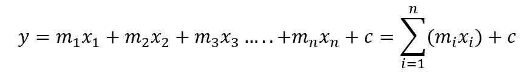

在上面的等式中，{m_1，m_2，m_3，…，m_n}表示自变量系数的集合，{x_1，x_2，x_3，…，x_n}表示有助于找出目标变量 y 的独立属性的集合。

现在让我们用公式表示一个多元线性回归，它使用多个独立的、解释性的数据属性来预测目标变量的值。多元线性回归的主要目标是通过推断自变量和因变量、目标变量之间的线性关系来建立预测模型。多元线性回归表示如下:

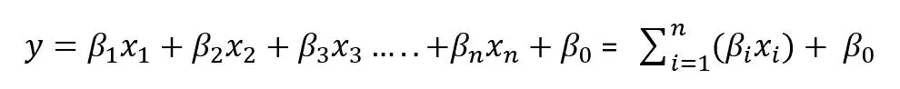

在上面的等式中，{β_1，β_2，β_3，…，β_n}表示自变量系数的集合，{x_1，x_2，x_3，…，x_n}表示有助于找出目标变量 y 的独立属性的集合。
简单的线性回归可以帮助分析者基于单个自变量建立预测模型，而在多元线性回归中，它依赖于多个自变量的数据。多元线性回归有假设，数据正态分布，均值为 0，标准差为σ，自变量和因变量之间存在线性关系，自变量之间不应存在多重共线性。

让我们举一个例子，一个股票市场分析师想要建立一个预测模型，预测不同的指数运动如何影响一家名为 ABC 的公司的股票价格。在回归模型的这个公式中，不同的指数将作为独立变量或预测变量，而 ABC 的股票价格将作为响应变量或目标变量。因此，在这种情况下，多元线性回归值得确定不同自变量和目标变量之间的线性关系。最小二乘法用于通过最小化误差平方和(即观察值和计算值之间的差值)来找到数据点集的最佳拟合回归线，如下图所示。

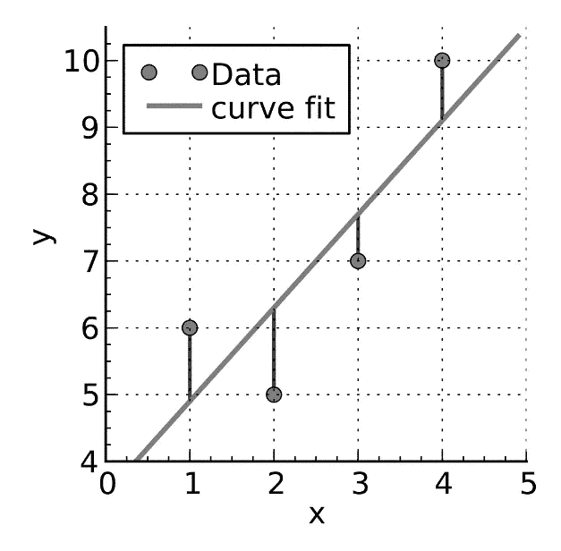

**图 2** 最小二乘曲线拟合参考:【https://commons.wikimedia.org/】T2

这是一种用于回归分析的曲线拟合方法。回归模型只能预测连续值，而如果我们希望预测离散值或类或标签，分类算法是一个很好的选择。

现在让我们来简要概述一下机器学习算法的变体——有监督的和无监督的机器学习。

**监督机器学习**

监督机器学习算法通过对已知数据点及其已知响应进行训练来建立学习模型，从而可以预测不熟悉数据点的响应。回归和分类算法是监督机器学习算法的主要类别。回归算法通过基于目标变量和已知数据点之间的关系构建模型来预测连续值。虽然分类算法有助于预测离散响应，但它基于已知的标记数据构建推断函数，该函数又用于预测不熟悉的数据点的响应。朴素贝叶斯、决策树、随机森林和支持向量机是机器学习中重要的分类算法。

**无监督机器学习**

无监督的机器学习算法试图在最少人工监督的情况下，在具有未标记数据点的数据集中推断模式或结构。它允许我们发现数据集本身的内在分布。它主要处理未标记的数据。聚类分析和主成分分析是无监督机器学习的主要变体。在神经网络中，自组织映射(SOM)在无监督学习的基础上工作，具有无需任何监督而自行学习的能力。

## 什么是人工神经网络？

人脑有数十亿个神经元和数万亿个突触。神经网络的基本单位称为神经元，神经元由具有如下图所示的树状结构的树突组成，它从连接的神经元接收脉冲信号，而轴突将信号从一个神经元传输到另一个神经元。轴突末梢通过突触与其他神经元的树突相连，轴突传递的信号代表电脉冲，是对输入信号产生的反应。

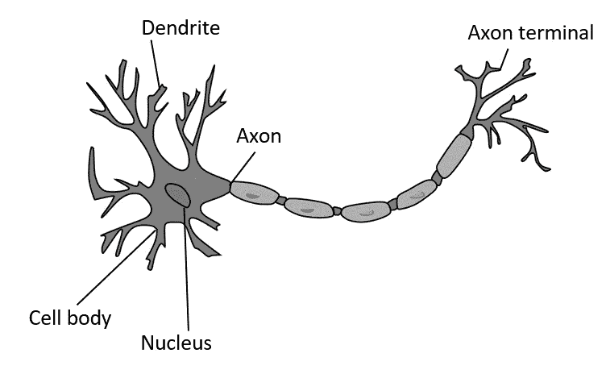

**图 3** 生物神经元的结构**参考:**[https://en.wikipedia.org/wiki/Biological_neuron_model](https://en.wikipedia.org/wiki/Biological_neuron_model)

简而言之，神经元检查不同输入信号的总强度是否超过阈值，并相应地发出电脉冲作为响应。由于密集和完全连接的多层网络形式，大脑中的神经网络可以学习比人工神经网络更复杂的特征。

生物神经网络帮助人类发展区分猫和狗的能力。这种保留被观察实体的细粒度细节的能力是通过从经验中学习获得的。

人工神经网络是生物神经网络的人工形式。人工神经网络的特征在于人工神经元层之间的加权连接。这些加权连接可以通过从已知数据中学习的学习算法进行微调，以提高神经网络的可预测性。定义成本函数来改变神经元层之间的连接的权重，这通常通过优化技术如梯度下降来完成。我们将在接下来的章节中更多地讨论梯度下降。下图所示的人工神经元代表了人工神经网络的最简单形式。

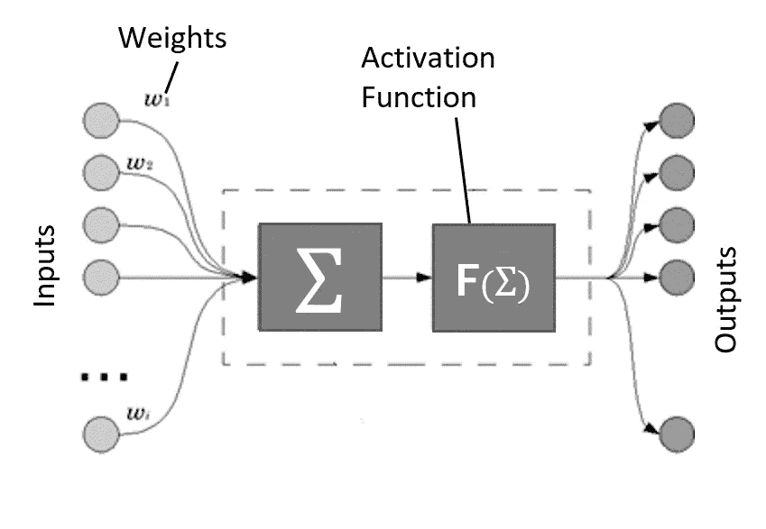

**图 4** 人工神经元结构

如上图所示，可以清楚地理解，通过聚集加权特征并传递给激活函数，信息被从一组输入节点前馈到输出节点，激活函数又根据某些规则或要求将神经元输入的加权和转换成有限值。计算出的分数与观察值相匹配，以微调网络权重。这一过程一直持续到计算值和观察值之间的差异急剧减小。一旦校正网络权重的过程完成，我们就获得了能够学习独立变量集和目标或响应变量集之间的复杂关系的最佳网络权重集。

**深度神经网络**

深度神经网络是人工神经网络的一种形式，它由多层网络组成，在输入和输出层之间有一个以上的隐藏层。深度神经网络可以构建复杂的非线性关系模型。卷积神经网络(CNN)和递归神经网络(RNNs)是深度神经网络的典型例子。

深度神经网络是多层前馈神经网络的一种形式。深度神经网络的主要应用是推荐系统、视觉识别、临床数据分析、金融欺诈检测、语言建模等等。深度神经网络的特征在于其深度和网络中神经元层的数量。神经网络层中更深的深度有助于神经网络更高的收敛性，从而获得更好的可预测性。

## 激活功能

现在让我们在下一小节中尝试理解激活函数及其不同的变体。激活函数在捕捉数据的非线性复杂特征中起着主要作用。需要激活函数来捕获数据特征的集合表示。

激活函数是神经网络的传递函数，它允许将神经元输入的加权和转换成有限范围的值。简单的激活函数称为线性激活函数，因为它不执行任何类型的变换。虽然它很省时，但它无助于捕捉特征之间的复杂关系，因此线性激活函数的典型使用仅限于回归问题。像线性激活函数一样，我们也有非线性激活函数，能够学习数据特征之间的复杂关系，这允许我们建立更强大的深度学习模型。

对激活函数的一个重要要求是，它不应该是计算昂贵的，因为现代神经网络中可能有数千个激活节点，这要求激活函数是时间高效的。基本上，人工神经网络的主要目的是学习数据的潜在复杂特征。

反向传播是一种梯度下降算法，其中网络权重与误差函数的负梯度成比例调整，并从神经网络的输出层反向传播到输入层。这个改变权重的过程一直持续到网络中的总误差达到最小值。由于现代神经网络在反向传播算法的帮助下学习数据的复杂关系，这给激活节点带来了很大的计算压力，因此强烈建议对神经网络的中间层或隐藏层使用省时的激活函数。

**激活函数**可以是简单的输入特征的加权和，也可以是根据规则或阈值将输入的加权和转换成有限范围值的传递函数。

以下激活函数主要用于构建神经网络架构。这些被分类为线性和非线性激活函数。

**线性激活功能**

让我们考虑数据集的输入特征集是 x1、x2、x3，表示为 x。当这些输入特征被馈送到神经元时，加权乘法给出输入特征的加权和σ。函数 f(σ)表示激活函数，ŷ表示输出分数，如下图所示。

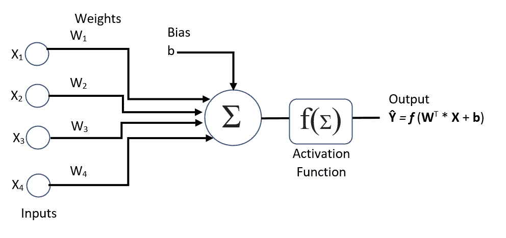

**图 5** 神经元中的激活功能

在上图中，我们看到 ŷ= f(σ)但是在线性激活函数的情况下，ŷ= f(σ)=σ

线性激活函数不执行任何变换，但可用于解决输出分数范围从-无穷大到+无穷大的回归问题。线性激活函数的主要挑战是学习数据集的数据元素特征之间的非线性复杂关系，但是由于线性激活函数不能捕捉数据集的复杂特征，所以更好的解决方案是使用非线性激活函数。

## 非线性激活函数

非线性激活函数有助于将输入要素的加权总和转换为有限范围的值。现代神经网络架构越来越多地使用非线性激活函数，这有助于学习复杂数据，进而有助于准确预测。非线性函数允许反向传播(梯度下降)算法更好的收敛。

以下是在神经结构中使用的主要非线性激活函数。

**s 形函数**

乙状结肠激活函数被定义为，

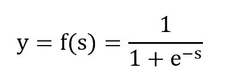

在该等式中，s 表示输入要素的加权和；sigmoid 函数将输出值 y 限制在(0，1)的范围内，如图所示。

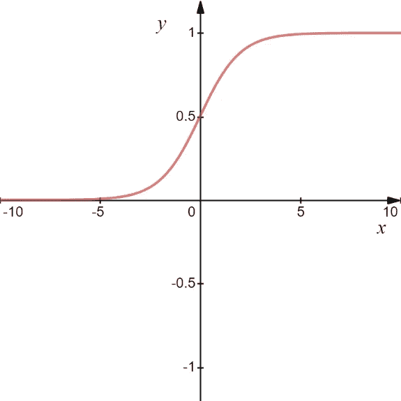

**图 6** 乙状结肠激活功能

这个激活函数在计算上是昂贵的，所以它通常用于输出层，而不是神经网络的隐藏层。对于非常高或非常低的值，使用 sigmoid 函数，当 s 的值太高或太低时，y 的值不会发生剧烈变化。这导致导数的较小变化，从而导致梯度消失的问题，这最终导致神经网络的较差学习，因为神经网络通过逐渐更新权重学习得非常慢。

**双曲正切函数**

该激活函数将输出值限制在一个有限的范围内(-1，+1)，它是如下图所示的形状相似的非线性激活函数，即 sigmoid 函数

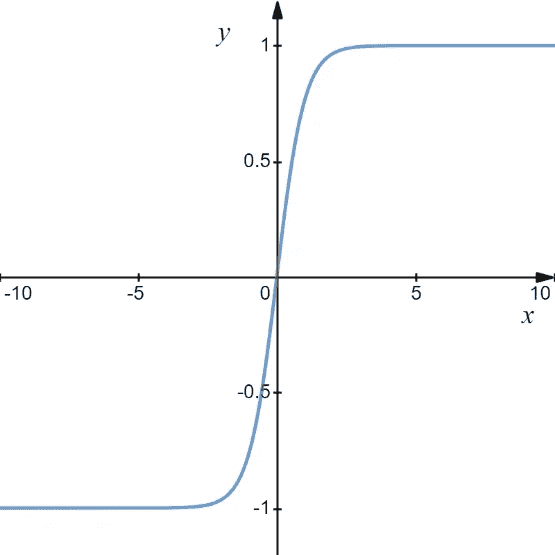

**图 7** 双曲正切激活函数

与 sigmoid 函数相比，它具有更好的性能。和 sigmoid 一样，tanh 函数(双曲正切)对于分别收敛到+1.0 和-1.0 的更高或更低的输入值都存在值饱和的问题。即使输入值有显著变化，它也不会像图中所示的那样变化太大，因此，反向传播算法很难改变权重以获得更好的收敛性。

在深度神经网络的学习阶段，误差通过神经层反向传播以进行权重更新。但是，如果误差量随着激活函数的导出而穿过更深的神经层而急剧减少，则权重更新得非常慢，这导致神经网络的学习更慢。这被称为消失梯度(重量上升的变化率)。消失梯度问题阻碍了神经网络以更快的速度学习。

**整流线性单位函数(RELU)**

RELU 是强烈推荐的用于神经网络结构中隐藏层的激活函数，因为它在计算上是高效的，它允许神经网络快速收敛，并且具有帮助误差通过神经网络层反向传播的导数函数。它将输入值 s 限制在最大值(0，s)的范围内，如下图所示。

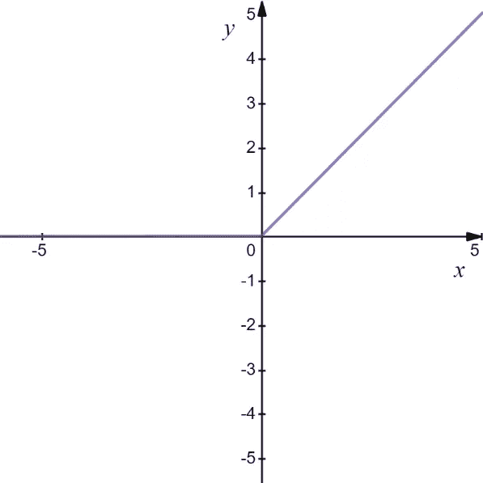

**图 8** 整流线性单元(RELU)激活功能

当 s 的值为正时，该激活函数线性工作，当 s 的值为负时，该激活函数变得非线性，并收敛到零。强烈推荐使用它来构建神经网络架构的大多数变体，如多层感知器和卷积神经网络。

**Softmax 功能**

Softmax 是一种非常流行的非线性激活函数，用于解决多类分类问题，仅用于输出图层将输入转换为(0，1)范围内的多个类概率值。

在构建神经网络时，激活函数的选择是一个至关重要的决定。用不同的神经层实验不同的激活函数可以帮助我们更好地收敛深度学习模型。

在下一节中，我们将学习更多关于前馈神经网络及其主要变体多层感知器，以及用于模型优化的反向传播算法。

# 前馈神经网络&反向传播算法

前馈神经网络构成了高级深度神经网络的基础。在本节中，我们将简要概述前馈神经网络及其主要变体，多层感知器，并深入了解反向传播算法。反向传播算法基于损失函数的梯度更新神经网络的权重或参数。

## 前馈神经网络

全连接神经网络表示这样一种神经网络，其每层的每个节点都连接到另一层的每个节点，从初始层开始，通过隐藏层到输出层。完全连接的神经网络也称为密集神经网络。前馈神经网络是人工神经网络的一种形式，其中信号流被前馈而不形成循环，并且来自输入层的数据通过一组隐藏层被馈送到输出层。

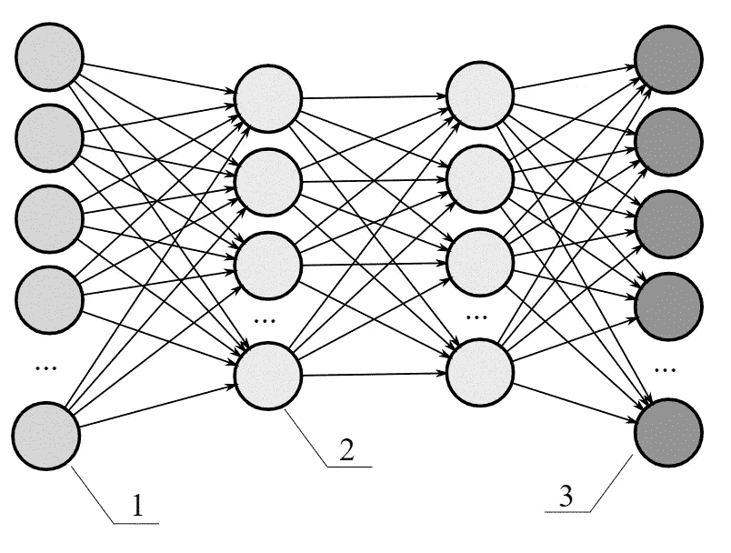

**图 9** 多层前馈神经网络参考:【https://commons.wikimedia.org/】T2

在这种形式的神经网络中，信息从一组输入节点(在上图中标注为集 1)通过隐藏层(如图中的集 2)转发到神经元的输出层(在上图中标注为集 3)，因此，它也被称为有向非循环图(DAG)。

**多层感知器(MLP)**

多层感知器(MLP)是一种前馈神经网络，由以前馈方式连接的多层计算节点组成。神经层中的每个节点都与下一层的每个神经节点有连接；这里的连接代表分配给单个神经节点的权重。在下图中，我们可以看到一个 2 层神经网络的示例，它的输入层有 3 个节点，隐藏层有 3 个节点，输出层有 2 个节点。这表示一个前馈神经网络，其中输入集通过它们之间的连接被馈送到隐藏层，这些连接表示强度或权重。多层感知器(MLP)与具有一个或多个隐藏层的单层感知器具有相同的结构。

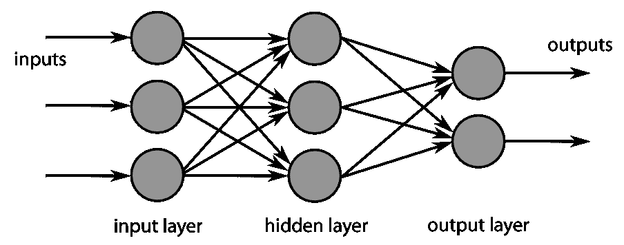

**图 10** 多层感知器参考:[https://commons.wikimedia.org/](https://commons.wikimedia.org/)

多层网络使用学习技术，如反向传播，其中输出值与正确值匹配，以找出错误率，然后通过网络层反馈该错误，以调整每个连接的权重，从而获得准确的输出值。在重复多次反向传播过程后，错误率降低，神经网络收敛到错误率最小的最佳状态。请注意，反向传播仅适用于可微分的激活函数，如 RELU、Sigmoid、SoftMax 等。术语可微性表示激活函数允许误差反向传播通过神经网络层以找到神经网络的最优权重集的能力。激活函数越容易计算，神经网络的收敛速度就越快，因此为隐含层的神经节点选择正确的激活函数以降低计算复杂度是非常重要的。

## 反向传播算法

多层神经网络是简单感知器的扩展版本，具有一个或多个隐藏层。反向传播算法主要有两个阶段，前向阶段和后向阶段。反向传播算法本质上是通过梯度下降过程将误差从输出层反向传播到输入层。在梯度下降过程中，误差函数的梯度相对于各层的神经权重被迭代计算，除非它达到最小值，这表明神经网络已经获得了一组用于更好收敛的最优权重。

前缀“back-”告诉我们，梯度计算是在从输出层到连接或权重的输入层的反向方向上进行的。首先，为输出层连接或权重计算误差函数的梯度，然后连续计算误差函数相对于隐藏层和初始层权重的梯度。因此，误差或损失函数的梯度的计算经由一个或多个隐藏的权重层从权重的输出层移动到权重的输入层。这种误差计算的反向流程允许神经网络更好地收敛。

让我们用一个例子来正式理解梯度下降算法的过程。
考虑一个函数，

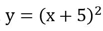

现在我们的目标是找到一个使函数最小的 x 值，y 最终使它为 0。我们将为实现我们的目标确定如下步骤:

**第一步**:从一个变量的随机初始值开始，x=-3

**第二步**:取函数的一阶导数，计算函数的梯度，

**步骤 3** :初始化参数，x = -3，学习率= 0.01(决定梯度的因子以获得 x 的最优值。

**#迭代 0**
求 y 的值，

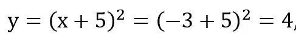

我们将计算误差，

e(y)= |预期值-计算值| = | 0–4 | = 4

现在，我们将通过一系列迭代来减小这个误差，这些迭代是根据函数的梯度来更新 x 的值。

**#迭代 1**

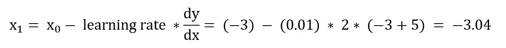

用这个新的 x 值，计算这个函数，

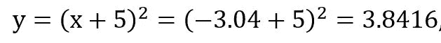

计算误差，

e(y)= |预期值-计算值| = | 0–3.8416 | = 3.8416

**#迭代 2**

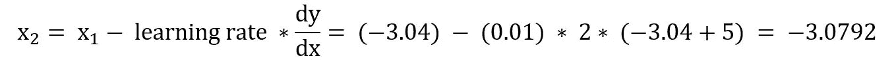

用这个新的 x 值，计算这个函数，

y=(x+5) =(-3.0792+5)2=3.6894，

计算误差，

e(y)= |预期值-计算值| = | 0–3.6894 | = 3.6894

经过多次迭代，最终，我们将达到函数的全局极小值，y=(x+5)对于 x=-5，这个 x 的值与函数的梯度的负值成比例地连续变化的过程称为梯度下降算法。

**图 11** 梯度下降

该图显示了优化 x 的值以最小化误差函数 E(y)以达到函数 y 的全局最小值的过程。我们从 x 的随机值开始，并通过一组迭代达到其最优值以最小化函数 y 的值，通过这些迭代我们将 x 的值收敛到其最优值。

在下一节中，我们将了解如何评估人工神经网络，以及如何使用不同的成本函数和评估指标来衡量它们的性能

# 评估和调整人工神经网络

一旦根据训练数据对神经网络进行了训练，就应该根据测试数据对其进行评估，以检查其预测未知数据的能力。通过性能评估，我们可以判断神经网络预测准确结果的能力。应对已训练的模型进行验证，以评估其对以前未见过的数据进行归纳的能力。

首先，我们将数据集按一定的比例分成三部分，比如 60:20:20，这意味着 60%的数据保留用于模型训练，20%用于验证和微调模型，20%的数据将用于测试训练好的模型。验证数据是训练数据的一部分，用于评估模型，并相应地使用不同的超参数微调其性能。

让我们将这三个术语定义如下

**训练数据集**是用于训练神经网络的数据集的子集；通常，数据集的主要部分用于训练目的。

**验证数据集**是数据的一个小子集，专门用于验证训练模型的性能，并相应地调整超参数以根据要求控制模型的学习。

**测试数据集**是数据集的一部分，用于测试具有不同评估指标(如精确召回率、F1 得分、ROC 和 AUC 曲线)的训练模型的性能。

用于评估**神经学习模型**性能的主要成本函数如下:

**损失**:对训练数据计算损失函数的代价度量

**val_loss** :对验证数据计算损失函数的代价度量

**acc** :这是一个代价函数，用来衡量学习模型对训练数据的准确性。

**val_acc** :这是一个代价函数，用来衡量学习模型对验证数据的准确性

现在，让我们讨论一些关于需要讨论的训练和验证数据的损失和准确性的重要场景。

如果验证损失随着训练数据损失的减少而开始增加，则表明学习模型对训练数据过度拟合，应该选择不同的正则化技术。

如果验证损失随着验证准确性的增加而开始减少，这表明学习模型正在变得一般化，并且可能给出很好的拟合。

如果训练数据的损失开始减少，而验证损失没有任何增加，我们可以继续对模型进行训练。但是，一旦验证损失开始增加，最好停止进一步训练模型，因为这可能会导致过度拟合，结果是，学习模型将不会得到很好的推广。

在深度学习库 Keras 中，为回归分析定义了一组评估指标，即**平均绝对误差、均方根误差、平均绝对百分比误差和余弦距离**。而在分类问题的情况下，可以使用类似于**二元精度、分类精度、前 k 分类精度**的测量列表。

通常，在训练数据的每次迭代或时期结束时计算度量分数，但是如果验证也被馈送，那么也为验证数据计算度量分数，这将进一步帮助**用不同的正则化和优化技术**调整神经网络。

**超参数对于控制模型的性能至关重要**。对于一个神经网络，学习速率、时期数、隐藏层数、隐藏节点数、激活函数是需要考虑的主要超参数。选择正确的参数对神经网络体系结构的成功起着重要作用，因为它对学习模型有重大影响。

# 经典机器学习 vs 深度学习

人工智能是一种机器能够自己学习数据的不同特征，并根据数据特征的变化相应地更新响应的能力。人工智能也被称为机器智能，意思是机器感知其环境并相应地产生最佳响应以最大限度地成功实现目标的能力。

人工智能试图通过经验学习的方式模仿人类智能，在这种方式下，它试图根据学习经验来纠正自己的行为。机器学习是人工智能的子集，它基于样本数据、一组已知数据点或观察值以及它们的响应来建立学习模型，而无需通过编程明确定义规则集，而深度学习是机器学习的高级版本，具有捕捉数据中非线性复杂关系的强大能力。

深度学习算法在数据量更多的情况下表现更好，而机器学习算法的性能在某个水平上停滞不前，不管数据量有多少。在深度学习算法的情况下，数据是更好性能的主要约束，数据越多，性能就越高。

深度学习算法需要大量的计算资源来对大量数据进行训练，而在机器学习算法的情况下，商用硬件可以完成这项工作。在机器学习中，领域专家必须识别强特征以获得更好的可预测性，但深度学习采用堆叠的神经元层，在其计算中引入非线性。深度学习算法建立了一个具有数百万个参数的学习模型，这些参数保存了数据的高度复杂的非线性表示。

# 摘要

在这篇文章中，我们学习了人工智能从经典机器学习到深度神经网络的转变，从机器学习的基础开始，监督和非监督机器学习到多层前馈神经网络，以及不同的激活函数，如 sigmoid，双曲线正切，整流线性单元和 softmax。我们学习了反向传播算法，以及它如何根据损失函数的梯度来更新神经网络的权重或参数。我们研究了如何调整具有不同超参数的学习模型的性能，如学习速率、隐藏层数、隐藏层中的节点数以及不同的成本函数。