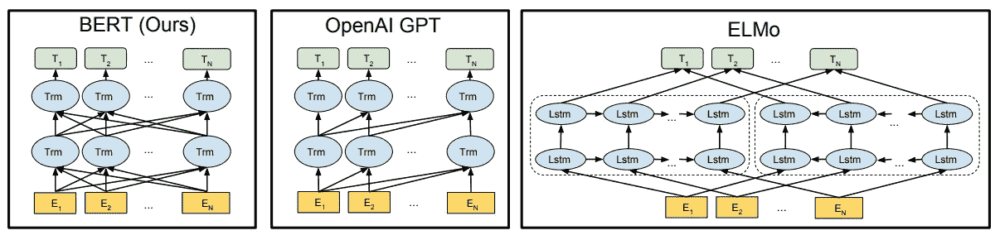
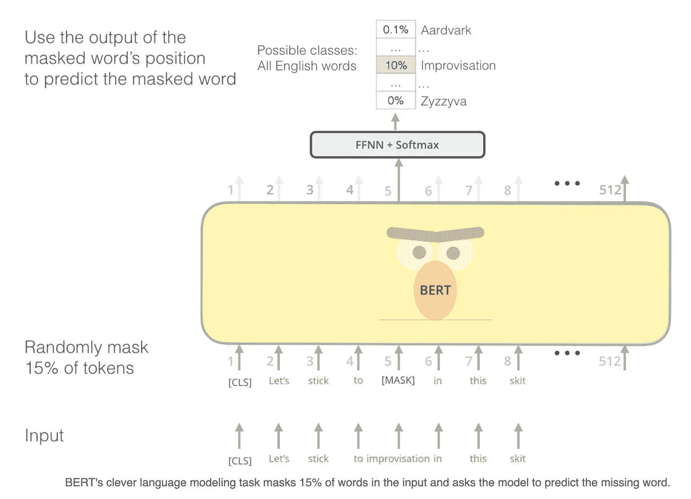
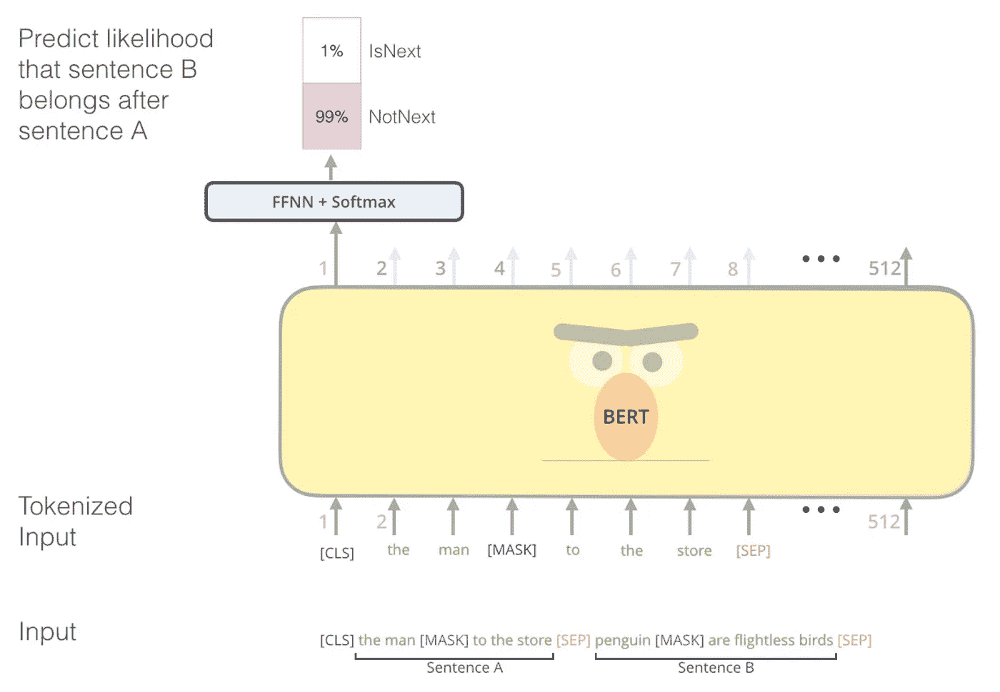
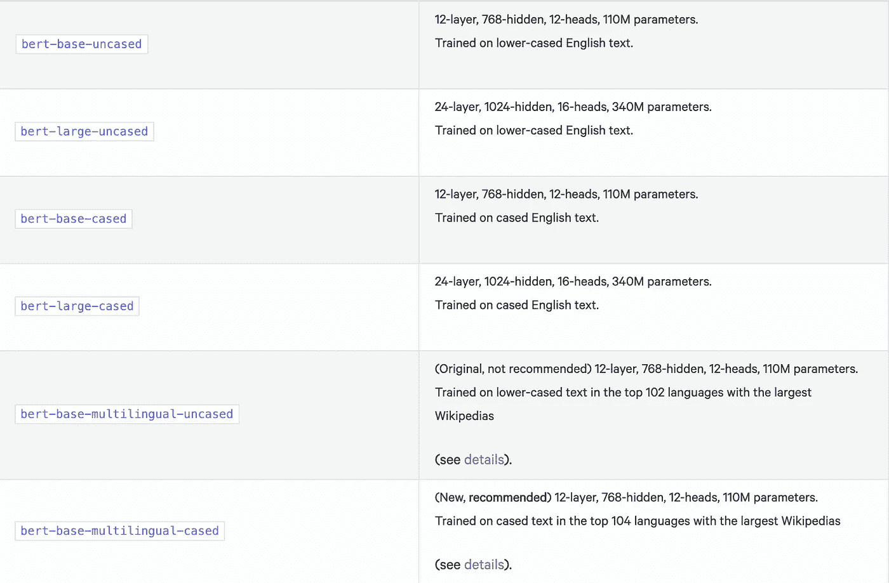
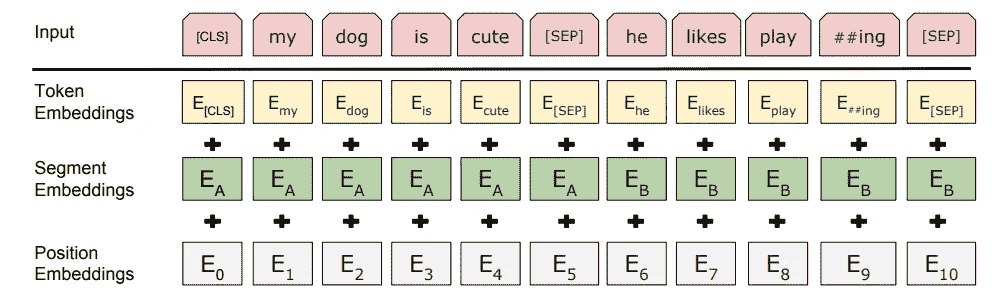
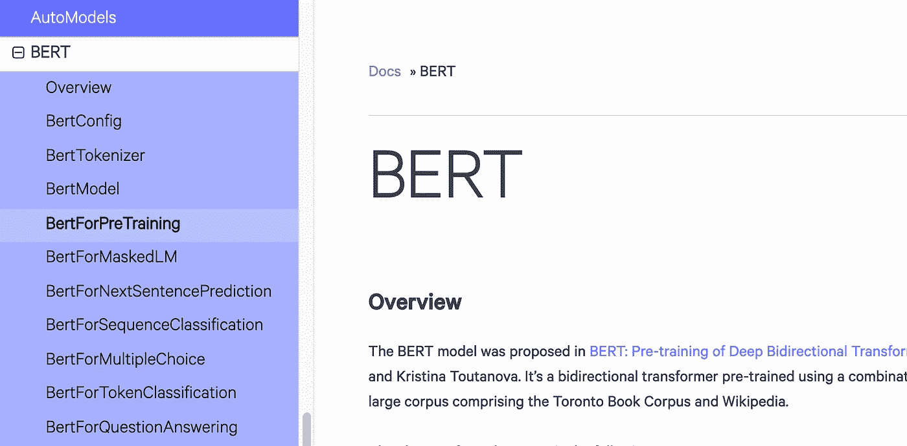
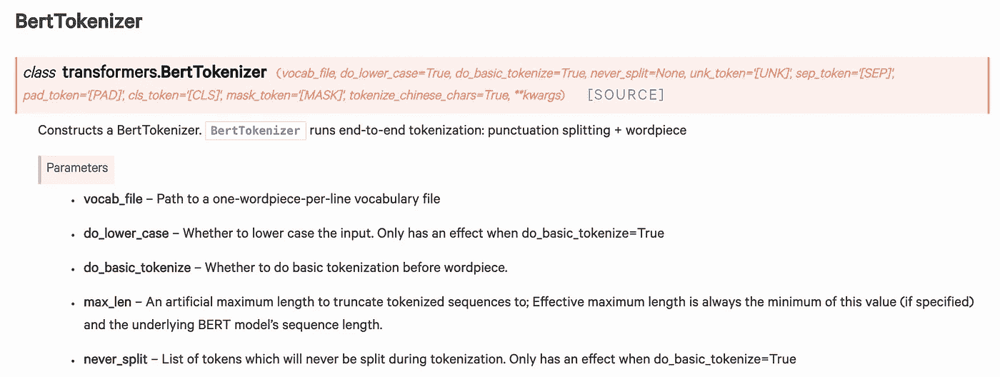
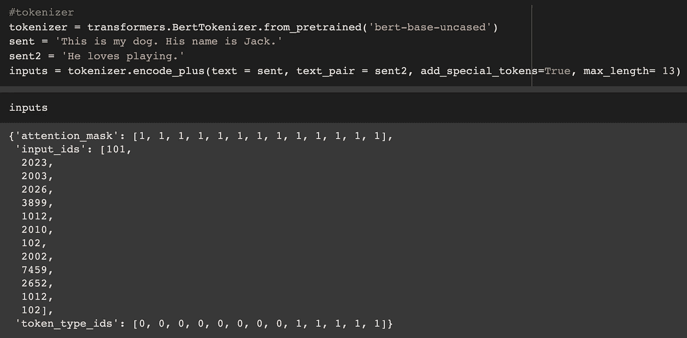

# 理解伯特

> 原文：<https://pub.towardsai.net/understanding-bert-b69ce7ad03c1?source=collection_archive---------0----------------------->

来源:安民在[像素](https://www.pexels.com/)上拍摄的照片

## [自然语言处理](https://towardsai.net/p/category/nlp)

BERT(来自变形金刚的双向编码器表示)是一篇由 Google AI language 发表的[研究论文](https://arxiv.org/pdf/1810.04805.pdf)。与以前版本的 NLP 架构不同，BERT 概念简单，经验丰富。它在 11 个自然语言处理任务上取得了最新的成果。

BERT 优于另一种标准 LM，因为它应用序列的深度双向上下文训练，这意味着它在训练时同时考虑左右上下文，而其他 LM 模型(如开放 GPT)是单向的，每个标记只能关注注意层中的先前标记。这种限制对于句子级任务(释义)或标记级任务(命名实体识别、问答)来说是次优的，在这些任务中，从两个方向结合上下文是至关重要的。

## **伯特是什么？**

在 LM 的早期版本(如 Glove)中，我们有固定的单词嵌入，例如，对于单词“ *right* ”，不管它在句子中的上下文如何，嵌入都是相同的。是指“*正确*还是“*正确方向*”？然后是 ELMo(双向 LSTM ),它试图通过使用左右上下文来生成嵌入来解决这个问题，但它只是连接了从左到右和从右到左的信息，这意味着表示不能同时利用左右上下文。然后 BERT 和它的注意力层胜过了所有以前的模型。

预训练模型架构的差异。伯特使用双向变压器。OpenAI GPT 使用从左到右的变压器。ELMo 使用独立训练的从左到右和从右到左 LSTMs 的串联来为下游任务生成特征。在这三者中，只有 BERT 表示在所有层中同时受到左右上下文的影响。

Transformer 是一种流行的注意力模型，其基本架构有两个主要组件:编码器和解码器。编码器部分读取输入序列并对其进行处理，解码器部分从编码器获取已处理的输入，并对其进行重新处理以执行预测任务。要了解更多关于变压器的信息，请参考:[这里的](https://medium.com/@shwetabaranwal20/attention-model-transformers-cbfa754c0475)。因为这里我们感兴趣的是生成语言模型(LM)，所以只有编码器部分是必要的。BERT 使用这种变压器编码器架构为输入序列生成双向自我关注。它一口气读完整个句子，注意力层从一个单词的所有左右周围单词中学习该单词的上下文。

## **预训练伯特:**

BERT 的预训练是在未标记的数据集上完成的，因此本质上是无监督的。BERT 中有两个预训练步骤:

1.  **蒙面语言模特(MLM)**

a)模型使用[MASK]标记随机屏蔽 15%的标记，然后在输出层预测这些屏蔽的标记。丢失仅基于屏蔽记号的预测，而不是基于所有记号的预测。

b)在模型的微调期间,[MASK]令牌不出现，从而产生不匹配，为了减轻这种情况，如果在预训练期间选择第 I 个令牌进行屏蔽，则用以下令牌替换它:

80%倍[面具] token: *我的狗是毛→我的狗是[面具]*

来自语料库的 10%倍随机词:*我的狗有毛→我的狗是苹果*

10%倍不变:*我的狗有毛→我的狗有毛*

[http://jalammar.github.io/illustrated-bert/](http://jalammar.github.io/illustrated-bert/)

2.**下一句预测**

A)在这种预训练方法中，给定两个句子 A 和 B，无论句子是否相关，模型都在二进制化的输出上进行训练。

B)在为预训练示例选择句子 A 和 B 时，B 有 50%的时间是跟在 A 后面的实际的下一个句子(label: *IsNext* )，有 50%的时间是从语料库中随机抽取的句子(label: *NotNext* )。

[http://jalammar.github.io/illustrated-bert/](http://jalammar.github.io/illustrated-bert/)

训练损失是平均屏蔽 LM 可能性和平均下一句预测可能性的总和。

在 NLP 的早期工作中，只有句子嵌入被转移到下游任务，而 BERT 转移预训练的所有参数来初始化不同下游任务的模型。预先训练的 BERT 模型由 Google 提供，可以直接用于微调下游任务。

[https://huggingface.co/transformers/pretrained_models.html](https://huggingface.co/transformers/pretrained_models.html)

## **伯特建筑:**

BERT 的模型架构是基于 Google 的 [*注意力是你所需要的全部*](https://arxiv.org/pdf/1706.03762.pdf) 论文的多层双向变压器编码器。它有两种模型形式:

**BERT BASE** : *更少的变压器块和隐藏层尺寸，具有与 OpenAI GPT 相同的模型尺寸。【12 个变压器块，12 个注意头，768 个隐藏层尺寸】*

**BERT LARGE** : *具有两倍于 BERT 基础的注意力层的巨大网络，在 NLP 任务上实现了最先进的结果。【24 个变压器块，16 个注意头，1024 个隐藏层尺寸】*

在模型微调期间，这些层的参数(*变压器块、注意头、隐藏层)*以及下游任务的附加层被端到端地微调。

## **伯特输入表示:**

1.  每个序列的第一个记号总是一个特殊的分类记号[CLS]。对应于该令牌的最终隐藏状态用于分类任务。
2.  这两个句子用[SEP]符号分隔。
3.  在句子对的情况下，添加了一个段嵌入，该段嵌入指示标记是属于句子 A 还是句子 b。
4.  对于给定的标记，其输入表示是通过添加相应的标记、段和位置嵌入来构建的。

BERT 输入表示。输入嵌入是标记嵌入、分段嵌入和位置嵌入的总和

## **微调伯特:**

微调 BERT 简单明了。根据手头的任务修改模型。对于每个任务，我们只需将特定于任务的输入和输出插入到 BERT 中，并端到端地微调所有参数。

在输入端，来自预训练的句子 A 和句子 B 类似于

1.  释义中的句子对
2.  蕴涵中的假设前提对
3.  问答中的问题-段落对
4.  文本分类或序列标记中的退化 text-∅对。

在输出端，表征表示被馈送到输出层用于表征级任务，例如序列标记或问题回答，而[CLS]表示被馈送到输出层用于分类，例如情感分析。

[http://jalammar.github.io/illustrated-bert/](http://jalammar.github.io/illustrated-bert/)

HuggingFace 也提供了一个微调特定任务模型的框架。

[https://hugging face . co/transformers/model _ doc/Bert . html # bertforpreparating](https://huggingface.co/transformers/model_doc/bert.html#bertforpretraining)

MaskedLM、下一句预测、序列分类、多项选择等的模型框架。以及针对 BERT 的预训练参数。这些实现起来既简单又有趣。

## **伯特记号赋予器:**

[https://hugging face . co/transformers/model _ doc/Bert . html # bertokenizer](https://huggingface.co/transformers/model_doc/bert.html#berttokenizer)

在 BERT 输入表示中，我们已经看到我们需要三种类型的嵌入(令牌、段、位置)。HuggingFace 的 Transformers 包为每个嵌入需求构造了令牌( [*encode_plus*](https://huggingface.co/transformers/main_classes/tokenizer.html) )。这里既可以使用预先训练好的标记器，也可以使用来自给定 vocab 文件的标记器。

来自预训练“bert-base-uncased”的 BERT 记号化器

BERT tokenizer 使用词块模型进行标记化。它将单词分解成子单词，以增加词汇的覆盖范围。

**单词** : *喷气式飞机制造商因座位宽度争执不休，大订单岌岌可危*

**word pieces**:*_ J et _ makers _ Fe ud _ over _ seat _ width _ with _ big _ orders _ at _ stake*

在上面的例子中，单词“ *Jet* ”被拆分为两个词块“_J”和“et”，“世仇”被拆分为两个词块“_fe”和“ud”。其他单词保持为单个单词片段。“_”是添加的特殊字符，用于标记单词的开头。

 [## ShwetaBaranwal/BERT

### 在 GitHub 上创建一个帐户，为 ShwetaBaranwal/BERT 开发做出贡献。

github.com](https://github.com/ShwetaBaranwal/BERT) 

## **参考文献**:

 [## BERT -变压器 2.4.1 文件

### BERT 模型是在 BERT:用于语言理解的深度双向转换器的预训练中提出的…

huggingface.co](https://huggingface.co/transformers/model_doc/bert.html)  [## 有插图的伯特、埃尔莫等人(NLP 如何破解迁移学习)

### 讨论:黑客新闻(98 分，19 条评论)，Reddit r/MachineLearning (164 分，20 条评论)翻译…

jalammar.github.io](http://jalammar.github.io/illustrated-bert/)  [## BERT:用于语言理解的深度双向转换器的预训练

### 我们介绍了一种新的语言表示模型，称为 BERT，代表双向编码器表示…

arxiv.org](https://arxiv.org/abs/1810.04805)  [## 谷歌的神经机器翻译系统:弥合人类和机器翻译之间的差距

### 神经机器翻译(NMT)是一个端到端的自动翻译学习方法，有潜力…

arxiv.org](https://arxiv.org/abs/1609.08144)  [## 谷歌研究/bert

### 这是几个新模型的发布，是预处理代码改进的结果。在…

github.com](https://github.com/google-research/bert)