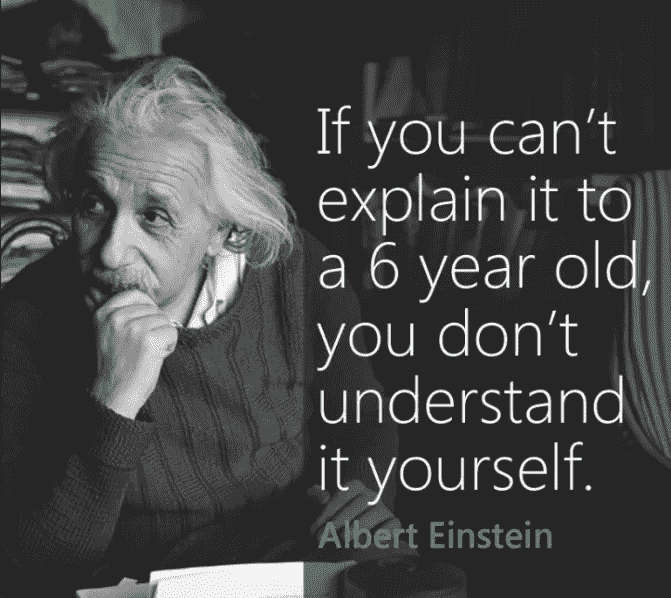
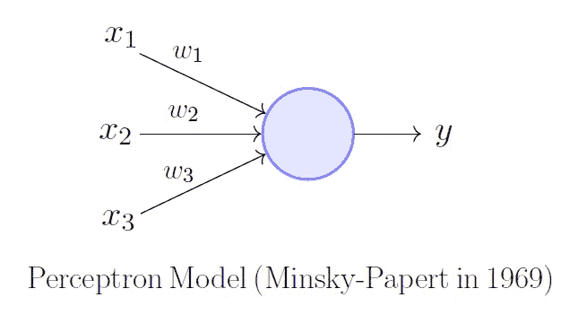
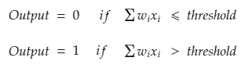
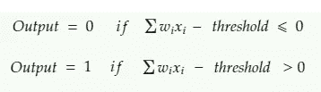
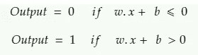

# 用最简单的方式理解偏见

> 原文：<https://pub.towardsai.net/understanding-bias-in-the-simplest-plausible-way-ad58f9eb1ddf?source=collection_archive---------1----------------------->

## 人工智能

我最近开始探索神经网络，我遇到了术语激活功能和偏见。激活函数对我来说有点意义，但我发现很难得到神经网络中偏差的确切本质。

我研究了各种来源，他们只有-

> 神经网络中的偏差可以被认为类似于线性回归中截距的作用。

但是这到底意味着什么呢？我非常理解**截距**是直线与 y 轴相交的点。如果我们没有截距，那么我们的线会一直穿过原点，但现实世界中不是这样，所以我们用截距来增加一些灵活性。

> **那么偏见是如何给神经网络增加灵活性的呢？**

在这篇文章的结尾你会找到这个问题的答案。

上面引用的定义是我们谈论偏见时遇到的最常见的定义。所以我想，让我们忽略我上面的问题，继续这个关于偏见的平庸解释(这没有任何意义)。因为任何人，当被问及偏见时，这都是抢答。但是后来我看到了下面这张图片，它深深地打动了我。

[来源](https://talgroupinc.files.wordpress.com/2016/07/careerlesson_explainitto6yearold.png?w=768)

如果我不能向一个六岁的孩子解释偏见，那么我想甚至我也没有理解它(这确实是事实)。所以我开始查阅更多的资料，最后，偏见开始变得有意义了。让我们借助感知器来理解偏见。

# 感知器

感知器可以被想象成接受一些二进制输入 x1，x2，…并产生一个二进制输出的东西。

感知器模型

权重对应于输入的重要性，也称为特征。输出，即 0 或 1，取决于权重和输入的加权和是否大于某个 ***阈值。***

算术地

感知器方程

让我们考虑一个例子，假设你喜欢一个人，你想决定是否应该告诉那个人你的感觉。你可能会根据下面的问题做出最后的决定。

1.  我是真的爱那个人，还是只是单纯的迷恋？
2.  如果我说出我的心声会毁了我和那个人的关系呢？
3.  这真的值得吗(会对你的职业生涯产生负面影响吗)

我知道可能还有许多其他问题，但这些都是常见的问题。所以你决定是否说出你的心声取决于上面的问题。

所以让我们把 x1、x2 和 x3 看作你的 3 个问题，如果是迷恋，x1 = 0，如果不是，x1 = 1。类似地，如果不会破坏你的等式，x2 = 0；如果你觉得不值得，x3 = 0。

可能发生的情况是，上述问题并不都同等重要。你可以做的是根据问题的重要性/相关性给所有问题分配一些数字。这些数字只不过是重量。

假设您分配权重，w1 = 3，w2 = 2，w3 = 7，其中 w1、w2、w3 分别代表问题 1、2 和 3 的权重。这意味着你更关心它是否值得，因为你想专注于你的职业生涯，你承受不起分心(因为 w3 有更高的量级)。你将阈值设置为 6，所以如果加权和大于 6，那么你会说出你的心声。但是从上面的权重值可以看出，你并不担心这是不是迷恋，也不担心这是否会毁了事情，因为即使 x1 = 1，x2 = 1，也不会对你的决定有多大帮助，因为它们的权重更小。所以看阈值和 w3，我们可以说决定因素是 x3(问题 3)。

让我们考虑一个不同的场景，假设权重 w1 = 10，w2 = 3，w3 = 5。所以在这里是不是一种迷恋比什么都重要。假设现在你把阈值保持在 2，那么你会很快得出肯定的结论。假设 x1 = 0，x2 = 1，x3 = 0。在这种情况下，即使 x1 和 x3 为 0，加权和也大于阈值。所以即使 x1 有较大的权重，但由于门槛太低，也起不到决定因素的作用。这意味着你更渴望通过设置更低的门槛来说出自己的心声。

所以改变权重和阈值也会改变决策。

想象一下这样一种情况，我们没有阈值，所以只要加权和大于 0，您就会得到“是”。但我们不希望这种情况发生。我们想根据加权和的大小得出结论。如果加权和超过某个阈值，那么输出应该是 Yes，否则应该是 No。因此我们需要一个阈值。

让我们通过将阈值放在左侧来简化等式。

LHS 的门槛(左侧)

类似地，当我们的加权和大于特定阈值时，我们希望我们的神经元被激活。如果我们不使用阈值，只要加权和大于 0，神经元就会被激活。

所以 bias***b = threshold****并且用 bias 代替 threshold，我们得到一个熟悉的等式。*

**

*有偏差的感知器*

*这里*σwixi*写成*w . x =σwixi，*其中 w 和 x 是向量，它们的分量分别是权重和输入。*

*我们可以认为，**偏差用于不活动，**神经元只有在加权和大于阈值时才会被激活，因为 ***b=阈值*** 概念有点颠倒。之前，我们说过阈值越大，要激活的神经元的加权和就应该越大，但是现在由于偏差是阈值的倒数，偏差越大，激活神经元所需的加权和就越小。*

> *通过这种方式，bias 通过决定何时激活神经元来增加神经网络的灵活性。*

*显然，感知机与人类做出复杂决策的方式并不完全相似，但这个例子有助于以更简单的方式理解偏见。*

*我希望我已经用最简单合理的方式解释了什么是偏见。欢迎在下面留下评论或问题，你可以在 [Linkedin](https://www.linkedin.com/in/anirudh-dayma-457861144/) 上找到我。*