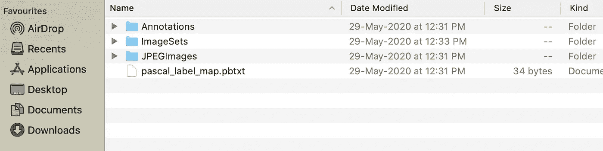
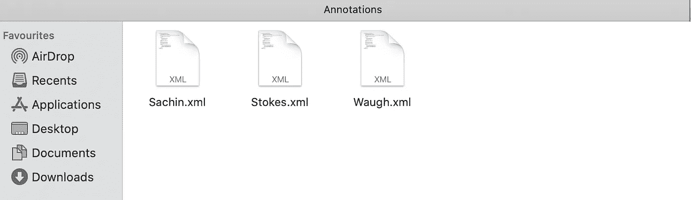
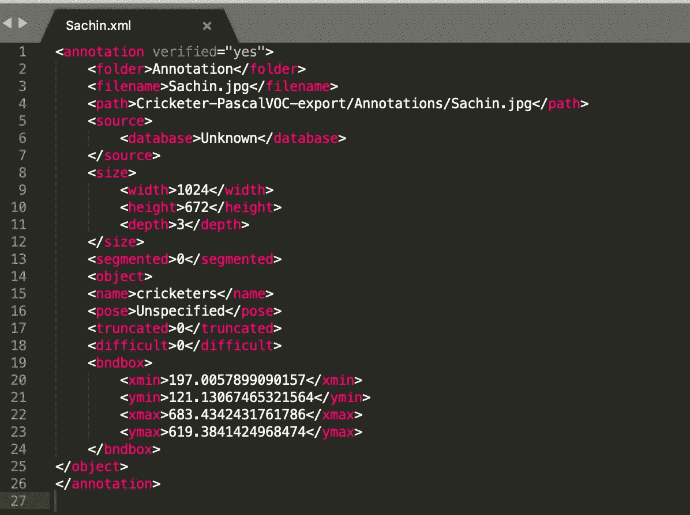
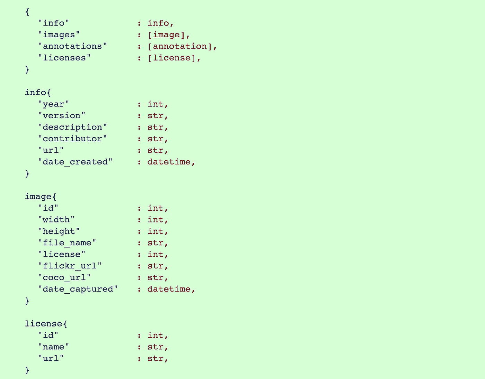
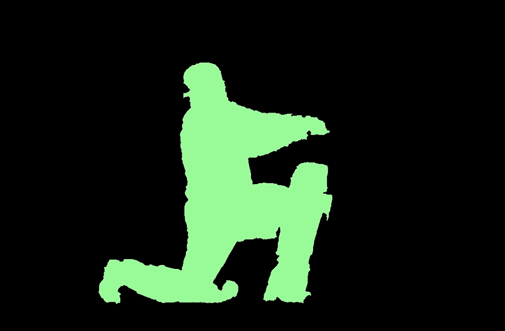

# 理解用于对象检测的 Pascal VOC 和 COCO 注释

> 原文：<https://pub.towardsai.net/understanding-coco-and-pascal-voc-annotations-for-object-detection-bb8ffbbb36e3?source=collection_archive---------0----------------------->

## 计算机视觉


来源: [Unsplash](https://images.unsplash.com/photo-1473163928189-364b2c4e1135?ixlib=rb-1.2.1&ixid=eyJhcHBfaWQiOjEyMDd9&auto=format&fit=crop&w=1950&q=80)

介绍

在之前的[博客](https://medium.com/towards-artificial-intelligence/create-your-dataset-for-object-detection-99f1ed04f2e5)中，我们为对象检测和分割创建了 **COCO** 和 **Pascal VOC** 数据集。因此，我们将深入研究这些数据集。

**帕斯卡 VOC**

PASCAL(模式分析、统计建模和计算学习)是欧盟的一个优秀网络。从 2005 年到 2012 年，他们举办了视觉对象挑战赛。

VoTT 注释后得到的文件结构如下。



这四个组件是 ***注释、图像集、JPEGImages、*** 和***Pascal _ label _ map . pbxt .***

我们将来到注释；最后，JPEGImages 是包含原始图像的文件夹。图像集包含两个 txt 文件，一个是 train，另一个是 valid，位于包含 train 和 valid 中图像列表的主文件夹中。

pascal_label_map.pbxt 包含要检测的对象的 id 和名称。

***Pascal _ label _ map . pbxt***

```
item {
 id: 1
 name: ‘cricketers’
}
```

最后也是最重要的部分是注释，注释文件是为给定文件夹中的每个图像创建的。



注释存储在一个 XML 文件中，让我们来看一个示例 XML 文件。



有不同的组件或标签对应于 XML 输出。

*文件夹*:包含图像。

*文件名*:被标注图像的相对路径。

*路径:*标注后输出文件的绝对路径。

*尺寸:*高度、宽度以像素为单位，深度表示 RGB 图像深度的通道数为 3，黑白为 1。

*对象:*包含名称、姿势、截断、困难。

*   *name:* 包含被注释对象的名称，在我们的例子中是板球运动员。
*   *姿势*:向左、向右等方向。
*   *截断:*如果对象超出边界框，截断为 1，否则为 0。
*   *难度*:如果不评估难度为 1 否则为 0。

*bndbox* :包围盒由左上角和右下角组成(*xmin-左上角，ymin-左上角，xmax-右下角，ymax-右下角)*

**可可**

COCO 在上下文中是一个常见的宾语。该数据集包含 328，000 幅图像中 250 万个标记实例的 91 种对象类型。

COCO 用于对象检测、分割和字幕数据集。

*   对象分割
*   语境中的识别
*   超像素素材分割

与 Pascal VOC 中的 XML 格式不同，COCO 以 JSON 格式存储注释。

COCO 的官方文件上写着它有五个[物体检测](http://cocodataset.org/#detection-2019)、[关键点检测](http://cocodataset.org/#keypoints-2019)、[素材分割](http://cocodataset.org/#stuff-2019)、[全景分割](http://cocodataset.org/#panoptic-2019)和[图像字幕](http://cocodataset.org/#captions-2015)。



图片来源 COCO 官方网站[http://cocodataset.org/](http://cocodataset.org/)

COCO 注释的基本数据结构对于所有五种类型都是相同的。与 Pascal VOC 注释不同，所有图像只有一个注释。

让我们仔细看看注释文件。

四个基本组件是*信息、图像、注释*和*许可*。

*信息*:包含图像的标准信息/描述。

*图片:上图中列出的每张图片的所有细节。*

*许可证*:由适用于该图像的许可证组成。

这里，我们将重点关注对象检测注释。

***注解*** 了解这些让我们先了解什么是类别。

类别包含一个具有唯一 id 的所有图像及其超级类别的列表，例如，运动员超级类别将是板球运动员，每个板球运动员将有一个唯一的 id。

```
"categories": [
    {"supercategory": "cricketers","id": 1,"name": "Sachin"},
    {"supercategory": "cricketers","id": 2,"name": "Stokes"},
    {"supercategory": "umpire","id": 3,"name": "Bucknor"},
    {"supercategory": "cricketers","id": 4,"name": "Waugh"},
    {"supercategory": "umpire","id": 5,"name": "Taufel"},

]
```

注释的数量将等于整个图像数据集中存在的对象的总数。



左边是原始图像，右边是遮罩。

遮罩被转换为 COCO 注释。

注释由*分割、iscrowd、image_id、category_id、id、bbox、*和*区域*组成

```
[{'segmentation': [[236.0,616.5,610.5,...,613.5,233.0,612.5,236.0,616.5]],
  'iscrowd': 0,
  'image_id': 1,
  'category_id': 1,
  'id': 1,
  'bbox': (199.5, 126.5, 474.0, 490.0),
  'area': 103944.0}]
```

*   *分割:*使用聚类游程编码(RLE)的多边形顶点列表。RLE 按照重复的次数存储重复的值。
*   *iscrowd* : 0 表示单个对象，1 表示一组对象。
*   image_id:对应于数据集中图像的唯一 id。
*   *category_id:* 对应类别。
*   *id:* 每个注释的唯一 id。
*   *面积:*以像素为单位的包围盒面积。
*   *bbox:一个*列表，包含*T43【左上 x 位置，左上 y 位置，宽度，高度】*

在下一篇博客中，我们将了解各种对象检测技术，并利用 COCO 和 Pascal VOC 数据。

😊