# 理解虚拟变量的每一点——人工智能和人工智能工程师的必备技能

> 原文：<https://pub.towardsai.net/understanding-every-bit-of-dummy-variables-must-for-ai-and-ml-engineers-b1f63ec89560?source=collection_archive---------0----------------------->

# 介绍

由于因变量和自变量的定性性质，虚拟变量被广泛用于数据科学和机器学习。定性变量包括分类变量，这意味着变量可以分为不同的类别。在这篇文章中，我将详细讨论虚拟变量的所有概念。

来源——Pixabay.com 的 24 张图片

# 主题地图

1.虚拟变量的定义和介绍

2.一个线性回归案例，包含 1 个定性变量(由单个虚拟变量组成)和 1 个定量变量，不考虑交互变量。

3.带有 1 个定性变量(由双哑变量组成)和 1 个定量变量的线性回归案例。

4.考虑交互作用变量的 1 个虚拟变量和 1 个定量变量的线性回归案例。

5.一键编码概念和虚拟变量陷阱。

# 什么是虚拟变量？

虚拟变量是表示分类数据的定性变量或离散变量，可以取值为 0 或 1，分别表示特定属性的不存在或存在。

虚拟变量也称为指标变量、设计变量和二进制基础变量。

它们经常与季节成分分析、线性回归模型一起用于时间序列分析，以及许多其他以定性数据为主的应用。

一般来说，任何回归分析中的解释变量或自变量都被假定为本质上是定量的。例如，温度、距离、年龄等变量。是定量的，因为它们是在明确界定的尺度上衡量的。

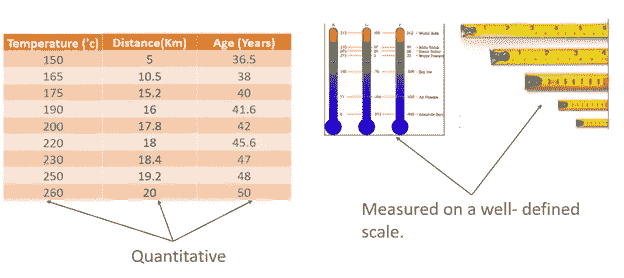

来源—作者提供的图片

但是在许多应用中，这些变量不能在一个确定的尺度上测量，它们本质上是定性的。

例如，性别(男性或女性)、肤色(黑色、白色)、国籍和就业状况(就业、失业)等变量是在名义规模上定义的。这些变量没有任何自然的衡量尺度。这种变量通常表示“质量”或属性的存在或不存在，如就业或失业、毕业或未毕业、吸烟或不吸烟、是或否、接受或拒绝，因此它们是在名义尺度上定义的。这种变量可以通过人工构建取值的变量来量化，例如 1 和 0，其中“1”通常表示属性的存在，“0”通常表示属性的不存在。例如，“1”可以表示此人是男性，“0”可以表示此人是女性。

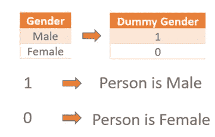

来源—作者提供的图片

类似地，“1”可以指示该人就业，然后“0”可以指示该人失业。这些变量将数据分为相互排斥的类别。这些变量被称为指标变量或虚拟变量。

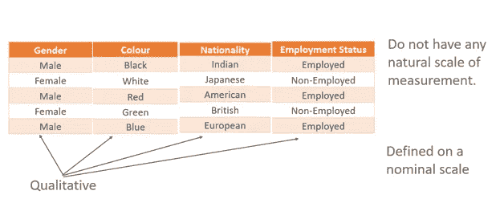

来源—作者提供的图片

这里要注意的一点是:—当一个定性变量有两个或两个以上的类别时，可以用一组虚拟变量*、*来表示，每个类别一个变量。

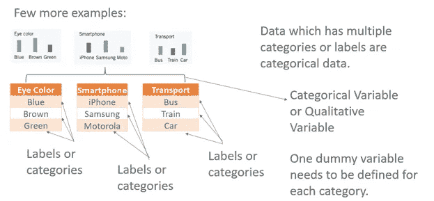

来源—作者提供的图片

*数字*变量也可以被*虚拟编码*以探索*非线性效应*。但是它也有一些缺点，比如:

将定量变量视为定性变量会增加模型的复杂性。误差的自由度也减少了。如果数据集很小，这可能会影响推断。然而，在大型数据集中，这种影响可能很小。

虚拟变量示例–

让我们考虑一个例子，通过一个线性回归的例子来详细阐述概念。

线性回归方程

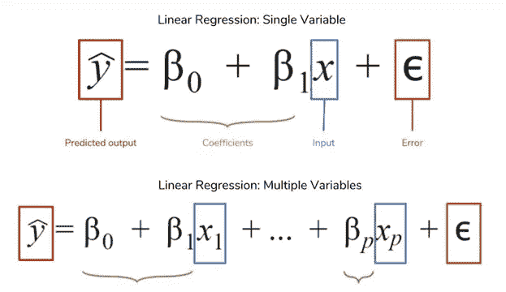

来源—图片来自[https://www . data quest . io/blog/understanding-regression-error-metrics/](https://www.dataquest.io/blog/understanding-regression-error-metrics/)

# 用例 1

我们有 2 个解释变量/自变量和 1 个响应变量/因变量。

解释变量——性别和年龄。

性别是一个定性自变量，有两个类别(男性和女性)

并且对应于性别的虚拟变量被描述为 **D *性别***

这里，考虑了用于定性自变量的两个类别(男性和女性)的 1 个虚拟变量。

年龄是定量(数字)自变量，描述为 **X** 。

响应变量——工资

它是一个定量(数字)响应或因变量，用 **Y** 表示。

定义虚拟变量内的类别， **D *性别***

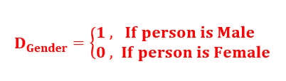

来源—作者提供的图片

下表给出了描述。

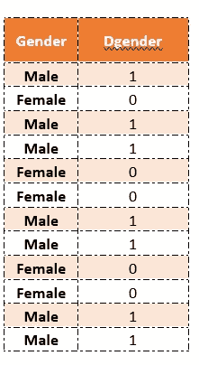

这采用值 0 和 1 来标识互斥类。

没有必要只选择 1 和 0 来表示类别。事实上， **D *性别*** 的任何一个截然不同的值都会服务于这个目的。优选选择 1 和 0，因为它们使计算更简单，并且有助于容易地解释这些值。但是，无论您认为值是 1 和 0 还是-1 或 1 或 1 和 2 等等，得出的结果都是相同的。

编写线性回归方程，以 **X** 为定量，以 **D *性别*** 为虚拟变量。

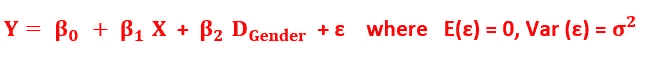

其中，模型方程中的ε是“随机误差项”

并且假设是独立的，并且具有均值为 0 且方差恒定的正态分布。

这里的解释结果很重要。

我们进行如下操作:

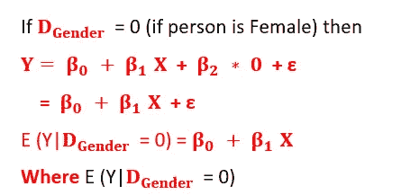

表示当所有其他预测值保持不变时，相关虚拟预测值变量中每单位变化(此处单位变化表示从 0 到 1 或从 1 到 0 的变化，因为值是二进制的)的 E(y)中平均响应的变化。

所以这个和截距 bo，斜率 b1 是直线关系。

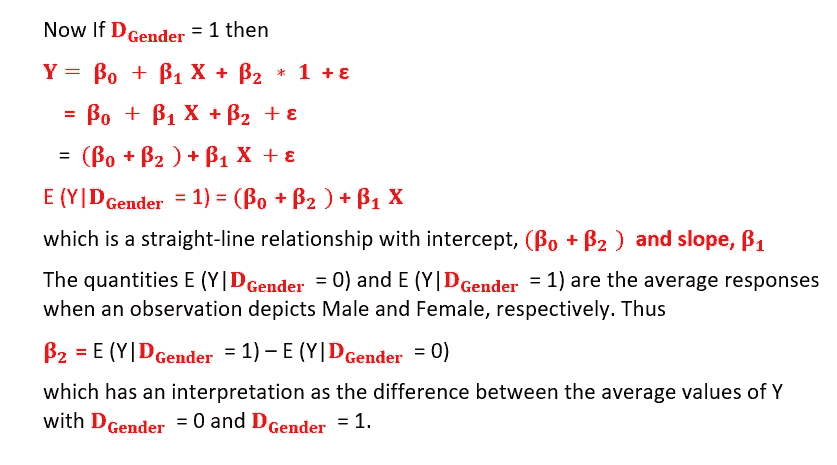

从图形上看，它如下图所示。它描述了两条具有相同方差的平行回归线。

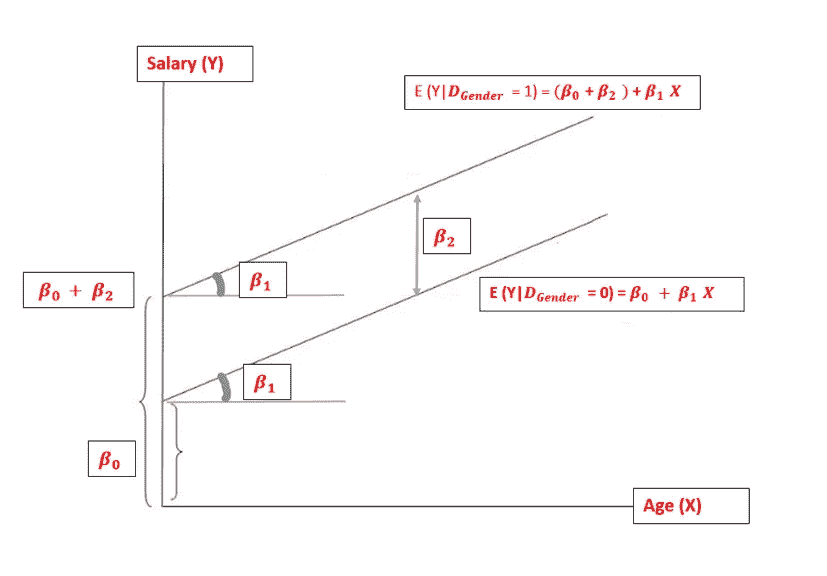

来源—作者提供的图片

以 X 为定量，以 **D *性别*为哑变量的回归方程**

两条平行线表示独立变量之间不存在任何显著的相互作用，即虚拟解释变量、性别对响应变量的影响，即工资在其他解释变量(即年龄)的不同值下是相同的。

这本身就是一个非常重要的结论，因为它会显著影响所创建的模型，如果存在交互作用，它会使模型在结果解释方面更加复杂。

交互作用效应通常表明第三个变量影响自变量和因变量之间的关系。

注意:通常，n-1 个虚拟变量是为 n 个类别创建的，即在我们的性别示例中，性别有 2 个类别(男性和女性)，只创建一个虚拟变量 **D *性别*** 。

为什么为 n 个类别创建 n-1 个虚拟变量，而不是 n 个，这是一个有趣的话题，我将在随后的部分中讨论。

# 让我们从第二个案例开始:

让我考虑与上面相同的例子，但是现在我考虑定性自变量的两个类别(男性和女性)的两个虚拟变量。所有其他事情保持不变。

此外，独立变量之间不考虑交互作用。

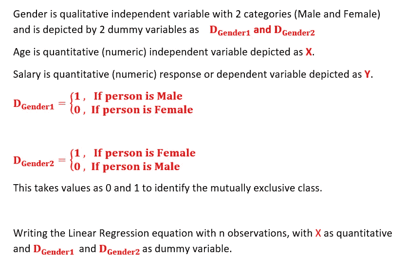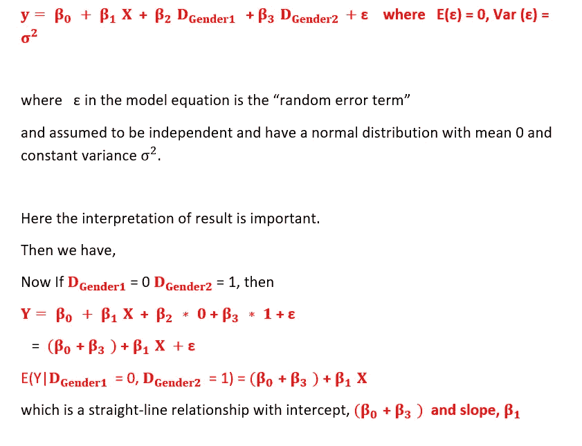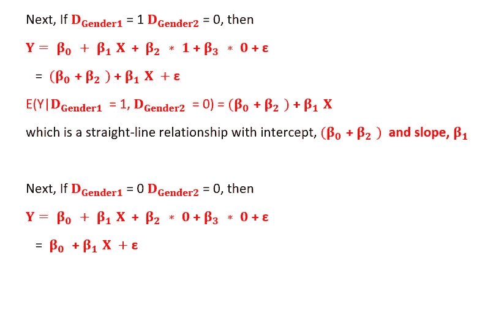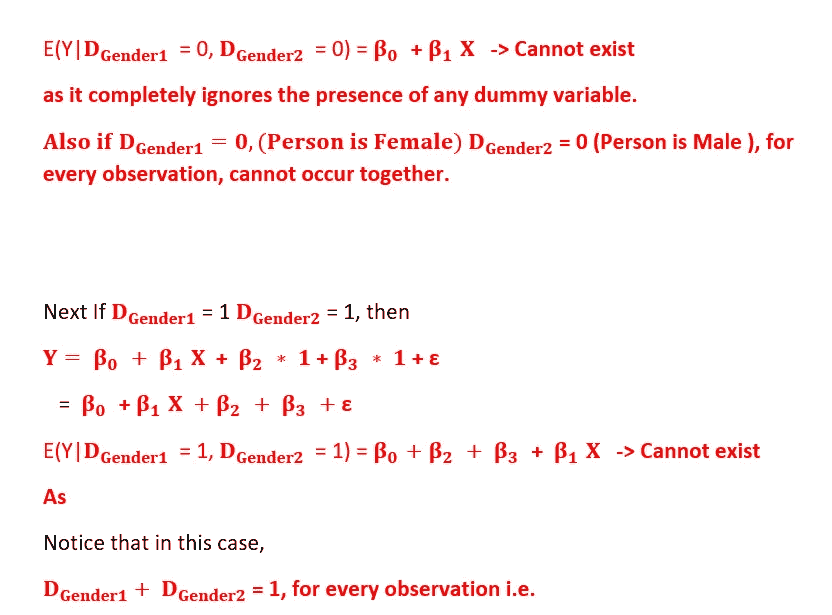

这些不能共存，因为 1 必须为 0，另一个必须为 1 才能满足条件，两者不能同时为 1。

下表描述了这些值。

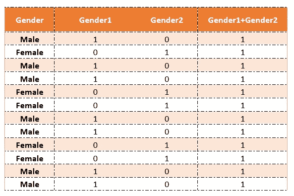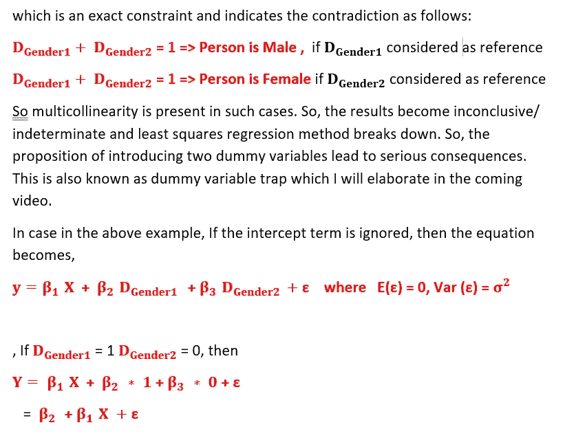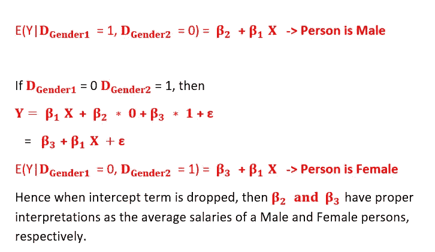

可以使用普通的最小二乘法原理来估计参数，并且使用用于得出推论的标准程序。

从图形上看，它如下图所示。它描述了两条具有相同方差的平行回归线。

两条平行线表示独立变量之间不存在任何显著的相互作用，即虚拟解释变量、性别对响应变量的影响，即工资在其他解释变量(即年龄)的不同值下是相同的。

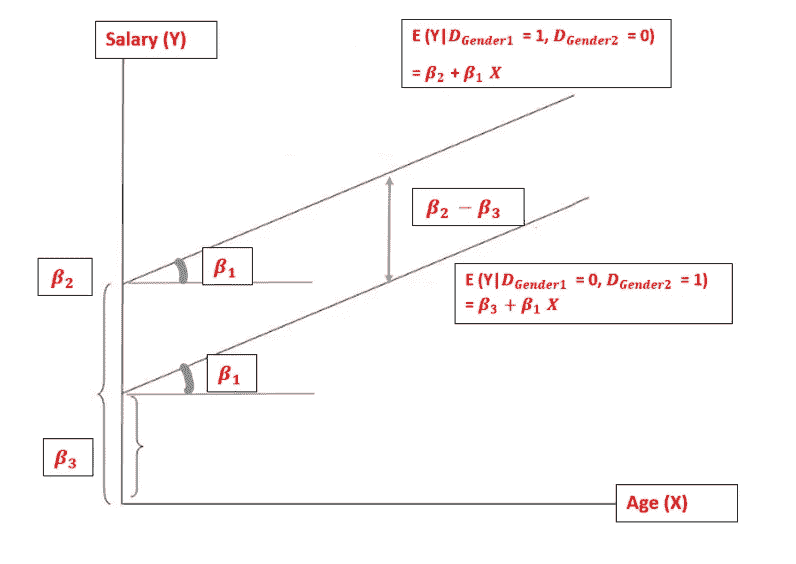

来源—作者提供的图片

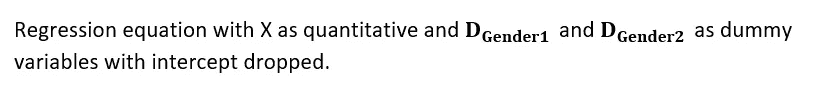

规则:当解释变量导致 m 个互斥类别分类时，则使用(m — 1)个虚拟变量来表示。或者，使用虚拟变量，但去掉截距项。

# 让我们从第三个案例开始:

我将考虑与上述相同的示例，但现在我考虑一种情况，其中我们有两个独立变量，一个是定量变量，另一个是定性变量，有两个类别(男性和女性)，它们都相互作用，另一个解释变量作为它们的相互作用添加到方程中。考虑定性变量的虚拟变量。

所有其他事情保持不变。

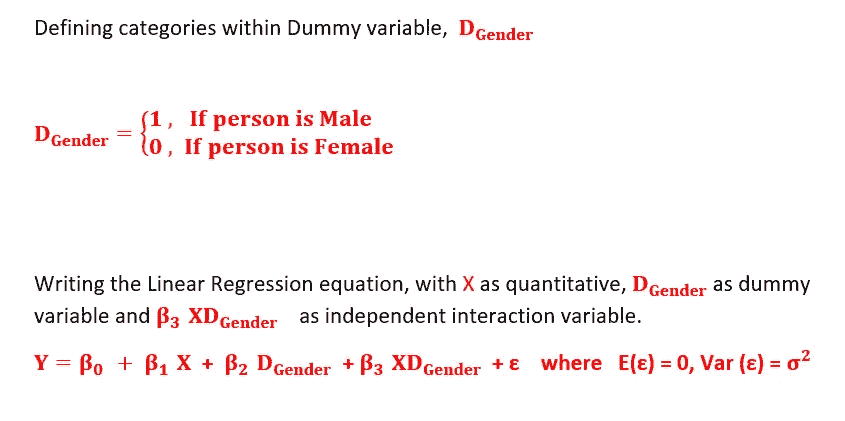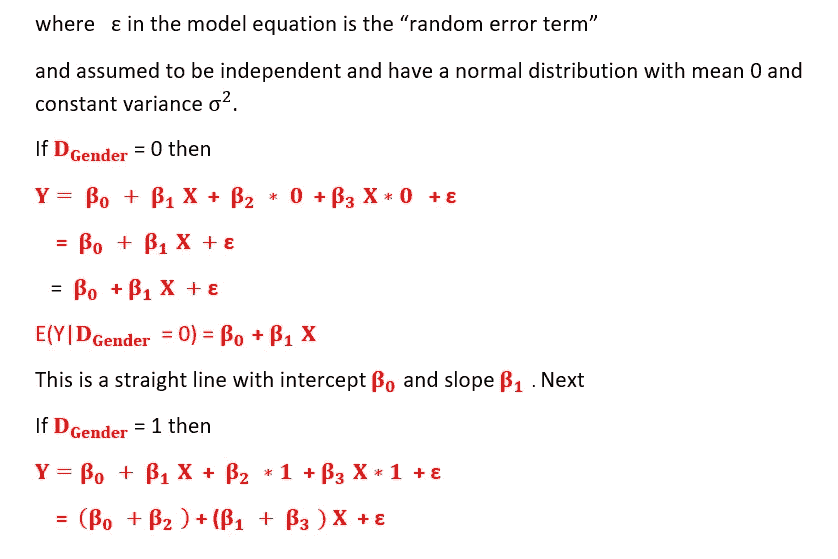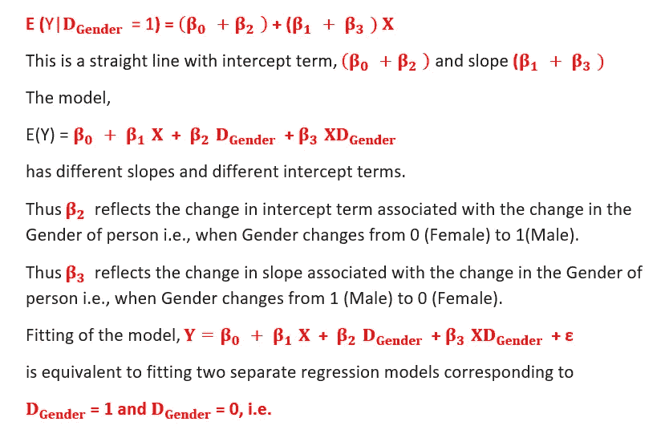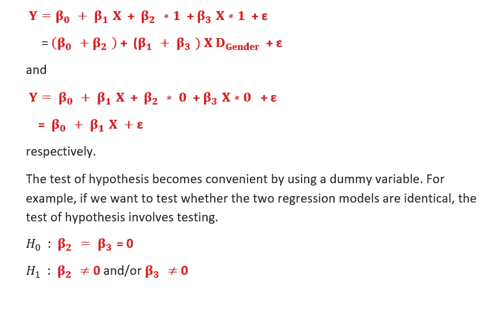

接受 H0 表明，只需要一个单一的模型来解释这种关系。在另一个例子中，如果目标是测试两个模型仅在截距方面不同，并且它们具有相同的斜率，则假设的测试包括测试。

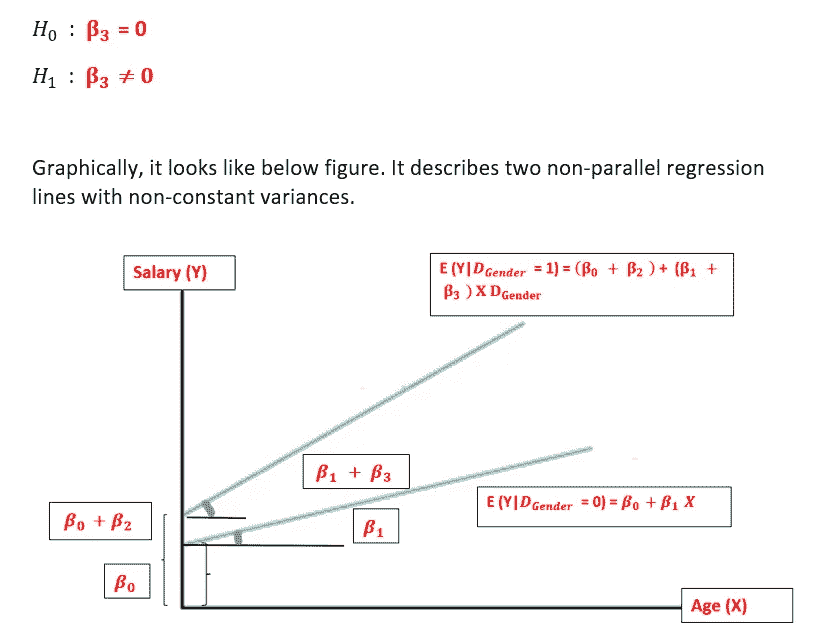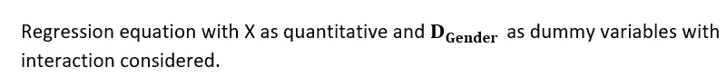

两条不平行的线表明独立变量之间存在交互作用，即虚拟解释变量、性别对响应变量的影响，即工资在其他解释变量(即年龄)的不同值下是不同的。

这本身就是一个非常重要的结论，因为它会显著影响模型，并且由于交互作用的存在，它会使模型在结果解释方面更加复杂。我们需要仔细检查线性回归结果，以得出由于独立变量相互作用而产生的见解。

交互作用效应通常表明第三个变量影响自变量和因变量之间的关系。

众所周知，如果你在处理有类别的定性变量，你可能需要将它们编码成一种数字格式，这种格式对机器学习算法的计算更友好。这里我们使用了一种叫做**一键编码的方法。**

## 那么，什么是一键编码呢？

一键编码是将具有多个类别的定性变量转换成多个二进制变量的过程，其中每个变量可以用值 1 或 0 来表示，以指示类别(即级别)的存在或不存在。

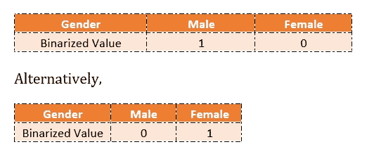

让我通过其余部分向您展示一个例子。

如果没有安装，请安装“虚拟”软件包，然后使用库函数调用该软件包。

考虑一个具有 3 列的示例数据，即每月工资、年龄和婚姻状况。

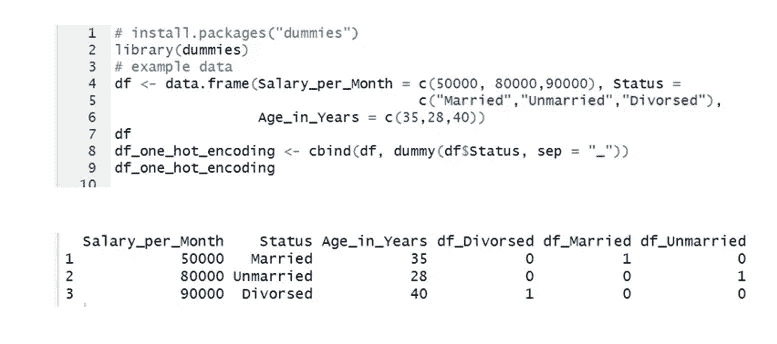

**一热编码**

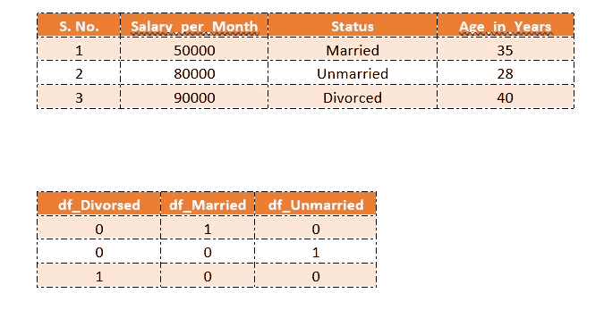

在完成一键编码后，我们得到的是虚拟变量。

但是，一个热编码生成的虚拟变量与定性变量中的类别一样多，也就是说，如果一个定性变量中有 m 个类别，它将生成 m 个虚拟变量。

我们也可以使用 R 中的“caret”或“mltools”包来进行一次热编码。所以在 R 中有多种方法可以生成虚拟变量。我考虑过其中的一种方法。

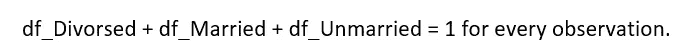

这是多重共线性的情况。

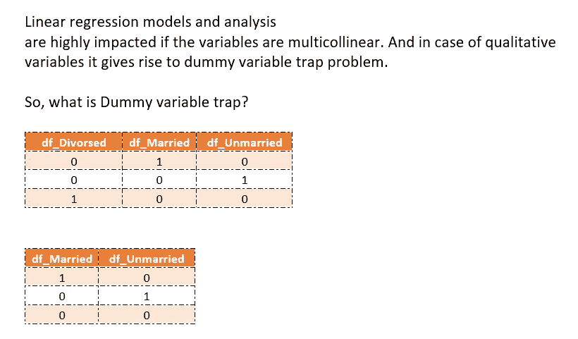

虚拟变量陷阱是线性回归中一个或几个自变量预测另一个自变量的情况，称为多重共线性。

因此，模型无法区分一列对另一列的影响。

虚拟变量陷阱是一种独立变量多共线的情况，即两个或更多变量高度相关的情况；简单地说，一个变量可以从其他变量中预测出来。

在我们的例子中，如果我们知道每个观察值的 3 列中的 2 列的变量值，我们可以很容易地预测第三个变量的值。

那么，这种情况下的解决方案是什么呢？

我们可以删除其中一个虚拟变量，从而消除添加的虚拟变量之间的共线性。

没有固定的规则来决定哪些变量可以删除。但许多软件会自动设置参考变量，并根据字母顺序删除其中一个虚拟变量。

因为。例如，在我们的例子中，考虑到变量，df_Divorsed、df_Married 和 df _ unfixed、df _ Divorsed divorced 将被设置为参考变量，并按照软件遵循的字母惯例从列表中删除。

因此，如果有 m 个类别，我们在模型中使用 m-1 个变量，被忽略的类别的值可以被认为是参考值，剩余类别的值被拟合以表示相对于该参考值的变化。

至此，我对虚拟变量做了总结。虽然这篇文章很长，但它肯定会帮助你更好地理解虚拟变量及其用途。

感谢阅读！！！