# 理解人工智能中的函数

> 原文：<https://pub.towardsai.net/understanding-functions-in-ai-d2fd52c72b37?source=collection_archive---------3----------------------->

## [人工智能](https://towardsai.net/p/category/artificial-intelligence)，[机器学习](https://towardsai.net/p/category/machine-learning)

## 探索函数的领域和范围…

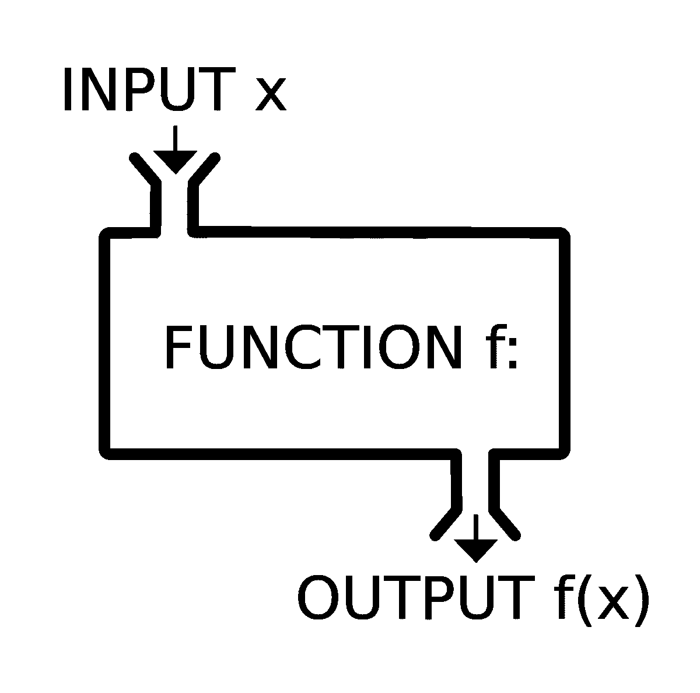

图片来源| [维基百科](https://www.google.com/url?sa=i&url=https%3A%2F%2Fen.wikipedia.org%2Fwiki%2FFunction_(mathematics)&psig=AOvVaw0R2bPlEtXSVuiwqKNQ32Q5&ust=1613911056534000&source=images&cd=vfe&ved=0CAcQjhxqFwoTCKi-iq-9-O4CFQAAAAAdAAAAABAD)

> 我们在人工智能中进行的每一次数据转换都试图将输入数据转换为我们要解决的任务所需的最具代表性的格式……这种转换是通过函数来完成的。

机器学习模型将其输入数据转换为有意义的输出。从已知的输入和输出示例中“T6”学习“T7”的过程。

因此，ML-model " **学习** **一个将它的输入数据映射到预期输出的** **函数"**。

# **f(x) = y_hat**

> 因此，机器学习和深度学习的核心问题是有意义地转换数据:换句话说，学习手头输入数据的有用表示——让我们更接近预期输出的表示……(Francois Chollet)

## 让我们看一个玩具例子…

我们有一个包含一些数据点的表格，一些属于“白”类，另一些属于“黑”类。当我们绘制它们时，它们看起来像这样…

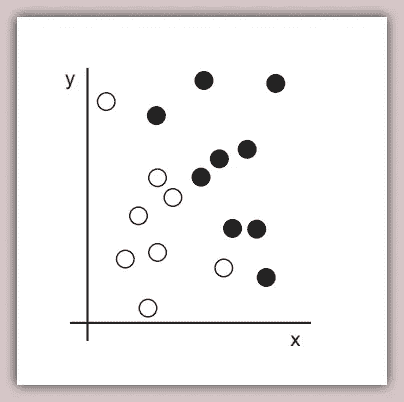

image credit| [dlwp](https://livebook.manning.com/book/deep-learning-with-python?origin=product-look-inside)

如你所见，我们有一些黑白点。假设我们要训练一个 ML 算法，它可以获取一个点的坐标( ***x，y*** )，并输出该点是黑(类 0)还是白(类 1)。

我们至少需要 4 样东西

*   **输入数据**本例中各点的(***)x，y*** )坐标
*   相应的**输出或目标** ( *黑色或白色*)
*   一种衡量绩效的方式，比如说一个**指标**，比如*准确度*。
*   适合任务的算法，比如说类型 ***逻辑回归*** 。

最终，我们在模型中需要的是一个新的数据表示，它可以清晰地将白点和黑点分开。句号！

这种新的表示可以简单到改变坐标，也可以复杂到对数据应用多项式、有理函数或对数、三角和指数函数的组合。

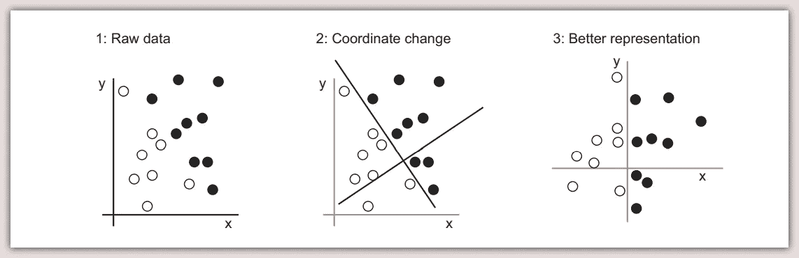

image credit| [dlwp](https://livebook.manning.com/book/deep-learning-with-python?origin=product-look-inside)

让我们假设在一些优化和运气之后，我们的算法学习了满足规则的上述第三种表示:

**{黑点有值> 0，白点有值≤ 0}**

这意味着我们的模型已经学习了我们的数据的表示，可以用'**函数'** ( *f* of *x* **，**写成***f*(*x*)**)来表示，它将输入数据映射到输出目标，使得:

***f(x)= 0*(‘黑’，如果 *x > 0* )**

***f(x)= 1*(‘白色’，如果 *x ≤ 0* )**

有了这个函数，我们希望这个模型能够归纳出未来看不见的黑点和白点的数据。

# 那么究竟什么是函数呢？

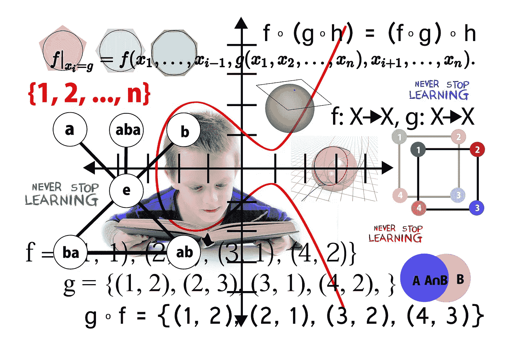

图片由 Gerd Altmann | [pixabay](https://pixabay.com/images/id-5459157/) 提供

想象一下，你在美国佛罗里达州的一家快递公司，将一个包裹 ***x*** ，寄往澳大利亚悉尼的一个地点……代理人输入包裹的重量 ***Wx*** 和从佛罗里达州到悉尼的距离 ***Dx*** ，并向你收取费用 ***C*** ，共计 500 美元。

> 这仅仅意味着 500 美元的费用 ***C*** ，是距离 ***Dx*** 和包裹重量**Wx**x 的**函数。**

让我们进一步假设成本计算器简单地应用一个隐藏函数*，来计算任何包裹的距离和重量，从而得出费用。*

*这整个事务可以写成一个**函数** ***f(x)*** 这样:*

****f(x) = H(Dx，Wx)****

*换句话说， ***C*** *给定* ***x*** 是一个函数***f(x)***取了一个隐藏函数 ***H*** ，对 ***Dx*** 和 ***Wx*** 进行了一些计算。*

*这与以下内容相同:*

****C***=***H(Dx，Wx)****

*这与以下内容相同:*

***$500 = *隐藏 _ 功能* ( *包裹距离 x* ，*包裹重量 x* )***

*所以函数的概念是无处不在的，函数在我们周围无处不在。我们可以通过函数来表示几个结构。例如，可以说…*

> *拥有美好的生活是健康生活和财富的功能*

*如果我们用 ***h*** 表示健康生活，用 ***w*** 表示财富，用 ***x*** 表示美好生活，我们可以把这个关系写成:*

****f(x) = h + w****

# ***一点微积分…***

*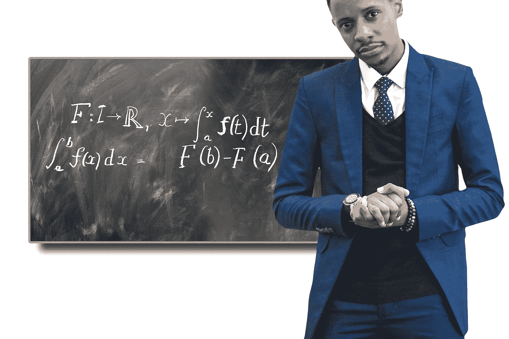*

*图片由 Gerd Altmann | [pixabay](https://pixabay.com/images/id-5459157/) 提供*

> ***微积分是描述函数变化的数学……***

*学习微积分所必需的函数是:-*

1.  ***多项式，***
2.  ***理性，***
3.  ***三角函数，***
4.  ***指数，**和*
5.  ***对数函数***

*不用深入微积分，让我们看看函数的定义:*

> *函数是一种特殊类型的关系，其中第一个集合(**域**)的每个元素与第二个集合(**范围**)的一个元素正好相关。
> 对于任何函数，当我们知道输入时，输出就确定了，所以我们说函数的输出是输入的函数。*

*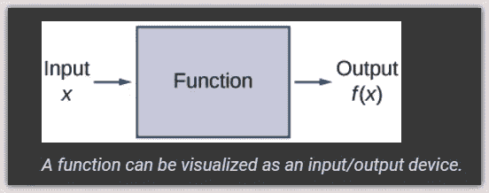*

*例如，正方形的*面积*由它的边长决定，所以我们说*面积* ( **输出**)是它的边长(**输入**)的函数。*

> *对于任何函数，当我们知道输入和规则时，输出就确定了，所以我们说函数的输出是输入的函数。*

*这仅仅意味着任何给定的函数***【f】***都由一组输入(**域**)、一组输出(**范围**)和一个**规则**组成，该规则用于将每个输入精确地分配给一个输出。*

*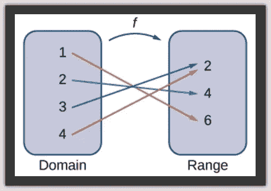*

*从域到范围的映射*

*函数将域中的每个元素映射到范围中的一个元素。虽然每个输入只能发送到一个输出，但是两个不同的输入可以发送到同一个输出(*见上面*的 3 和 4 映射到 2)。*

# *实数、自然数和负数:*

*让我们快速更新一下上面的知识，因为没有数字就不可能在人工智能中执行任何活动…*

## ***1。实数:***

> ***实数集是负无穷大到无穷大范围内的数的集合。***

*在区间记数法中，如果 ***x*** 在以下范围内，则可以写成 ***x*** 是实数:*

***( *-inf* ， *inf* ):** *小于负无穷大且小于无穷大**

*在集合符号中:*

***{*x*|*-INF<x<INF*}:***x，给定-inf < x < inf**

*实数集是各种数的超集，从分数到浮点数到任意大小的负数和正数。*

## *2.自然数:*

> ***自然数集合是范围(0，无穷大)内的正数集合***

*在区间记数法中:*

***[ *0* ， *inf* ):** *包含 0 但小于无穷大。**

*在集合符号中:*

***{*x*| 0*≤x*}:***x，给定 0 ≤ x**

## *3.负数:*

> ***负数的集合是所有小于 0 的数的集合***

*在区间记数法中:*

***(-inf，0)** : *小于负无穷大且小于 0。**

*在集合符号中:*

***{*x*|*x<0*}**:*x，给定 x < 0**

# *探索函数的领域和范围:*

**

*照片由 [CHUTTERSNAP](https://unsplash.com/@chuttersnap?utm_source=unsplash&utm_medium=referral&utm_content=creditCopyText) 在 [Unsplash](https://unsplash.com/s/photos/numbers?utm_source=unsplash&utm_medium=referral&utm_content=creditCopyText) 上拍摄*

*给定一个函数，我们如何确定它的**域**和**范围**？我们如何才能弄清楚这样一个功能可以接受什么样的法律输入，可以产生什么样的法律输出？*

## *功能一:*

****f(x) = max(0，x)****

*上述表达式的意思是，对于***x*** 的任意给定输入，函数返回 **0** 和 ***x*** 之间的最大值。*

*没有进一步的约束，我们可以假设 ***x*** 是任意给定的数，使得:*

***{*x*|*-INF**<x<INF*}**:*含义 x 是任意实数。**

*因此该函数的**域**是实数集*。并且，由于该函数的输出是任意给定数的最小值 **0** 和最大值，我们可以将该函数的**值域**表示为*自然数****【0，inf】或{y|y ≥ 0}*** *的集合。***

## **绘制函数:**

**让我们用从-10 到 10 的数字来画出上面的函数**

**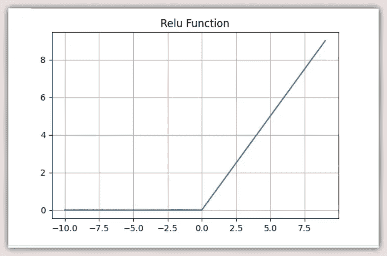**

**值为-10 到 10 的 RELU 激活函数**

**我们一直在探索的功能是最流行的*整流线性单元。*又名 *Relu 激活功能*。Relu 非常简单，但是非常强大。**

> **也许 Relu 的高点是它成功地应用于训练具有非线性激活函数的深层多层网络，使用反向传播… [链接](https://machinelearningmastery.com/rectified-linear-activation-function-for-deep-learning-neural-networks/#:~:text=The%20rectified%20linear%20activation%20function,otherwise%2C%20it%20will%20output%20zero.&text=The%20rectified%20linear%20activation%20function%20overcomes%20the%20vanishing%20gradient%20problem,learn%20faster%20and%20perform%20better.)**

## **功能二:**

*****f*(*x*)= sqrt(*x*+3)+1****

****

**功能 2…**

**以上表达式的意思是，对于任意给定的输入***x*** ，函数返回( ***x + 3) + 1*** 的平方根。**

**要找到定义域，我们需要注意函数的**规则**。这里，我们有一个*平方根*函数作为规则的一部分。这就自动告诉我们,*平方根*中的表达式必须有最小值 0。因为我们找不到负数的平方根。**

**所以要找到定义域，我们必须问…我们必须将 ***x*** 的什么值加到 **3** 才能得到 **0** 的最小值？**

****x + 3 = 0…因此:x = -3****

**因此函数的**域**为 **{ *x* | *x ≥ -3* }** ，或 **[-3， *inf* )。****

**有了规则和定义域，我们可以很容易地找到范围。如果我们把 **-3** 的最小值代入为 ***x*** 。然后该函数将评估为 **0** 的 sqrt，即 **0** ，加上 **1** ，即 **1** 。因此**范围**为 **[1， *inf* )** 或 **{y|y *≥ 1* }** 。**

**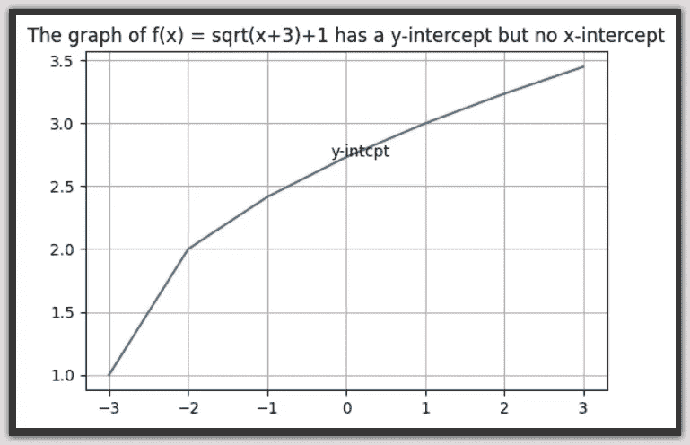**

**函数 2 的图形**

> **对于任何函数，当我们知道输入和规则时，输出就确定了，所以我们说函数的输出是输入的函数。**

## **功能三:**

*****f*(*x*)= 1/(1+*e*^*-x*)****

**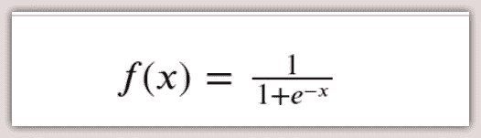**

**功能 3…**

**上述表达式的意思是，对于***x*** 的任意给定输入，函数返回 **1/(1 + *e* ，提升为负 *x* )** ，其中 ***e*** 为*欧拉数* = **2.71828** 。**

**那么我们如何确定这个函数的定义域呢？**

**再看函数，我们可以看到 ***x*** 其实就是*的指数*，其*基*就是 ***e*** 。因此 ***x*** 实际上可以取任何值。这是因为一个*指数函数*的**域**其实就是所有实数的集合，只要*基*不是 **0** 和！= 1.**

****那么范围呢？****

****

**理解了域可以取任何值，就把我们带到了**规则**。我们首先注意到的是负 ***x*** 的指数。由于 **0** 的指数是 **1** ，所以负数的指数必须在**【0，1】**之内。**

**所以，如果指数部分返回 **0** ，我们得到 **1 / (1 +0) = 1** 。如果它返回任何其他值 ***v*** ，其中**0*****<v***<**1**，我们得到**1/(1+*v*)**=**>**某值 **(0，1)。****

**因此**范围**为 **(0，1)或{y|0 < y ≤ 1}****

**没错。我们刚刚探索的函数是*Sigmoid-Activation-Function*，它是我们放在一个*线性回归*函数上的帽子，将它转换成一个适合于*二元分类*任务的*逻辑回归*函数。**

**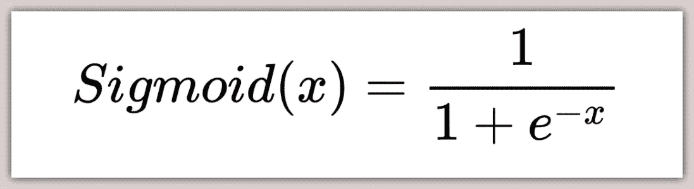**

## **绘制乙状结肠:**

**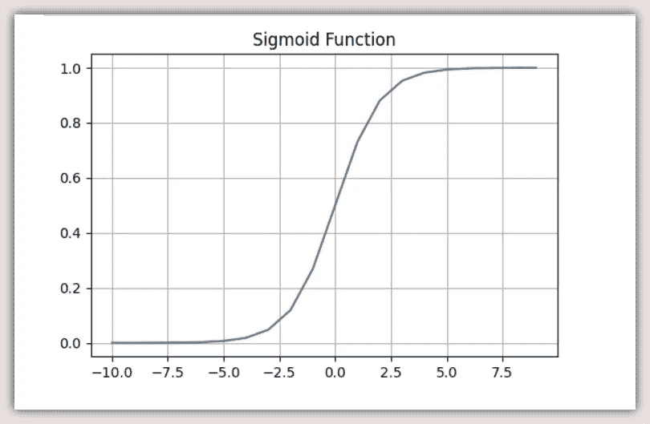**

**值为-10 到 10 的 Sigmoid 激活函数**

## ****关于乙状结肠的更多信息:****

*****y _ hat = w1x 1+w2x 2+b*****

**上面的等式表示具有两个变量 ***x1*** 和 ***x2、*** 乘以权重 ***w1*** 和 ***w2*** 加上偏差 ***b*** 的*多元线性回归。如果我们将 ***y_hat*** 从温度、重量等连续数转换为表示两个类别的离散二进制数，如【 **0，1** 】,我们可以简单地将 *Sigmoid* 函数应用于 ***y_hat，*** 设置一个阈值，如 **0.5** 来区分这两个类别，***

***log _ reg = Sigmoid(*y _ hat*)…=>Sigmoid(*w1x 1*+*w2x 2*+*b*)***

*此外，我们可以很容易地将 *Sigmoid* 函数扩展为 ***Softmax 函数*** 。*

*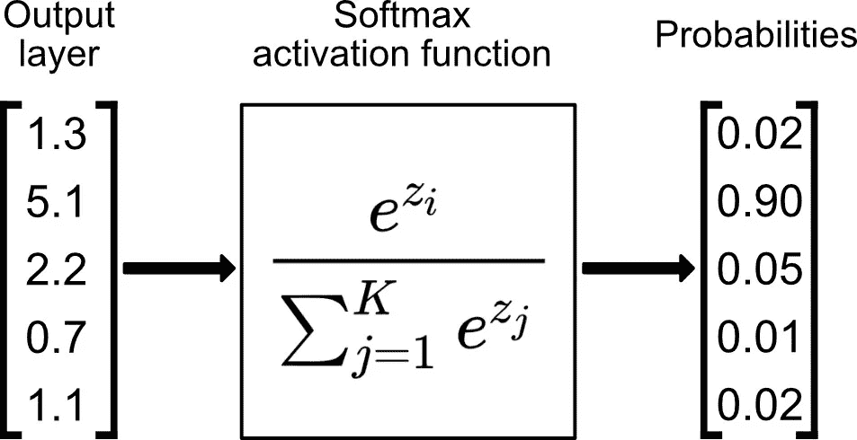*

*Softmax 非常适合多类分类。在 softmax 中，我们为每个输出类计算指数( ***e*** )的[ ***y1，y2…y5】***)。*

> *如果我们有 5 个类，我们有一个包含 5 个元素的向量，[ **y1** ，**y2**…**y5】***

*所以，我们把所有的指数加起来，然后把每个指数除以指数的总和。这给出了 5 个不同的概率，总计为 1.0。概率得分最高的值成为预测 **( *y_hat* )***

*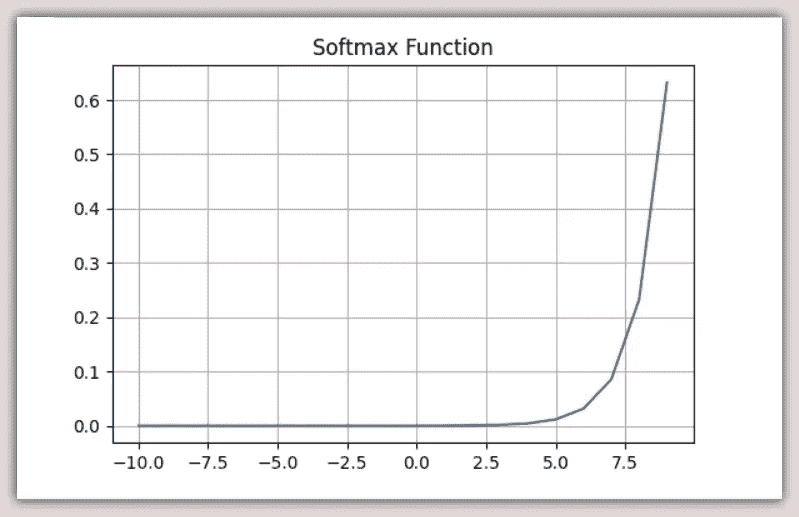*

*值为-10 到 10 的 Softmax 激活功能*

## *功能四:*

****f*(*x*)*=*3*/*(*x*+2)***

*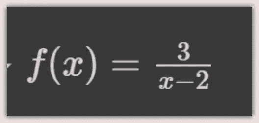*

*功能 4…*

*上述表达式的意思是，对于***x*** 的任意给定输入，函数返回**3**/(***x-*2**)的值。*

*那么，我们如何确定这个函数的定义域呢？换句话说， ***x*** 的什么值会使这个表达式有效？*

*在没有任何其他约束的情况下， ***x*** 应该可以承担除 **2** 之外的任何*实数*。这是因为**3**/(2–2)是非法的，会引发 *ZeroDivisionError* 。*

*因此**域**就是 **( *x* ！= 2)、**或 **{ *x* | *x* ！ *=* 2}。***

*为了找到范围，我们需要找到 ***y*** 的值，使得在属性为**(3/(*x*+2))=*y***的域中存在一个实数 ***x*** 。*

*由于 ***x*** 可以是除 **2 以外的任何实数。**和 **3** 除以(任意实数加 **2** )不能等于 **0** 。*

*所以范围是 **( *y* ！= 0)** 或 **{ *y* | *y* ！= 0}** 。*

# *摘要*

**

*由[凯利·西克玛](https://unsplash.com/@kellysikkema?utm_source=unsplash&utm_medium=referral&utm_content=creditCopyText)在 [Unsplash](https://unsplash.com/s/photos/summary?utm_source=unsplash&utm_medium=referral&utm_content=creditCopyText) 上拍摄的照片*

*上面的最后一个例子有点棘手，但是它遵循了相同的一般模式，即根据规则查找域的合法元素。然后，将这些元素映射到范围。*

*一般来说，函数对编程极其重要，尤其是对人工智能。当我们着手构建模型、导入具有许多其他功能的库或者根据需要编写我们自己的库时。让我们意识到我们函数的**域**、**规则**和**范围**。为每个函数附加一个人类可读的 docstring，除了名称和变量名是不言自明的。*

*谢谢你的时间。*

***干杯！***

# *信用:*

*[用 Python 进行深度学习(Francois Chollet)](https://www.amazon.com/Deep-Learning-Python-Francois-Chollet/dp/1617294438)*

*[Montereyinstitute.org](http://www.montereyinstitute.org/courses/DevelopmentalMath/COURSE_TEXT2_RESOURCE/U18_L1_T1_text_final.html#:~:text=Exponential%20functions%20have%20the%20form,is%20the%20growth%20of%20bacteria.)*

*[Openstax.org](https://openstax.org/books/calculus-volume-1/pages/1-1-review-of-functions)*

*[机器学习掌握度](https://machinelearningmastery.com/rectified-linear-activation-function-for-deep-learning-neural-networks/#:~:text=The%20rectified%20linear%20activation%20function,otherwise%2C%20it%20will%20output%20zero.&text=The%20rectified%20linear%20activation%20function%20overcomes%20the%20vanishing%20gradient%20problem,learn%20faster%20and%20perform%20better.)*

# *关于我:*

*劳伦斯是技术层的数据专家，对公平和可解释的人工智能和数据科学充满热情。我持有 IBM 的 ***数据科学专业*** *和* ***高级数据科学专业*** *证书。以及****uda city AI nano degree****。我已经使用 ML 和 DL 库进行了几个项目，我喜欢尽可能多地编写函数代码，即使现有的库比比皆是。最后，我从未停止学习、探索、获得认证，并通过有见地的文章分享我的经验……**

*请随时在以下网址找到我*

*[Github](https://github.com/Lawrence-Krukrubo)*

*[**领英**](https://www.linkedin.com/in/lawrencekrukrubo/)*

*[**推特**](https://twitter.com/LKrukrubo) *。**