# 了解 GANs

> 原文：<https://pub.towardsai.net/understanding-gans-4f5388548d1d?source=collection_archive---------1----------------------->

照片来自[https://wallpaperaccess.com/](https://wallpaperaccess.com/)

## [深度学习](https://towardsai.net/p/category/machine-learning/deep-learning)

GANs(生成对抗网络)是一类模型，其中图像从一个分布转换到另一个分布。GANs 有助于各种应用，例如:提高图像质量、照片编辑、图像到图像的翻译、服装翻译等。如今，许多零售商、时尚行业、媒体等。正在利用 GANs 来改善他们的业务，并依靠算法来完成这项任务。

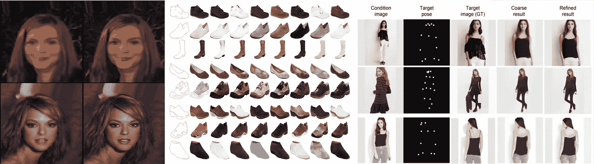

a)超分辨率:增强图像质量 b) MUNIT:从边缘构建鞋子 c) DeepFashion:使用条件图像生成引导姿势

有许多形式的 GAN 可用于不同的目的，但在本文中，我们将重点讨论 CycleGAN。在这里，我们将看到它在 PyTorch 中的工作和实现。所以系好安全带！！

CycleGAN 学习图像从源 X 到目标域 y 的映射。假设您有一个城市的航拍图像，并希望在 google maps 中将图像或风景图像转换为分段图像，但您没有可用的成对图像，那么 GAN 适合您。

***甘与风格转移有何不同？*** 干是比风格转移更一般化的模式。这里两种方法都试图解决相同的问题，但是方法不同。样式转换试图在应用另一个图像的样式时保持图像内容不变。它从神经网络模型的中间层提取内容和风格。它专注于分别学习图像的内容和风格，但在 GAN 中，该模型试图学习从一个域到另一个域的整个映射，而不分离上下文和风格的学习。

## GAN 架构:

考虑两个图像域，一个*源域* (X)和一个*目标域* (Y)。我们的目标是学习从域 G: X → Y 和从 F: Y → X 的映射。我们分别在域 X 和 Y 中有 N 和 M 个训练示例。

GAN 有两个部分:

a) ***生成器******(G)***

生成器的工作就是做 ***翻译*** 的部分。它从 X → Y 和 Y → X 中学习映射，并使用域 X 中的图像来生成看起来与目标域相似的*假 Y 的*，反之亦然。发生器的设计通常包括下采样层，随后是一系列残差块和上采样层。

b) ***鉴别器(D)***

鉴别器的工作是查看图像，并输出它是真实的训练图像还是来自生成器的虚假图像。鉴别器就像一个二进制的"*分类器，给出图像真实的概率。鉴别器的设计通常由一系列的[conv，范数，漏-Relu]层组成。鉴别器的最后一层输出矩阵，当输入图像是实数时该矩阵接近 1，否则接近 0。每个域有两个鉴别器( *Dx* 和 *Dy* )。*

*在训练期间，生成器试图通过生成越来越好的假货来智胜鉴别器。当生成器生成的图像非常好，以至于鉴别器以几乎 50%的置信度猜测它是假的还是真的时，模型达到平衡。*

## *损失函数:*

*GAN 涉及三种类型的损耗:*

1.  ***败*败*败***

*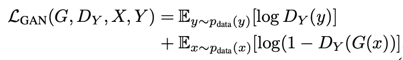*

*对抗性损失*

*这里 D(G(x))是 G 生成的输出是实像的概率。G 试图生成看起来类似于真实图像 y 的图像 G(x)，而 Dy 试图区分真实图像(y)和转换后的图像(G(x))。d 关注于最大化该损失函数，而 G 想要最小化该损失函数，使其成为 GAN 的 *minimax* 目标函数。映射 F: Y → X 也有类似的对抗性损失。*

*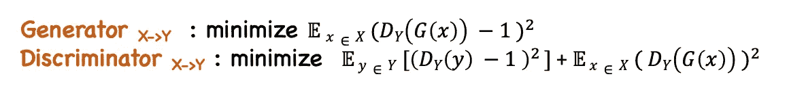*

*改良对抗性损失*

*但是在训练过程中，这种损失函数被修改为 MSE 损失，更加稳定和准确。生成器的最终对抗性损失是映射 G 和 f 的损失之和。*

*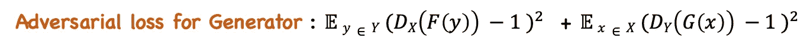*

*2. ***周期一致性丧失*** :*

*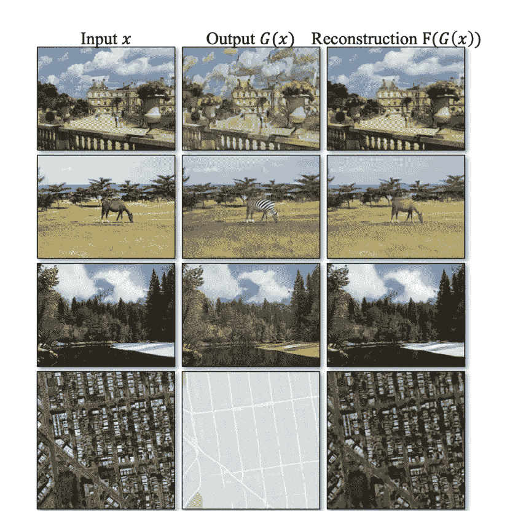*

*循环一致性损失*

*单独的对抗性损失函数不能保证 X 到 Y 的映射。它可以改为学习该映射以创建类似于域 Y 但失去域 X 的所有特征的图像。为了减少可能的映射函数的空间，引入了另一个称为循环一致性损失的损失函数。它通过完成 X → Y 再 Y → X 的映射循环，学会恢复原始图像。*

*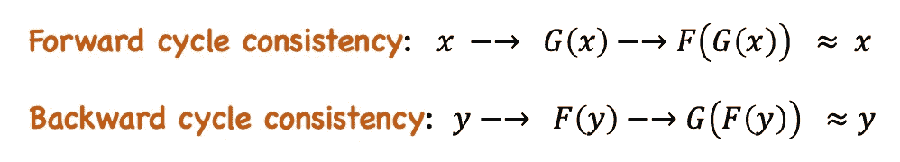*

*平移后的图像(G(x))通过映射 F 得到 x 的重构图像。原始图像和重构图像应该足够接近。*

*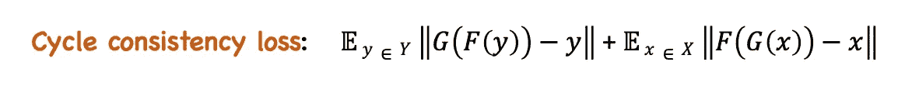**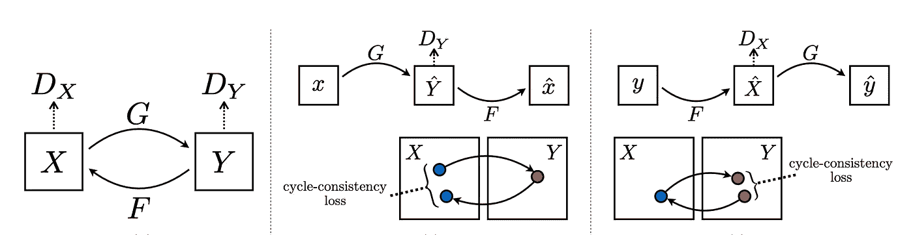*

*前向循环一致性和后向循环一致性*

*3. ***身份丧失:****

*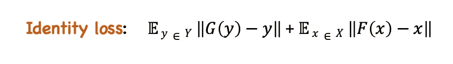*

*恒等式丢失处理 G: X → Y 和 F: Y → X 的恒等式映射`G(y) = y and F(x) = x`*

*发电机的最终损失函数是上述三种损失的**加权和**。*

## *培养*

*在这里，我们训练甘模型做图像翻译，从莫奈的画到真实的照片，反之亦然。数据集中的图像尺寸为 256，但由于内存限制，图像尺寸被转换为 128。*

*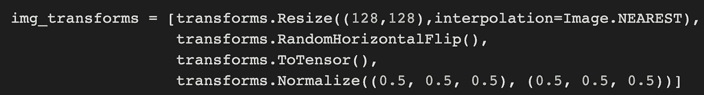*

*图像中使用的变换:调整大小和随机水平翻转*

*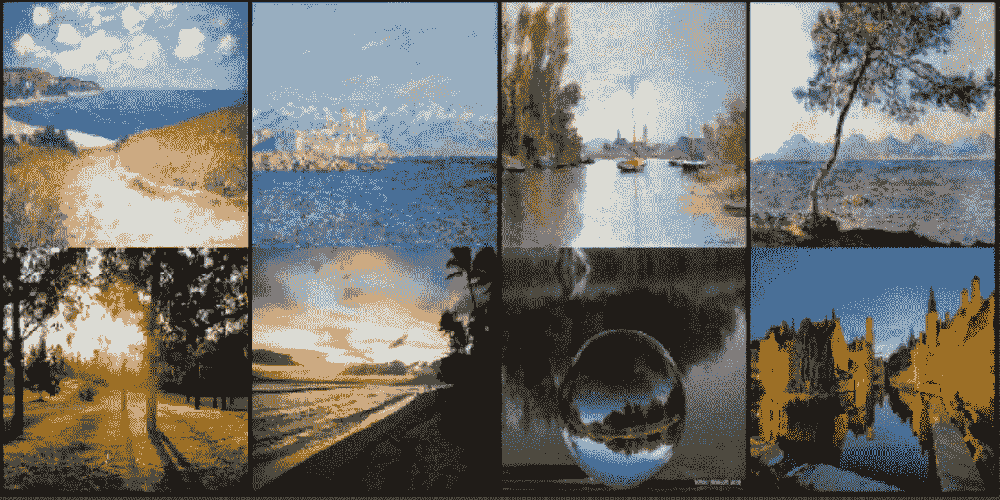*

*第一排:莫奈的**画作(领域 A)** ，第二排:**真实照片(领域 B)***

****所用发电机型号:****

*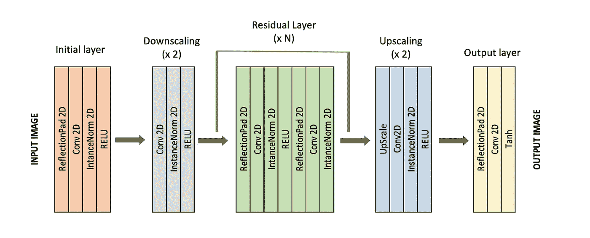*

*发电机架构*

****使用的鉴别器型号:****

*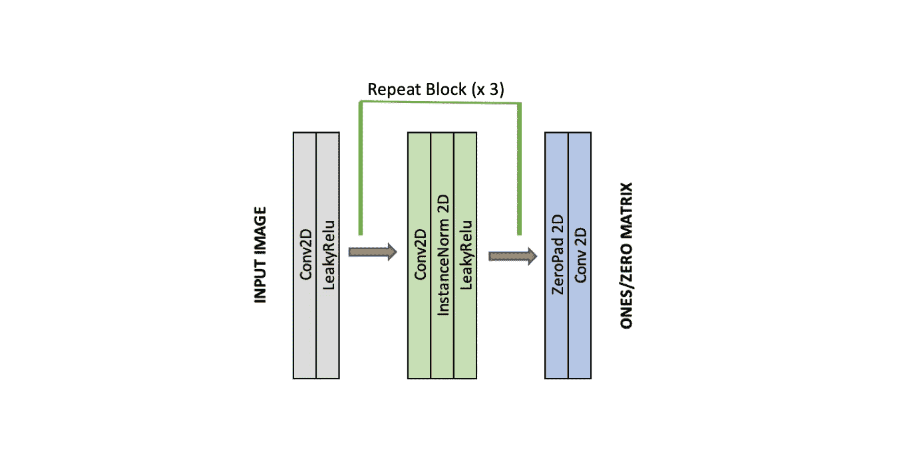*

*鉴别器架构*

****其他设置:****

*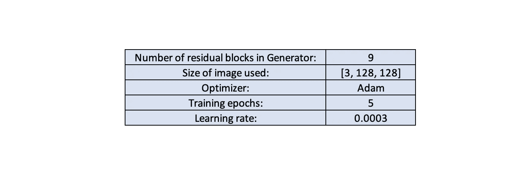*

****训练步骤:****

*发电机步骤:*

1.  *为生成器创建两个模型实例。`G_AB`:莫奈的真实和`G_BA`:莫奈的真实。此外，两个鉴别器`D_A`和`D_B`，用于两个域的真实图像分类器。*
2.  *从 A 域和 b 域取一批图像(`real_A`、`real_B`)，通过`G_AB`和`G_BA`得到`fake_B`和`fake_A`。*
3.  *计算上述发电机损耗，反推网络`G_AB`和`G_BA`。*

**这里的变量**有效**和**假**分别是 1 和 0 的矩阵。*

*鉴别器步骤:*

1.  *现在，带上`fake_A`和`real_A`并训练`D_A`。使用对抗损失一节中提到的鉴别损失函数。*
2.  *同样，拿`fake_B`和`real_B`练`D_B`。*

****测试结果:****

*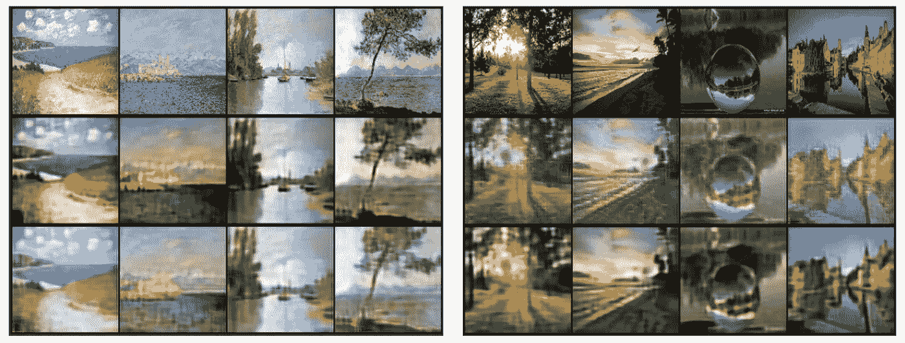*

***图 1** :真 A →假 B →复原 A，**图 2** :真 B →假 A →复原 B*

*以上数字显示了模型的整个周期。图 1，第一行显示的是真实的莫奈的画(`real_A`)，第二行显示的是莫奈的画向真实照片的转换(`fake_B`)，然后第三行再次显示的是`fake_B`的转换，以恢复莫奈的画(`recov_A`)。类似地，图 2 显示了将真实照片转换为莫奈的绘画，然后再转换回恢复的真实照片的循环。*

*我正致力于改进这个模型，了解更多关于 GANs 的知识。如果你喜欢这篇文章，点击拍手。*

## *代码:*

* [## ShwetaBaranwal/GAN

### permalink dissolve GitHub 是超过 5000 万开发人员的家园，他们一起工作来托管和审查代码，管理…

github.com](https://github.com/ShwetaBaranwal/GAN/blob/master/Understanding_CycleGANs.ipynb) 

## 参考资料:

 [## 使用循环一致对抗网络的不成对图像到图像翻译

### 图像到图像的翻译是一类视觉和图形问题，其目标是学习图像和图形之间的映射

arxiv.org](https://arxiv.org/abs/1703.10593)  [## /~ tae sung _ park/cycle gan/数据集的索引

### 编辑描述

people.eecs.berkeley.edu](https://people.eecs.berkeley.edu/~taesung_park/CycleGAN/datasets/)  [## eriklindernoren/PyTorch-GAN

### 收集 PyTorch 实现的研究论文中提出的生成性对抗网络变体。型号…

github.com](https://github.com/eriklindernoren/PyTorch-GAN/tree/a163b82beff3d01688d8315a3fd39080400e7c01)*