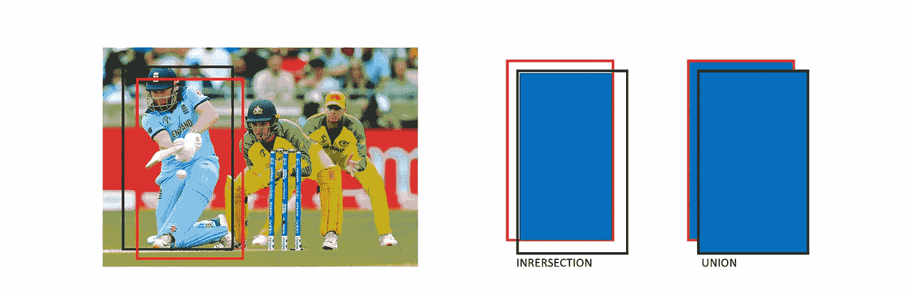
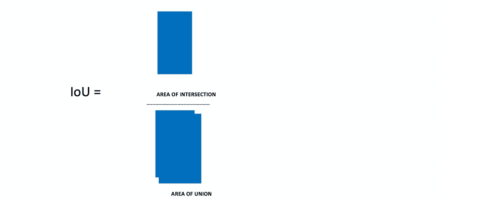
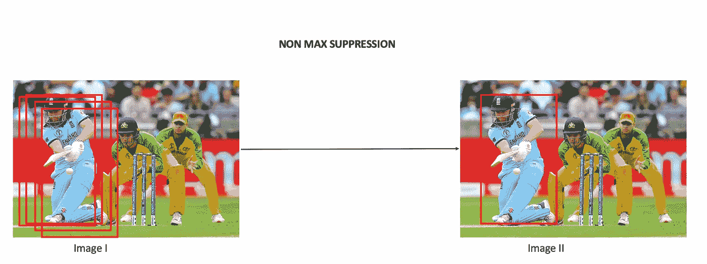

# 了解对象检测中的 IoU 指标

> 原文：<https://pub.towardsai.net/understanding-iou-metric-in-object-detection-1e5532f06a76?source=collection_archive---------0----------------------->

## 计算机视觉


[https://images . unsplash . com/photo-1453728013993-6d 66 e 9 c 9123 a？IX lib = r b-1 . 2 . 1&ixid = eyjhchbfawqiojeymdd 9&auto = format&fit = crop&w = 1950&q = 80](https://images.unsplash.com/photo-1453728013993-6d66e9c9123a?ixlib=rb-1.2.1&ixid=eyJhcHBfaWQiOjEyMDd9&auto=format&fit=crop&w=1950&q=80)

# 介绍

在本帖中，我们将讨论用于评估对象检测模型的指标。无论使用 RCNN、快速 RCNN、快速 RCNN、YOLO 等算法，度量都是不变的。

博客将主要分为三个部分，第一部分包括“什么”，“为什么”需要借据。第二个是 python 实现，最后是通过非最大值抑制在边界框选择环境中的应用。

一旦你建立了一个物体探测器，下一件事你想知道的是你的模型有多精确。这在所有机器学习项目中都很常见，在实现之前，应该对模型进行评估。在回归问题的情况下，我们有一个类似均方误差(MSE)的度量，类似地，对于分类，可以使用混淆矩阵、f1 分数等；详情参见此[博客](https://medium.com/analytics-vidhya/model-validation-for-classification-5ff4a0373090?source=your_stories_page---------------------------)。

现在回到我们的问题，物体检测的任务或者物体检测的输出无非是以一定的概率画一个包围盒。



样本输出:假设我们正在检测击球手

边界框是一组用来定位图像的坐标，它因 COCO 和 Pascal-VOC 数据集而异。

*   COCO: bbox 是(左上 x 位置，左上 y 位置，宽度，高度)
*   Pascal-VOC:bbox 是(*xmin-左上，ymin-左上，xmax-右下，ymax-右下)*

关于这些数据集的更多细节可以在[这里](https://medium.com/towards-artificial-intelligence/understanding-coco-and-pascal-voc-annotations-for-object-detection-bb8ffbbb36e3)阅读。

红框:预测的边界框。

黑盒:实际包围盒或地面真相包围盒。

与准确性、 *f1* 得分等其他指标不同，这里我们使用相似度的概念，而不是 bbox 的点匹配。一种这样的相似性度量是 Jaccard 指数，或者在计算机视觉的通俗语言中，我们称之为并集上的交集。

假设我们有两组 S1 和 S2，Jaccard 指数 J 定义为

J(S1，S2) = |S1 ∩ S2|/ |S1 U S2|

IoU =相交面积/并集面积。



*   IoU 评分≥0.5 视为良好。

**Python 实现**

```
box1 = (21, 11, 14, 13)
box2 = (23, 12, 13, 14) 
print("iou = " + str(iou(box1, box2)))
```

输出:iou = 0.417

**IoU 指标的其他一些应用。**

**非最大抑制**

一旦你设置了一个阈值，所有高于这个阈值的边界框都会被过滤掉，但是我们希望图像中的每个物体都有一个单独的边界框。



非最大抑制是如何工作的？

给定一组预测的 bbox 和概率/分数以及阈值，需要提出单个 bbox。

*A:概率为*的所有预测 bbox 的集合

*B:初始空集*

*   挑选得分最高的一个，推入集合 *B*
*   把那个从 a 上放下来。
*   用选中的一个计算所有其他的 IoU，从 IoU ≥阈值的 A 中移除所有预测框。
*   重复步骤 2 和 3，直到 a 中没有 bbox。