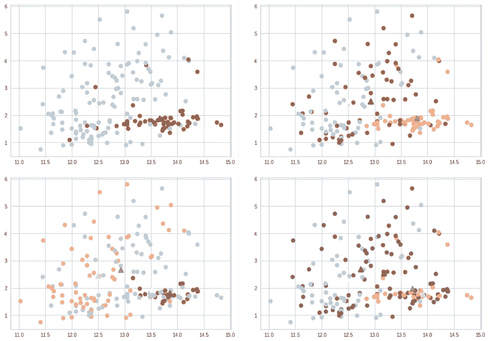
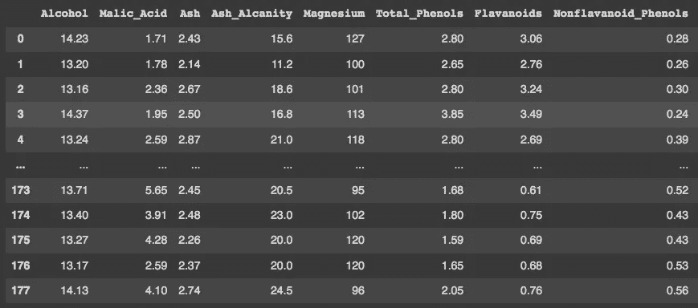
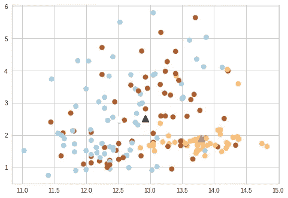
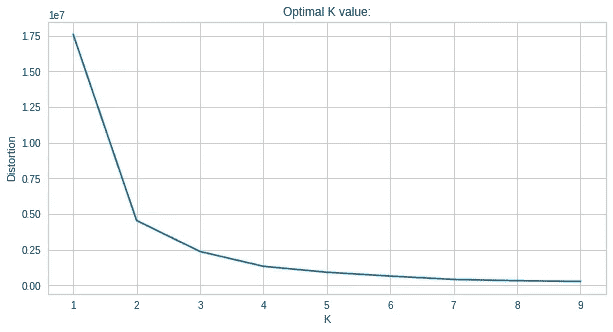
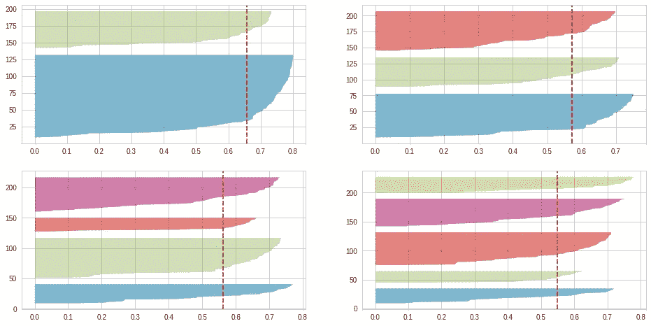

# 理解 K-均值聚类:SciKit 实践-学习

> 原文：<https://pub.towardsai.net/understanding-k-means-clustering-hands-on-with-scikit-learn-b522c0698c81?source=collection_archive---------0----------------------->

## 使用 Python 和 Google Colab



K-means 是一种无监督的机器学习算法，它试图找到能够聚集与任何特征或特征组更接近的某些数据点的聚类中心。这种技术在探索性数据分析中非常有用，尤其是当研究人员不太了解数据和变量行为时。

## K-Means 算法是如何工作的？

实现 k-means 算法有三个主要步骤:

***1。设置研究员想要的集群数量***

当 K 均值函数被定义时，聚类的数量必须由研究者选择。有两种选择 K 值的基本技术，但我将在后面讨论它们。

***2。定义质心(或初始均值)***

现在，该算法选择 k 个随机点作为质心，并将剩余的数据点分配给最近的质心。在所有的点都被指定之后，一个新的 k 形心的平均值被计算出来。

***3。更新质心平均值并重新分配观测值***

当计算新的平均值时，一些数据点可以被重新分配给不同的质心。当对不同集群的分配不再改变时，该算法完成其工作。

> 让我们做一些实际的工作:

你可以从 Kaggle 下载用于本教程的数据集，但是我强烈建议你尝试对我们自己的数据实现该算法。

```
**#Import libraries:**
import pandas as pd
import numpy as np
import seaborn as sns
from sklearn.cluster import KMeans
import matplotlib.pyplot as plt
from sklearn.metrics import silhouette_score
from yellowbrick.cluster import SilhouetteVisualizer**#Load and read data frame:**
df = pd.read_csv('/content/Wine.csv')
df
```



我们需要定义 K-Means 函数，并通过猜测尝试 k=3:

```
**#Define function:**
kmeans = KMeans(n_clusters=3)
```

由于我们使用的是无监督算法，因此没有必要定义 y，但我们仍将数据称为 X:

```
**#Define X as numpy array:**
X = np.array(df)**#Fit the model:**
km = kmeans.fit(X)**#Print results:**
print(kmeans.labels_)**#Visualise results:**
plt.scatter(X[:, 0], X[:, 1], 
            c=kmeans.labels_,      
            s=70, cmap='Paired')
plt.scatter(kmeans.cluster_centers_[:, 0],
            kmeans.cluster_centers_[:, 1],
            marker='^', s=100, linewidth=2, 
            c=[0, 1, 2])
```



> 但是我们如何找到 K 的最佳值呢？

选择最佳 K 值对于研究人员来说可能并不明显，因为 K-means 是一种经常用于数据探索的无监督 ML 技术，而研究人员对数据集和要素行为知之甚少。有两种主要方法来选择 k 值:

## **肘法**

该方法选取 K 的一系列随机值，然后计算每个聚类中各点之间的平均距离。对于 K 值为 1 的情况，平均距离较高，随着 K 值的增加，平均距离会降低。然而，降低的距离有一个极限，肘形法找到这个极限，并使用更接近的整数作为 k。

```
**#Define variable distortions:**
distortions = []**#Set a range of values for K:** K = range(1,10)**#Initialise the loop:** for k in K:
    kmeanModel = KMeans(n_clusters=k)
    kmeanModel.fit(X)
    distortions.append(kmeanModel.inertia_)**#Plot the graph:**
plt.figure(figsize=(10,5))
plt.plot(K, distortions, 'bx-')
plt.xlabel('K')
plt.ylabel('Distortion')
plt.title('Optimal K value:')
plt.show()
```



通过图形观察，我们可以看到最佳 K 值为 3，在该值之后，失真的下降并不显著。

## **剪影法**

与肘部方法类似，剪影方法首先为 K 选择一个随机值，然后为质心赋值。当所有的值都被赋值后，剪影方法计算每个观察值与同一质心中所有其他观察值之间的平均距离( *x* )，以及一个观察值与最近聚类中的点之间的平均距离( *y* )。然后我们应用剪影公式:

> ***SF = (y — x)/Max(x，y)***

轮廓得分的值从-1 到 1 不等。当 SF 值接近 1 时，聚类的理想数量将是。我们可以打印 SF 值:

```
**#Compute and print SF value while trying different k values:**
score = silhouette_score(X, km.labels_, metric='euclidean')
print('Silhouetter Score: %.3f' % score)
```

或者我们可以用不同的 k 值构建一个图形可视化:

```
**#Build graphical visualisation for Silhouette Score:**
fig, ax = plt.subplots(2, 2, figsize=(16,8))
for i in [2, 3, 4, 5]:
    km = KMeans(n_clusters=i, init='k-means++', n_init=12, 
                max_iter=1000, random_state=42)
    q, mod = divmod(i, 2)
    visualizer = SilhouetteVisualizer(km, colors='yellowbrick', 
                 ax=ax[q-1][mod])
    visualizer.fit(X)
```



通过图形可视化，可以看到使用轮廓分数的理想聚类数是 K=2(红色虚线)。

***结论***

K-Means 算法有助于发现数据中的模式，尤其是在研究者对数据集知之甚少的情况下。除了构建 K 均值算法之外，选择理想的 K 值也很重要。

感谢您的阅读！如果你有建议要添加到这个列表中，请告诉我，不要忘记订阅以接收关于我未来出版物的通知。

如果:你喜欢这篇文章，别忘了关注我，这样你就能收到所有关于新出版物的更新。

否则如果:你想了解更多，你可以通过[我的推荐链接](https://cdanielaam.medium.com/membership)订阅媒体会员。它不会花你更多的钱，但会支付我一杯咖啡。

Else:谢谢！