# 了解 LSTMs 和 gru

> 原文：<https://pub.towardsai.net/understanding-lstms-and-gru-s-b69749acaa35?source=collection_archive---------0----------------------->

## [深度学习](https://towardsai.net/p/category/machine-learning/deep-learning)，[自然语言处理](https://towardsai.net/p/category/nlp)

## 长短期记忆和门控循环单元的完美指南。

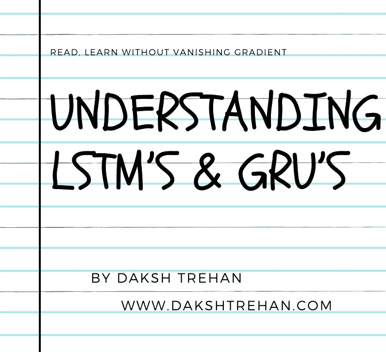

在我的上一篇文章中，我介绍了递归神经网络及其带来的复杂性。为了克服这些缺点，我们使用 LSTMs & GRUs。

 [## 用于假人的递归神经网络

### 递归神经网络完美指南

medium.com](https://medium.com/towards-artificial-intelligence/recurrent-neural-networks-for-dummies-8d2c4c725fbe) 

# 障碍是短期记忆

递归神经网络仅限于短期记忆。如果一个长序列被输入到网络中，他们将很难记住这些信息，还不如从一开始就忽略掉重要的信息。

此外，当反向传播开始起作用时，递归神经网络面临消失梯度问题。由于冲突，更新的梯度小得多，使得我们的模型没有变化，因此对学习没有太大贡献。

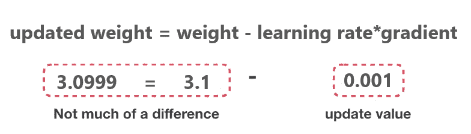

权重更新规则

“当我们执行反向传播时，我们计算每个节点的权重和偏差。但是，如果前几层的改进很少，那么对当前层的调整就会小得多。这导致梯度显著减小，从而导致我们的模型几乎没有变化，因此我们的模型不再学习，不再改进。”

# 为什么是 LSTMs 和 GRUs？

比方说，你正在网上查看对[的《小溪》](https://www.imdb.com/title/tt3526078/)的评论，以决定你是否可以观看。基本方法是阅读评论并确定其观点。

当你寻找评论时，你的潜意识会试图记住决定性的关键词。你会试着记住更多有分量的词，如“Aaaaastonishing”、“永恒的”、“不可思议的”、“古怪的”和“反复无常的”，而不会关注像“认为”、“确切地”、“大多数”等常规词。

下一次当你被要求回忆这篇评论时，你可能会有一段艰难的时间，但是，我敢打赌，你必须记住上面提到的观点和一些重要的决定性的词语。

这正是 LSTM 和 GRU 想要做的。

> 只学习和记住重要的信息，忘记所有其他的东西。

# LSTM(长短期记忆)

LSTMs 是香草 RNN 的一种进步形式，被引入来克服其缺点。为了实现上述直觉并管理由于 RNN 有限大小的状态向量而产生的重要信息，我们选择性地使用读、写和遗忘门。

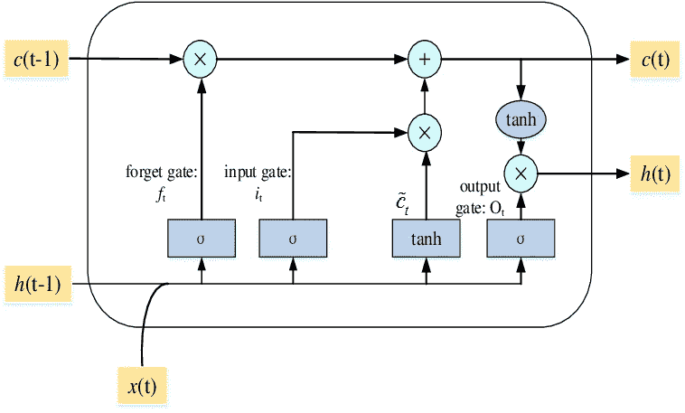

LSTM 细胞，[来源](https://www.researchgate.net/profile/Xiaofeng_Yuan4/publication/331421650/figure/fig2/AS:771405641695233@1560928845927/The-structure-of-the-LSTM-unit.png)

抽象概念围绕细胞状态和各种门。细胞状态可以将相关信息传递给序列链，并能够在整个计算过程中携带相关信息，从而解决了短期记忆的问题。随着这个过程的继续，更多的相关信息通过 gates 被添加和删除。门是一种特殊类型的神经网络，它在训练过程中学习相关信息。

## 选择性写入

我们假设，隐藏状态( **sₜ** )，先前隐藏状态( **sₜ₋₁** )，当前输入( **xₜ** )，偏置( **b** )。

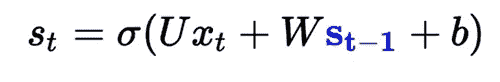

现在，我们正在累加前一状态 **sₜ₋₁** 的所有输出，并计算当前状态 **s** ₜ的输出

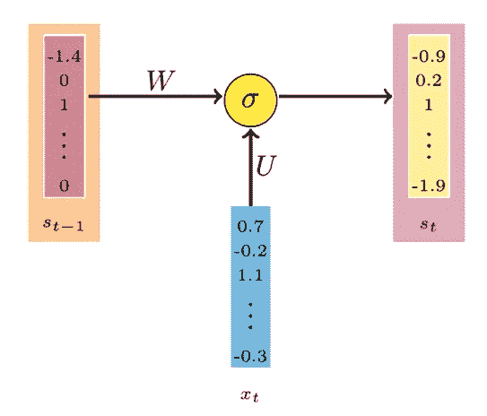

香草 RNN

使用选择性写入，我们感兴趣的只是将相关信息传递给下一个状态 **sₜ.**为了实现该策略，我们可以为每个输入分配一个从 0 到 1 的值，以确定有多少信息将被传递到下一个隐藏状态。

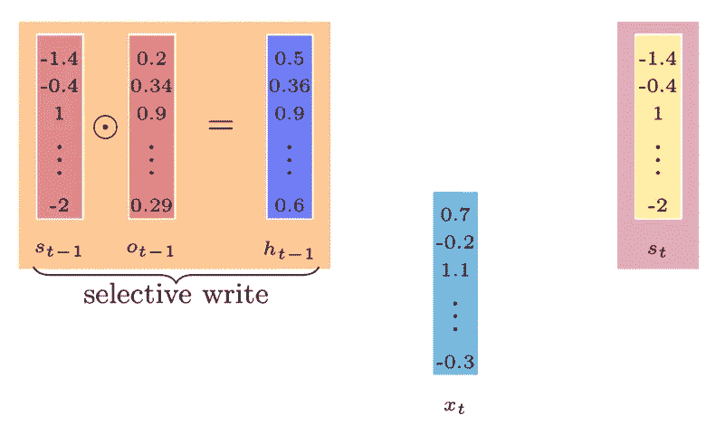

LSTM 选择性写作

我们可以把要传递的那部分信息存储在一个向量 **hₜ₋₁ t** 中，这个向量可以通过把先前的状态向量 **sₜ₋₁** 和 **oₜ₋₁** 相乘来计算，前者为每个输入存储 0 和 1 之间的值。

我们遇到的下一个问题是，如何得到 **oₜ₋₁？**

为了计算 oₜ₋₁，我们必须学习它，我们唯一能控制的向量是我们的参数。所以，为了继续计算，我们需要用参数的形式表示 oₜ₋₁。

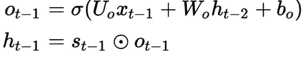

在使用梯度下降学习了 **Uo、Wo** 和 **Bo** 之后，我们可以使用我们的输出门( **oₜ₋₁** )进行精确预测，该输出门控制将有多少信息传递到下一个门。

## 选择性阅读

在传递了来自前一个门的相关信息后，我们引入一个新的隐藏状态向量**šₜ**(用绿色标记)。

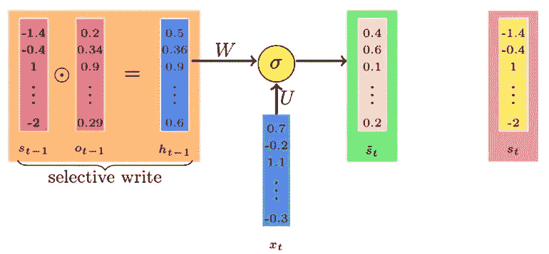

**šₜ**捕捉来自前一状态 **hₜ₋₁** 和当前输入 **xₜ** 的所有信息。

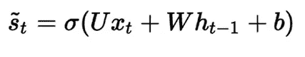

但是，我们的目标是尽可能多地移除不重要的东西，并继续我们的想法，我们将选择性地从**šₜ**中读取，以构建新的细胞阶段。

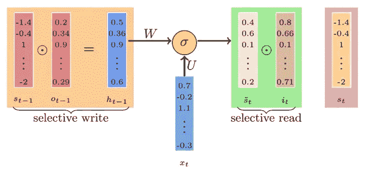

选择性阅读

为了存储所有重要的内容，我们将再次回滚到 0–1 策略，在该策略中，我们将为每个输入分配一个介于 0–1 之间的值，以定义我们希望阅读的比例。

向量 **iₜ** 将存储每个输入的比例值，该比例值稍后将与**šₜ**相乘，以控制流经当前输入的信息，该输入被称为**输入门。**

为了计算 **iₜ** ，我们必须学习它，我们唯一能控制的向量是我们的参数。所以，为了继续计算，我们需要用参数的形式表达 iₜ。

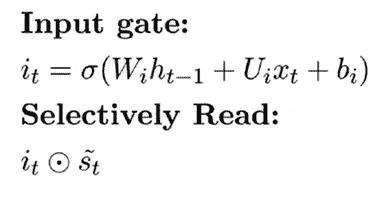

在使用梯度下降学习了 **Ui、Wi、**和 **Bi** 之后，我们可以使用我们的输入门( **iₜ** )进行精确的预测，输入门控制有多少信息将被提供给我们的模型。

总结到目前为止学习到的参数:

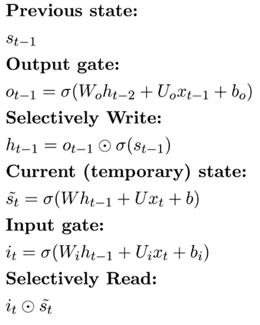

## 选择性遗忘

在有选择地阅读和书写信息之后，现在我们的目标是忘记所有不相关的东西，这些东西可以帮助我们减少混乱。

为了丢弃所有来自 sₜ₋₁的无用信息，我们使用遗忘门 fₜ.

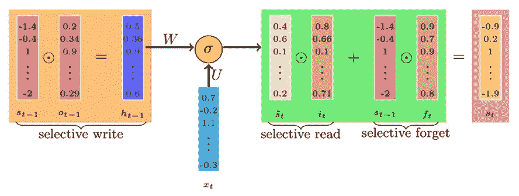

选择性遗忘

遵循上述传统，我们将引入遗忘门 **fₜ** ，它将构成一个从 0 到 1 的值，用于确定每个输入的重要性。

为了计算 fₜ，我们必须学习它，我们唯一能控制的向量是我们的参数。因此，为了继续计算，我们需要以提供的参数的形式表示 **fₜ** 。

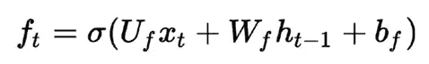

在使用梯度下降学习了 **Uf、Wf** 和 **Bf** 之后，我们可以使用我们的遗忘门( **fₜ** )进行精确预测，遗忘门控制着将丢弃多少信息。

将遗忘门和输入门的信息相加，可以告诉我们当前的隐藏状态信息。

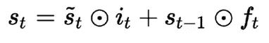

## 最终模型

LSTM 模型

完整的方程组看起来像:

LSTM 需要的参数比香草 RNN 需要的多得多。

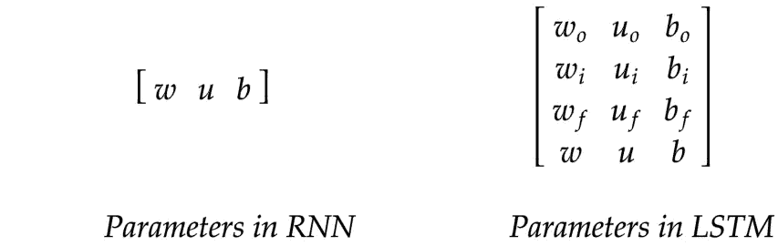

由于大门的数量和它们的排列变化很大，LSTM 可以有很多种类型。

# 门控循环单元

如前所述，LSTM 可以有许多变化，GRU 是其中之一。不太可能 LSTM，GRU 试图实现更少的门，从而有助于降低计算成本。

在门控循环单元中，我们有一个输出门，控制传递到下一个隐藏状态的信息比例，此外，我们有一个输入门，控制来自当前输入的信息流，与 RNN 不同，我们不使用遗忘门。

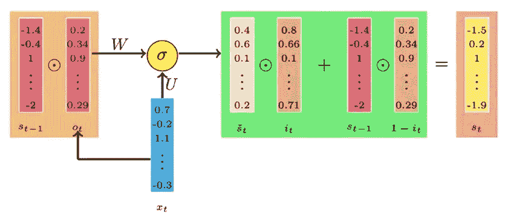

门控循环单位

为了降低计算时间，我们移除遗忘门并丢弃信息，我们使用输入门向量的补充，即(1- **iₜ** )。

为 GRU 实现的方程是:

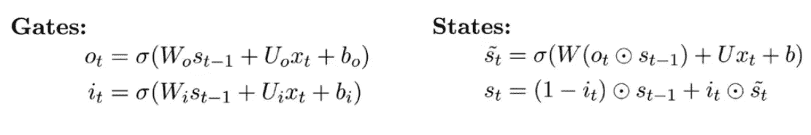

# 要点

*   引入 LSTM 和 GRU 是为了避免 RNN 的短期记忆。
*   LSTM 通过使用遗忘门来遗忘。
*   LSTM 记得使用输入门。
*   LSTM 利用细胞状态保持长期记忆。
*   gru 比 LSTM 速度更快，计算成本更低。
*   在向前传播的情况下，LSTM 的梯度仍然可以消失。
*   LSTM 没有解决爆炸梯度的问题，因此我们使用梯度剪辑。

# 实际使用案例

*   使用 RNN 的情感分析

 [## dakshtrehan/IMDB-情感分析-NN

### permalink dissolve GitHub 是超过 5000 万开发人员的家园，他们一起工作来托管和审查代码，管理…

github.com](https://github.com/dakshtrehan/IMDB-sentiment-analysis-NN/blob/master/IMDB%20Sentiment%20Analysis%20using%20Neural%20Network.ipynb) 

*   使用 LSTM 的人工智能音乐生成

 [## dakshtrehan/AI-音乐-一代

### 加入我在 www.dakshtrehan.com | | www.linkedin.com/in/dakshtrehan 的目标是产生新的音乐使用 LSTM 和给定的…

github.com](https://github.com/dakshtrehan/AI-Music-Generation) 

# 结论

希望这篇文章能帮助你以最好的方式理解长短期记忆(LSTM)和门控循环单位(GRU ),并帮助你实际应用。

一如既往，非常感谢您的阅读，如果您觉得这篇文章有用，请分享！

请随意连接:

> 领英~[https://www.linkedin.com/in/dakshtrehan/](https://www.linkedin.com/in/dakshtrehan/)
> 
> https://www.instagram.com/_daksh_trehan_/的 insta gram ~
> 
> github ~【https://github.com/dakshtrehan 

关注更多机器学习/深度学习博客。

> 中等~[https://medium.com/@dakshtrehan](https://medium.com/@dakshtrehan)

# 想了解更多？

[利用深度学习检测新冠肺炎](https://towardsdatascience.com/detecting-covid-19-using-deep-learning-262956b6f981)

[无法逃脱的人工智能算法:抖音](https://towardsdatascience.com/the-inescapable-ai-algorithm-tiktok-ad4c6fd981b8)

[使用机器学习的卡通化内部指南](https://medium.com/towards-artificial-intelligence/an-insiders-guide-to-cartoonization-using-machine-learning-ce3648adfe8)

你为什么要为乔治·弗洛伊德的谋杀和德里的骚乱负责？

[用于假人的递归神经网络](https://medium.com/towards-artificial-intelligence/recurrent-neural-networks-for-dummies-8d2c4c725fbe)

[虚拟卷积神经网络](https://medium.com/towards-artificial-intelligence/convolutional-neural-networks-for-dummies-afd7166cd9e)

[深入深度学习](https://medium.com/towards-artificial-intelligence/diving-deep-into-deep-learning-f34497c18f11)

[为什么选择随机森林而不是决策树](https://medium.com/towards-artificial-intelligence/why-choose-random-forest-and-not-decision-trees-a28278daa5d)

[集群是什么？什么时候用？](https://medium.com/@dakshtrehan/clustering-what-it-is-when-to-use-it-a612bbe95881)

[从 k 个最近邻居开始你的 ML 之旅](https://medium.com/@dakshtrehan/start-off-your-ml-journey-with-k-nearest-neighbors-f72a122f428)

[朴素贝叶斯解释](https://medium.com/swlh/things-you-never-knew-about-naive-bayes-eb84b6ee039a)

[激活功能说明](https://medium.com/analytics-vidhya/activation-functions-explained-8690ea7bdec9)

[参数优化说明](https://towardsdatascience.com/parameters-optimization-explained-876561853de0)

[梯度下降解释](https://towardsdatascience.com/gradient-descent-explained-9b953fc0d2c)

[逻辑回归解释](https://towardsdatascience.com/logistic-regression-explained-ef1d816ea85a)

[线性回归解释](https://medium.com/towards-artificial-intelligence/linear-regression-explained-f5cc85ae2c5c)

[确定最适合你的 ML 模型](https://medium.com/datadriveninvestor/determining-perfect-fit-for-your-ml-model-339459eef670)

> 干杯！