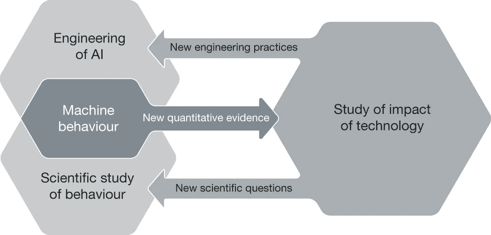
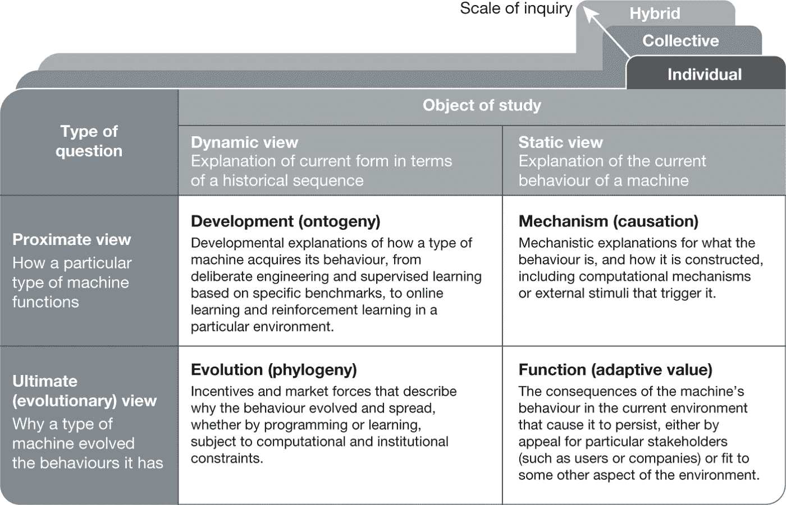
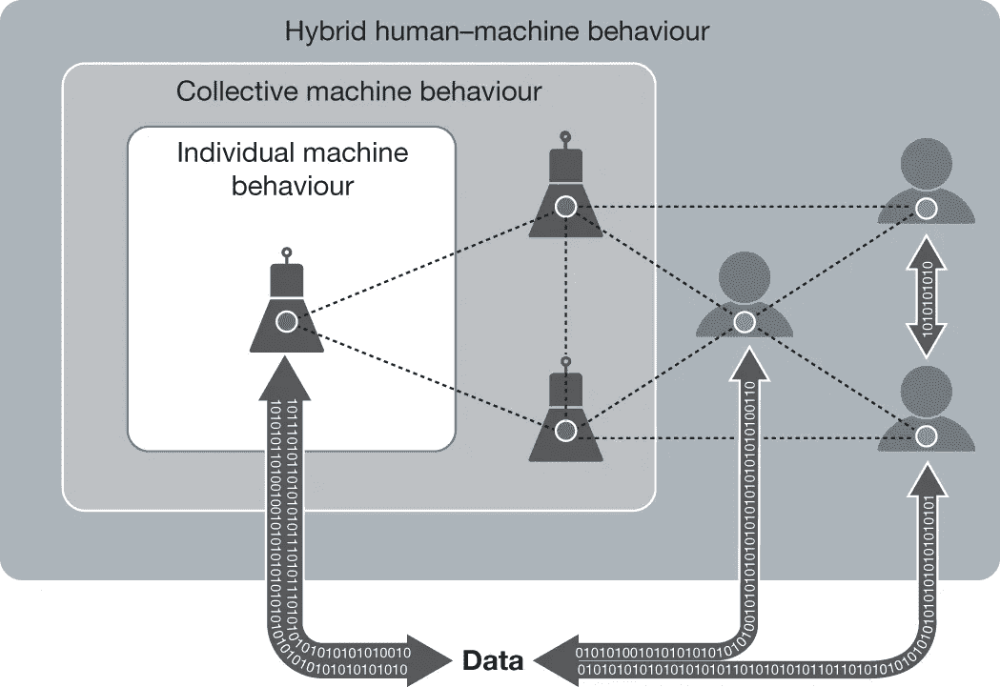

# 理解机器行为

> 原文：<https://pub.towardsai.net/understanding-machine-behavior-456cab95d4a5?source=collection_archive---------1----------------------->

## 这个人工智能学派着眼于理解人工智能代理的行为，就像我们研究动物一样。

来源:[https://news . northeast . edu/2019/04/24/researchers-from-northeast-MIT-Facebook-Google-Microsoft-make-a-case-of-the-impressing-of-the-重要性-field-of-machine-behavior/](https://news.northeastern.edu/2019/04/24/researchers-from-northeastern-mit-facebook-google-microsoft-make-a-case-for-the-importance-of-the-emerging-field-of-machine-behavior/)

> 我最近创办了一份专注于人工智能的教育时事通讯，已经有超过 10 万名订户。《序列》是一份无废话(意思是没有炒作，没有新闻等)的 ML 导向时事通讯，需要 5 分钟阅读。目标是让你与机器学习项目、研究论文和概念保持同步。请通过订阅以下内容来尝试一下:

 [## 序列

### 订阅人工智能世界中最相关的项目和研究论文。受到 120，000+的信任…

thesequence.substack.com](https://thesequence.substack.com/?r=2g8vk) 

理解人工智能(AI)代理的行为是人工智能未来十年的关键挑战之一。可解释性或可解释性是一些经常用来描述方法的术语，这些方法提供了关于人工智能程序行为的见解。直到今天，大多数可解释性技术都专注于探索深度神经网络的内部结构。最近，一群来自麻省理工学院(MIT) [的人工智能研究人员一直在探索一种激进的方法，试图解释人工智能观察它们的行为，就像我们研究人类或动物行为一样](https://www.media.mit.edu/projects/machine-behavior/overview/)。他们将这一领域的想法归入“机器行为”这个朗朗上口的名字之下，这有望成为人工智能未来几年中最令人兴奋的领域之一。

机器行为背后的想法可能是变革性的，但其原理相对简单。为了理解 AI 代理的行为，机器行为更多地依赖于观察而不是工程知识。想想我们是如何观察动物在自然环境中的行为并从中得出结论的。我们从观察中获得的大多数结论与我们的生物学知识无关，而是基于我们对社会互动的理解。在人工智能的情况下，研究这些虚拟和具体化人工智能代理行为的科学家主要是创造代理本身的科学家，这相当于需要生物学博士来理解动物的行为。理解人工智能代理不仅仅是解释特定的算法，还需要分析代理之间以及与周围环境的交互。要做到这一点，通过简单的观察进行行为分析是一个强有力的工具。

# 什么是机器行为？

机器行为是一个利用行为科学来理解人工智能代理行为的领域。目前，最常研究机器行为的科学家是首先创造出机器的计算机科学家、机器人学家和工程师。虽然这个团队当然有计算机科学和数学知识来理解人工智能代理的内部，但他们通常不是训练有素的行为主义者。他们很少接受关于实验方法、基于人口的统计和抽样范式或观察因果推理的正式指导，更不用说神经科学、集体行为或社会理论了。类似地，即使行为科学家理解这些学科，他们也缺乏专业知识来理解特定算法或技术的效率。从这个角度来看，机器行为位于计算机科学、工程和行为科学的交叉点，以实现对人工智能代理行为的整体理解。

图片来源:麻省理工学院

随着人工智能代理变得越来越复杂，分析它们的行为将结合理解它们的内部架构以及它们与其他代理和它们的环境的交互。虽然前者将是深度学习优化技术的功能，但后者将部分依赖于行为科学。

# 理解人工智能代理的行为模式

动物行为学是生物学的一个领域，主要研究自然条件下的动物行为，是进化特征的结果。动物行为学之父之一是尼可拉斯·丁伯根，他因识别动物行为的关键维度而获得了 1973 年的诺贝尔生理学或医学奖。丁伯根的论点是，有四个互补的维度来理解动物和人类的行为:功能、机制、发展和进化史。尽管人工智能和动物之间存在根本差异，但机器行为借用了丁伯根的一些观点来概述人工智能主体的主要行为模块。机器具有产生行为的机制，经历将环境信息整合到行为中的发展，产生使特定机器在特定环境中变得或多或少常见的功能性结果，并体现进化历史，通过进化历史，过去的环境和人类决策继续影响机器行为。下图显示了 Tinbergen 的框架对机器行为的适应:

图片来源:麻省理工学院

基于以前的框架，机器行为的研究集中在四个基本领域:机制、发展、功能和跨越三个主要尺度的进化:个体、集体和混合。

图片来源:麻省理工学院

对于给定的 AI 智能体，机器行为将试图通过研究以下四个方面来解释其行为:

1.**机制:**生成 AI 智能体行为的机制是基于它的算法和执行环境的特性。在最基本的层面上，机器行为利用可解释性技术来理解给定行为模式背后的特定机制。

2.**发展:**人工智能代理的行为不是一蹴而就的，而是随着时间的推移而演变。机器行为研究机器如何获得(发展)特定的个人或集体行为。行为发展可能是工程选择以及代理人经历的结果。

3.**功能:**行为分析的一个有趣的方面是理解一个特定的行为如何影响一个 AI 智能体的终身功能。机器行为研究行为对人工智能代理的特定功能的影响，以及如何在其他人工智能代理上复制或优化这些功能。

4.**进化:**除了功能，AI 智能体也容易受到进化历史和与其他智能体的相互作用的影响。在整个进化过程中，人工智能代理的算法方面在新的环境中被重用，既约束了未来的行为，又使额外的创新成为可能。从这个角度来看，机器行为也研究人工智能代理的进化方面。

前面的四个方面提供了理解人工智能主体行为的整体模型。然而，当我们评估具有单个智能体的分类模型时，这四个元素并不以相同的方式应用于具有数百辆汽车的自动驾驶汽车环境。从这个意义上说，机器行为在三个不同的范围内应用了前面的四个方面:

1.**个体机器行为:**机器行为这个维度试图通过个体机器自身来研究个体机器的行为。有两种研究单个机器行为的通用方法。第一种侧重于使用机器内方法分析任何特定机器代理的行为集，比较特定机器在不同条件下的行为。第二种是机器间的方法，研究各种机器代理在相同条件下的行为。

2.**集体机器行为:**与个体维度不同，这一领域通过研究群体中的互动来理解人工智能主体的行为。机器行为的集体维度试图发现人工智能代理的行为，这些行为不会出现在个体层面。

3.**混合人机行为:**在许多场景中，AI 智能体的行为受到它们与人类交互的影响。机器行为的另一个维度专注于分析人工智能主体中由与人类交互触发的行为模式。

机器行为是人工智能中最有趣的新兴领域之一。行为科学可以补充传统的可解释性方法，以开发新的方法来帮助我们理解和解释人工智能的行为。随着人类和人工智能之间的交互变得更加复杂，机器行为可能会在实现下一级混合智能方面发挥关键作用。