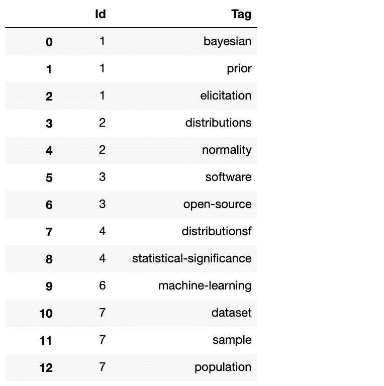
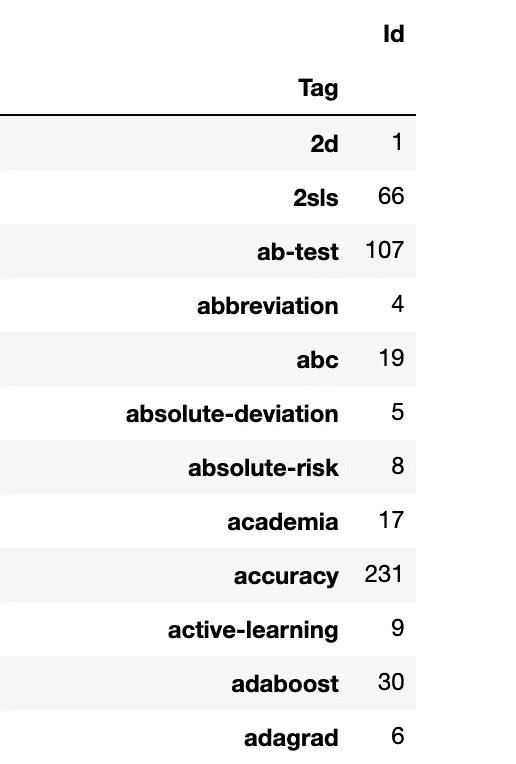
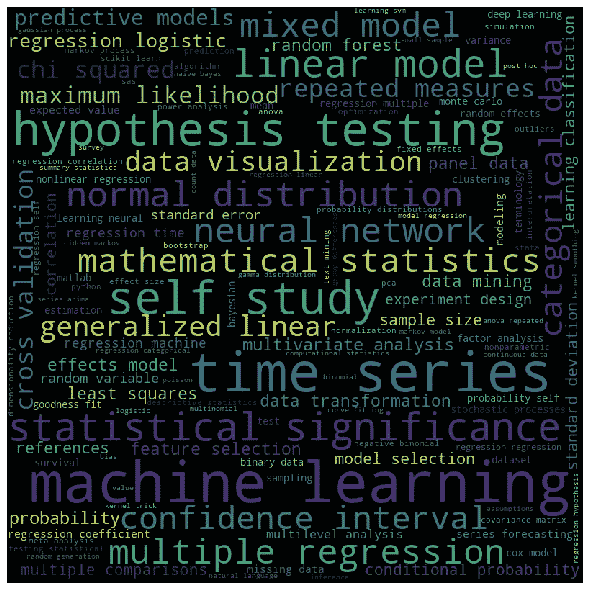
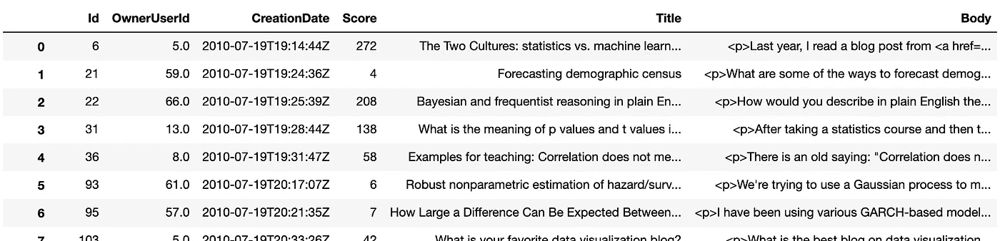
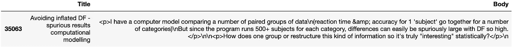
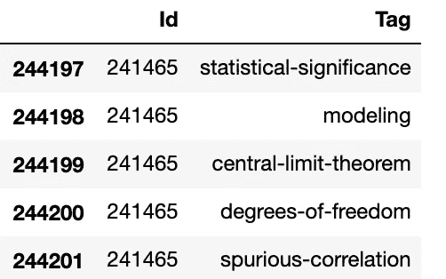
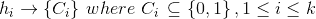
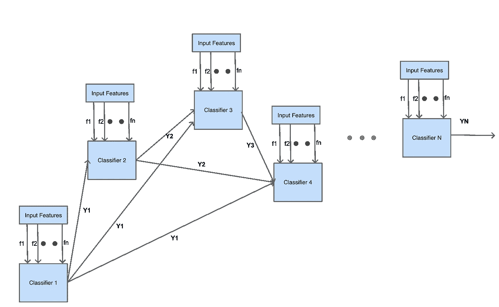
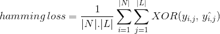

# 了解多标签分类模型和准确性指标

> 原文：<https://pub.towardsai.net/understanding-multi-label-classification-model-and-accuracy-metrics-1b2a8e2648ca?source=collection_archive---------0----------------------->

## [机器学习](https://towardsai.net/p/category/machine-learning)

## 多标签/多标记模型背后的理论、不同的伞式分类方案和准确性度量分析


分类技术可能是机器学习中最基本的技术。大多数在线人工智能课程都是从这个开始的。

在常规分类中，我们定义了一个模型，它只使用一个类标签对数据实例进行分类或标记。毫无疑问，在类别集中，可以(将会)有多个类别标签，但是分类器将在这些标签中只选择一个(最好的)。

现在，问题是:一个数据实例可以用集合中多个可能的类标签进行分类/标记吗？模型应该如何设计，我们如何计算模型的准确性？在本文中，我们将讨论设计多标签分类所需的理论模型和准确性度量。

# 样本数据集和数据探索

为了更好地解释模型，我们举一个多标签分类的例子数据集:“Stackoverflow question-anwers”。开发人员可以在“stackoverflow.com”上发布一个技术问题，并在上面标记多个主题。我们可以将每个“标签”视为独立的类标签。这个数据集可以从 [Kaggle](https://www.kaggle.com/stackoverflow/statsquestions) 下载。“Tags.csv”包含问题 id 和与之关联的标签。让我们借助小 python 代码来看看它的内容

```
import pandas as pddf = pd.read_csv('../data/Tags.csv')
df
```



图 1

因此，很明显，对于一个问题 id，可以有多个标签。

让我们看看数据集中有多少不同的标签

```
tags_count_df = df.groupby(['Tag']).count()
tags_count_df
```

一些标签



图 2

总共有 1316 个不同的标签。

词云分布是这样的

```
%matplotlib inlinefrom wordcloud import WordCloud, STOPWORDS 
import matplotlib.pyplot as plttags = ''
for index, row in df.iterrows():
    tags = tags + ' ' + row['Tag']

stopwords = set(STOPWORDS)wordcloud_tac_repro = WordCloud(width = 800, height = 800, 
                background_color ='black', 
                stopwords = stopwords, 
                min_font_size = 10).generate(tags) 

plt.figure(figsize = (8, 8), facecolor = None) 
plt.imshow(wordcloud_tac_repro) 
plt.axis("off") 
plt.tight_layout(pad = 0) 

plt.show()
```



图 3

从图 3 来看，“机器学习”可能是使用最多的标签。

让我们探索一下“Question.csv”

```
questions_df = pd.read_csv('../data/Questions.csv', encoding = "ISO-8859-1")
questions_df
```



图 4

现在，让我们打印问题 id 241465 的标题和正文

```
q = questions_df.query('Id == 241465')[['Title','Body']]
pd.set_option('display.max_colwidth', -1)
q
```



图 5

与此问题相关联的标签

```
tags = df.query('Id == 241465')[['Id','Tag']]
tags
```



图 6

因此，第 241465 号问题可以分为 5 类。

现在，问题陈述是，如果给定一个问题的主体&标题，我们能预测与之相关的可能标签吗？

> **这是一个‘多标签分类’问题。虽然当前的问题陈述它与文本分类相关，但是通常多标签分类可以是任何形式。它可用于预测包含所有数值并附加了多个标签的数据集。顶层理论模型的建立不会因此而改变。**

现在的挑战是，“如何为这类问题设计分类器？”。它会和单一标签分类一样吗？。我们将尝试找到这些答案，并构建一个理论模型的框架(完整的实现超出了本文的范围)

# 总括分类方案

**问题分解**

任何分类问题的响应变量都可以编码为二进制字符串，如“1010011 ..”。基本上，一个响应变量被分解成几个子响应变量，每个子响应变量产生一位的值。这里每一位代表一个类别标签。位值“1”意味着“类标签”存在于数据实例中，否则为“0”。

对于二进制分类问题，字符串只有两种形式:“10”或“01”。一般的多类单标签分类问题只能有一个位为 1，因为一个数据实例最多只能用一个类标签进行分类。

因此，根据我们到目前为止的理解，在多标签分类中，可以有 1 到 N 个比特具有‘1’，其中 N 是类别标签的总数。对于我们目前的问题标注问题，N=1316 这是相当大的！！这里，响应变量将是长度为 1316 的二进制串，具有设置为 1 的多个值。

在多标签分类中，我们可以把响应变量的每一位看作一个独立的问题。因此，该问题可以分解为一组子分类问题，每个子分类问题将是一个*二元分类器。*

例如，对于我们当前的问题，我们可以将其分解为 1316 个二进制分类问题(虽然问题空间看起来很大，实际上需要更窄的范围，但出于假设的原因，让我们考虑这是为了理论上的理解)。它看起来会像这样:

> 问题 1:问题可以有标签“2d”吗？将回答 0 或 1
> 
> 问题 2:问题可以有标签“2sls”吗？将回答 0 或 1
> 
> ……
> 
> 问题 k:这个问题可以有“统计显著性”标签吗？将回答 0 或 1
> 
> …(续)
> 
> **我们可以使用任何标准分类模型设计这些二元分类器，如逻辑回归、随机森林、朴素贝叶斯等**

一般来说，为几个子问题选择和建立一个特定的模型。在我们的例子中，如果我们选择 LogisticRegression 作为模型，那么我们必须建立 1316 个不同的 LogisticRegression 模型，这些模型必须分别进行训练和测试。

一旦分解完成，我们可以在此基础上应用几个伞状分类方案(如下所述)

**二元关联模式**

这是所有方案中最简单的。正如上面所解释的，原始问题被分解成 N 个子分类器。这些分类器将在数据实例的输出二进制字符串中分别产生 0 或 1。

理论上，如果 hᵢ是仅使用特定类别标签 Cᵢ的信息而忽略所有其他标签的信息学习的二元分类模型，那么数学表达式看起来像



最后，所有的“1”将被收集起来，这些类标签将成为预测的输出。

在我们的示例中，预测的二进制字符串可能看起来像“0001”..00..一..01..一..1..'。所有 1 代表类别标签:'*统计显著性*'、*建模*'、*中心极限定理*'、*自由度'*和'*伪相关性*'。因此，预测的输出将是这 5 个类标签。

**分类器链方案**

有时候，类别标签是相互依赖的。就像二元相关性一样，将为每个类别创建前 N 个响应变量。子分类器的一个响应变量的输出将被用作下一个子分类器的额外特征。



图 7

上图显示了分类器链。它几乎类似于“LinkedList”数据结构。Y，Y..Yᴺ是每个分类器的响应变量(它将是 0 或 1)。来自所有先前分类器(除了第一个)的响应被播种到下一个分类器中，并且这些响应与原始输入特征(f..fⁿ).

> 通常，分类器 K 将用完整的输入特征集来构建:f，f，..纽约州 fⁿ,Y 市，..Yᴷ⁻

现在，一个问题来了，“分类器链的顺序是如何决定的？”对此有不同的策略，如下所示:

> **分类器链集成(ECC)** :这里使用分类集成模型。选择链的随机采样，并在此基础上构建集合。预测输出是通过对集合输出应用多数表决方案而得到的。这很像随机森林分类器。
> 
> **蒙特卡罗分类器链(MCC)** :应用蒙特卡罗方法生成最优分类器序列。
> 
> 还有其他方法，如分类器的随机搜索或依赖方法，但不是很常用。

每个分类器的输出将像二进制相关性方案一样被捕获，并将最终确定类别标签。

**标注功率设置方案**

二元相关性和分类器链的基本概念或多或少是相同的。标签幂集以不同的方式工作。它将训练数据集中的每个标签组合视为一个单独的标签。例如，对于 3 类多标签问题，100、001、101、111 等将被视为单独的标签。

> 一般来说，在一个 n 维的类空间中，可以有 2ᴺ数的所有可能的标号组合。

所以，它不分解成任何子问题，而是直接预测作为一个整体的类标签的组合。

**各方案的优点&缺点**

*二元相关性*是一个简单的方案，容易实现。但是它没有考虑标签的相互依赖性，因此经常会误解隐藏的数据关系。

*分类器链*完美处理类标签关系。特别是，对于一些类别标签是其他类别标签的子标签，并且一个类别标签的出现严重依赖于其他标签(类别标签中的父子关系)的情况。如果存在父标签，则可以出现子标签)。但是这种方案本质上是复杂的，并且如果类别空间很大的话会遇到高维问题。

*标签功效集*适用于类别标签的不同组合数量较少的情况。与二元相关性分类器链相比，这是一个非常简单的方案。

在所有情况下，在对特定方案做出决定之前，都需要了解数据集。

# 准确性指标

在多类或二元单标签分类问题中，*的绝对精度*由比率*(正确分类的数据实例数/数据实例总数)给出。*

让我们使用示例数据集来看看多标签情况的场景。如果 id 为 241465 的问题用标签分类:*、【建模】、【中心极限定理】、【自由度】*那么我们能说什么？数据集中的实际类别标签是'*统计显著性*'、*建模*'、*中心极限定理*'、*自由度*和'*伪相关性*'。它既不是完全错误的预测，也不是完全正确的预测。如果我们采用传统的基于正确率和总比率的准确性度量，我们肯定无法判断分类器。我们需要一些东西来判断多标签分类器的部分正确性。

**海明损失度量**

汉明损失不是计算正确分类的数据实例的数量，而是计算预测期间类标签的位串中产生的损失。它在原始二进制类别标签字符串和数据实例的预测类别标签之间进行 XOR 运算，并计算整个数据集的平均值。其表达式如下



在哪里

|N| =数据实例的数量

|L| =类空间的基数

yᵢ,ⱼ =数据实例 I 中类标签 j 的实际位

^yᵢ,ⱼ =数据实例 I 中类别标签 j 的预测位

> “汉明损失”值的范围是从 0 到 1。因为它是一个损失度量，它的解释本质上是相反的，不像正常的准确度比率。汉明损失值越小，表示分类器越好。

**子集精度**

在某些情况下，我们可能会追求*绝对准确率*，在这种情况下，测量标签预测的精确组合非常重要。这听起来可能与“标签功率设置”的情况有关。在多标签场景中，它被称为*子集准确度。*

除了这两个，每个单独的二元分类器的准确性可以通过其他传统的度量标准来判断，如准确率、F1 分数、精确度、召回率等和 ROC 曲线。

这都是关于多标签分类的理论建模。我们将在下一篇文章中看到使用真实数据的案例研究。数据探索代码可从 [Github](https://github.com/avisheknag17/public_ml_models/blob/master/multi_label_classification_understanding/notebook/multi_label_classification_data_understanding.ipynb) 获得。

最近我写了一本关于 ML(【https://twitter.com/bpbonline/status/1256146448346988546】T2)的书