# 了解多元线性回归

> 原文：<https://pub.towardsai.net/understanding-multiple-linear-regression-1b4a5b939f5a?source=collection_archive---------0----------------------->

## [机器学习](https://towardsai.net/p/category/machine-learning)

## 使用矩阵代数…

H**ello World**，有没有想过你最喜欢的机器学习算法实际上是如何工作的？让我们看看多元线性回归( **MLR** )模型如何计算理想参数，给定特征矩阵(***【X】)***和目标变量( ***y)，*** 使用 ***线性代数。***

***X*** 是 an ( ***m * n 特征矩阵)*** 和*y 是 an( ***m* 1 列向量*** )*

****其中:****

****m*** 是数据集中观察值或行数*

****n*** 是为预测选择的属性或变量的数量*

****X*** 是 ***m * n*** 特征矩阵的自变量*

****y*** 是目标或因变量*

*我假设您知道线性回归的基础知识，并且能够轻松地完成整个简单线性回归(SLR)过程。*

*我**强烈**推荐你通过这个 [***链接***](https://medium.com/towards-artificial-intelligence/understanding-the-simple-maths-behind-simple-linear-regression-3ce4a30e7602) 到我关于单反的文章。*

*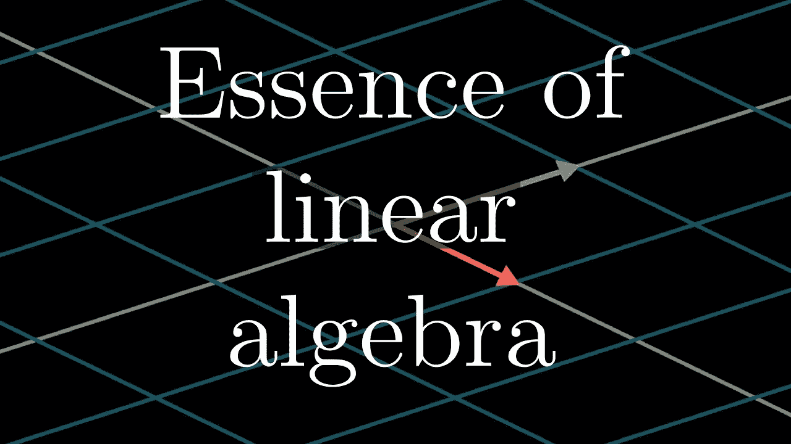*

*这是一种中间方法，需要对*线性代数*和向量或/和矩阵乘法、矩阵的逆和转置……也称为 ***矩阵代数有所了解。****

*作为复习，我的朋友***H****arvey****B****erman*at[***stattrek.com***](https://stattrek.com/)有丰富的教程来指导你哦！他也回复他的电子邮件。*

> *好了，我们开始吧！*

**

*开始吧…|[*img _ credit*](https://artfiles.alphacoders.com/334/33416.jpg)*

# *几个关键点…*

1.  ****目标*** 或 ***因变量*** ( ***y*** )必须是连续的，但 ***特征*** 或 ***自变量***(***x1…xn***)可以是分类的，也可以是连续的。*
2.  *每个*特征*必须与*目标*成线性关系。*
3.  *多元线性回归( **MLR** )方程的形式如下*

****y _ hat = B0+b1x 1+B2 x2+b3x 3+…bnxn****

## *其中:*

****y_hat*** 是模型预测*

****b0 …bn*** 为模型的系数，以 ***b0*** 为截距或偏差单位， ***b1 …bn*** 为自变量的梯度或斜率(***x1***…***【xn】***)。*

*因此，每个特征( ***x1…xn*** )都有其伴随的梯度或斜率( ***b1…bn*** )。*

*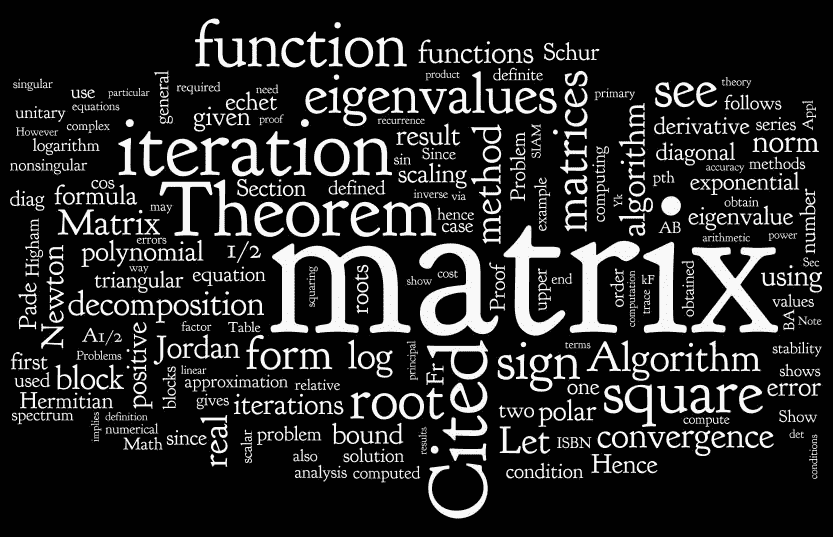*

*矩阵代数…|[*img _ credit*](http://www.ma.man.ac.uk/)*

# *探索真实世界的数据*

*我们将使用加拿大汽车销售的燃油消耗率数据集。
[***(原厂油耗评级 2000–2014)***](https://open.canada.ca/data/en/dataset/98f1a129-f628-4ce4-b24d-6f16bf24dd64)。*

*你可以在这个 [GitHub repo](https://raw.githubusercontent.com/Blackman9t/Machine_Learning/master/Original_2000_2014_Fuel_Consumption_Ratings.csv) 上看到原始文件。*

*导入所需的库*

```
*# importing required librariesimport matplotlib.pyplot as plt
import pandas as pd
import seaborn as sns
import pylab as pl
import numpy as np*
```

*理解数据*

```
***FuelConsumption.csv****:**We have downloaded a fuel consumption dataset, **FuelConsumption.csv**, which contains model-specific fuel consumption ratings and estimated carbon dioxide emissions for new light-duty vehicles for retail sale in Canada.
**MODELYEAR** e.g. 2014
**MAKE** e.g. Acura
**MODEL** e.g. ILX
**VEHICLE CLASS** e.g. SUV
**ENGINE SIZE** e.g. 4.7
**CYLINDERS** e.g 6
**TRANSMISSION** e.g. A6
**Fuel Type
FUEL CONSUMPTION in CITY(L/100 km)** e.g. 9.9
**FUEL CONSUMPTION in HWY (L/100 km)** e.g. 8.9
**FUEL CONSUMPTION COMB (L/100 km)** e.g. 9.2
**COMB_(mpg)
CO2 EMISSIONS (g/km)** e.g. 182 → low → 0*
```

*让我们从 GitHub 下载数据集*

```
*# First Let's import our Data set
data = "[https://raw.githubusercontent.com/Blackman9t/Machine_Learning/master/Original_2000_2014_Fuel_Consumption_Ratings.csv](https://raw.githubusercontent.com/Blackman9t/Machine_Learning/master/Original_2000_2014_Fuel_Consumption_Ratings.csv)"# Next let's define additional representation of null values 
# To help us select all possible null values in case they existmissing_data = [’n/a’,’na’,’--’,’?’,’non’,’Non’,’None’]*
```

*让我们读取一个 pandas 数据框并打印出前 5 行。*

```
*fuel_df = pd.read_csv(data, na_values=missing_data)#Next let's print out the first five rowsfuel_df.head()*
```

*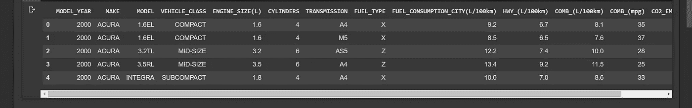*

*数据集的头部，显示属性(列标题)和特征(列数据内容)*

*让我们检查一下形状:*

```
*fuel_df.shape>>
  (14343, 13)# 14343 rows, 13 cols*
```

*让我们检查缺失的值。*

```
*fuel_df.isna().any().all()>>
False*
```

*为了简洁起见，让我们重命名一些属性。*

```
*fuel_df.rename(columns={'FUEL_CONSUMPTION_CITY(L/100km)':'FUEL_CONS_CITY', 
                        'ENGINE_SIZE(L)':'ENGINE_SIZE',
                       'HWY_(L/100km)':'HWY_L100km',
                       'COMB_(L/100km)':'COMB_L100km',
                       'COMB_(mpg)':'COMB_MPG',
                       'CO2_EMISSIONS(g/km)':'CO2_EMISSIONS'},
                       inplace=True)*
```

*让我们来看看变化*

```
*fuel_df.head()*
```

*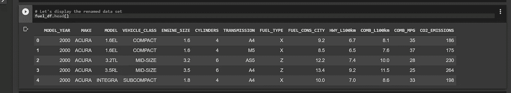*

*重命名的属性*

## *计算 MLR 模型的理想系数。*

*要手动计算多元线性回归模型的理想系数，我们必须定义三个矩阵。参见 [***链接***](https://stattrek.com/multiple-regression/regression-coefficients.aspx?Tutorial=reg)*

> ***注**:一个 [**列向量**](https://newonlinecourses.science.psu.edu/stat501/node/382/) 是一个 **m** × 1 矩阵，也就是只有一列的矩阵*

*所以矩阵是:-*

1.  ****【X】，*** 包含我们的预测变量，实际上是一个(***m****(1+***n***)特征矩阵)…因为截距或偏差单位而添加的一列 1， ***b0*** 。*
2.  ****b*** 我们的模型系数是一个(( ***n +*** 1)* 1 列向量)…为 ***b0 增加了 1 个元素。****
3.  ****y*** 我们的目标或因变量是哪一个( ***m*** * 1 列向量)。*

**

*别担心，伙计，跟我在一起…这有点直觉。*

*[*img_credit*](https://i0.wp.com/www.planetclaire.tv/wp-content/uploads/2015/04/the-simpsons-season-17.jpg?resize=350%2C200&ssl=1)*

*不要太担心符号，这是代数，lol… *和我呆几分钟*。记住这个…*

> ***y _ hat = B0+b1x 1+B2 x2+b3x 3+…bnxn***
> 
> *其中:*
> 
> ***y_hat** 是模型预测*
> 
> ***b0 …bn** 是模型的系数或参数，*
> 
> ***b0** 是截距或偏差单位，因此矩阵 **X、**中增加了一列 1，这样当模型编译时， *1* 将乘以 **b0** 的值，以产生截距或偏差单位。参见 [**链接**](https://stattrek.com/multiple-regression/regression-coefficients.aspx?Tutorial=reg)*
> 
> *然后，每个特征( **x1…xn** )都有其伴随的梯度或斜率( **b1…bn** )。*

**

*一步一步来...| [*img_credit*](https://i.ytimg.com/vi/MhLQQ0cAbSo/maxresdefault.jpg)*

*在多元线性回归中，我们试图使用两个或更多的特征或自变量来预测一个连续的因变量。*

*在这种情况下，我们希望使用数据集中的两个或更多特征来预测 CO2 _ 排放量。特征可以是发动机尺寸、气缸、品牌、型号等*

*因此，为了定义我们的特征矩阵***【X】，*** ，我们需要从数据集中选择理想的特征，即[](https://cognitiveclass.ai/courses/data-analysis-python/)*与*CO2 _ 排放相关。***

***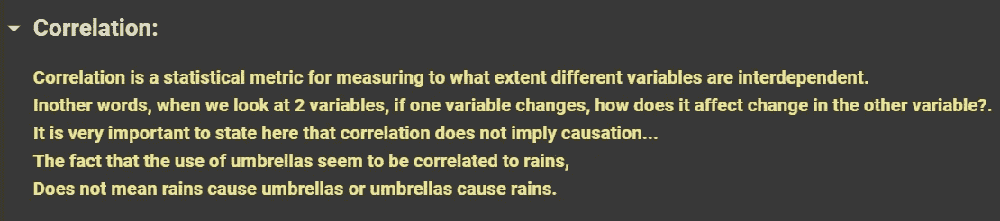***

***相关性可以判断两个或多个变量是否相互依赖，以及相互依赖的程度。***

***相关性产生一个介于-1 和 1 之间的数字。如果数字接近-1，表示强负相关，如果接近 1，表示强正相关，如果接近 0，表示变量间弱相关。***

***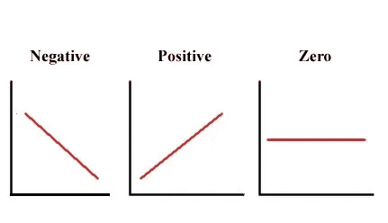***

***负相关向下倾斜，正相关向上倾斜，弱相关很少或没有倾斜***

***查看这个 [Coursera 课程](https://www.coursera.org/learn/data-analysis-with-python/lecture/lb1Hl/correlation)了解更多详情。***

## ***定义特征矩阵(X)和目标矩阵(y)***

***首先让我们看看我们的变量是如何相关的…***

```
***# Let's plot the correlation of the data set using a heatmap from seaborn librarycorr_data = fuel_df.corr()plt.figure(figsize=(10, 6))
sns.set_style('ticks')sns.heatmap(corr_data, annot=True)plt.show()***
```

***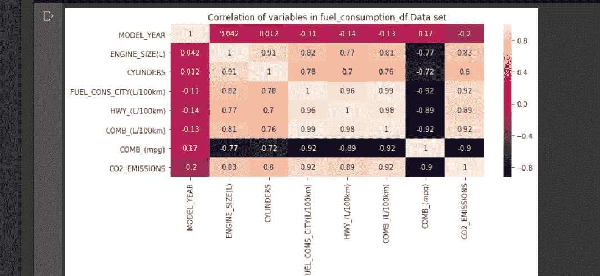***

***使用 seaborn library 的热图进行变量关联…较浅的颜色表示较强的相关性，反之亦然。***

***我们可以看到，六(6)个变量与 CO2 排放密切相关。这些如下所示***

***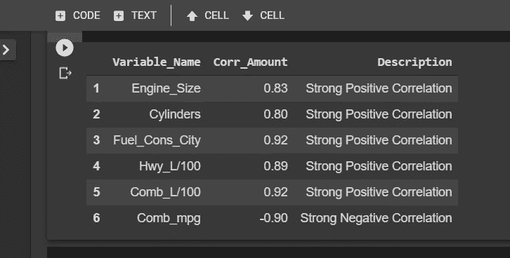***

***与 Co2 排放密切相关的六个变量以及对每种关系类型的描述。***

***只要看看上面的相关热图，我们就可以看到一些预测变量与其他预测变量高度相关。例如*燃料消耗城市*和*梳齿 L/100* 。这种情况叫做[](https://stattrek.com/multiple-regression/multicollinearity.aspx)****。*******

**中度多重共线性可能不会造成问题，但严重的情况可能会导致:-**

*   **回归系数的估计不可靠。 [***链接***](https://stattrek.com/multiple-regression/multicollinearity.aspx)**
*   **[***多重共线性会削弱分析的统计能力***](https://blog.minitab.com/blog/adventures-in-statistics-2/what-are-the-effects-of-multicollinearity-and-when-can-i-ignore-them) 会导致系数转换符号，扭曲正确的模型。**

**让我们通过丢弃冗余的(*高度相关的*)预测变量来解决这种情况**

**首先，我们需要使用一种叫做 [***方差-膨胀-因子***](https://etav.github.io/python/vif_factor_python.html)***【VIF】***的技术来测量多重共线的程度。VIF 是多元回归中预测变量之间共线性的一种度量。如果结果是 1，没问题。如果它在 1 到 5 之间，它显示低到平均共线性，高于 5 通常意味着高度冗余，变量应该被删除。**

****计算 VIF:****

**首先，让我们选择 6 个与二氧化碳排放量高度相关的变量。**

```
**data = fuel_df[['ENGINE_SIZE','CYLINDERS','FUEL_CONS_CITY','COMB_MPG', 'HWY_L100km', 'COMB_L100km']]data.head()**
```

**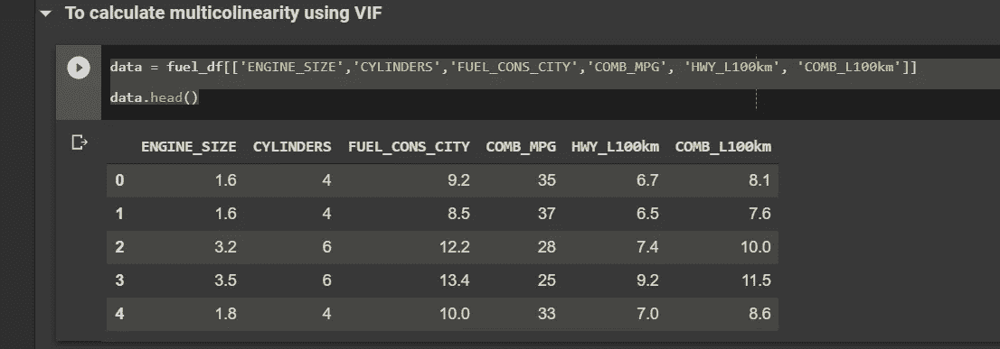**

**显示前 5 行最高相关变量**

**接下来，让我们定义一个简单的方法来标准化数据**

```
**def standardize(data_features):
    data_features = (data_features - data_features.mean()) /   data_features.std()
    return data_features**
```

**让我们对每个特性应用标准化方法，并将其保存到一个新变量中。**

```
**std_data = data.apply(standardize, axis=0)
std_data.head()**
```

**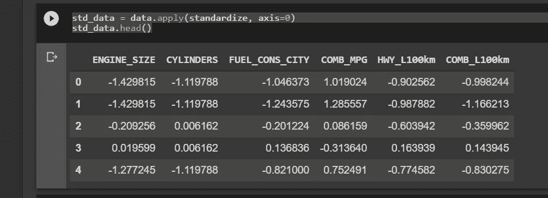**

**接下来，我们计算 VIF**

```
**from statsmodels.stats.outliers_influence import variance_inflation_factorvif = pd.DataFrame()
vif["VIF_Factor"] = [variance_inflation_factor(std_data.values, i) for i in range(std_data.shape[1])]
vif["features"] = std_data.columnsvif
# This displays the following:-**
```

**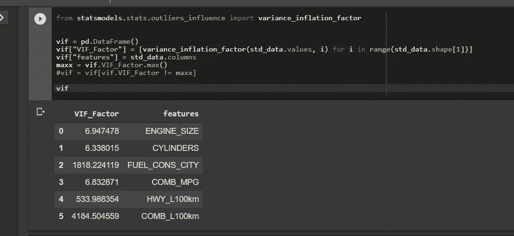**

**显示要素或自变量多重共线性得分的 VIF**

**如所怀疑的，三个变量(***FUEL _ CONS _ 城市，HWY_L/100km，COMB_L100Km*** )具有极高的共线性值，应删除。**

```
**# Dropping variables with extreme colinearity scoresstd_data.drop(['COMB_L100km','HWY_L100km','FUEL_CONS_CITY'], axis=1, inplace=True)**
```

**让我们计算剩余三个变量的 VIF**

```
**vif = pd.DataFrame()
vif["VIF_Factor"] = [variance_inflation_factor(std_data.values, i) for i in range(std_data.shape[1])]
vif["features"] = std_data.columnsvif
# This outputs the following:-**
```

**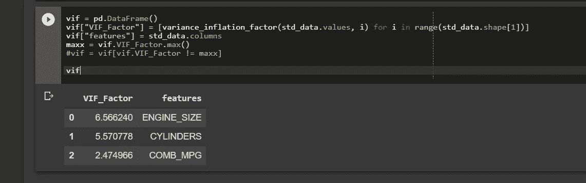**

**选定独立变量的中等 VIF 分数**

**相对适中的 VIF 评分分别为 6.56、5.57 和 2.47，我们可以选择 ***发动机 _ 大小、*** 和 ***COMB_MPG*** 作为我们的自变量。**

****定义特征矩阵( *X* )和目标矩阵( *y* ):****

**记住 ***X*** 是一个***m****(1+***n***)矩阵。所以我们需要插入一列 1 与偏置单位 ***b0 相乘。*****

```
**# Save the un-standardized data with moderate VIF attributes as X
X = data[['ENGINE_SIZE','CYLINDERS','COMB_MPG']]# Define a column of ones, the length of X
ones = np.ones(len(X), dtype= 'int8')# Insert The column of ones to the first position of X
X.insert(0, 'Ones', ones)# Display first 5 rows of X
X.head()# Now we define target matrix y(an m * 1 column vector)
y = fuel_df.CO2_EMISSIONS
y.head()**
```

**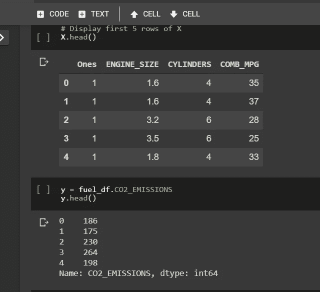**

**显示前五行特征矩阵(X)和目标列向量(y)**

**定义好我们的 ***X*** 和 ***y*** 矩阵后，让我们将它们分成训练和测试数据集，然后我们可以开始处理最终的矩阵 ***b*****

```
**# Import train_test_split for splitting the data set
from sklearn.model_selection import train_test_split# split the data set into training and testing sets.
X, X_test, y, y_test = train_test_split(X, y, test_size=0.25, shuffle=True)# Display the shapes of each split
print('X shape is:',X.shape)
print('y shape is:',y.shape)
print('X_test shape is:',X_test.shape)
print('y_test shape is:',y_test.shape)>>X shape is: (10757, 4) 
y shape is: (10757,) 
X_test shape is: (3586, 4) 
y_test shape is: (3586,)**
```

## ****定义系数矩阵( *b* )****

**这个矩阵由斜率或梯度( ***b1…bn*** )和截距或偏差单元( ***b0*** )组成**

**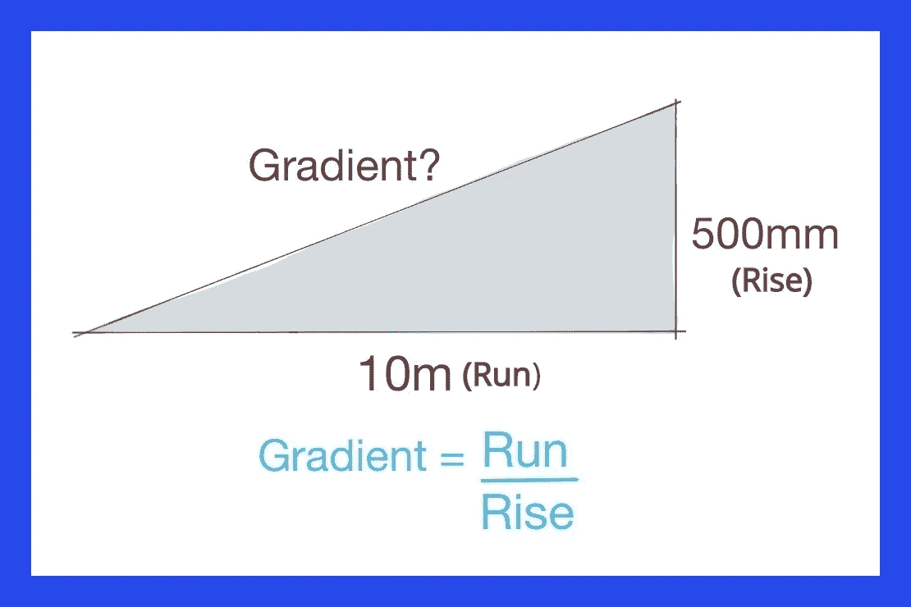**

**斜率或梯度是简单的运行除以上升…**

## ****最小二乘估计:****

**为了定义矩阵 ***b、*** ，我们将使用一个简单的公式，称为 [***最小二乘估计(LSE)。***](https://newonlinecourses.science.psu.edu/stat501/node/382/)*LSE 非常适合计算线性回归的系数，无论是简单线性回归还是多元线性回归。***

***LSE 的唯一缺点是独立变量是线性相关的。***

> ***也就是说，一个*或多个*变量可以写成另一个变量的线性组合。例如，如果变量 1 是变量 2 乘以变量 3 的结果…这是我们在上一步中试图减少多重共线性的部分原因。***

***现在，我们为什么要关心线性相关性呢？ [***因为方阵的逆矩阵只有当列线性无关时才存在***](https://newonlinecourses.science.psu.edu/stat501/node/382/) 。LSE 涉及计算方阵的逆矩阵。***

**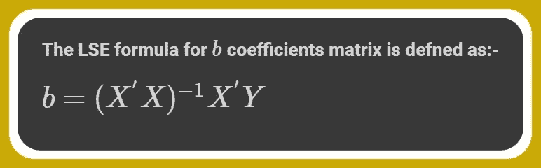**

**最小二乘估计公式**

> ****提示:****
> 
> **[**矩阵乘法不可交换**](https://www.khanacademy.org/math/precalculus/precalc-matrices/properties-of-matrix-multiplication/v/commutative-property-matrix-multiplication) 。除了 [**特例**](https://martin-thoma.com/when-is-matrix-multiplication-commutative/) 。因此我们将矩阵 **x** 乘以矩阵 **y** ( **xy** )定义为矩阵 x 后乘以矩阵 y，或者可以定义为矩阵 **y** 前乘以矩阵 **x****

**因此，LSE 公式指出:**

*****b*** = ((矩阵***X-转置*** 后置乘以矩阵 ***X*** )前置乘以矩阵***X-转置*** 前置乘以矩阵 ***y.*****

**让我们一步一步来…**

****第一步:**我们来定义一下***X-转置*** 矩阵( ***X'*** )**

```
**# First we convert X and X_test, y, y_test to Numpy arrays for ease of computing
X = X.values
X_test = X_test.values
y = y.values
y_test = y_test.values# Next we define X_trans, the Transpose of X matrix
X_trans = X.transpose()print('X-Trans shape:',X_trans.shape)
>>
  X-Trans shape: (4, 10757)**
```

****第二步:**接下来我们定义一下***X-转置*** 后置乘矩阵 ***X: (X'X)*****

```
**# Post-multiply X_trans by X
X_trans_X = np.matmul(X_trans, X)# Print out the shape of X_trans_X
print('X_Trans_X shape:',X_trans_X.shape)
>>
  X_Trans_X shape: (4, 4)**
```

****第三步:**接下来我们来定义 ***X 的逆——转置*** 后乘矩阵 ***X: (X'X)^-1*****

```
**# Import inv from numpy.linear algebra
from numpy.linalg import inv# define X_trans_X_inv
X_trans_X_inv = inv(X_trans_X)# Print the shape of X_trans_X_inv
print("Shape of X_trans_X_inv is",X_trans_X_inv.shape)
>>
  Shape of X_trans_X_inv is (4, 4)**
```

****步骤 4:** 接下来我们将 ***的逆 x-转置-X*** 与***【x-transposed:(x'x)^-1x'】***后乘**

```
**# Let's Post-multiply X_trans_X_inv by X_trans
X_trans_X_inv_X_trans = np.matmul(X_trans_X_inv, X_trans)# Let's print the shape
print("Shape of X_trans_X_inv_X_trans is",X_trans_X_inv_X_trans.shape)
>>
  Shape of X_trans_X_inv_X_trans is (4, 10757)**
```

****第五步:**最后我们将 ***(X'X)^-1X'*** 乘以矩阵 ***y*** 得出完整公式 ***(X'X)^-1X'Y*****

```
**# Matrix b or coefficients defined as:
b = np.matmul(X_trans_X_inv_X_trans, y)# Let's print the shape of b
print('Shape of matrix b or coefficients is:', b.shape)# Print the values of b
print(b)
>>
  Shape of matrix b or coefficients is: (4,)**
```

**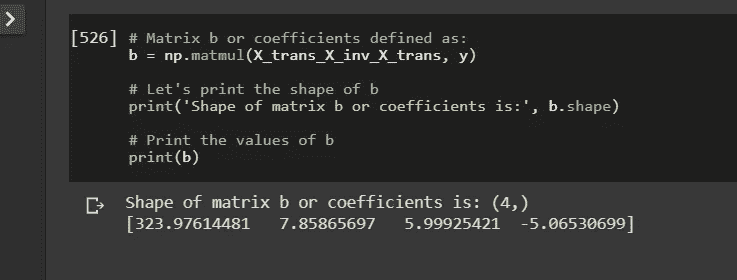**

**矩阵 b 或系数矩阵值**

**因此，矩阵代数模型系数为:-**

**b[0] => ***偏置单位或截距***= 23861 . 486368636366**

**b[1] => ***发动机斜率 _ 尺寸*** = 7.85865697**

**b**= >***= 5.99925421***

***b[3] => ***斜率梳 _MPG*** = -5.06530699***

**因此我们可以看到，对于任何给定的车辆，*发动机 _ 尺寸* (7.85)比*气缸* (5.99)或 *Comb_mpg* (-5.06)对*CO2 _ 排放*的影响更大。**

**因此，如果我们想预测一辆发动机尺寸为 **3.2** 升、有 **6 个**气缸且 comb_MPG 值为 **28** 的汽车的二氧化碳排放量(**y _ haty _ hat**),我们只需代入:**

*****y _ hat = B0+b1x 1+B2 x2+b3x 3*****

**这意味着…**

*****y _ hat***= 323.97614481+(7.85865697 ****ENGINE _ SIZE****)****+***(5.99925421 ****气缸***+(-5.0655)**

**最后让我们用 3.2，6 和 28 代替 ***x1*** ， ***x2*** 和 ***x3*****

*****y _ hat***= 323.97614481+(7.85865697 * 3.2*)****+***(5.99925421 * 6)+(-5.06530699 * 28)**

*****y _ hat***= 243(四舍五入)**

## ****使用矩阵代数模型的预测:****

**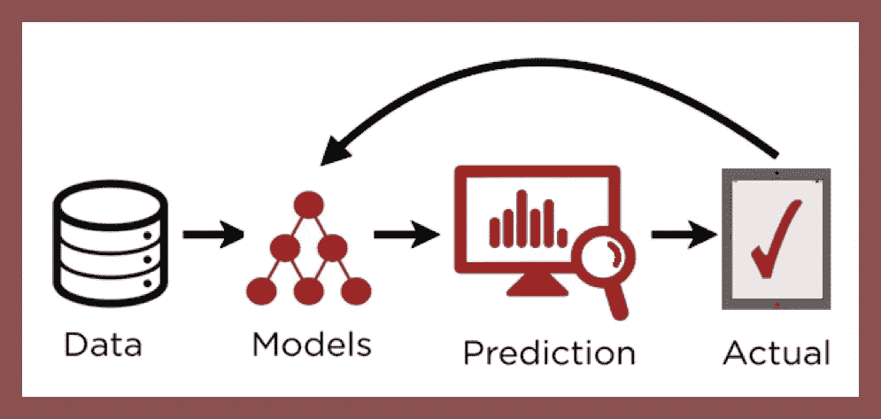**

**让我们使用矩阵代数模型系数来预测测试数据集。**

```
**# Let's define a simple method for prediction
def predict(x):
    """ takes a row of test data and predicts it
    and returns the summed value of the observation"""
    x = list(x)

    x = x[0]*intercept + x[1]*b1 + x[2]*b2 + x[3]*b3

    return x**
```

**接下来，让我们将测试数据转换为数据框，以便我们可以对其应用预测方法。**

```
**X_eval = pd.DataFrame(X_test)**
```

**接下来，让我们应用 predict 方法并传递 axis=1，这样就沿着列完成了。然后我们使用。值，并将其全部赋给变量 y_hat。y_hat 现在是我们的模型对样本外或测试数据集的预测。**

```
**y_hat = np.ceil(X_eval.apply(predict, axis=1).values)**
```

## ****评估矩阵代数模型:****

****

**[img_credit](http://lynda.com)**

```
**# First import metrics from sklearn
from sklearn.metrics import mean_squared_error, r2_score**
```

**让我们计算均方误差和均方根误差。**

```
**MSE = mean_squared_error(y_test, y_hat)
RMSE = MSE**0.5# Let's print out the MSE and RMSE
print(MSE)
print(RMSE)
>>
    502.12827663134414
    22.408218952682162**
```

**让我们计算误差幅度和 r2_score(决定系数)。r2_score 告诉我们，我们的模型预测有多有把握。**

```
**# First we find the range of the target variable, y
y_range = y_test.max() - y_test.min()# Then we compute the RMSE as a percentage of the range of y
error_margin = error_margin = (RMSE / y_range) * 100# Next we compute the r2_score
r2_score = r2_score(y_test, y_hat)# Let's print out the error_margin and r2_score
print(error_margin)
print(r2_score)
>>
    4.6012769923371994
    0.8535767069727507**
```

**这意味着我们的矩阵代数模型对每个预测都有 85%的信心，并且误差在目标变量范围的 4.6%以内……非常好。**

****对比:****

**让我们使用相同的数据集将我们的矩阵代数模型与 Sklearn 库中的模型进行比较。**

```
**# first import sklearn linear regression
from sklearn.linear_model import LinearRegression# Instantiate a Linear regression model
model = LinearRegression()**
```

**接下来训练 Sklearn 模型。**

```
**model.fit(X,y)
>>
  LinearRegression(copy_X=True, fit_intercept=True, n_jobs=None, normalize=False)**
```

**打印 Sklearn 模型的系数。**

```
**# The Slope or gradient
model_slope = model.coef_# the intercept or bias unit
model_intercept = model.intercept_print(’Slope =’, slope,’\nIntercept = ',intercept)
>>
      Slope = [ 0\.          7.9148692   5.89255091 -5.00194268]  Intercept =  322.5539237961783**
```

**让我们使用 Sklearn 模型来预测测试数据集**

```
**y_pred = model.predict(X_test)**
```

**我们来评价一下 Sklearn 模型的性能**

```
**model_mse = mean_squared_error(y_test, y_pred)
model_rmse = model_mse ** 0.5
model_error_margin = (model_rmse / y_range) * 100
model_r2_score = r2_score(y_test, y_pred)**
```

**让我们来看看矩阵代数和 Sklearn 模型的总结**

```
**summary_dict = {'algebra_model':[intercept, b1, b2, b3, MSE, RMSE, error_margin, matrix_r2_score],
               'sklearn_model':[model_intercept, model_slope[1], model_slope[2], model_slope[3], model_mse, model_rmse, model_error_margin, model_r2_score]}summary_df = pd.DataFrame(summary_dict, index=['Intercept','b1','b2','b3','MSE','RMSE','Error_margin','R2_score'])
summary_df**
```

**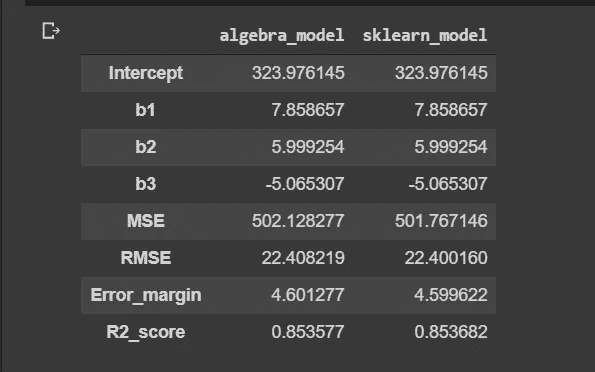**

**矩阵代数和 Sklearn 模型实际上具有相同的参数**

**我们可以看到，这两个模型在所有参数(截距、斜率、MSE、RMSE、误差容限和 r2 分数)上都有实际上精确的值**

**因此，Sklearn 和矩阵代数模型对每个预测都有 85%的置信度，并且误差范围为 y 的 4.6%。**

## ****可视化:****

**让我们看看矩阵代数模型预测的距离图和正则图**

**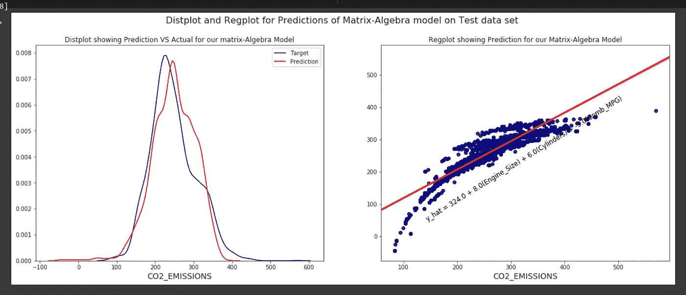**

**测试数据集上矩阵代数模型预测的 distplot 和 regplot**

**让我们来看看 Sklearn 模型预测的 distplot 和 regplot**

**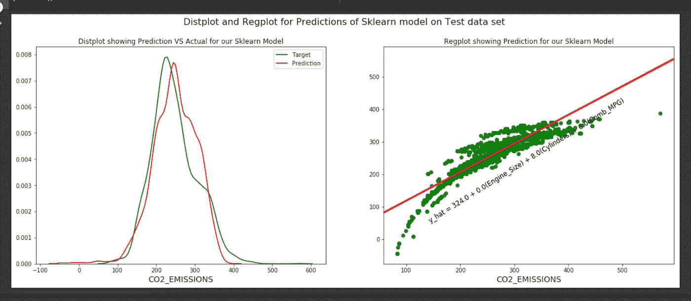**

**测试数据集上 Sklearn 模型预测的 distplot 和 regplot**

**这两种型号惊人地相同。**

## ****总结:****

**我们已经看到多元线性回归(MLR)如何使用矩阵代数一步一步地工作。**

**我们从零开始建立了一个 MLR 模型，首先确定相关变量，确定多重共线性，并选择 3 个适度线性独立变量。
然后，我们使用符合*最小二乘估计公式*的矩阵乘法，使用训练数据集训练模型，并使用模型对模型未知的测试数据集(样本数据集之外)进行预测。
然后，我们使用 MSE、RMSE 和 r2_score 对该模型进行评估，并将其与 Sklearn 库中的模型进行比较。**

## **最后:**

**我希望我已经把你的直觉放大到多元线性回归，给你计算线性回归的能力，不管有没有库…看到本质，超越抽象。**

**你可以在[***cognitive class . ai***](https://cognitiveclass.ai/courses/machine-learning-with-python/)上查看这个免费课程**

**参见 Github 上的 此处的 [***代码单元格***](https://github.com/Lawrence-Krukrubo/Understanding_Multiple_Linear_Regression)**

****干杯！****