# 了解非线性回归

> 原文：<https://pub.towardsai.net/understanding-non-linear-regression-fbef9a396b71?source=collection_archive---------0----------------------->

当你有一个弯曲的数据集时，知道如何拟合模型…

> 所有的模型都是错的，但有些是有用的… [**乔治·爱德华·佩勒姆**](https://en.wikipedia.org/wiki/George_E._P._Box)

回归的目标是建立一个模型来准确预测未知情况。

回归通常是使用历史数据预测连续变量的过程，如房价、工人工资、降雨强度等。

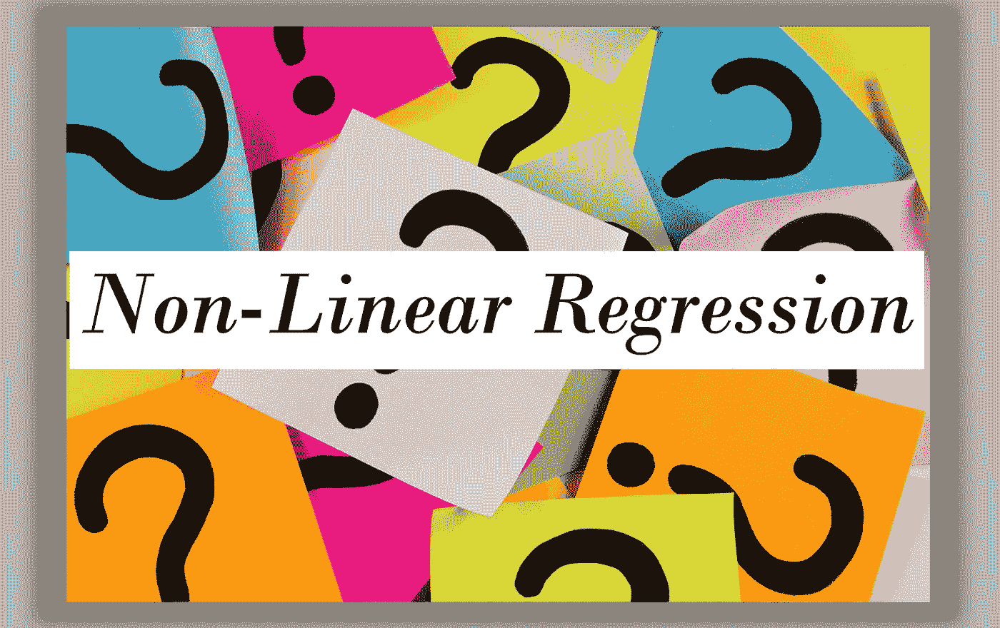

了解非线性回归

基本上，回归只有两种类型，参见 IBM***链接***

**。简单回归**

**。多元回归**

简单回归和多元回归都可以是线性或非线性的。

回归的线性是基于自变量和因变量之间关系的性质。

本文假设读者对简单回归和多元回归的概念有初步的了解。但不要烦恼，为了复习，请查阅我以前关于简单的[](https://medium.com/towards-artificial-intelligence/understanding-the-simple-maths-behind-simple-linear-regression-3ce4a30e7602?source=---------8------------------)*和 [***多重***](https://medium.com/towards-artificial-intelligence/understanding-multiple-linear-regression-1b4a5b939f5a?source=---------6------------------) 线性回归的深入文章。*

*我们都喜欢看到自变量和因变量的散点图，它显示了一条几乎截然不同的直线来拟合我们的模型，但事实是，在现实中，许多数据集显示不同的模式。*

*因此，如果数据集显示曲线趋势，那么线性回归模型可能确实不合适。在这种情况下，我们需要采用非线性回归模型。我们马上会看到几个例子…*

**

*[img_credit](http://i1.sndcdn.com/avatars-000378018311-j1p564-original.jpg)*

## *非线性回归(NLR):*

***NLR** 是自变量 ***X*** 和因变量***y*** 之间的任意关系，产生非线性函数模型化数据。*

*本质上，任何关系，只要是**而不是**线性的，都可以被称为非线性的，通常用多项式 ***k*** (最大幂 ***X*** *)来表示。**

*事实上，存在许多不同的 NLR，可以用来拟合任何数据集，并且这些可以无限继续下去。*

*我们可以统称所有这些 **NLR** s， ***多项式回归*** ，只要将自变量 ***X*** 与因变量 ***y*** 之间的关系建模为 X 中的一个***n 次多项式。参见*[***链接自 IBM***](https://d3c33hcgiwev3.cloudfront.net/b-TljGpQEei5FgrpHNEYyg.processed/full/540p/index.webm?Expires=1572912000&Signature=ediGaW4W6mC4QHviPdBC3WhDGi-YI6xg0CzE5Ki9fT2dQZPI8C30isc1rQ~fOTG1cuRhXGGMN7UiuDTmpN6gJ~p0M79z8ozr7SBSXo7CGmFAXNdC2KrWznqFkX7Z3gCAB6IHErjMK7J6sySN1knVDDUIAq2adLboO1wqXniYmcQ_&Key-Pair-Id=APKAJLTNE6QMUY6HBC5A)*****

## *那么什么是多项式回归或非线性回归呢？*

*多项式回归将曲线拟合到您的数据。三次多项式的一个简单示例如下所示*

*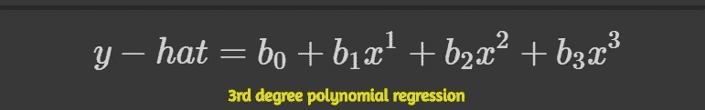*

*其中 b0 是截距或偏差单位，b1 至 b3 是变量 x 的每个独立值的斜率。*

*这看起来很像多元线性回归的特征集，对吗？就像下面这个，是的，确实是。事实上，多项式回归是多元线性回归的一个特例，其主要思想是“你如何选择你的特征？”。*

**

*其中 b0 是截距或偏差单位，b1 至 b3 是每个独立变量 x1 至 x3 的斜率*

## ***常见的非线性回归类型:***

*在我们继续之前，让我们简单看一下线性回归。它的方程式是:-*

****y = B0+b1x 1****

*线性回归模拟因变量 ***y*** 和自变量 ***x*** 之间的关系。这种关系的度为 1。*

*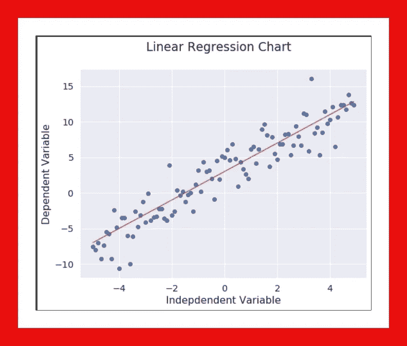*

*样本线性回归图*

*如前所述，有许多类型的非线性回归，但最常见的可能是:-*

***。立方***

***。二次型***

***。指数***

***。对数***

***。s 形/物流***

*让我们简单看一下这些…*

**

*[img_credit](https://media.istockphoto.com/videos/ready-set-go-video-id463916396?s=640x640)*

## ***1。立方:***

*三次函数的形式为:- ***y_hat*** 等于 ***截距*** 加上变量 ***x*** 的三次幂加上 ***x*** 的二次幂，依此类推。它也可以是从 1 次方到 3 次方的反向*

*这个函数的图形在 2D 平面上不是一条直线。让我们画一个，但首先，看看下面的三次方程。*

**

*y_hat =截距+ x 的 3 次幂+ x 的 2 次幂+ x …*

*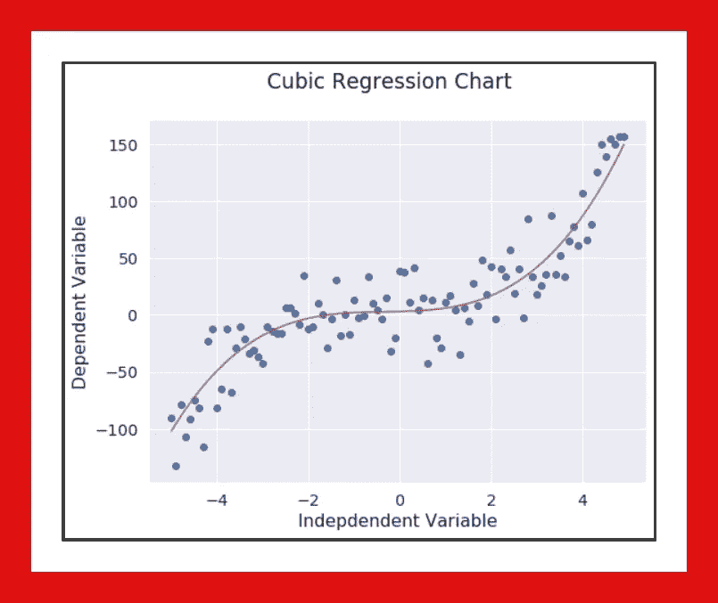*

*样本三次回归图*

## *2.二次:*

*一个二次函数的等式是:- ***y_hat*** 等于变量 ***x*** 乘以变量 ***x*** 或 2 的幂。*

**

*y_hat = X 平方*

*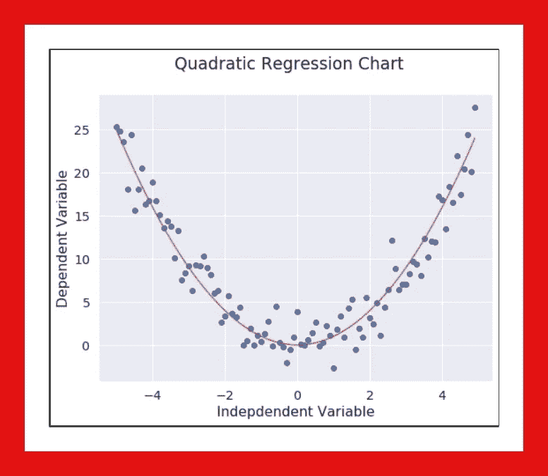*

*样本二次回归图*

## *3.指数:*

*以 ***c*** 为底的指数函数被定义为*y-hat 等于 ***截距*** 加上 ***斜率*** 乘以一个常数( ***c*** )的变量 ***X*** 。请参见下面的表达式。**

****

**哪里 b！= 0，c > 0！= 1，x 是变量和实数，c 也是常数。**

**指数可能看起来有点令人困惑，但是绘制它非常简单…只需应用 ***numpy.exp()*** 函数，并传递变量 ***X*** 作为它的参数，格式如下:-***y _ hat = NP . exp(X)****。*然后绘制 X 轴上的变量 ***X*** 和 y 轴上的变量***y 轴*。******

**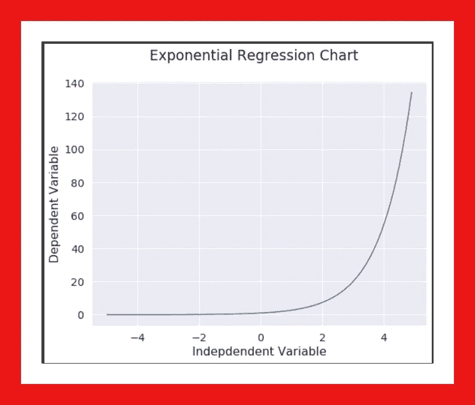**

**样本指数回归图**

## **4.对数:**

**在对数函数中， ***y_hat*** 是对变量 ***X*** 应用对数映射的结果。这是对数函数最简单的表达式之一。**

****

**y _ hat =的对数**

**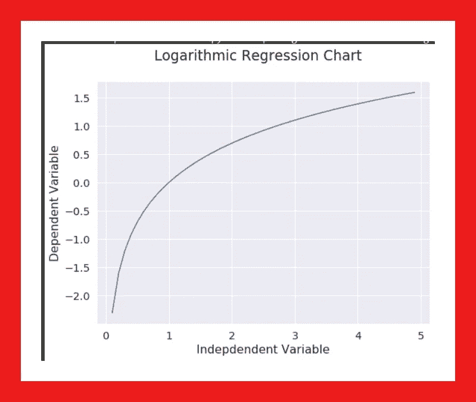**

**对数回归图表示例**

## **5.s 形/物流:**

**逻辑回归是线性回归的一种变体，当观察到的因变量 ***y*** 是分类变量时，逻辑回归非常有用。它通过线性回归拟合特殊的 S 形曲线，并使用 sigmoid 函数将数字估计值转换为概率得分。参见 [***链接***](https://github.com/Blackman9t/Machine_Learning/blob/master/Classification_Logistic_Reg_churn.ipynb)**

****

****β1** 控制曲线的陡度**，β2** 控制 x 轴上的曲线。**

****

**样本逻辑回归图**

**有许多回归类型可供选择，很有可能其中一个会很好地适合您的数据集。**

> ****请记住，选择最适合数据集的回归模型非常重要。****

**我相信你有一些问题，我会慷慨地回答我认为最明显的问题…**

## **问题:**

> ****如何简单的知道问题是线性还是非线性？****

**要回答上述问题，我们可以做两件事。**

****答****

**直观地判断这种关系是线性的还是非线性的。最好用每个输入变量来绘制输出变量的二元图。参见[上的链接**上的*上的*上的**上的](https://www.kaggle.com/residentmario/bivariate-plotting-with-pandas)**

****B.****

**另一个简单的选择是计算自变量和因变量之间的相关系数。在熊猫身上，这很容易通过调用 ***来实现。*corr()**作用于数据集。如果所有变量的系数为 0.7 或更高，则存在线性趋势，因此非线性模型不合适。**

> ****好了，说够了！！让我们用一些真实的实时数据来弄脏我们的手……****

****

**[img_credit](https://www.google.com/url?sa=i&source=images&cd=&ved=2ahUKEwiwusuZoNPlAhWDDGMBHckECv0QjRx6BAgBEAQ&url=https%3A%2F%2Fwww.azquotes.com%2Fquote%2F282125&psig=AOvVaw1dNwQfz1n24n1BJ9L4xt89&ust=1573049467807411)**

**我们将尝试对 1960 年至 2014 年中国 GDP 的数据点拟合一个非线性模型。我们的数据集包含两列，第一列包含从 1960 年到 2014 年的年份，第二列包含每年相应的国内生产总值(GDP)值。**

**这是一个 55 行 2 列的小数据集，但已经足够了。**

**在 Github 这里可以看到数据集 [***的链接。***](https://raw.githubusercontent.com/Blackman9t/Machine_Learning/master/china_gdp.csv)**

```
**# Import libraries**import numpy as np
import pandas as pd
import matplotlib.pyplot as plt****china_gdp = '** [**https://raw.githubusercontent.com/Blackman9t/Machine_Learning/master/china_gdp.csv**](https://raw.githubusercontent.com/Blackman9t/Machine_Learning/master/china_gdp.csv)**'****df = pd.read_csv(china_gdp)****df.head(10)****
```

**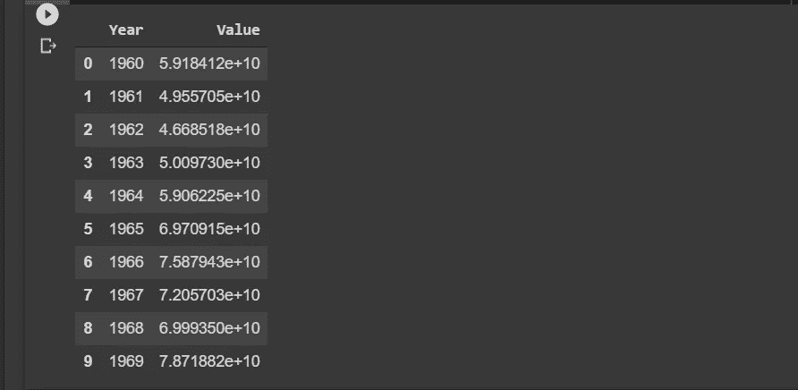**

**显示前 10 行…**

**接下来，我们需要绘制数据点的二元图。X 轴上的自变量 ***X*** (年)，y 轴上的因变量 ***y*** (值)。**

```
****plt.figure(figsize=(8,5))
X_data, y_data = (df['Year'].values, df['Value'].values)
plt.plot(X_data, y_data, 'ro')
plt.suptitle('Graph showing corresponding years and GDP values for China', y=1.02)**
**plt.ylabel('GDP')
plt.xlabel('Year')
plt.show()****
```

**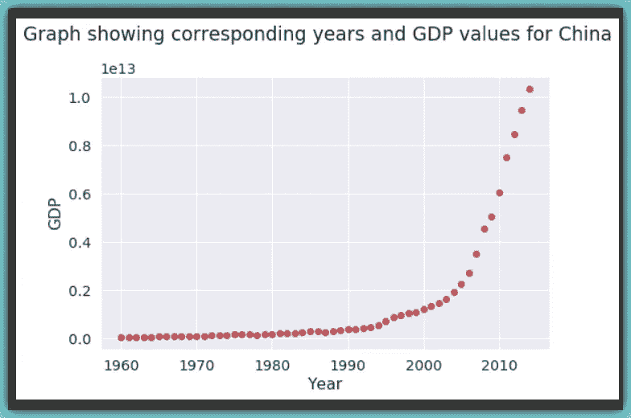**

**嗯……这看起来有点眼熟。你能猜出我们之前研究的哪张 NLR 图表有与上述数据点相似的曲线吗？**

**如果你说指数或逻辑…你错了…我在开玩笑！当然，你是对的！**

**它看起来确实像指数或逻辑 GDP 增长开始缓慢，然后从 2005 年开始，增长非常显著，然后在 2010 年代略有减速。**

## **选择型号:**

**逻辑函数可以是一个很好的近似，因为它具有开始缓慢、中间增加增长、然后最后再次减少的特性。**

## **构建模型:**

**根据上面定义的 sigmoid 方程，记住 Beta_1 控制曲线的陡度，而 Beta_2 在 x 轴上滑动曲线。**

**现在让我们建立我们的回归模型并初始化它的参数。**

```
****def sigmoid(X, Beta_1, Beta_2):**
    """ *This method performs the sigmoid function on param X and 
    Returns the outcome as a varible called y*"""
    **y = 1 / (1 + np.exp(-Beta_1*(X-Beta_2)))
    return y****
```

**现在让我们用一些样本值来测试我们的 sigmoid 函数**

```
****beta_1 = 0.10
beta_2 = 1990.0**# logistic_function
**y_pred = sigmoid(X_data, beta_1, beta_2)**# Plot initial predictions against data points.**plt.figure(figsize=(8,5))
plt.suptitle('Sample Plot: Sigmoid Function on data points')
plt.plot(X_data, y_pred*15000000000000.0)
plt.plot(X_data, y_data, 'ro')
plt.show()****
```

**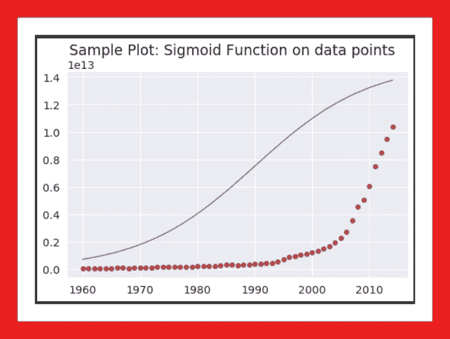**

**蓝线是我们的样本 sigmoid 模型，红点是数据点。**

## **标准化我们的变量:**

**在这一点上，让我们规范化我们的变量**

```
****xdata = X_data / max(X_data)
ydata = y_data / max(y_data)****
```

## **寻找最佳参数:**

**我们的下一个任务是找到非线性或逻辑模型的最佳参数。我们将使用来自 ***scipy*** 库中的 ***curve_fit()*** 方法。该方法所做的是:-它使用非线性 [***最小二乘估计***](https://stattrek.com/regression/linear-regression.aspx) 来将我们上面定义的 sigmoid 函数拟合到数据点。**

```
****from scipy.optimize import curve_fit****popt, pcov = curve_fit(sigmoid, xdata, ydata)**
# popt are our new optimized parameters
# pcov represents the covariance
**print('beta_1 = %f, beta_2 = %f' % (popt[0],popt[1]))**>>
  **beta_1 = 690.453017, beta_2 = 0.997207****
```

**由于 curve_fit()方法，现在我们有了理想的参数，我们将使用它们来拟合我们的模型，换句话说，就是最小化每个预测与其对应的实际值之间的平方差之和。**

```
****x = np.linspace(1960, 2015, 55)**
# Normalize x
**x = x / max(x)
plt.figure(figsize=(8,5))
y = sigmoid(x, popt[0], popt[1])**
# Plotting the original data points
**plt.plot(xdata, ydata, 'ro', label='data')**
# Plotting the fitted prediction line
**plt.plot(x, y, linewidth=3.0, label='fit')
plt.legend(loc='best')
plt.ylabel('GDP', color='r', fontsize=18)
plt.xlabel('Year', color='r', fontsize=18)
plt.xticks(color = 'y')
plt.yticks(color = 'y')
plt.show()****
```

**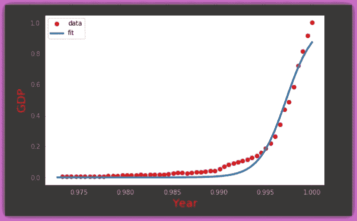**

**曲线数据点上拟合的模型蓝线…**

**正如我们所看到的，它看起来非常适合，但是让我们来评估一下我们的模型…**

****

**模型评估…**

**首先，让我们将数据分成训练和测试数据集。**

```
****msk = np.random.rand(len(df)) < 0.8 
train_x = xdata[msk] 
test_x = xdata[~msk] 
train_y = ydata[msk]
test_y = ydata[~msk]****
```

**接下来，我们使用训练集来构建模型，以提取理想参数**

```
****popt, pcov = curve_fit(sigmoid, train_x, train_y)**
# Remember popt saves the ideal parameters from curve_fit method
# While pcov stores the covariance**print('Ideal params are: ', popt)**
>>
**Ideal params are:  [670.91888462   0.99708276]****
```

**现在，我们使用测试集进行预测**

```
****y_hat = sigmoid(test_x, *popt)**# *popt means unpack popt into popt[0] and popt[1]**
```

## **评估…**

```
****mean_abs_error = np.mean(np.absolute(y_hat - test_y))
mean_squ_error = np.mean(np.absolute((y_hat - test_y) **2))****print("Mean absolute error: %.2f" % mean_abs_error)
print("Residual sum of squares (MSE): %.2f" % mean_squ_error)**# Next let's check the R2 score, The coefficient of determination**from sklearn.metrics import r2_score****r_score = r2_score(y_hat, test_y)
print("R2-score: %.2f" % r_score)**>>
**Mean absolute error: 0.04 
Residual sum of squares (MSE): 0.00 
R2-score: 0.95****
```

**MAE = 0.4MSE = 0.0。；R2 得分= 0.95 (95%)**

## **总结:**

**这需要大量的实践，但是很明显，正如我们在这个小数据集上看到的，通过曲线数据集拟合非线性回归线实际上是可能的。Python 有丰富的模块来帮助我们拟合一个模型来预测一个连续的甚至是分类的变量。**

**请随意浏览 Github 上的笔记本[](https://github.com/Blackman9t/Machine_Learning/blob/master/Non_LinearRegression.ipynb)*了解更多细节，尤其是我们之前绘制的 NLR 图表。***

*****干杯！*****

## ***关于我:***

***劳伦斯是技术层的数据专家，对公平和可解释的人工智能和数据科学充满热情。我持有 IBM 的 ***数据科学专业*** *和* ***高级数据科学专业*** *证书。我已经使用 ML 和 DL 库进行了几个项目，我喜欢尽可能多地编写函数代码，即使现有的库比比皆是。最后，我从未停止学习和实验，是的，我拥有几个数据科学和人工智能认证，并且我已经写了几篇强烈推荐的文章。****

**请随时在以下网址找到我**

**[**Github**](https://github.com/Lawrence-Krukrubo)**

**[**领英**](https://www.linkedin.com/in/lawrencekrukrubo/)**

**[**推特**](https://twitter.com/LKrukrubo)**