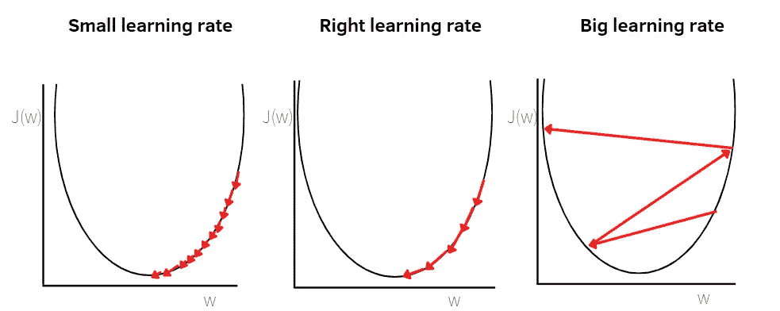
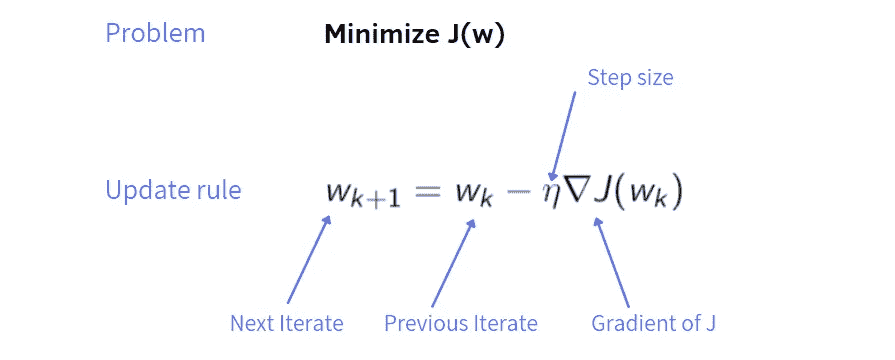
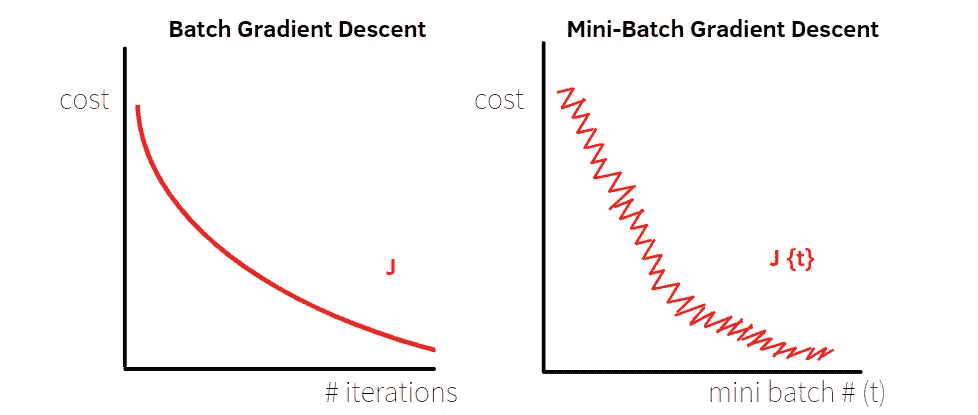
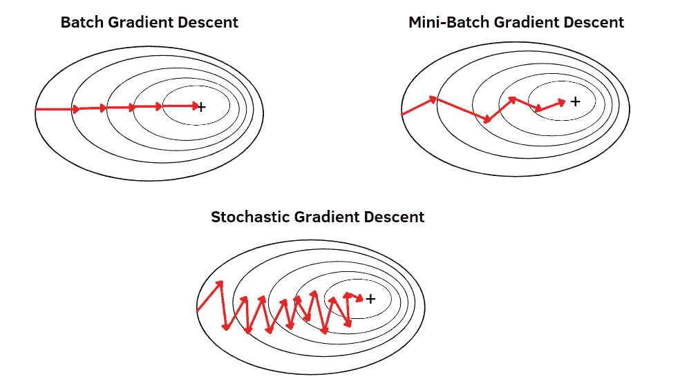
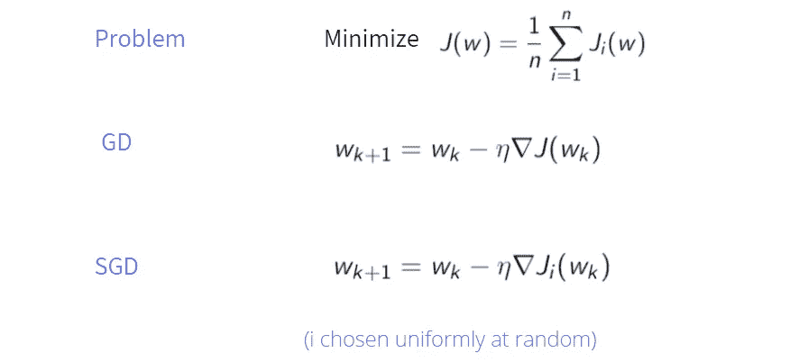
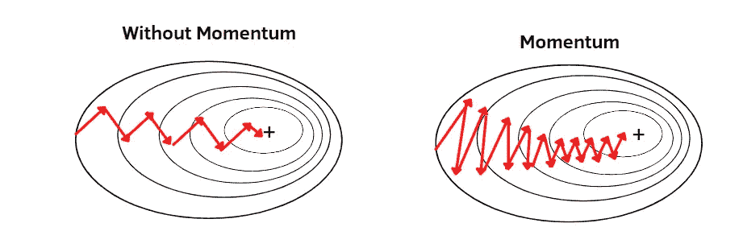
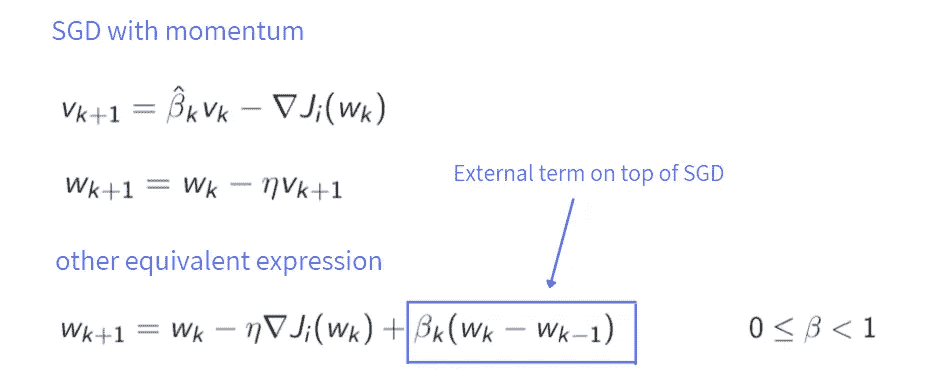
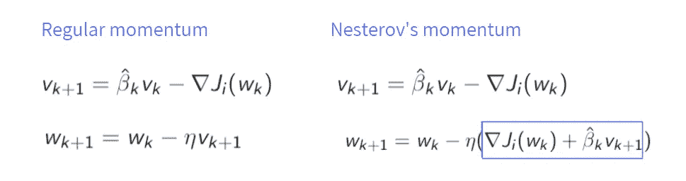
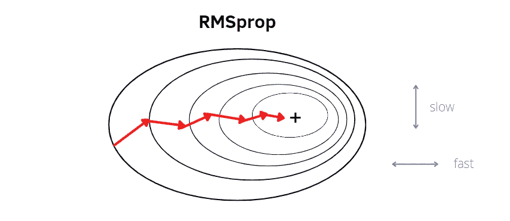
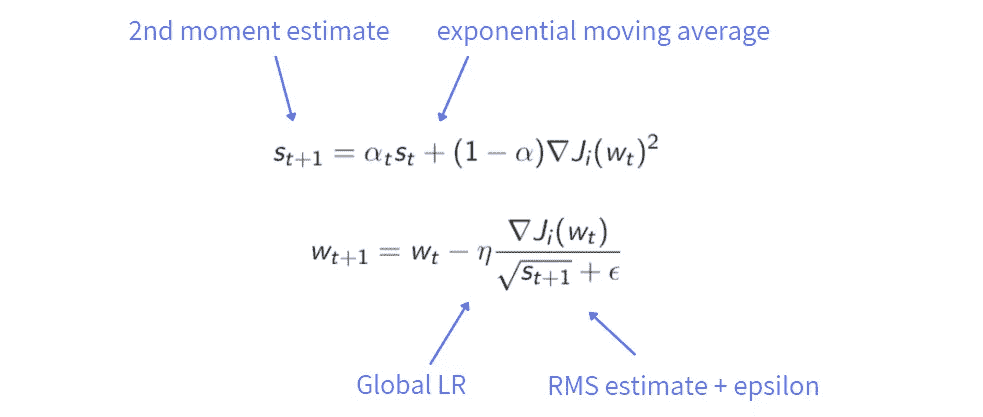

# 用简单的语言解释优化算法的基础

> 原文：<https://pub.towardsai.net/understanding-optimization-algorithms-309d8065599d?source=collection_archive---------1----------------------->

## [优化](https://towardsai.net/p/category/optimization)

## 理解如何在机器学习算法中最小化成本函数的指南

由[汤姆·斯温南](https://www.pexels.com/@shottrotter)在[像素](https://www.pexels.com/)上拍摄的照片

在我攻读数据科学硕士学位期间，我在大多数课程中都遇到过优化人员。起初，我不太理解算法的概念，因为它们用许多数学公式处理，这使我感到更加困惑。然后，我在网上看了一些教程，终于，我能够理解这些优化器背后的含义了。

优化算法在机器学习和深度学习中起着关键作用。没有它，我们无法建立任何模型来进行预测。此外，根据所选择的优化算法，模型将以不同的方式运行。因此，您不仅需要选择能够很好地处理数据的最佳方法，还需要选择算法和该算法的相应超参数。

在这篇文章中，我想用简单的方式解释基本算法。对于每种算法，我将展示相关的主要方程，我将重点介绍最常用的方法，你们可以在目录中看到。

**目录:**

1.  [**批量渐变下降**](#67d4)
2.  [**小批量梯度下降**](#abeb)
3.  [**随机梯度下降**](#3f94)
4.  [**SGD 带动量**](#88ab)
5.  [**新加坡元带着内斯特罗夫的气势**](#d16d)
6.  [**RMSprop 和 Adam**](#58d3)

# 1.批量梯度下降

不同学习率的梯度下降。作者插图

梯度下降是解决最小化问题的最基本的算法，其对应于成本函数 J [1]的最小化。一旦我们定义了成本函数，我们希望通过参数、权重和偏差来最小化它。

正如你在下面看到的，你可以推断出这也是一个迭代过程，从一个随机的位置开始，从这里我们想要达到最小值。每次迭代时，参数都会改变。在这个符号中，我使用 w 来表示参数的值，但是您也可以找到其他符号。

**w** 是指**集合的砝码**。但是还有一些符号也考虑了偏差参数，出于简化的目的，本文没有考虑这些参数。更新规则取决于负梯度的方向

GD 更新规则。作者插图

从步骤 k 的参数随机配置开始，更新规则由**先前分配**给出，从中减去**学习率**，也称为步长，乘以步骤 k 的成本函数 J 的**梯度。每次更新后，梯度被重新评估为新的权重向量，并且该过程被重复几次。**

梯度下降中的一个重要参数是学习率，它决定了每一步的大小。当学习率过大时，梯度下降可能会跳过山谷，最终到达另一边。所以，太大的步长会导致代价函数的发散。另一方面，如果太小，需要很长时间才能收敛到最小值。因此，我们需要这个参数的平衡，不能太小也不能太大。

**注:**这种方法的特点是我们**处理整个训练集**。当训练集中有数百万个示例时，计算开销可能会很大。在这种情况下，梯度下降不再是最小化成本函数的好解决方案。我们需要其他优化者。

# 2.小批量梯度下降

批量 GD 与小批量 GD。作者插图

在之前的算法中，我们使用了整个训练集，但在一些有无数例子的情况下，它并不工作得很好。小批量梯度下降的思想是将训练集分成“小批量”，即更小的部分。

例如，假设我们有**6000 万个样本**，我们决定每个小批量有 **100 个样本**。然后，训练集的前 100 个示例将形成第一个小批量，接下来的 100 个示例将构成第二个小批量，依此类推。我们总共会有 **600，000 个小批量**。

在批量梯度下降中，一次评估 N 个点。使用小批量梯度下降，单次通过训练集需要**N/小批量** **梯度下降步骤**。在本例中，一次通过将有 600，000 个 GD 步骤。当训练集很大时，小批量方法比梯度下降法更快。在上图中，您可以观察到提到的两种方法之间的差异。

在批量梯度下降中，成本函数在每次迭代中降低。而在小批量梯度下降中，成本函数可能不会在每次迭代中降低，并且具有之字形行为。这种之字形移动是由于每个小批量包含不同的示例，其中训练集的一些较小部分可能比其他部分更嘈杂。

对于小批量的大小，需要考虑不同的情况:

*   如果 **mini-batch size = N** ，我们将使用所有训练集的例子，因此我们使用批量梯度下降。
*   如果**小批量=1** ，我们以随机梯度下降结束。然后，训练集的每个例子构成一个小批量，导致有 N 个小批量。

一般来说，最好是小批量，不要太小也不要太大。如果我们有一个巨大的训练集，使用梯度下降更新参数的过程将花费太多时间。另一方面，当有噪声观察时，采用太小的小批量不能很好地工作，并且有时算法不会收敛。典型的小批量是 64、128、256 和 512。您可以观察到，最小批量的大小通常是 2 的幂。

# 3.随机梯度下降

批量 GD 与小批量 GD 与 SGD。作者插图

随机梯度下降的思想是用梯度的随机近似代替梯度下降步骤的梯度[2]。这种随机近似由训练集的单个例子的成本函数的梯度构成。如前所述，如果小批量=1，我们最终得到随机梯度下降。

作者插图

在随机梯度下降的符号中，Ji 指的是训练集的单个例子的成本函数。我们希望最小化成本函数 J，它是所有实例的总成本。

使用这种方法有一些优点:

*   当训练集中存在冗余信息时，SGD 有助于避免进一步的冗余计算。
*   随机梯度下降在计算方面是便宜的。它不需要在内存中存储很多值，因为它会立即计算部分梯度，并将其应用到更新规则中，然后在我们删除它之后。
*   SGD 行为中的随机噪声有利于摆脱局部极小值并收敛到全局极小值。

但是也有一些缺点。在随机梯度下降中，我们一般会朝着正确的方向移动，但偶尔甚至会增加误差。正如你从上面的插图中看到的，在路径周围有曲折的行为，这是更少的方向性和更少的规则性。一般来说，这种行为也取决于小批量的大小和学习速度。

# 4.带动量的 SGD

新币 vs 有动量的新币。作者插图。

动量是优化算法的一个有用技巧。它通常适用于随机梯度下降，但也非常适合梯度下降。在这种情况下，我将重点讨论带动量的随机梯度下降。

如你所知，之前我们只有一个迭代 w。现在我们有**两个迭代**、v 和 w，它们在每一步 k 都被更新。v 更新是通过将**旧 v** 乘以**常数β**与成本函数的**梯度**相加而获得的。参数β的值在 0 和 1 之间，构成少量阻尼。在实践中，beta 的典型值是 0.9 或 0.99，这很有效。

因此，v 就像一个累积的梯度，其中过去的梯度在应用常数β的每一步都减少。如果你看看这张比较新币和有动量的新币的图片，就清楚多了。然后，在这个算法中，我们用 v，而不是只用梯度。想法是当动量参数增加时减小步长参数以保持收敛。

作者插图

第二种形式有助于将两步过程合并成一个方程。它被称为**随机重球法**。这个名字的原因是它像一个从山上滚下来的大球。球有动量，所以当它遇到地形变化时不会立即改变方向。表达式的第一部分与 SGD 相同。在我们加上常数β乘以过去的迭代 w 和步骤 k-1 的迭代 w 之间的差之后。

# 5.新加坡元与内斯特罗夫的势头

人们很容易将这种势头与内斯特罗夫的势头混淆。它们不是一回事。与常规动量相比，第二个方程有一个小的修正。

作者插图

代替将学习率乘以迭代 v，我们将它乘以成本函数的**梯度和参数β的**估计的和**乘以在步骤 k+1** 的**迭代。**

为常数选择正确的值，内斯特罗夫动量能够在凸问题的情况下加速收敛。但没有理论表明这种加速发生在训练神经网络时，神经网络的特征是没有凸性。

# 6.RMSprop 和 Adam

RMSprop 和 Adam 被称为**自适应方法**，它们与神经网络配合得非常好。有一些原因导致了更好的表现。两种算法都可以**单独调整每个权重的学习率**，而不是像之前的算法那样使用全局学习率。

学习率应取决于从每个重量的**梯度获得的信息。为什么全局学习率不能很好地用于神经网络？在卷积神经网络的情况下，有非常不同的操作，例如卷积和最大池。正因为如此，学习率可能在一个层上工作得很好，但在其他层上就不好了。**

RMSprop。作者插图。

**RMSprop** 代表均方根。以特定的方式加速梯度下降是有用的。它减缓在**垂直方向**的学习，并加速在**水平方向**的学习。它应用衍生产品平方的指数移动平均值。事实上，在第一个等式中有平方运算和 0 到 1 之间的非负参数α。在算法更新参数之后。与前面的方法一样，更新规则由前面的赋值给出，从中我们减去成本函数的梯度除以二阶矩估计值的平方根**加上常数**ε**，这是避免计算中出现问题所需要的(0 除以 0)。实际上，二阶矩估计值将非常小，很容易发现它非常接近于 0。**

作者插图

Adam 是一种算法，它将 RMSprop 和 momentum 连接在一起。事实上，它代表自适应矩估计。我们使用指数移动平均线更新**动量**。β作为超参数引入，其值介于 0 和 1 之间，作为超参数α。

作者插图

beta 计算导数的平均值(一阶矩)，alpha 计算导数平方的指数加权平均值(二阶矩)。β和α的典型值分别是 0.9 和 0.999，而ε具有非常接近于零的值，例如 10^(-8。

# 最终想法:

这些是在机器学习和神经模型中最常用的优化算法。还有许多其他的优化器，但是我说的这些是应用最多的主要优化器。

谢谢你阅读它。大部分解释的东西都是受了吴恩达的《改善深度神经网络》课程和 Yann LeCun 和 Alfredo Canziani 的《深度学习》课程的启发。

如果你想深入研究这个话题，请查阅文章底部的参考资料！

**参考文献:**

[1] [吴恩达，改进深度神经网络:超参数调整、正则化和优化](https://www.coursera.org/learn/deep-neural-network)

[2][https://at cold . github . io/py torch-Deep-Learning/en/week 05/05-1/](https://atcold.github.io/pytorch-Deep-Learning/en/week05/05-1/)

**你喜欢我的文章吗？** [***成为会员***](https://eugenia-anello.medium.com/membership) ***每天无限获取数据科学新帖！这是一种间接的支持我的方式，不会给你带来任何额外的费用。如果您已经是会员，*** [***订阅***](https://eugenia-anello.medium.com/subscribe) ***每当我发布新的数据科学和 python 指南时，您都可以收到电子邮件！***