# 了解熊猫融化— pd.melt()

> 原文：<https://pub.towardsai.net/understanding-pandas-melt-pd-melt-362954f8c125?source=collection_archive---------0----------------------->

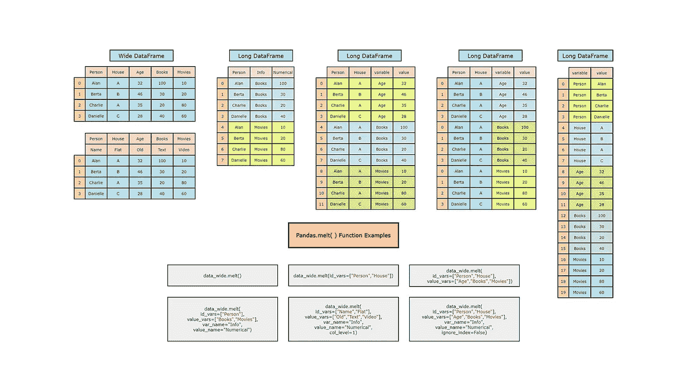

Pandas.melt()函数示例|图片由作者提供|除非另有说明，所有图片均来自作者。

## [数据科学](https://towardsai.net/p/category/data-science)、[编辑](https://towardsai.net/p/category/editorial)、[编程](https://towardsai.net/p/category/programming)

## 了解重塑 Pandas 数据框的最有效和最灵活的函数

**作者:** [普拉蒂克·舒克拉](https://www.linkedin.com/in/pratik-shukla28/)，[罗伯特·伊里翁多](https://mktg.best/vguzs)

 [## 加入我们吧↓ |面向人工智能成员|数据驱动的社区

### 向着 AI 加入。通过成为会员，你不仅将支持人工智能，但你将有机会…

members.towardsai.net](https://members.towardsai.net/) 

他的教程将更深入地探究 Pandas 的函数，理解它的图形核心功能及其在 Python 中的实现。我们将首先看到这个方法的语法和参数。那么我们就举几个例子来了解所有的`pd.melt()`函数参数。本教程的配套资源可以在 [**Google Colab**](https://colab.research.google.com/drive/1Anc3ydboAyrxxVycP0wtMYbDCvSWDSpN?usp=sharing) 或 [**Github**](https://github.com/towardsai/tutorials/tree/master/pandas/pd-melt.py) 上找到。

## 什么是 PD 熔体？

**Pandas melt()** 函数是用于将 Pandas 数据帧从宽格式重塑为长格式的许多其他方法中的一种，这在 [**数据科学**](https://mld.ai/mldcmu) 中特别有用。然而，`pd.melt()`功能是**中最高效、最灵活的**。`pd.melt()`功能将熊猫数据帧从宽格式解旋转/融化为长格式。

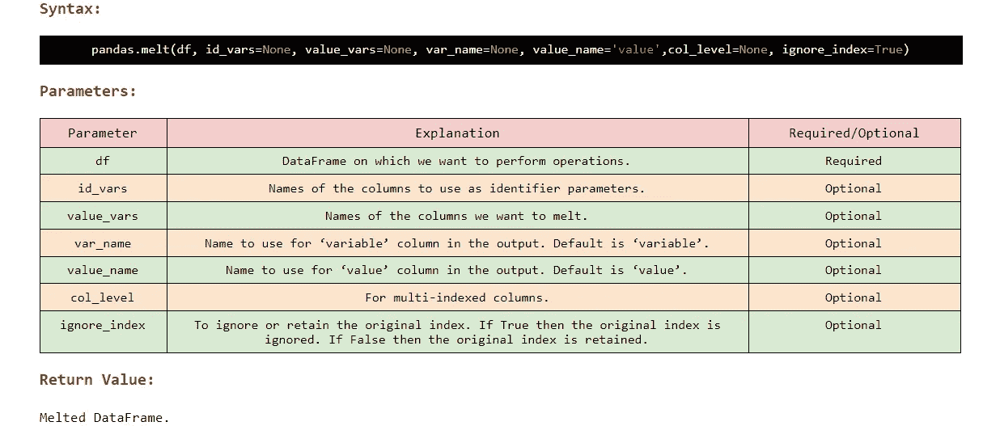

图 pd.melt()函数的语法。

## 宽与长数据帧:

在将我们的**宽数据帧**转换为**长数据帧**之前，让我们先直观地看看它们之间的区别。下面是一个数据帧的例子。

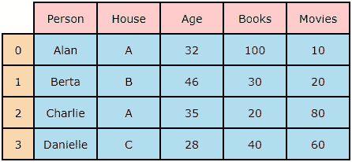

图 2:宽格式的数据帧。

现在，下图显示了一个 DataFrame，它包含相同的数据，但格式较长。

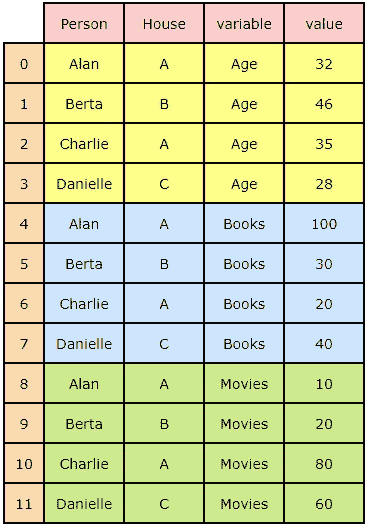

图 3:长格式的数据帧。

在深入研究之前，让我们首先使用`pd.DataFrame()`创建一个宽数据帧。

## A.创建宽数据框架:

图 4:创建主数据帧。

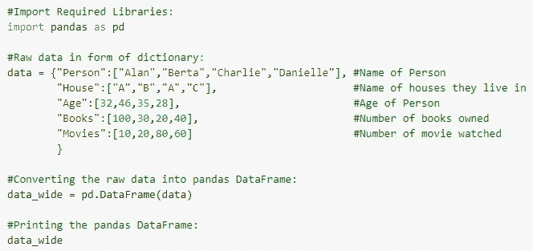

图 5: Python 代码。

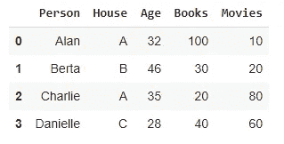

图 6: Python 代码输出。

## B.示例 1:

**使用的参数:**

> 没有使用参数

**在使用`pd.melt()`方法时，如果我们不指定任何参数**，它将熔化所有列及其相应的值。

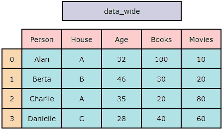

图 7:主数据帧。

图 8:使用 pd.melt()函数。

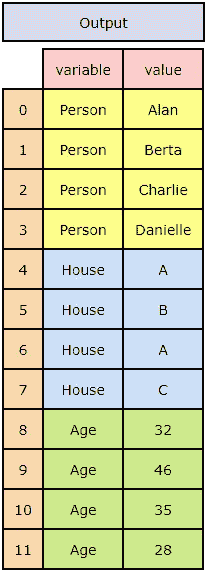

图 9:输出。

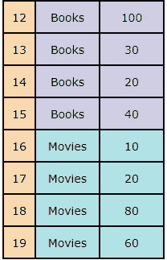

图 10:输出。

## Python 实现:

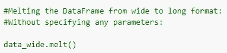

图 11: Python 代码。

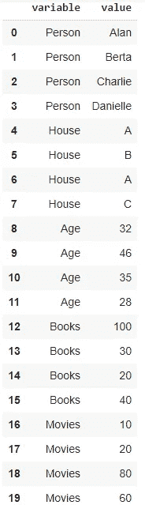

图 12: Python 代码输出。

## C.示例 2:

**使用的参数:**

> id_vars:人，房子

在本例中，我们将通过仅指定`id_vars`参数来融合我们的`data_wide`数据帧。在`id_vars`(人，房子)中使用的列被称为标识符变量，这些列不会被融化。由于我们没有指定任何其他参数，所有其他列(年龄、书籍、电影)将被融合成一个单独的列。

在输出中，我们有两个新列:变量和值。变量列存储融合列的名称，值列存储融合列的实际值。我们可以使用`var_name`和`value_name`参数更改输出列名。

这里需要注意的关键点是，在`id_vars`中指定列名之后，不指定要融合的列将会融合所有剩余的列。

图 13:主数据帧。

图 14:使用 pd.melt()函数。

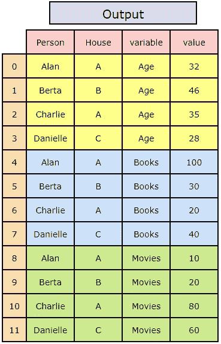

图 15:输出。

## Python 实现:

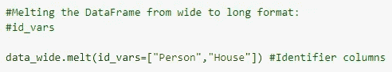

图 16: Python 代码。

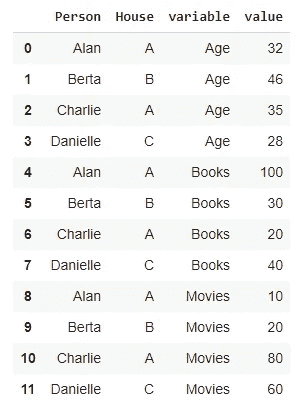

图 17: Python 代码输出。

## D.示例 3:

**使用的参数:**

> id_vars:人，房子
> 
> value_vars:年龄、书籍、电影

在这个例子中，我们指定`id_vars`来指定我们不希望融合的列名(Person，House)。除此之外，我们使用`value_vars`参数来指定我们想要融合的列名(年龄、书籍、电影)。

图 18:主数据帧。

图 19:使用 pd.melt()函数。

图 20:输出。

## Python 实现:

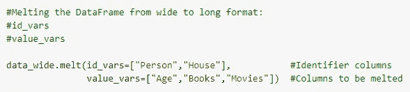

图 21: Python 代码。

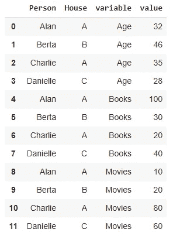

图 22: Python 代码输出。

## E.示例 4:

**使用的参数:**

> id_vars:人员
> 
> value_vars:书籍、电影

下面的例子显示了我们可以为参数`id_vars`和`value_vars.`使用任意多的列

图 23:主数据帧。

图 24:使用 pd.melt()函数。

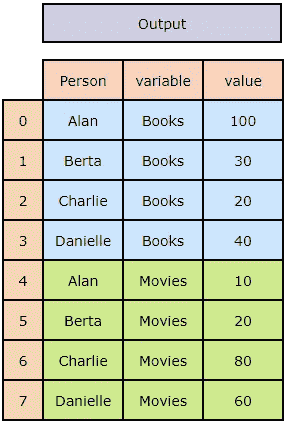

图 25:输出。

## Python 实现:

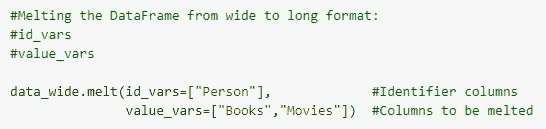

图 26: Python 代码。

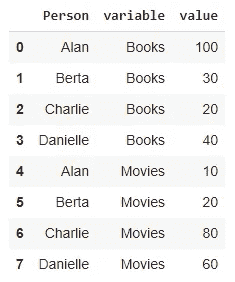

图 27: Python 代码输出。

## F.示例— 5:

**使用的参数:**

> id_vars:人，房子
> 
> value_vars:年龄、书籍、电影
> 
> var_name:信息
> 
> 数值名称:数字

下面的例子展示了我们如何使用`var_name`和`value_name`参数来改变输出列的名称。

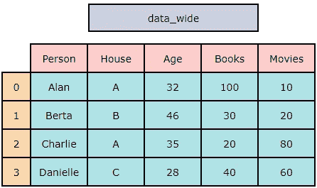

图 28:主数据帧。

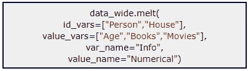

图 29:使用 pd.melt()函数

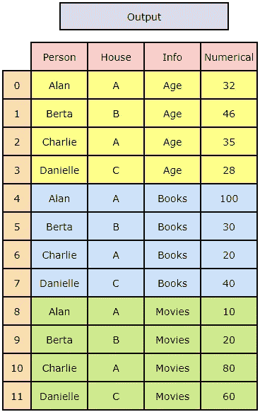

图 30:输出。

## Python 实现:

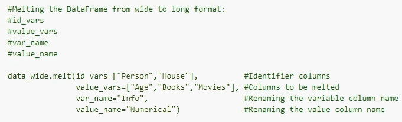

图 31: Python 代码。

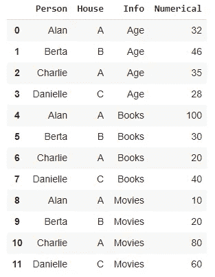

图 32: Python 代码输出。

## G.示例— 6:

**使用的参数:**

> id_vars:人员
> 
> value_vars:书籍、电影
> 
> var_name:信息
> 
> 数值名称:数字

以下示例使用选定的列作为`id_vars`和`value_vars`参数。除此之外，我们还使用 `var_name`和`value_name`参数改变输出数据帧的列名。

图 33:主数据帧。

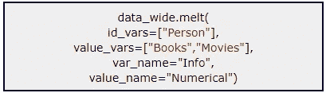

图 34:使用 pd.melt()函数。

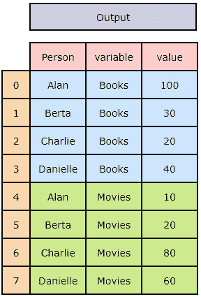

图 35:输出。

## Python 实现:

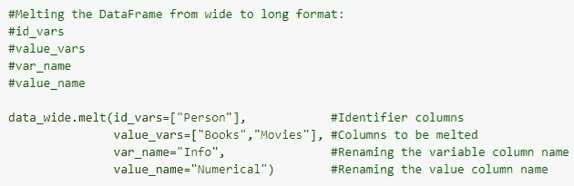

图 36: Python 代码。

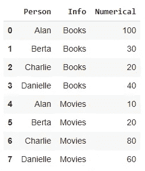

图 37: Python 代码输出。

## H.示例— 7:

**使用的参数:**

> id_vars:人，房子
> 
> value_vars:年龄、书籍、电影
> 
> var_name:信息
> 
> 数值名称:数字
> 
> Ignore _ 索引:False

下面的例子显示了使用`ignore_index`参数来忽略或保留原始索引。如果我们将`ignore_index`设置为`False`，那么原始索引将被保留。如果我们将`ignore_index`设置为`True`，它将忽略原始索引，并为该索引分配连续值。

图 38:主数据帧。

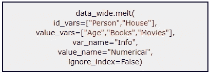

图 39:使用 pd.melt()函数。

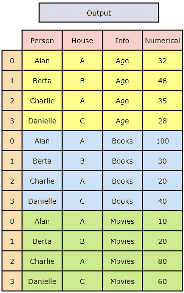

图 40:输出。

## Python 实现:

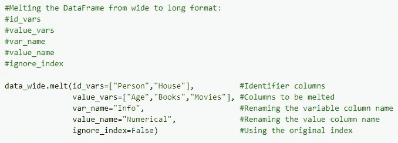

图 41: Python 代码。

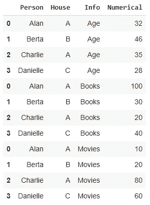

图 42: Python 代码输出。

## I .创建具有多个索引的数据帧:

在某些情况下，列会有多个名称。在这种情况下，我们可以使用`col_level`参数来指定在熔化数据帧时使用哪个级别。

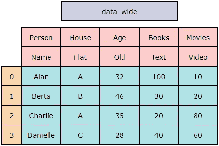

图 43:带有多个索引的主数据帧。

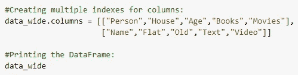

图 44: Python 代码。

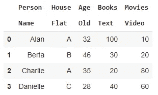

图 45: Python 代码输出。

## J.示例— 8:

**使用的参数:**

> id_vars:人，房子
> 
> value_vars:年龄、书籍、电影
> 
> var_name:信息
> 
> 数值名称:数字
> 
> 列级别:0

以下示例演示了如何使用第 0 个列级索引，使用`col_level`参数来融合数据帧。

图 46:带有多个索引的主数据帧。

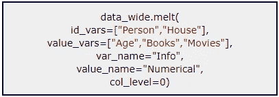

图 47:使用 pd.melt()函数。

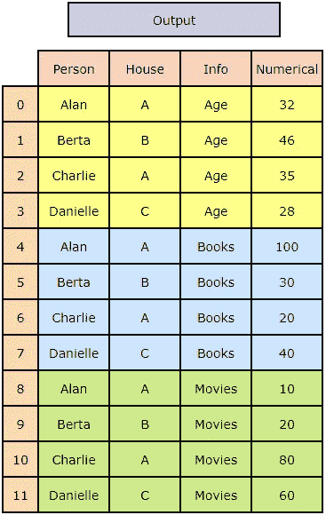

图 48:输出。

## Python 实现:

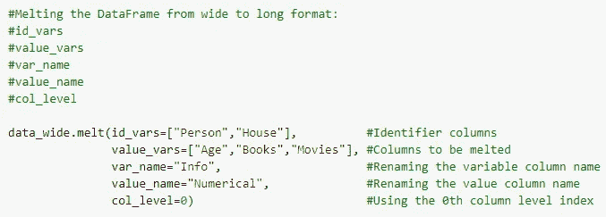

图 49: Python 代码。

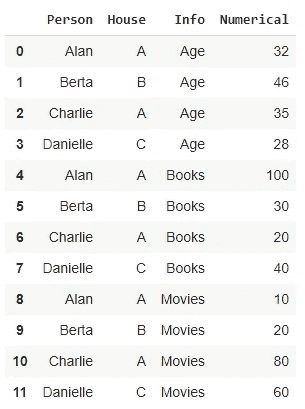

图 50: Python 代码输出。

## K.示例— 9:

**使用的参数:**

> id_vars:人，房子
> 
> value_vars:年龄、书籍、电影
> 
> var_name:信息
> 
> 数值名称:数字
> 
> 列级别:1

下面的例子演示了如何使用列级的第一个索引，使用参数`col_level`来融合数据帧。

图 51:带有多个索引的主数据框。

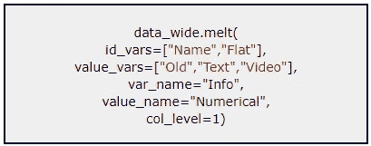

图 52:使用 pd.melt()函数。

图 53:输出。

## Python 实现:

图 54: Python 代码。

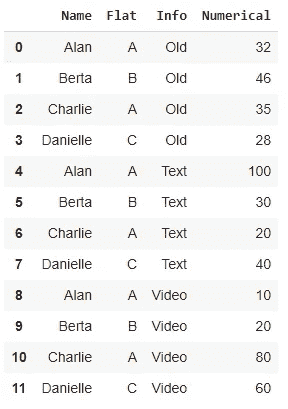

图 55: Python 代码输出。

## 长度示例— 10:

**使用的参数:**

> id_vars:人，房子
> 
> value_vars:年龄、书籍、电影
> 
> var_name:信息
> 
> 数值名称:数字
> 
> Ignore _ 索引:False
> 
> 列级别:1

在下面的例子中，我们将使用所有的`pd.melt()`函数参数。

图 56:带有多个索引的主数据帧。

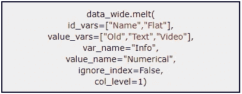

图 57:使用带有所有参数的 pd.melt()函数。

图 58:输出。

## Python 实现:

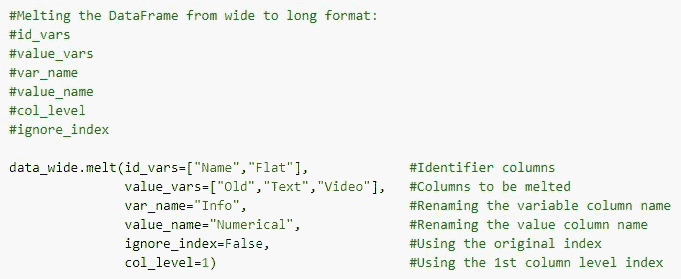

图 59: Python 代码。

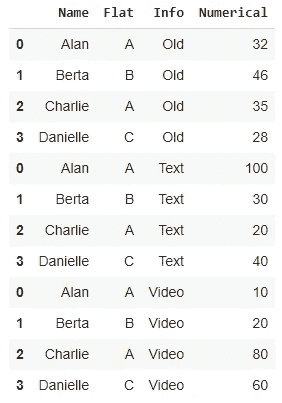

图 60: Python 代码输出。

## 结束语:

我们希望你喜欢阅读这篇文章，并了解到一些关于`pd.melt()`函数**的新东西，它允许我们重新塑造数据帧**。一如既往，请随时让我们知道你的想法。感谢您的阅读！

给普拉蒂克买杯咖啡！

**免责声明:**本文所表达的观点仅代表作者个人观点，不代表与作者(直接或间接)相关的任何公司的观点。这项工作并不打算成为最终产品，而是当前思想的反映，同时也是讨论和改进的催化剂。

**除非另有说明，所有图片均来自作者。**

通过 [**向 AI**](https://towardsai.net/) 发布

## 参考资料和资源:

 [## 了解熊猫融化——谷歌合作实验室

colab.research.google.com](https://colab.research.google.com/drive/1Anc3ydboAyrxxVycP0wtMYbDCvSWDSpN?usp=sharing) 

[**Github 资源库**](https://github.com/towardsai/tutorials/blob/master/pandas/pd-melt.py) 。

[**熊猫文献—熊猫融化**](https://pandas.pydata.org/docs/reference/api/pandas.melt.html)

 [## 店铺↓ |走向 AI

### 发布最好的技术、科学和工程|社论→https://towardsai.net/p/editorial |订阅→…

ws.towardsai.net](https://ws.towardsai.net/shop)  [## 加入我们吧↓ |面向人工智能成员|数据驱动的社区

### 加入人工智能，成为会员，你将不仅支持人工智能，但你将有机会…

members.towardsai.net](https://members.towardsai.net/)  [## 赞助商|了解如何成为《走向人工智能》的赞助商

### 无论你是想以一种吸引读者的方式突出你的产品，吸引高度相关的利基受众，还是…

sponsors.towardsai.net](https://sponsors.towardsai.net/)