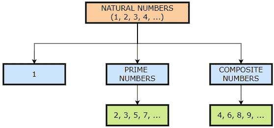
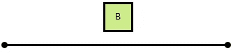
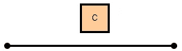
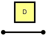
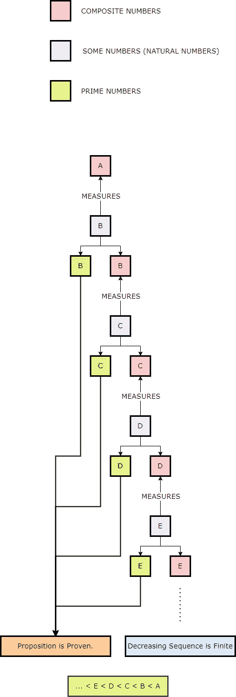

# 理解欧几里得的证明— 101

> 原文：<https://pub.towardsai.net/understanding-proofs-by-euclid-101-1dfe900e435f?source=collection_archive---------1----------------------->

## [数学](https://towardsai.net/p/category/mathematics)

## 任何合数都是由某个质数来度量的。

由[乔安娜·科辛斯卡](https://unsplash.com/@joannakosinska?utm_source=unsplash&utm_medium=referral&utm_content=creditCopyText)在 [Unsplash](https://unsplash.com/s/photos/old-books?utm_source=unsplash&utm_medium=referral&utm_content=creditCopyText) 上拍摄的照片

**作者:** [普拉蒂克·舒克拉](https://www.linkedin.com/in/pratik-shukla28/)

在这一系列文章中，我们要了解希腊数学家[欧几里德](https://en.wikipedia.org/wiki/Euclid)对一些著名定理和命题的证明。这里我们要去理解欧几里德本人在他那个时代所提供的证明。还有其他方法可以证明一个定理，但我们认为最好是从头开始。这些命题在他的著作《欧几里得的几何原本》中有所提及。

在进入命题的证明之前，我们先了解一些与之相关的基本术语。

**每个正数不是合数就是质数或者单位数(1)。**

图 1:数字的分类

## 什么是自然数？

*   自然数是那些用于计数的数字。
*   它包含了所有的*正整数。*
*   *例子:1，2，3，…*

## *什么是质数？*

*   *质数是大于一的自然数，而不是两个较小自然数的乘积。*
*   *一个素数是一个只有两个约数的正整数:1 和它自己。*
*   *请注意， ***质数是⊂自然数。****
*   *例子:2，3，5，7，…*

## *什么是合数？*

*   *合数是一个可以由两个较小的正整数相乘得到的正整数。*
*   *合数是一个正整数，它至少有一个除数不是 1 和它本身。*
*   *请注意***⊂自然数的合成数。****
*   *例子:4，6，8，…*

## *术语“衡量标准”是什么意思？*

*当我们说 ***b 测度* a** 时，那么就意味着 a 能被 b 整除，换句话说，我们可以说 a/b 的结果是一个整数。换一种说法，我们也可以说，如果用 b 来度量 a，那么 a 可以被 b 整除。*

***例子:***

*   *2 措施 6。*
*   *3 措施 9。*
*   *16 措施 64。*

## *一个重要定义:*

*合数是由某个数来度量的数。*

## *使用未声明的原则:*

*任何递减的数列都是有限的。*

*现在，让我们开始讨论这个命题及其证明。*

## *命题:*

*任何合数都是由某个质数来度量的。*

## *目标:*

*我们的目标是证明这样一个命题，即任何合数都由某个质数来度量。*

## *证明:*

*   *在这个证明中，我们将每个数字表示为一条直线。线的长度代表它的价值。线越长，数字越高。*
*   *设 A 是一个合数。*

**

*图 2:合成数字 A*

*   *目标是证明 A 是由某个质数度量的。*
*   *根据[定义](#a671)，我们可以说，既然 A 是一个合数，那么某个数 B 可以度量它。由于 B 在测量 A，很明显 B≤A。现在，忽略 B=A 的情况。因此，留给我们条件 B < A。*
*   *在这个证明中，我们忽略了 B=A 的情况，背后的原因是如果 B=A 那么 A/B 会给我们 1。但是，在这一点上，1 在命题的推导中对我们没有任何用处，因为它既不是合数，也不是质数。*
*   *简而言之，对于下一个数字，我们只考虑严格小于当前数字的数字。*

**

*图 3:自然数 B*

*   *现在，如果 B 是一个质数，那么我们的命题被证明。*
*   *但是，如果 B 是一个合数，那么某个数 C 测量它。这里，C < B < A。*

**

*图 4:自然数 C*

*   *现在，注意因为 C 度量 B and B 度量 A，我们可以说 C 度量 A*
*   *接下来，如果 C 是素数，那么[我们的命题](#a461)被证明。*
*   *但是，如果 C 是一个合数，那么[某个数测量它](#a671)。*
*   *这里注意 C*

******

***图 5:自然数 D***

*   ***现在，这个研究继续这样下去，然后会发现一些素数，它测量它之前的数，这也将测量 a。***
*   ***如果找不到质数，那么一个无穷数列测量出数字 A， ***中的每一个都小于另一个* rs** ，这在数字中是不可能的，因为[任何递减的数列总是有限的](#be94)。这里我们有一个自然数的递减序列(1，2，3，…)。***
*   ***另外，请注意，质数的最小可能值(2)小于合数的最小可能值(4)。所以，当我们继续减少这个数字时，我们总会找到一个度量合数的质数。例如，如果我们得到一个合数(4)，那么就有一个素数(2)来度量它。***

***整个过程可以通过下图来理解。***

******

***图 6:证明的简单解释***

******

***我们希望你喜欢阅读这个证明，并从中学习一些新的东西。如果您有任何建议或问题，请随时添加评论。**快乐学习！*****

## ***参考资料:***

1.  ***[http://aleph 0 . clarku . edu/~ djoyce/Java/elements/elements . html](http://aleph0.clarku.edu/~djoyce/java/elements/elements.html)***
2.  ***[http://aleph 0 . clarku . edu/~ djoyce/Java/elements/book VII/prop VII 31 . html](http://aleph0.clarku.edu/~djoyce/java/elements/bookVII/propVII31.html)***
3.  ***[http://aleph 0 . clarku . edu/~ djoyce/Java/elements/book VII/def VII 11 . html](http://aleph0.clarku.edu/~djoyce/java/elements/bookVII/defVII11.html)***