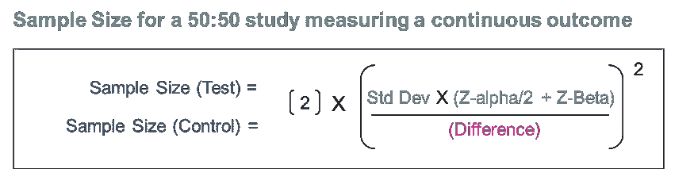
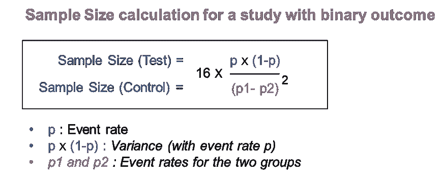

# 了解样本量！

> 原文：<https://pub.towardsai.net/understanding-sample-sizes-3a143b563d69?source=collection_archive---------2----------------------->

熟悉与样本大小相关的所有事情，这是建立有效的测试控制研究和 AB 测试框架的先决条件。

由[亚历克斯·康德拉蒂耶夫](https://unsplash.com/@alexkondratiev?utm_source=medium&utm_medium=referral)在 [Unsplash](https://unsplash.com?utm_source=medium&utm_medium=referral) 上拍摄的照片

AB 测试或测试控制分析是一个非常基本的分析工具，世界各地的数据科学家和分析师使用它来为业务决策提供信息。市场公认的评估任何干预影响的最佳方法是进行 AB 测试(或测试控制分析)。

干预— *任何能引起变化的活动。*

> *AB 测试(或测试控制分析)的前提是* ***你暴露了你的主题的某一部分****(~用户、客户、地区等。)来干预* ***阻止一定数量的单位*** *暴露出来。*
> 
> *→* ***比较*** *这两组被试的* ***行为后的干预*** *可以帮助我们了解* ***干预*** *的真实影响。*

*请注意 AB 测试和测试-控制分析是一回事，因为两者都有两组受试者，我们在干预后进行比较:
-AB 测试情况下的 A 和 B，以及
-测试-控制分析情况下的测试和控制组。*

一个重要的问题是，我的测试和控制组(或者 A 和 B 组)的规模应该是多少，这样我的分析才是可靠的。
**→即我的研究样本量应该是多少？**

测试组和对照组的样本量取决于以下因素。

> **研究的总样本量=样本量(测试)+样本量(对照)**

# 促成因素。

研究的样本量取决于以下因素:

## 1.研究的预期显著性水平:

我们可能犯的一个常见错误是:基于研究的观察**得出两组之间有差异的结论，而实际上没有** →也就是说，我们**可以拒绝一个真正的零假设**(没有差异)。

> 这个误差被称为**第一类误差(α)**。
> → *我们得到的是***假称一个* ***正差*** *，因此又叫得出一个* ***假称*** *的结论。**

*Alpha 是一种概率，表示错误拒绝零假设并获得假阳性结果的可能性。
**显著性**代表不犯第一类错误的几率，即**代表对我们结论的置信度**。
*显著性级别是 Alpha 的补码:* ***显著性= 1- Alpha****

*阿尔法值通常固定在 0.05，这意味着作为研究人员，你希望有 5%的机会得出假阳性结论。如果我们将 Alpha 保持在 5%，那么显著性就变成了 95%。*

*—我们希望的**越精确或越有信心的**，我们应该保持我们的阿尔法水平越低，因此，**我们的显著性水平**越高(即假阳性的机会越低)。我们越想自信，就需要越大的样本来作为我们结论的基础。*

**→* ***样本量与期望的显著性成正比。****

## *2.研究所需的功效等级:*

*我们可能犯的另一个常见错误是，我们可以**得出两个群体之间没有区别的结论，而实际上是有区别的。
→** 也就是说，我们**错误地接受了零假设** H0(表示没有差异)。这被称为**II 型误差(beta)** 。*

> *这个误差被称为**一个 II 型误差(beta)** 。
> → *我们是* ***假报*** *自称* ***无差*** *，故称* ***假报*** *。**

*β代表犯第二类错误和得到假阴性结论的可能性。测试的**功效**指的是**利用基于人口样本(真阳性)的测试获得人口中实际存在的效应的能力**。
*幂是β的补数:* ***幂= 1-β****。**

**Beta 通常固定在 0.20，*这意味着作为一名研究人员，你希望有< 20%的机会得出假阴性结论。 *如果我们将 Alpha 保持在 20%，那么测试的功效就变成了 80%。**

*—我们希望**研究具有高功效**，即**避免假阴性和检测真阳性的高几率。** *测试所需的功率越高，所需的样本就越大。**

**→* ***样本量与测试的期望功效成正比。****

**要了解更多关于测试的重要性和功效，请参考我的文章《了解假设检验中的第一类和第二类错误:**

* [## 理解假设检验中的第一类和第二类错误

### 深入了解支持统计假设检验的概念——一个非常相关的框架…

pub.towardsai.net](/understanding-type-i-and-type-ii-errors-in-hypothesis-testing-956999e60e17) 

## 3.要测量的预期效果大小:

考虑下面的例子，我们正在比较两组人的身高差异。

*一切事物保持不变，直觉上说:*

*   *要比较婴儿和成人的身高差异，我们只需要在少数情况下观察就能得出差异显著的结论。鉴于，*
*   为了比较 8 岁和 10 岁孩子的身高差异，我们需要在很多人身上进行观察，才能得出有意义的结论。

如果两组之间的**差异巨大** *(就像上面婴儿和成人的场景)* 你需要观察它**更少的次数**才能自信。然而，如果**的差异很小** *(就像上面 8 岁和 10 岁的场景)*，那么你需要观察它**很多次**才能自信地得出结论。

*→* ***样本大小与要检测的效果成反比。***

> ****感兴趣的最小效应*** *是您希望能够检测到的被研究组之间的最小差异。**

*   *对于**连续结果变量**，最小临床相关差异为**数值差异**。
    *例如，如果一个品牌的花费是干预的结果，你可以选择每个购物者 5 的差异作为组间的最小可检测差异。**
*   *在具有**二元结果**的试验中，例如，是否有人点击；或者注册与否，您应该估计测试组和对照组的 **事件发生率**之间的相关**差异，并且可以选择。
    *例如，治疗组和对照组之间 5%的差异作为最小可检测差异。****

*由于样本量与预期差异的平方成反比，因此即使预期差异在治疗中有很小的变化，也会对估计的样本量产生重大影响。*

## *4.感兴趣的指标的变化:*

*研究所需的样本量还取决于我们在指标中观察到多少变化，我们希望从中发现差异。*

*   *如果在我们的人群中感兴趣的度量有较少的可变性，我们可以基于较少数量的观察更有信心。
    ***可变性更小→精度更高→对更小样本的信心****
*   *然而，如果有大量的可变性，这意味着我们需要大量的数据点才能更有把握。
    ***可变性更大→精度更低→小样本可信度更低→需要更大样本****

**→* ***样本大小与感兴趣的度量的变化成正比。****

*请注意，上述所有因素都会影响测试组和对照组的规模。进而影响研究的样本量。回想一下:
***研究的总样本量=样本量(试验)+样本量(对照)****

**影响研究样本量的下一个因素是用于分析的测试组和对照组的相对规模。请看下面:**

## *5.测试:控制受众的划分:*

*当我们有两个大小不同的组时，在较大的组中观察到变化的可能性比在较小的组中更大— *这仅仅是因为由于单位数量较大，偏离平均值的可能性更大。**

*两组中的**相同数量的分析单位**确保了在两组中没有观察到差异变化的潜在原因，因此**少了一个导致错误结论**的因素 *(即两组的大小不同)* **。***

> **分裂观众* ***50:50 是一个理想的测试和控制*** *分析**

*实际上，事情并不那么简单。在一些研究中，很容易做到 50:50 的分割，而在另一些研究中**由于没有向大部分观众** *(即 50%的对照组)*展示**干预，因此存在机会成本损失**。
*例如，考虑展示脸书广告的情况，没有展示给 50%的群体意味着没有接触到该受众，这意味着脸书由于没有展示这 50%的受众而错过了创收机会。**

> **→在***之间的权衡是* ***最小化机会成本损失*** *并且仍然能够* ***适当地设置/设计研究*** *以便稍后做一个* ***稳健分析*** *。***

**保持所有**其他因素不变**，由于**我们偏离了等规模组** *(即从 50:50 到 60:40 到 90:10 为测试:控制)*，**一个组的样本量相对于另一个组**急剧增加。**

**例如，让我们假设在 95%的显著性下，80%的功率和检测到的差异为 5；我们可以做一个 50:50 的研究，需要 200 人做试验，200 人做对照。*(观众人数=测试+控制=200+200=400)***

*   **如果我们转向 80:20(测试:控制)研究，即我们希望保持 20%的总观众作为控制。保持一切不变，我们将需要 500 人进行测试，125 人进行控制。
    *(观众人数=测试+控制=500+125=625)***
*   **如果我们转向 90:10(测试:控制)研究，即我们希望保持 10%的总观众作为控制。保持一切不变，我们将需要 1000 人进行测试，111 人进行控制。
    *(观众人数=测试+控制= 1000+111 = 1111)***

***所有其他因素保持不变，当该比率为 1 时，研究的样本量最小，即当样本量(测试)=样本量(对照)***

*****→研究的样本量与试验中试验:对照的比例成正比。****** 

# **样本量计算。**

****研究的总样本量=样本量(测试)+样本量(对照)****

****

**样本大小计算(图片由作者提供)**

**请注意**最常用的α值为 95 %,β值为 20%** ,分别对应于 Z-α/2 和 Z-β的 **1.96 和 0.84。****

***在* ***50:50 的情况下进行*** *的研究，即同规模试验和对照；我们有..***

****

**样本大小计算(图片由作者提供)**

**请注意，在**二元结果**的情况下，上述公式成立。
****事件率*** *(例如点击率=点击次数/总曝光次数)成为我们的***。*****

*   *****可检测差异**将成为测试和控制的预期事件发生率的**差异。*****
*   *****方差**将由 **p X (1-p)** *(其中，p —事件率)*表示***

***对于一项 50:50 的二元研究，r=1，α= 5%，β= 20%，我们可以将 Z-α/2 = 1.96 和 Z-β= 0.842 代入上述等式，得到下图 4 中的样本量计算公式。***

***你可能以前也遇到过，请注意，它是从上面的通用公式推导出来的。***

******

***样本大小计算(图片由作者提供)***

# ***摘要***

***研究的样本量包括“测试”组和“控制”组。研究的样本量因以下因素而异:***

*   *****与期望的**显著性水平**成正比。*****
*   *****与期望的**功率水平成正比**。*****
*   *****与要测量的度量**中的**变化成正比**。***
*   *****与需要测量的**效果大小成反比的****。***
*   *****与**成正比**测试组和对照组**的相对大小。***