# 使用 Python 理解语义分析— NLP

> 原文：<https://pub.towardsai.net/understanding-semantic-analysis-using-python-nlp-f48016422677?source=collection_archive---------0----------------------->


来源:图片由 Jr Korpa 在 [Unsplash](https://unsplash.com/photos/JXb5j1vdWSI) 上拍摄

## [自然语言处理](https://towardsai.net/p/category/nlp)、[编辑](https://towardsai.net/p/category/editorial)、[编程](https://towardsai.net/p/category/programming)

## 机器如何理解我们的语言？本教程深入语义分析，这是自然语言处理(NLP)的一个重要领域

**作者:** [达克什·特雷汉](https://www.linkedin.com/in/dakshtrehan/)，[罗伯特·伊里翁多](https://mktg.best/vguzs)

[](https://members.towardsai.net/) [## 加入我们吧↓ |面向人工智能成员|数据驱动的社区

### 向着 AI 加入。通过成为会员，你不仅将支持人工智能，但你将有机会…

members.towardsai.net](https://members.towardsai.net/) 

我们生活在一个越来越依赖机器的世界。无论是 Siri、Alexa，还是 Google，都可以理解人类语言(大部分)。但是他们是怎么做到的呢？今天我们将探索 NLP(自然语言处理)的一些最新发展如何使我们更容易处理和分析文本。

计算机能理解人类语言并对其做出反应吗？计算机科学中最基本的问题之一。人类已经讨论这个话题很多个世纪了:机器能“思考”吗？它们能“感觉”吗？我们离创造一台会思考的机器还有多远？

对我们许多人来说，机器和计算机是一个谜。他们做我们编程让他们做的事情，但他们不断学习和适应(这在某些情况下很可怕)。计算机和人工智能的一个迷人之处是它们如何理解人类语言。它们是怎么变得如此明亮的？就此而言，是什么让我们的语言如此聪明，可以用这么少的词表达这么多的意思？如果我们想要人类和计算机之间的无缝通信，理解这些概念是至关重要的。本文将概述语义分析是如何工作的，并概述使用最基本的 NLP 技术之一构建 NLP 相关系统的 Python 基础:**语义分析。**

自然语言处理已经存在了几十年。作为一名开发人员，看到机器如何将许多单词转化为有意义的数据令人着迷。那就是把我们日常使用的东西，语言，转化成可以有多种用途的东西。让我们看一些例子，看看这个过程是什么样子的，以及我们如何在日常生活中使用它。

我们之前发布过一个关于使用 Python 进行 [**自然语言处理的深度教程。这一次，我们想更详细地探索语义分析，并解释解决我们问题的算法实际上是怎么回事。本教程的配套资源可在**](https://news.towardsai.net/nlp)**[**【Github】**](https://github.com/towardsai/tutorials/tree/master/natural_language_processing/semantic-analysis.py)**上获得，其完整实现也可在**[**Google Colab**](https://colab.research.google.com/drive/1Fv70ma1zVWHDKMg-158FpMkMAhlpjJP-?usp=sharing)**上获得。********

**[](/state-of-the-art-data-labeling-with-a-true-ai-powered-data-management-platform-18d973f7af78) [## 通过真正的人工智能数据管理平台实现最先进的数据标签

### 深入了解大型非结构化数据集的数据标注工作流的真正一流自动化

pub.towardsai.net](/state-of-the-art-data-labeling-with-a-true-ai-powered-data-management-platform-18d973f7af78) 

# 什么是自然语言，它是如何帮助机器理解文本的？

专家将自然语言定义为我们与同伴交流的方式。从语音到文本，都是自然语言的一部分。环顾四周，我们会得到成千上万的自然语言的例子，从报纸到最好的朋友不想要的建议。

对于一台机器来说，处理自然语言是棘手的，因为它的规则杂乱无章，没有定义。想象一下，一个孩子如何花费数年的教育来学习和理解语言，我们期望机器在几秒钟内理解它。为了处理这类文本数据，我们使用了 [**自然语言处理**](https://news.towardsai.net/nlp) ，它负责使用自然语言进行人机交互。

机器学习算法大多基于统计，处理数字和数字，这是自然语言的真正挑战。为了让机器使用自然语言理解我们的动机，我们需要将我们的文本数据转换为机器可以理解的形式，即本例中的数字。我们的文本模型提出的另一个挑战是如何让我们的模型理解我们的动机。正如我们所讨论的，自然语言规则是混乱和松散的，将我们的想法转移到使用自然语言处理的机器上是一项有点困难的任务。因此，为了简化这一过程，我们提出了一套预定义的规则:

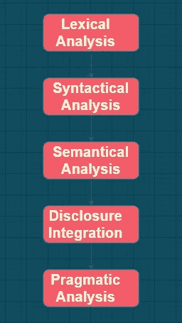

图 1:自然语言处理分析的类型。

**词法分析:**涉及到分析单词的结构，即将文本的组块分解成段落、句子、单词。

两种最流行的技术是:

*   *词汇化*:在这种情况下，我们需要之前的词性，基于这个词性我们将下一个单词转换成它的词根形式。

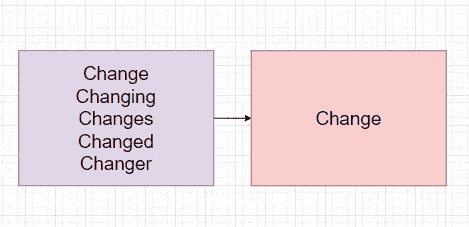

图 2:词汇化的一个例子。

*   *词干化*:这是一种没有任何上下文的基于规则的单词和作品的转换，以获得通用形式。

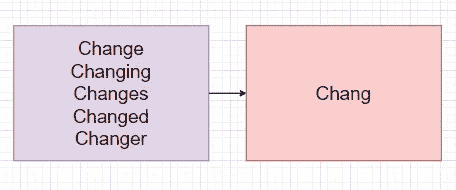

图 3:词干提取的一个例子。

**句法分析:**动机是检查句子的语法句法。例如，“一个男孩是他。”解析器会拒绝这个句子，因为单词被打乱了。即使这个句子产生了正确的意思，语法结构还是有缺陷的。

句法分析包括分析单词之间的语法关系和检查它们在句子中的排列。词性标注和依存语法在这一步起着不可或缺的作用。

**语义分析:**这一步负责通过将单词级别的含义连接在一起，生成句子的可能含义。它有助于识别文本元素并找到它们的逻辑意义。

例如，“多彩的红色”可能看起来在语法上是正确的，但是在逻辑上是不相关的，因此语义分析器将丢弃它。

**揭示整合**:聚焦上一条和下一条语句，生成当前语句的含义。它遵循有组织的基于规则的方法。

例句:“汤姆因为超速行驶遇到了车祸。”使用这个句子，我们可以得出结论，汤姆遇到了事故，这是他的错，但如果我们删除一些短语或只考虑几个短语，意思可能会改变。

**语用分析**:有助于揭示文本中额外的无向意义，需要广泛的世界知识和语境理解。

例如，“银行拒绝给他们贷款，因为他们没有良好的信用记录。”

"银行拒绝贷款给他们，因为他们担心他们不会偿还."

两个句子中“他们”的意思完全不同，为了搞清楚这种区别，我们需要世界知识和造句的语境。

# 什么是语义分析？

语义分析可以被称为从文本中寻找意义的过程。文本是交流不可或缺的一部分，理解文本传达的内容是必要的，这也是必要的。作为人类，我们在理解语言方面花费了多年的训练，所以这不是一个乏味的过程。但是，机器需要一套预定义的规则。

语义分析是我们期望机器从文本中提取逻辑意义的技术。它允许计算机解释语言结构和语法格式，识别单词之间的关系，从而创造意义。

它消化逻辑结构，并试图确定文本中的最佳元素和不同概念之间的关系。例如，模型可以容易地理解关于“足球”的文本的概念，即使它不包含实际的单词，而是包含诸如“梅西”、“罗纳尔多”、“意甲”、“BRFootball”的相关文本

它是许多机器学习用例背后的驱动力，如聊天机器人、搜索引擎、基于 NLP 的云服务。由于语义分析有助于理解句子背后的真实含义，因此它被信息巨头广泛用于从电子邮件、推文、支持票、评论等非结构化数据中提取有意义的信息，从而采取措施改善反馈，从而潜在地了解客户对组织的看法。** 

# **语义分析是如何工作的？**

**词汇语义是语义分析的重要组成部分，它允许机器学习词汇项之间的关系:**

*   ****上位词**:它概括了概念(上位词)，比如菲亚特是 Car 的上位词(上位词)。**
*   ****一词多义**是指不同的单词和短语之间存在某种关联，即一个短语有不同的意思。例如，“混合”也可以写成“交织”、“网状”、“混合”、“组合”**
*   ****:可以定义为短语的一个组成部分。例如，“芒果”被认为是“芒果树”的部分术语****
*   ****同义词:这些词表达了与另一个词相同的意思。例如，不开心、担心、焦虑、紧张****
*   ****反义词:这些词表达了完全相反的意思。例如快乐、悲伤****
*   ******同音异义词**:这些词听起来一样，但意思不同。例如橙色(水果)、橙色(颜色)****

****除了这些种类的单词，语义分析还考虑了各种符号和单词的搭配。****

## ****关系抽取****

****这个过程包括确定两个或多个实体之间的关系。这些实体通常通过语义类别连接在一起，例如“为”“住在”“总部在”****

****例如，“梅西效力于总部位于西班牙、居住在阿根廷的巴塞罗那俱乐部。”****

****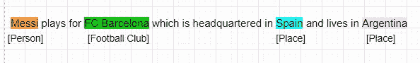****

****图 4:关系提取的一个例子。****

## ****词义消歧****

****这有助于理解如何使用单词/短语来获得逻辑和真实的含义。****

****例如，树皮可以被称为狗的声音和树的外部。****

****类似地，蝙蝠可以被称为蝙蝠-爬行动物或用于板球的蝙蝠。****

********

****图 5:展示我们词义消歧的图像。****

****自然语言是模棱两可的，很多时候，确切的词可以根据如何使用来传达不同的意思。****

> ****语义——自然语言中的单词和句子有独立的含义吗？****

****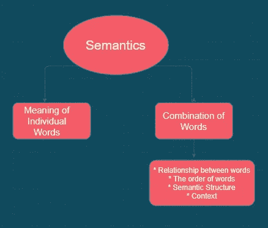****

****图 6:自然语言中的不同含义。****

## ****个别单词的含义:****

****这个术语就是上面讨论的词法分析。****

## ****单词组合:****

****这种技术讲述了单词连接在一起形成句子/短语时的含义。****

****“单词组合”还取决于其他几个因素:****

*   ****单词之间的关系。****
*   ****单词的顺序****
*   ****语义结构****
*   ****语境****

****如“ ***我喜欢你*** ”和“ ***你喜欢我*** ”都是确切的词，但逻辑上，它们的意思是不同的。****

********

****图 7:单词组合的例子。****

****获得单个单词的含义是有帮助的，但是由于自然语言中的歧义，这并不能证明我们的分析是正确的。要获得句子背后的最终逻辑，还必须考虑其他几个因素。****

****正如上面例子中所讨论的，单词的语言意义在两个句子中是相同的，但在逻辑上，两者是不同的，因为语法是重要的部分，句子的构成和结构也是重要的部分。****

> ****单个单词的意思+单词的组合****
> 
> ****= >语义分析****

# ****语义分析方法****

## ****一阶谓词逻辑****

****它将句子转换成逻辑形式，从而在它们之间建立一种关系。是对命题逻辑的推进。****

****一阶谓词逻辑的基本元素是:****

****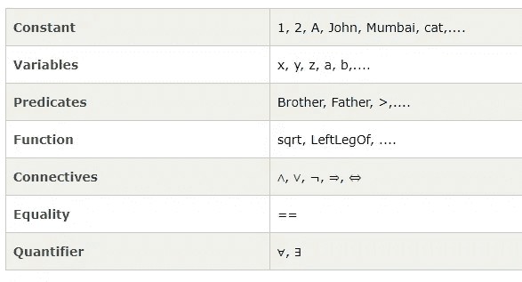****

****图 8:一阶谓词逻辑元素。****

****一阶谓词逻辑方法的工作原理是找到一个主语和谓语，然后使用量词，它试图确定两者之间的关系。****

****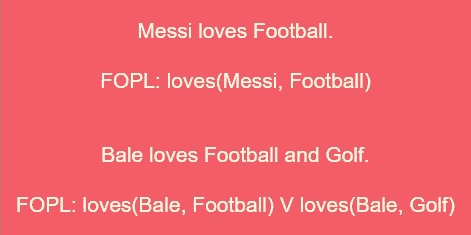****

****图 9:FOPL 的一个例子。****

## ****语义网****

****在语义网中，我们试图用图形网络的形式来说明知识。网络由表示对象和弧的节点组成，并试图定义它们之间的关系。语义网最重要的亮点之一是它的长度是灵活的，可以很容易地扩展。****

****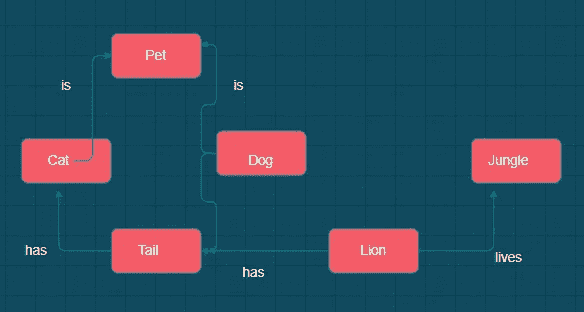****

****图 10:语义网的一个例子。****

## ****格语法****

****这是另一种知识表示方法，我们试图分析句子中的结构语法。****

****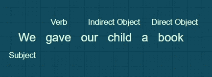****

****图 11:知识表示的一个例子。****

# ****语义分析技术****

****语义分析方法可以大致分为两类:****

****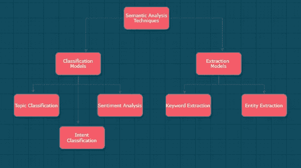****

****图 12:语义分析技术。****

## ****分类模型:****

****当我们想要以预定义的方式对文本进行分类时，我们使用它。****

*   ******主题分类:**当我们想要将我们的文本分类到预定义的主题中时使用。例如，将支持票据分类为“支付问题”、“一般问题”、“有账户的问题”****
*   ******情感分析:**用于检测文本中的情感。例如，购物网站使用这种技术将评论分类为正面的、负面的、中性的。****
*   ******意图分类:**有助于对我们的文本进行分类，了解客户的未来意图。例如，如果一个人按下“取消订阅”，这表示该人对该产品/品牌最不感兴趣。****

## ****提取模型:****

****当我们的动机是从文本中获取特定信息时，我们使用这些技术。****

*   ******关键词提取:**用于提取包含任何特定关键词的文本。这可以与上述分类方法一起使用，以获得精确的输出。例如，它将识别所有带有特定关键字的推文，然后应用情感分析来了解社会对某个问题的观点。****
*   ******实体提取:**当我们希望在文本中找到命名实体时，就使用这种技术。例如，对于招聘团队，从简历中自动提取姓名、地址和技能可能是一个很好的功能。****

# ****为什么语义分析在自然语言处理中至关重要？****

****时代变了，我们处理信息和分享知识的方式也变了。我们过去常写信的日子一去不复返了。现在一切都在网上，搜索一个查询，就能得到解决方案。****

****与 90 年代初相比，网络的海洋是如此广阔，不幸的是，它侵犯了我们的隐私。我们在网上与朋友交谈，评论一些产品，谷歌一些查询，评论一些模因，为我们的产品创建一张支持票，在一个最喜欢的子网站上抱怨任何话题，并在推特上发布关于任何政党的负面消息。信息巨头追踪一切。追踪到的信息将通过语义解析器，从而提取关于我们的选择和兴趣的有价值的信息，这进一步有助于为他们创建个性化的广告策略。****

********

****由[托尔加·阿赫梅特勒](https://unsplash.com/@t_ahmetler?utm_source=medium&utm_medium=referral)在 [Unsplash](https://unsplash.com?utm_source=medium&utm_medium=referral) 拍摄的照片****

****更好的个性化广告意味着我们会点击广告/推荐，并显示我们对产品的兴趣，我们可能会购买它或进一步推荐给其他人。我们的利益将帮助广告商盈利，并间接帮助信息巨头、社交媒体平台和其他广告垄断企业盈利。****

> ******“如果你不为产品付费，那么你就是产品**”~特里斯坦·哈里斯****

## ****有哪些语义分析的例子？****

****语义分析的结果对组织至关重要。当某人搜索“Puma”时，它可能是****

********

****照片由[胯踢](https://unsplash.com/@hipkicks?utm_source=medium&utm_medium=referral)在 [Unsplash](https://unsplash.com?utm_source=medium&utm_medium=referral) 上****

****或者，它可能是美洲狮，指的是动物。****

********

****普里西拉·杜·普里兹在 [Unsplash](https://unsplash.com?utm_source=medium&utm_medium=referral) 上的照片****

****分析中最微小的变化都可能彻底破坏用户体验，并让公司赚大钱。****

****语义分析甚至可以帮助公司追踪用户的习惯，然后根据他们生活中发生的事件向他们发送优惠券。****

****例如，超市存储用户的电话号码和账单历史，以跟踪他们的习惯和生活事件。如果用户一直购买更多与儿童相关的产品，她可能会有一个宝宝，电子商务巨头将试图通过向他们发送与婴儿产品相关的优惠券来吸引客户。****

# ****Python 实现****

*   ****导入所有需要的库。****

****图 13:导入我们需要的库。****

*   ****从 sk-learn 中提取数据集。****

****图 14:用 sk-learn 提取我们的数据集。****

****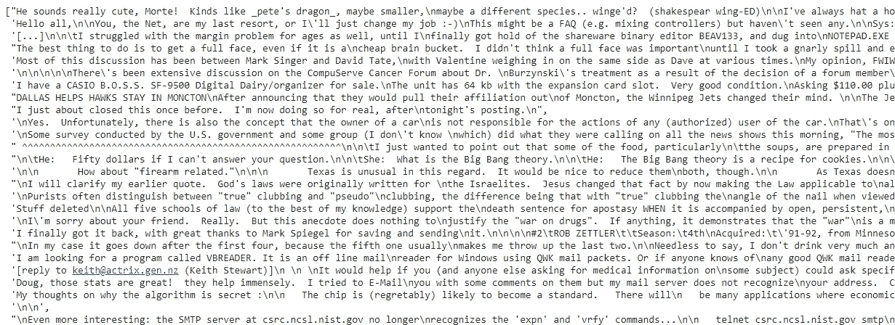****

****图 15:我们代码的输出。****

*   ****数据预处理****

****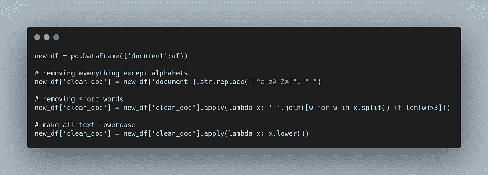****

****图 16:预处理数据。****

*   ****删除停用词****

****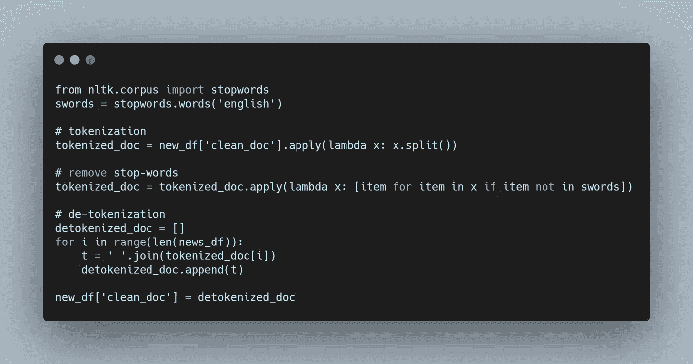****

****图 17:删除代码中的停用词。****

*   ****使用 Tf-IDf 向量对数据进行矢量化。****

****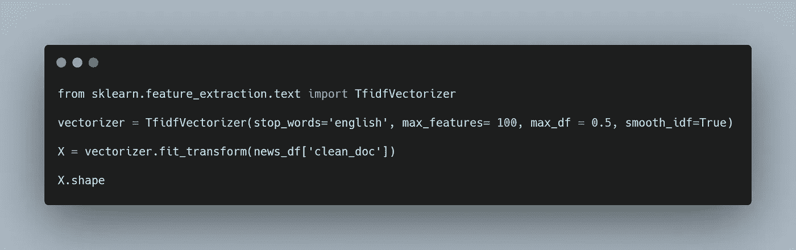****

****图 18:矢量化我们的数据。****

*   ****应用奇异值分解模型。****

****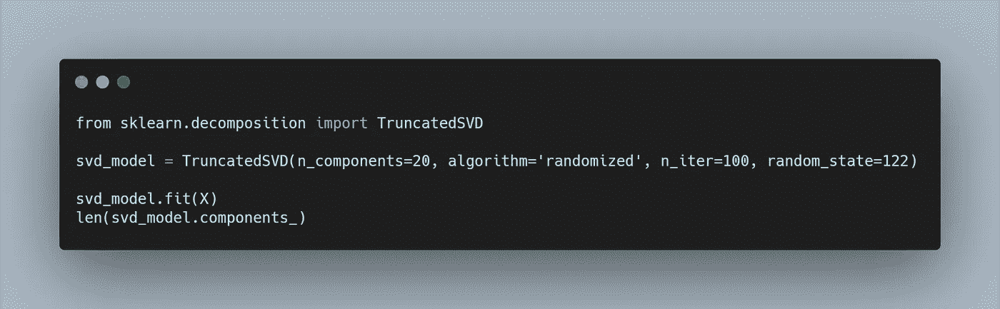****

****图 19:应用 SVD 模型。****

*   ****获得最终输出。****

****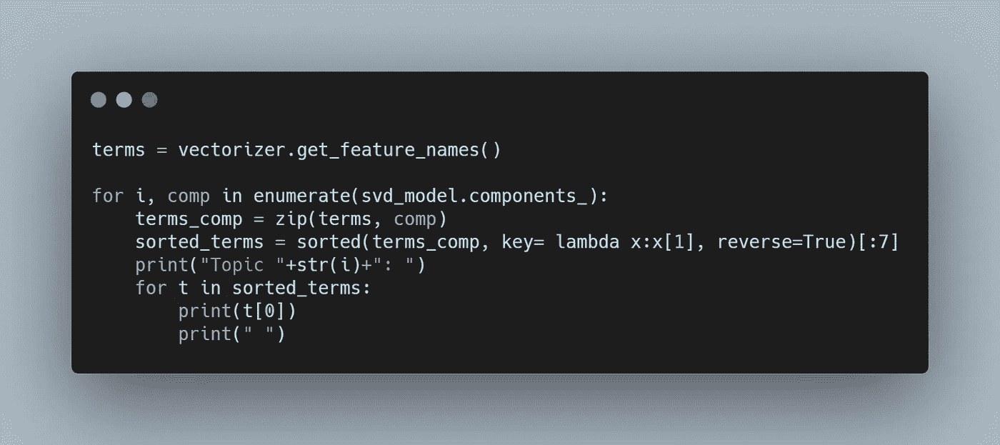****

****图 20:获得最终输出。****

****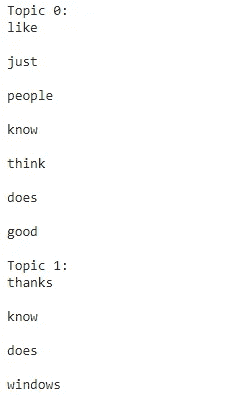****

****图 21:模型在执行主题分类，n_iter = 100。****

# ****最后的想法****

****这些是使用 Python 进行语义分析的一些基础。我们希望你喜欢阅读这篇文章，并学到一些新的东西。任何建议或反馈对于继续改进都至关重要。请在评论中告诉我们是否有任何令人困惑或需要重新审视的地方。****

# ****引用****

****对于学术背景下的归属，请引用该工作为:****

```
**Daksh Trehan, et al., “Understanding Semantic analysis using Python”, Towards AI, 2021**
```

# ****BibTex 引文:****

```
**@article{daksh_iriondo_2021, 
 title={Understanding Semantic Analysis Using Python — NLP}, 
 url={[https://news.towardsai.net/nls](http://news.towardsai.net/nls)}, 
 journal={Towards AI}, 
 publisher={Towards AI Co.}, 
 author={Trehan, Daksh and Iriondo, Roberto},  
 year={2021}, 
 month={May}
}**
```

******免责声明:**本文所表达的观点仅代表作者个人观点，不代表与作者(直接或间接)相关的任何公司的观点。这项工作并不打算成为最终产品，而是当前思想的反映，同时也是讨论和改进的催化剂。****

******除非另有说明，所有图片均来自作者。******

# ****资源****

****[](https://colab.research.google.com/drive/1Fv70ma1zVWHDKMg-158FpMkMAhlpjJP-?usp=sharing) [## 语义分析教程|谷歌合作实验室

### 编辑描述

colab.research.google.com](https://colab.research.google.com/drive/1Fv70ma1zVWHDKMg-158FpMkMAhlpjJP-?usp=sharing) [](https://github.com/towardsai/tutorials/tree/master/natural_language_processing/semantic-analysis.py) [## semantic-analysis.py/towardsai/tutorials

### AI 相关教程。免费访问其中任何一个→https://towardsai.net/editorial-toward sai/教程

github.com](https://github.com/towardsai/tutorials/tree/master/natural_language_processing/semantic-analysis.py) 

# 进一步阅读

[](https://news.mktg.best/natural-language-in-search-engine-optimization-seo-how-what-when-and-why-b390364b5d3d) [## 搜索引擎优化(SEO)中的自然语言——如何、做什么、何时以及为什么

新闻网](https://news.mktg.best/natural-language-in-search-engine-optimization-seo-how-what-when-and-why-b390364b5d3d) [](/understanding-pandas-melt-pd-melt-362954f8c125) [## 了解熊猫融化— pd.melt()

### 了解重塑 Pandas 数据框的最有效和最灵活的函数

pub.towardsai.net](/understanding-pandas-melt-pd-melt-362954f8c125) [](/natural-language-processing-nlp-with-python-tutorial-for-beginners-1f54e610a1a0) [## 使用 Python 的自然语言处理(NLP)——教程

### 自然语言处理(NLP)基础教程，包含 Python 中的示例编码实现

pub.towardsai.net](/natural-language-processing-nlp-with-python-tutorial-for-beginners-1f54e610a1a0) 

# 参考

[1] 2021.Monkeylearn.Com。[https://monkeylearn.com/blog/semantic-analysis/.](https://monkeylearn.com/blog/semantic-analysis/.)

[2]《印地语自然语言处理中的语义分析| NLP 系列》。2021.Youtube.Com。https://www.youtube.com/watch?v=W7QdqCrX_mY.

[3] [使用 Python 的潜在语义分析— DataCamp](https://www.datacamp.com/community/tutorials/discovering-hidden-topics-python)

[4] 2021.Home.Adelphi.Edu。[https://home.adelphi.edu/~siegfried/cs372/372l8.pdf.](https://home.adelphi.edu/~siegfried/cs372/372l8.pdf.)

[5]《CSC 350 笔记——语义分析》。2021.Cs.Oswego.Edu。[http://www . cs . OS wego . edu/~ oden Dahl/coursework/CSC 350/notes/15-aa-SEM _ analysis . html](http://www.cs.oswego.edu/~odendahl/coursework/csc350/notes/15-aa-sem_analysis.html.)

[6]“LSA 是什么？”。2021.Lsa.Colorado.Edu。[http://lsa.colorado.edu/whatis.html.](http://lsa.colorado.edu/whatis.html.)

[](https://ws.towardsai.net/shop) [## 店铺↓ |走向 AI

### 发布最好的技术、科学和工程|社论→https://towardsai.net/p/editorial |订阅→…

ws.towardsai.net](https://ws.towardsai.net/shop) [](https://members.towardsai.net/) [## 加入我们吧↓ |面向人工智能成员|数据驱动的社区

### 加入人工智能，成为会员，你将不仅支持人工智能，但你将有机会…

members.towardsai.net](https://members.towardsai.net/) [](https://sponsors.towardsai.net/) [## 赞助商|了解如何成为面向人工智能的赞助商

### 无论你是想以一种吸引读者的方式突出你的产品，吸引高度相关的利基受众，还是…

sponsors.towardsai.net](https://sponsors.towardsai.net/)****