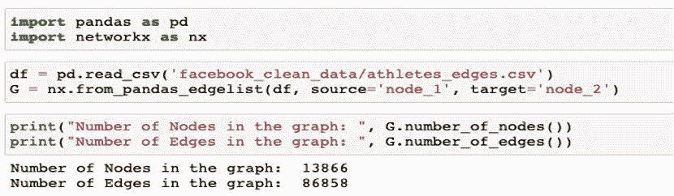
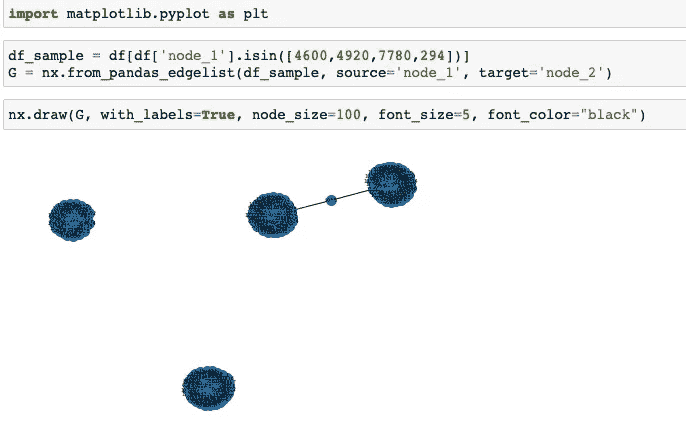
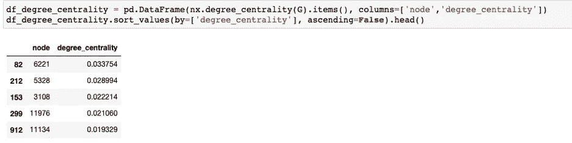
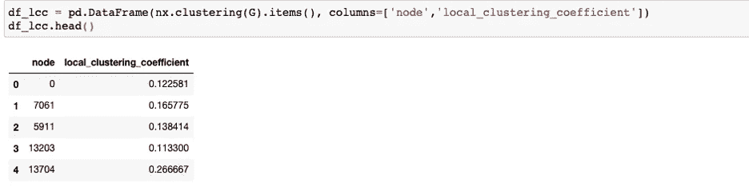
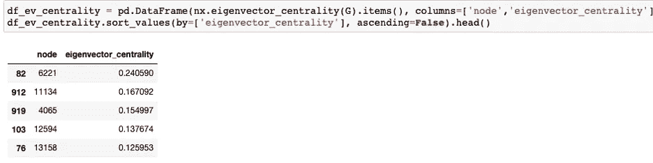

# 理解社交网络

> 原文：<https://pub.towardsai.net/understanding-social-networks-409dffc785ea?source=collection_archive---------3----------------------->

## [数据分析](https://towardsai.net/p/category/data-analysis)

当实体(例如人或组织)之间存在一组连接以及它们之间的交互(例如友谊、契约)时，社会网络就形成了。在当今世界，有许多社交网络存在——其中一个著名的是脸书的朋友网络。然而，只要我们能够在各种实体之间建立联系，我们就可以将我们周围的许多事情表示为一个社交网络或一个图表。社交网络的其他例子可以是客户写关于产品的评论——客户和产品成为网络中的节点，写关于产品的评论成为优势。在本文中，我将互换使用社交网络和图形。

**在我们进入复杂性之前，先了解一些社交网络的基础知识**

1.*节点* —这些是图形中的实体，比如人、产品、组织、服务器

2.*边缘* —这些是节点之间的连接或关系，比如两个人对同一产品写评论

3.*权重* —边的权重是连接的强度。例如:如果两个人通过 10 个共同的朋友联系在一起，那么权重是 10。

4.*单部图* —仅由一种类型的节点组成的网络

5.*多部图*——由多种类型的节点组成的网络

6.*无向图* —如果节点之间的关系没有方向，那么这个图被称为无向图。例如，两个朋友之间的关系。

7.*有向图* —如果节点之间的关系存在方向，那么这个图就被称为有向图。例如，一个实体发起与另一个实体的对话的通信网络。

**为什么分析社交网络很重要？**

1.  让我们更好地理解实体或个人之间的联系
2.  为我们提供了网络中重要实体/连接的某些度量

3.根据连接类型查找相似的实体

4.超越个人认知，基于个人/实体的联系对其进行分析

**让我们深入分析使用 Python 的社交网络分析**

为了更好地理解我们如何利用图网络，我将在开源数据集上运行分析并生成各种网络要素。

**数据来源**:快照数据集 https://snap.stanford.edu/data/gemsec-Facebook.html[脸书·杰姆塞](https://snap.stanford.edu/data/gemsec-Facebook.html)。这个数据集代表不同运动员的蓝色验证的脸书页面网络。节点代表运动员的页面，边代表运动员之间的相互喜欢。为了实现匿名，节点从 0 开始被索引。

用于社会网络分析的开源包:

可用于分析社交网络的两个非常流行的包是:

**NetworkX** : NetworkX 是一个 Python 包，用于创建、操作和研究复杂网络的结构、动态和功能。[https://networkx.org/](https://networkx.org/)

**Networkit** : NetworKit 是一个不断发展的开源工具包，用于大规模网络分析。它的目标是为分析从数千到数十亿条边的大型网络提供工具。[https://networkit.github.io/](https://networkit.github.io/)

要下载这些软件包，请在终端中运行以下命令:

pip3 安装网络 it

pip3 安装网络 x

以下是在 Jupyter Notebook 中重新创建分析的步骤:

**步骤 1** :将数据集从快照存储库中加载到 Pandas DataFrame 中，创建一个图形对象，并打印节点和边数的统计数据

**第二步**:可视化社交网络。

大型社交网络的一个特殊挑战是在屏幕上将其可视化。因此，在本文中，我们将通过选择几个具有大量连接的节点来获取数据集的样本。

在这里，我们可以看到某些节点组是不相交的，而有些节点组是通过公共节点关系连接在一起的。

**第三步**:生成社交网络的度量

*度中心性* —度中心性是在节点级别上计算的，并且测量它所具有的边的数量。度中心性值通过除以简单图 n-1 中的最大可能度来归一化，其中 n 是 g 中的节点数。

*特征向量中心性* —度中心性在节点级别计算，并测量节点对其网络的影响。

*局部聚类系数* —聚类系数是对图中节点倾向于聚集在一起的程度的度量。

**结论**

使用网络分析来了解生态系统中的联系和实体可以极大地帮助您了解实体的行为，以及这些实体在生态系统中的影响。这些网络图可以进一步划分为子图，以深入了解用户行为。还有许多其他技术，例如从这样的图中生成嵌入，并将它们作为特征提供给机器学习模型，甚至对网络嵌入进行聚类，以获得有意义的见解。

**来源**

https://snap.stanford.edu/data/gemsec-Facebook.html

【https://networkx.org/documentation/stable/index.html 

[https://networkit.github.io/](https://networkit.github.io/)

[https://en.wikipedia.org/wiki/Social_network](https://en.wikipedia.org/wiki/Social_network)