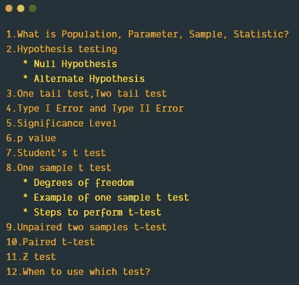
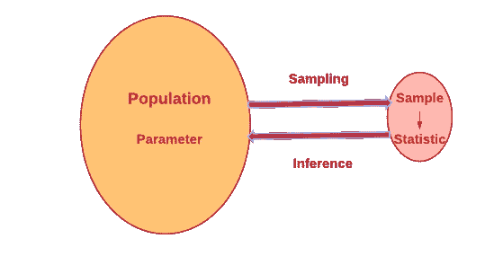
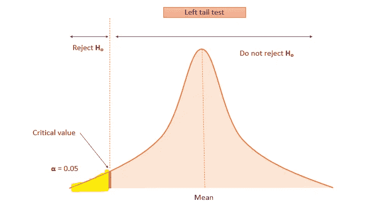
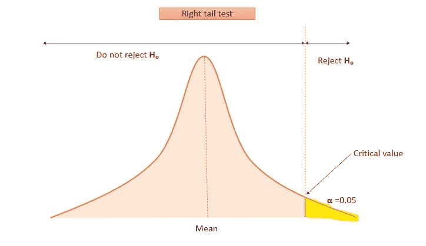
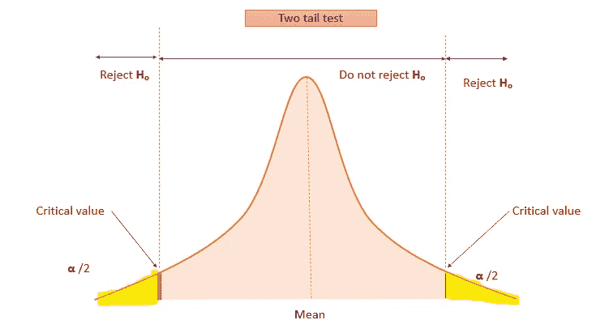
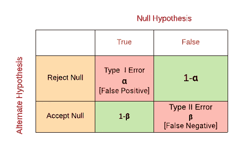
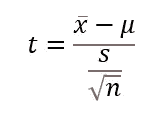
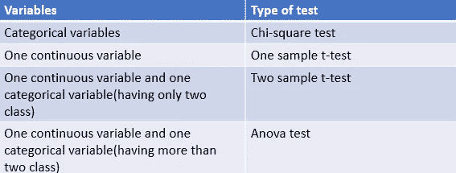

# 理解统计假设检验

> 原文：<https://pub.towardsai.net/understanding-statistical-hypothesis-testing-69c4d03c688e?source=collection_archive---------0----------------------->

## [统计数据](https://towardsai.net/p/category/statistics)

## 假设检验、p 值、t 检验类型等等

JESHOOTS.COM 在 [Unsplash](https://unsplash.com/s/photos/test?utm_source=unsplash&utm_medium=referral&utm_content=creditCopyText) 上[的照片](https://unsplash.com/@jeshoots?utm_source=unsplash&utm_medium=referral&utm_content=creditCopyText)

# 推断统计学

推断统计允许您从样本中推断总体。它用于从样本统计中估计总体参数。

假设检验是推断统计的方法之一。让我们在本文中了解一下假设检验。

# 本文涵盖的主题。

作者图片

# 什么是总体、参数、样本、统计？

**总体→** 总体是我们从中得出结论的所有可能值的集合。例如。全世界每一个患有糖尿病的人。假设我们想从这个人群中推断出一些数据，比如一个糖尿病患者的平均年龄。通常不可能测量全部人口。所以我们从人群中随机抽取一个样本。

**样本** →样本是总体的一个子集。样本是我们将从中收集数据的特定组。样本量(N)将小于从中抽取样本的总体量(N)。
例如从人群中选择一些患有糖尿病的人。

**参数** →是描述整个群体特征的数值。
例如总体平均值 **μ**

**统计** →是描述样本特征的数值。例如。样本均值 **x̄**

作者图片

# 假设检验

假设检验是为了检验基于观察和实验的假设。
假设检验的两个部分

*   零假设
*   替代假设

**零假设**
零假设总是用来接受事实/假设。它被命名为 **Hₒ**

**替代假设**
替代假设是用来反驳假设的。它被表示为 **Hₐ**

## **原假设和替代假设的例子**

假设一个零售商正在销售 32 液体盎司瓶装的苹果汁。一位顾客抱怨说，他以前买的苹果汁重量不足 32 液体盎司。

什么是赫尔假说和候补假说？

从零售商的角度来看，他有信心卖出 32 液体盎司的苹果汁。

**hₒ**t0】

另一个假设是客户投诉；少于 32 液体盎司。

**hₐ**t1】

在另一个假设中，可能有双尾检验或单尾检验。

# 单尾检验

在我们的例子中，交替假设是一个单尾测试。**hₐ**

这里我们只关注一个方面(低于平均值)。这就是所谓的左尾检验。

左尾测试[图片由作者提供]

**右尾测试**

**举例:**
**Hₒ** μ ≤32

**Hₐ** μ > 32

这里我们只关注一个方面(大于平均值)。这就是所谓的右尾检验。

右尾测试[图片由作者提供]

# 双尾检验

进行**测试**以显示样本的平均值是否显著大于和显著小于总体的平均值被认为是**双** - **尾检验**

《出埃及记》如**hₒ**T3**hₐ**

这里的替代假设是双尾的。我们正专注于双方。[小于平均值且大于平均值]

双尾测试[图片由作者提供]

# 第一类错误和第二类错误

作者图片

## **第一类错误**

**第一类错误**发生在研究者拒绝原假设为真时。当无效假设为真时，拒绝该假设的概率称为**显著性水平**。用 **α** 表示

## 显著性水平

第一类错误的最大概率称为α。在我们做任何统计测试之前，我们必须确定 **α** 值**。** 在大多数情况下，alpha 值将为 0.05。这意味着我们有 95%的信心做出了正确的决定。[从 100%中减去α水平 5%(0.05)得到置信水平]
**α** 为 0.05 意味着只有 5%的可能性，当它为真时，我们会拒绝零假设。对于医学领域的一些案例，比如测试一种新药，我们应该至少有 99%的信心。对于这种情况，alpha 值设置为 0.01。

像所有概率一样，alpha 值的范围是从 0 到 1。

## **第二类错误**

第二类错误发生在当零假设为假时，研究者未能拒绝该假设。犯第二类错误的概率称为 **β** (beta)

# p 值是多少？

p 值是指用于确定是否拒绝零假设的概率值。

研究者确定 **α** 值。如果 **α** 值设为 0.05，表示对决策有 95%的把握。[从 100%中减去 alpha 等级 5%(0.05)得到置信度]

在进行假设检验后，我们将得到一个 p 值。

如果 p≤0.05 意味着拒绝零假设。
如果 p > 0.05 表示不拒绝零假设。

# 大样本和小样本的假设检验

1.  t 检验→小样本
2.  z 检验→大样本

# “学生”t 检验

*   **威廉·希利·戈塞**开发了 t 发行版，并以笔名**“学生”发布**
*   当样本量小于或等于 30
    且总体标准差未知时，使用学生 t 检验。

# t 检验的类型

1.  单一样本 t 检验
2.  不成对双样本 t 检验
3.  配对 t 检验

# 单一样本 t 检验

*   当总体的标准差未知时，它用于检验样本均值在统计上是否不同于总体均值。
*   它用于将一个数据分布与一个固定值进行比较。
*   一个分布与假设平均值
*   测试变量应该是连续的(即区间或比率水平)

**公式:**

x̄→样本均值
μ→总体均值
n →样本量
s →样本标准差

`df= n-1`

df =自由度

## **自由度**

t-test 使用自由度。

自由度是指计算中涉及的可自由变化的值的数量。

**举例:**假设 3 个数的平均数是 6。如果 x1 =5，x2= 6，那么 x3 是多少？

x3 将是 7，不能自由变化。所以 df=2

这里 n=3，所以 df= n-1=2

## **一个样本 t 检验的例子**

一家汽车公司声称他们的新车平均时速为 31 英里。你从当地汽车经销商那里随机选择 10 辆该型号的汽车，并测试它们的里程数。然后测试这些车的实际油耗是否明显偏离 31。

## **公式**

x̄→样本均值
μ→总体均值
n →样本量
s →样本标准差

**第一步。**定义 **Hₒ** 和 **Hₐ**

零假设 **Hₒ** x̄=μ
【样本均值等于总体均值】
替代假设**hₐ**x̄**≦**μ

**第二步。**指定显著性水平 **α。**正常情况下 **α** 水平设定为 5% ( **α=0.05)**

**第 3 步:**使用以下公式计算 t 统计量

**第四步:**计算自由度
df=n-1。在本例中，样本量=10。所以 df=9。

**第五步:**解读

比较 t-临界和 t-统计

当 df =9 且 **α=0.05/2 时，从 t 表中计算出 t-critical。**

由于是双尾检验，显著性水平除以 2 以计算 t 临界值。

如果 **t** - **统计值**大于 **t** - **关键值**，则零假设被拒绝。

# 不成对双样本 t 检验

独立/不成对双样本 t 检验用于比较同一连续变量上两个不相关组的平均值。

示例:计算一个组织中女性和男性的平均工资，并比较两组的平均工资是否相同。

# 配对 t 检验

配对 t 检验比较两种不同情况下相同组的平均值。

**示例:**比较学员培训前后的考试成绩。

# z 检验

z 检验是检验假设的一种统计方法。当总体的标准差未知，且样本量大于 30 时。
2。当我们知道总体的标准差时。

# 独立性卡方检验

独立性卡方检验用于检验同一总体中两个分类变量之间的独立性。

# 何时使用哪种测试？

作者图片

# 我的另一个关于统计的博客

[数据科学的描述性统计](https://medium.com/towards-artificial-intelligence/exploring-descriptive-statistics-using-pandas-and-seaborn-1b8501e1f27f)

[数据科学的推断统计](https://medium.com/towards-artificial-intelligence/inferential-statistics-for-data-science-91cf4e0692b1)

我希望这篇文章对你有所帮助。

请关注此空间，了解更多关于 Python 和数据科学的文章。如果你喜欢看我的更多教程，就关注我的 [***中***](https://medium.com/@IndhumathyChelliah)[***LinkedIn***](https://www.linkedin.com/in/indhumathy-chelliah/)*[***Twitter***](https://twitter.com/IndhuChelliah)***。****

*感谢阅读！*