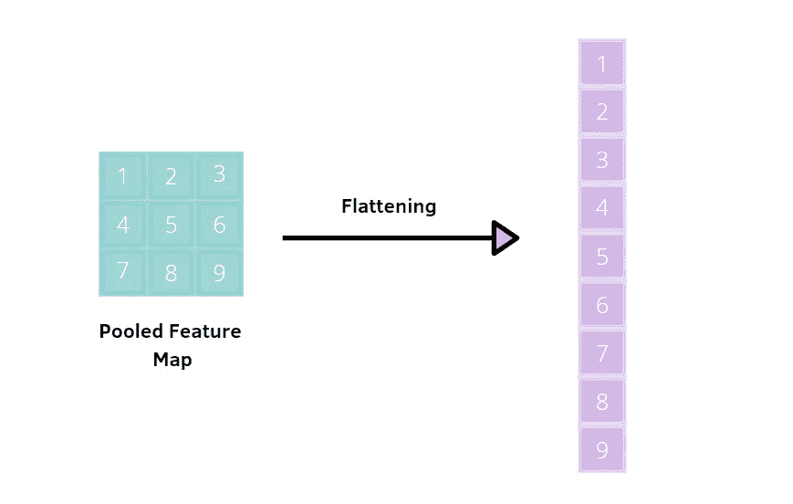
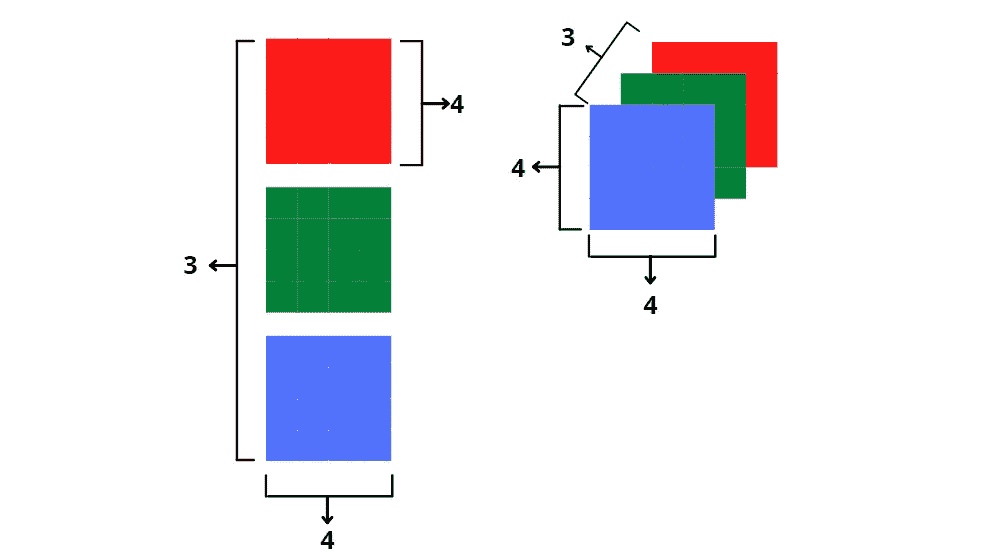
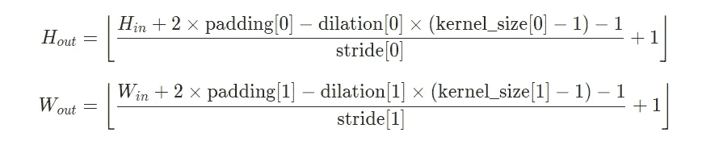
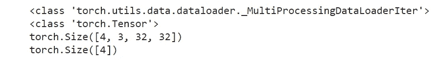

# 用 Pytorch 理解深度学习模型中的张量维数

> 原文：<https://pub.towardsai.net/understanding-tensor-dimensions-in-deep-learning-models-with-pytorch-4ee828693826?source=collection_archive---------0----------------------->

## [深度学习](https://towardsai.net/p/category/machine-learning/deep-learning)



作者插图。

*这篇文章是 Pytorch 构建深度学习模型系列指南的第三篇。下面，是全系列:*

*第一部:* [*Pytorch 初学者教程*](/pytorch-tutorial-for-beginners-8331afc552c4)

*第二部分:* [*操纵 Pytorch 数据集*](https://medium.com/mlearning-ai/manipulating-pytorch-datasets-c58487ab113f?sk=5d4cf7bd62d527d7c968b8db696b633f)

*第三部分:理解 DL 模型中的张量维度(本帖)*

*第四部分:* [*CNN &特征可视化*](https://medium.com/dataseries/visualizing-the-feature-maps-and-filters-by-convolutional-neural-networks-e1462340518e)

*第五部分:* [*超参数调谐用 Optuna*](/tuning-pytorch-hyperparameters-with-optuna-470edcfd4dc)

*第六部分:* [*K 折交叉验证*](https://medium.com/dataseries/k-fold-cross-validation-with-pytorch-and-sklearn-d094aa00105f?sk=2466aaedc4e454b89f880a32604a2e0a)

*第七部分:* [*卷积自动编码器*](https://medium.com/dataseries/convolutional-autoencoder-in-pytorch-on-mnist-dataset-d65145c132ac)

*第八部分:* [*去噪*](https://ai.plainenglish.io/denoising-autoencoder-in-pytorch-on-mnist-dataset-a76b8824e57e)

*第九部分:* [*变型自动编码器*](https://medium.com/dataseries/variational-autoencoder-with-pytorch-2d359cbf027b)

*本系列的目标是通过实现示例尽可能使 Pytorch 更加直观和易于使用。互联网上有许多教程可以使用 Pytorch 构建多种类型的具有挑战性的模型，但同时也会令人困惑，因为当您从一个教程转到另一个教程时，总会有轻微的差异。在这个系列中，我想从最简单的主题开始，到更高级的主题。*

# 介绍

如果你开始使用 Pytorch，并建立了一个卷积神经网络，你可能会遇到关于张量维数的错误。你疯狂地在网上寻找，希望找到犯同样错误的人。但是这会浪费时间，即使你纠正了错误，如果你对输入和输出形状没有深入的了解，你还会犯同样的错误。本指南将帮助您理解功能中要求的尺寸，如`torch.nn.Conv2d`层和`torch.nn.linear`层，它们具有不同的输入和输出尺寸。

# 内容:

1.  [**输出 nn 的形状。Conv2d 和 nn。线性**](#2645)
2.  [**输出 nn 的形状。convtranspose 2d**](#add4)
3.  [**CNN cifar 10 上的例子**](#301b)
4.  [**cifar 10 上的 Autoencoder 示例**](#a414)

# **1。神经网络的输出形状。Conv2d 和 nn。线性**

你需要知道的第一件事是，深度学习模型，如 CNN 和 autoencoder，可以用于不同类型的输入数据:

*   **三维视频**。形状( *batch_size* 、*通道*、*深度*、*高度*、*宽度*)用于`nn.Conv3d`输入。
*   **二维图像**。形状( *batch_size* 、*通道*、*高度*、*宽度*)用于`nn.Conv2d`输入。
*   **文字**和**音频**，都是 1D。形状(*批量大小*、*通道*、*数量特征)*用于`nn.Conv1d`输入。输入形状也可以是( *seq_len* ， *batch_size* ， *num_features* )，以防我们将其传递给递归神经网络。

一般而言，您可以注意到**批次大小**和**通道**在大多数情况下是第一个大小，添加它们是为了满足卷积层的函数条件:

*   `nn.Conv1d`需要一个 3d 张量
*   `nn.Conv2d`需要一个四维张量
*   需要一个 5d 张量



作者插图。用形状(3，4，4)可视化图像的两种方法

在这些第一尺寸之后，随后的尺寸根据输入和任务的类型而变化。在 CNN 中，最常见的情况是将图像作为输入来执行分类任务。因此，我们将重点关注:

`nn.Conv2d(in_channels,out_channels,kernel_size,stride=1,padding=0,dilation=1)`

其中:

> **in_channels** 是输入图像中的通道数，而 **out_channels** 是卷积产生的通道数

处理图像时有三种可能的情况:

1.  如果图像是灰度的，输入通道是 1。
2.  如果图像是彩色的，输入通道是 3。
3.  如果有一个额外的阿尔法通道，我们有 4 个输入通道。

要计算每个卷积层中高度和宽度的输出维度，在应用池层后，需要记住这两个公式:



来源:[https://py torch . org/docs/stable/generated/torch . nn . conv2d . html](https://pytorch.org/docs/stable/generated/torch.nn.Conv2d.html)

在这里，你看到两个公式，但你通常会有相同的公式。这取决于填充、膨胀和内核大小。在 CNN 中，卷积核/滤波器通常是 3×3，而池通常应用于 2×2 窗口、步幅 2 和无填充。因此，对于这些值，公式对于输出的宽度和高度是相同的。

在最后一个卷积层+池层之后，一个或多个全连接层被添加到 CNN 架构中。卷积层和汇集层产生的输出是三维的，但是全连接层需要一个 1D 数数组。因此，我们使用以下函数将输出展平为一维向量:

`torch.nn.Linear(in_features,out_features, bias=True)`

其中:

*   **in_features** 构成每个输入样本的大小
*   **out_features** 构成****每个输出样本的大小****

****展平输出形状有两个主要功能:****

*   ****`image = image.view(image.size(0),-1)` 其中批量大小为 image.size(0)。****
*   ****`image = torch.flatten(image.size(0),start_dim=1)`****

# ****2. **nn 的输出形状。ConvTranspose2d******

****如果我们改变任务，假设我们想要建立一个模型，该模型能够在给定数据流形的情况下重建图像，该数据流形是具有相关特征的压缩输入。一种特殊类型的前馈神经网络专门用于这项任务，被称为**自动编码器**。它由两个网络组成:编码器和解码器。第一个网络，编码器，压缩输入数据以提取最相关的信息，这些信息将包含在一个缩减的空间中，称为**编码空间**。第二个网络，解码器，是相反的过程。它从这个编码空间恢复数据，并重建原始图像。****

****仍然有`torch.nn.Conv2d`层和`torch.nn.linear`层，但也有其他类型的层:****

****`nn.ConvTranspose2d(in_channels,out_channels,kernel_size,stride=1,out_padding=0,padding=0,dilation=1)`****

****参数与`nn.Conv2d`函数中的相同。解码器由转置卷积层组成，转置卷积层学习“上采样”压缩表示。所以这些函数是卷积运算的逆运算。因此，通道的数量、宽度和高度将逐层增加，而不是减少。****

****要计算每个卷积层中高度和宽度的输出维度，在应用池层后，需要记住这两个公式:****

> ****out _ height =(in _ height-1)* stride[0]-2 * padding[0]+exploation[0]*(kernel _ size[0]-1)+output _ padding[0]+1****
> 
> ****out _ width =(in _ width-1)* stride[1]-2 * padding[1]+exploation[1]*(kernel _ size[1]-1)+output _ padding[1]+1****

# ****3.CIFAR10 上的 CNN 示例****

********

****来源:[https://py torch . org/tutorials/初学者/blitz/cifar 10 _ tutorial . html](https://pytorch.org/tutorials/beginner/blitz/cifar10_tutorial.html)****

****我们来看一个摘自 Pytorch 官网 [cifar_tutorial](https://pytorch.org/tutorials/beginner/blitz/cifar10_tutorial.html) 的例子:****

```
****class** **Net(nn.Module):**
    **def** __init__**(**self**):**
        super**().**__init__**()**
        self**.conv1** **=** **nn.Conv2d(**3**,** 6**,** 5**)**
        self**.pool** **=** **nn.MaxPool2d(**2**,** 2**)**
        self**.conv2** **=** **nn.Conv2d(**6**,** 16**,** 5**)**
        self**.fc1** **=** **nn.Linear(**16 ***** 5 ***** 5**,** 120**)**
        self**.fc2** **=** **nn.Linear(**120**,** 84**)**
        self**.fc3** **=** **nn.Linear(**84**,** 10**)**

    **def** **forward(**self**,** **x):**
        **x** **=** self**.pool(F.relu(**self**.conv1(x)))**
        **x** **=** self**.pool(F.relu(**self**.conv2(x)))**
        **x** **=** **torch.flatten(x,** 1**)** 
        **x** **=** **F.relu(**self**.fc1(x))**
        **x** **=** **F.relu(**self**.fc2(x))**
        **x** **=** self**.fc3(x)**
        **return** **x****
```

****在 CNN 架构中，我们有两个卷积层和三个线性层。每个卷积层之后是最大池层和作为非线性激活函数的 ReLU。您可以快速观察到，第一个卷积层上的输出通道数等于第二个卷积层上的输入通道数。如果检查前一个线性图层的输出要素数和后一个线性图层的输入要素数，情况也是如此。****

****我将一步一步地解释输入和输出形状。首先你需要问自己:我的图像的输入形状是什么？它是有色的还是有色的？在本例中，CIFAR10 数据集包含大小为 *3* x *32* x *32* 的图像，并带有 3 个彩色通道。若要检查定型集的维度，在应用 DataLoader 之前，您应该编写:****

```
**trainset[0][0].shape**
```

********

****要在创建 DataLoader 对象后查看形状，您应该这样做:****

```
**dataiter1 = iter(trainloader)
images1,labels1 = dataiter1.next()print(type(dataiter1))
print(type(images1))
print(images1.shape)
print(labels1.shape)**
```

********

****返回的第一个形状是图像的形状，另一个是目标的形状。函数 **iter** 用于提供一个可迭代的数据集，而 **next** 需要得到第一次迭代的第一项。这样，我们可以看到第一个图像的形状，(4，3，32，32)，其中 4 是选择的批量大小，3 是通道的数量，宽度和高度是 32。****

****在**第一个卷积层+maxpooling 层**之后，我们将计算输出形状:****

> ****out _ width = out _ height =(in _ dim-kernel _ size)/stride+1 =(32–5)/1+1 = 28****
> 
> ****out_width = out_height = 28/2 = 14****

****我们对一幅 3×32×32 的图像进行多次卷积，每次使用不同的 5×5 大小的滤波器，得到 6×28×28 的输出。在应用最大池后，窗口大小和跨距配置将产生的输出大小减半，即 6 x 14 x 14 输出。****

****在第二卷积层+maxpooling 之后，我们得到:****

> ****out _ width = out _ height =(in _ dim-kernel _ size)/stride+1 =(14–5)/1+1 = 10****
> 
> ****out_width = out_height = 10/2 = 5****

****在第二卷积层+maxpooling 之后，我们将 3D 输出展平为一维向量:****

> ****out _ dim = out _ channels x out _ height x out _ width = 16 x 5 x 5****

****现在最难的部分完成了！最后，您需要在最后一个完全连接的层(称为输出层)中指定输出隐藏单元的数量。目标是将图像分类到 10 类中的一类。因此输出特征的数量将是 10。****

# ****4.CIFAR10 上的自动编码器示例****

****让我们来看一个取自 [analyticsindiamag](https://analyticsindiamag.com/how-to-implement-convolutional-autoencoder-in-pytorch-with-cuda/) 网站的例子，略有改动。卷积自动编码器再次应用于 CIFAR10 数据集。****

```
**class Autoencoder(nn.Module):
    def __init__(self,d=2):
        super(Autoencoder, self).__init__()

        # encoder
        self.**enc1** = nn.Conv2d(
            in_channels=3, out_channels=8, kernel_size=3,stride=2
        )
        # out_width = (32-3)/2+1 = 29/2+1 = 15
        self.**enc2** = nn.Conv2d(
            in_channels=8, out_channels=16, kernel_size=3,stride=2
        ) self.**enc3** = nn.Flatten(start_dim=1)
        self.**enc4** = nn.Linear(7*7*16, d)   

        # decoder 

        self.**dec1** = nn.Linear(d,7*7*16)
        self.**dec2** = nn.Unflatten(dim=1, unflattened_size=(16, 7, 7))
        self.**dec3** = nn.ConvTranspose2d(
            in_channels=16, out_channels=8, kernel_size=3,stride=2 
        )
        self.**dec4** = nn.ConvTranspose2d(in_channels=8,               out_channels=3, kernel_size=3,stride=2,output_padding=1
        ) def forward(self, x):
       x = F.relu(self.**enc1**(x))
       x = F.relu(self.**enc2**(x))
       x = self.**enc3**(x)
       x = self.**enc4**(x) x = F.relu(self.**dec1**(x))
       x = self.**dec2**(x)
       x = F.relu(self.**dec3**(x))
       x = torch.sigmoid(self.**dec4**(x)) return x**
```

****我们可以一步一步地计算形状。首先，我们知道原图是 3×32×32。****

****现在，让我们看看**编码器**的形状:****

*   ****[con v1]:out _ width = out _ height =(32–3)/2+1 = 29/2+1 = 15****
*   ****[con v2]:out _ width = out _ height =(15–3)/2+1 = 7****
*   ****[展平]: 7x7x16****
*   ****[线性]: d=2****

****一旦定义了编码器，**解码器**将恢复编码空间 d 中的信息，我们将重建图像，图像大小需要为 3×32×32:****

*   ****[线性]: 7x7x16****
*   ****(16，7，7)****
*   ****[con v1]:out _ width = out _ height =(7–1)* 2+3 = 15****
*   ****[con v2]:out _ width = out _ height =(15–1)* 2+3 = 28+1+3 = 32****

# ******总结******

*   ****您的图像的输入形状为(*批量大小*、*通道*、*深度*、*高度*、*宽度*)****
*   *****out _ width = out _ height =(in _ width-2 * padding-kernel _ size)/stride+1*在 **nn 的大多数情况下。Conv2d******
*   ****第一个完全连接的层将接收具有形状的一维向量(*输出通道 x 输出高度 x 输出宽度*****
*   *****out _ width = out _ height =*(*in _ width*–1)* stride+kernel _ size*-2 * padding*+out _ padding+1**conv transpose 2d******

# ****最终想法:****

****我希望这篇教程能让你更好地使用 Pytorch 构建 CNN 架构。这很容易受阻，因为有些事情在头脑中不是很清楚，有时你需要从基础开始前进。感谢阅读。祝您愉快！****

****你喜欢我的文章吗？ [*成为会员*](https://eugenia-anello.medium.com/membership) *每天无限获取数据科学新帖！这是一种间接的支持我的方式，不会给你带来任何额外的费用。如果您已经是会员，* [*订阅*](https://eugenia-anello.medium.com/subscribe) *每当我发布新的数据科学和 python 指南时，您都会收到电子邮件！*****