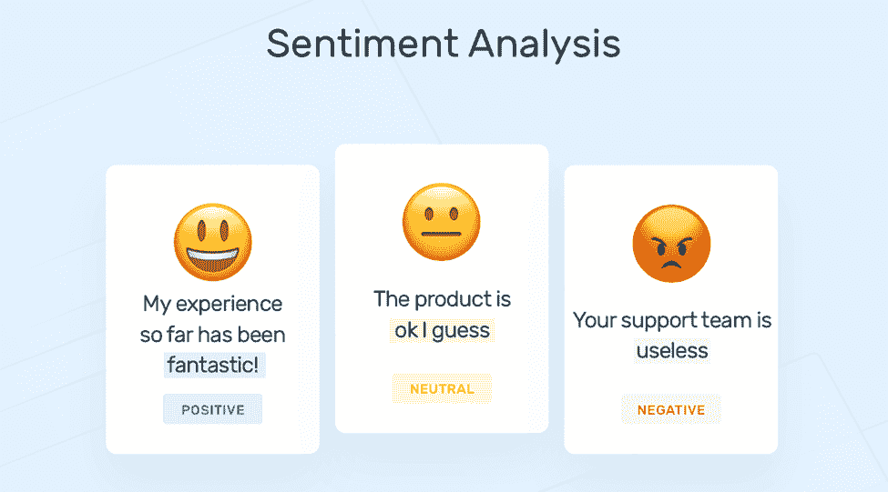
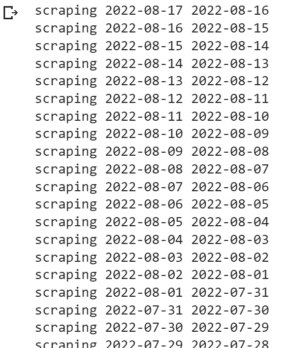
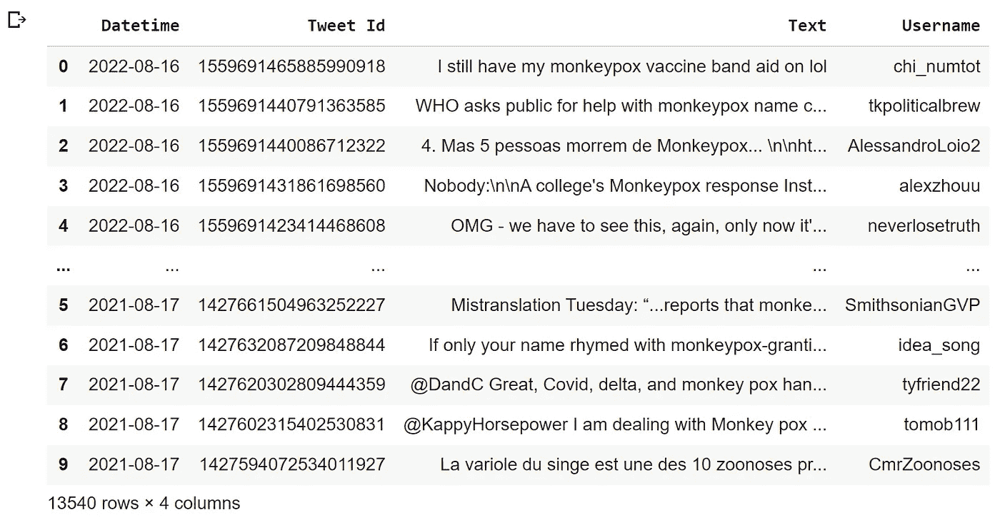
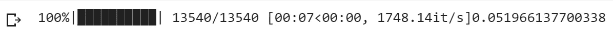
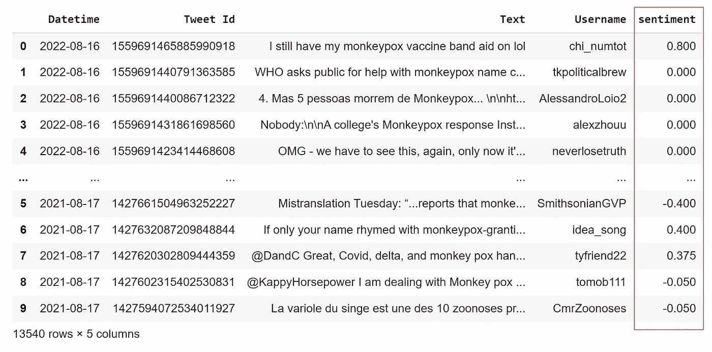
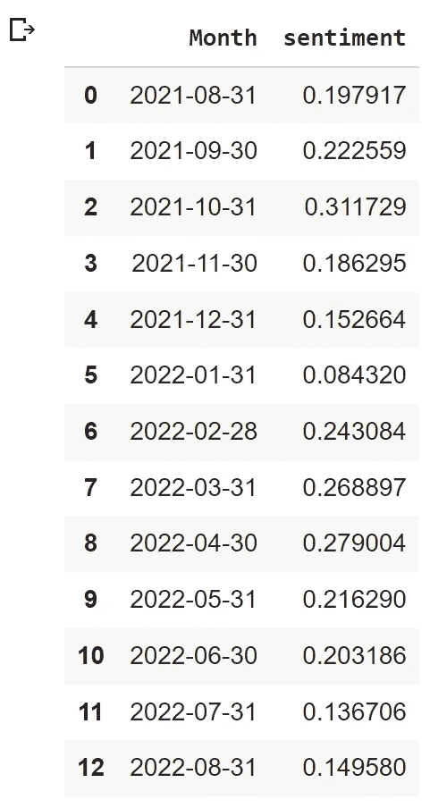
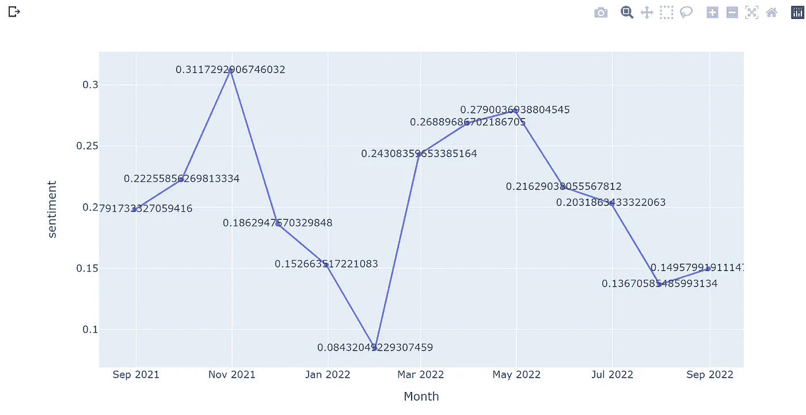
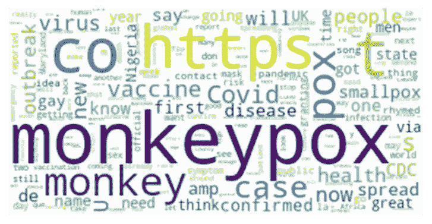

# 人工智能理解文本的情感基调——猴痘微博的情感分析

> 原文：<https://pub.towardsai.net/understanding-the-emotion-tone-of-text-with-ai-sentiment-analysis-on-monkeypox-tweets-13040cfb1f99?source=collection_archive---------2----------------------->

公司和组织如何理解顾客的感受或公众对一个流行事件的看法？最常见的方法是在网上阅读数百条评论和意见，安排反馈访谈，或者让公众填写调查问卷。假设我们已经从公众那里收集了这些有价值的数据，接下来我们应该做什么来从中提取价值呢？

*图像检索自:*[*【https://unsplash.com/photos/V5Owjg-ZNto】*](https://unsplash.com/photos/V5Owjg-ZNto)

在揭开谜底之前，我们先用最新传播的传染病之一的猴痘病毒话题做一个实例研究，看看大众对此的感受。在收集了过去 12 个月来自 Twitter 的约 13.5 万条推文作为样本语料后，我们将对公众对猴痘病毒的感受进行情感分析。

## 什么是情感分析，为什么它很重要？

自 20 世纪初以来，情感分析得到了广泛的应用，其研究领域仍在快速发展。最先进的解决方案之一是使用人工智能进行情感分析。该算法使用自然语言处理(NLP)技术，使其能够确定一段文本的情绪或情感。在这种情况下，公司可以根据用户的反馈做出反应。

当我们使用这种算法来分析一个语料库时，一个情感分数将被分配给它。情感得分是一个介于-1 到 1 之间的指标，它显示了语料库中的内容是表达积极的(1)、中性的(0)还是消极的情感(-1)。

*   情绪得分在 0.2 到 1 之间，文本越来越倾向于积极的情绪。
*   情感得分在-0.2 和-1 之间的范围内，文本将倾向于被认为是负面的或非常负面的。
*   情感得分在-0.2 和 0.2 之间，文本被认为是中性的。

提取客户情绪得分的公司可以将其作为他们的 KPI 之一，因为它可以表明他们的客户对他们的品牌的感受。

*图像检索自:*[*https://monkeylearn.com/sentiment-analysis/*](https://monkeylearn.com/sentiment-analysis/)

## **手头上！**

## **网页抓取**

> 声明:本文仅用于教育目的。我们不鼓励任何人抓取网站，尤其是那些可能有条款和条件反对此类行为的网站。

如前所述，我们将从 Twitter 上收集过去 12 个月中大约 13.5 万条关于猴痘病毒的推文。我们在这一步使用的主要 Python 库叫做 [snscrape](https://github.com/JustAnotherArchivist/snscrape) 。

webscraper.py 的输出

webscraper.py 的输出

正如你所看到的，我们已经成功地收集了 13540 条 tweets 作为我们的样本语料库，它们被临时保存在一个 DataFrame 中。该数据帧中有 4 列:“日期时间”、“Tweet ID”、“文本”和“用户名”。

## **计算情感得分和数据清洗**

准备好数据后，我们现在可以使用一个名为 [TextBlob](https://textblob.readthedocs.io/en/dev/) 的库来计算每条推文的情感分数。

来自 perspective . py 的输出

来自 perspective . py 的输出

每条推文都有一个情感分数，显示在一个名为“情感”的新栏目中。在进一步分析之前，我们发现有许多推文是中性的(情绪得分在-0.2 到 0.2 之间)。中立意味着没有意见影响或不相关的评论。在这种情况下，我们只想通过隐藏中立的推文来关注显示积极和消极情绪的推文。

## 形象化

接下来，我们将计算并可视化按月份分组的平均情绪得分，以了解公众对猴痘病毒的感受趋势。可视化月平均情绪分的 Python 库是 [plotly.express](https://plotly.com/python/plotly-express/) 。

monthly_avg.py 的输出

这些是每个月的平均情绪得分。接下来，我们将使用上面的数据来可视化折线图。

line_graph.py 的输出

上面的线形图显示了从 2021 年 8 月下旬到 2022 年 8 月下旬的情绪得分。两次最急剧的下降发生在 2021 年 11 月至 2022 年 2 月和 2022 年 5 月至 2022 年 8 月。该曲线图上的两个最低点是 2021 年 2 月和 2022 年 8 月，这可能是由于政府公共卫生部门的重大公告。总的来说，在过去的 12 个月里，公众对猴痘病毒有负面情绪。

最终，我们使用 [WordCloud](https://www.datacamp.com/tutorial/wordcloud-python) 来描绘在我们的语料库中被提及最多的关键词，基于对频率的统计。词云上出现的词越大，被公众提及的次数就越多。

wordcloud.py 的输出

## **结论**

正如你所看到的，使用人工智能来实现情感分析对于需要审查客户或公众反馈的公司和组织来说非常有效率，特别是当数据集很大时。通过使用这种算法，我们可以很容易地跟踪公众对这种最新传播的传染病的情绪。这将非常有助于相关部门决定采取何种行动来消除公众未来的焦虑。