# 理解简单线性回归背后的简单数学

> 原文：<https://pub.towardsai.net/understanding-the-simple-maths-behind-simple-linear-regression-3ce4a30e7602?source=collection_archive---------1----------------------->

## [数学](https://towardsai.net/p/category/mathematics)

T2:很多人喜欢数学，而且有充分的理由。我不太喜欢它，但我试图保持基础知识的更新:-代数、线图、三角函数、微积分先修课程等。感谢像[汗学院](http://www.khanacademy.org)这样的平台……学习数学会很有趣。

他的文章是写给任何对机器学习感兴趣的人的，尤其是初学者，监督学习技术的新手。

有些人可能会说，数据科学和 ML 可以不用数学来完成，我在这里不是要反驳这个前提，但是我要说的是，人们需要花时间来看看我们日常使用的一些工具和抽象的引擎盖下面，对启发式有更好的直觉。

**L** 线性回归我们已经知道，是指用一个或多个自变量来预测一个因变量。因变量必须是连续的，如预测二氧化碳排放量、工人的年龄或工资、明天的温度等，而自变量可以是连续的或分类的。

在本文中，我们将集中讨论简单线性回归。SLR 可以说是最直观、最普遍的机器学习算法。

在机器学习中，模型可以被认为是在给定一个或多个其他值的情况下，用来预测一个值的数学方程。

> 通常你拥有的相关数据越多，你的模型就越精确。

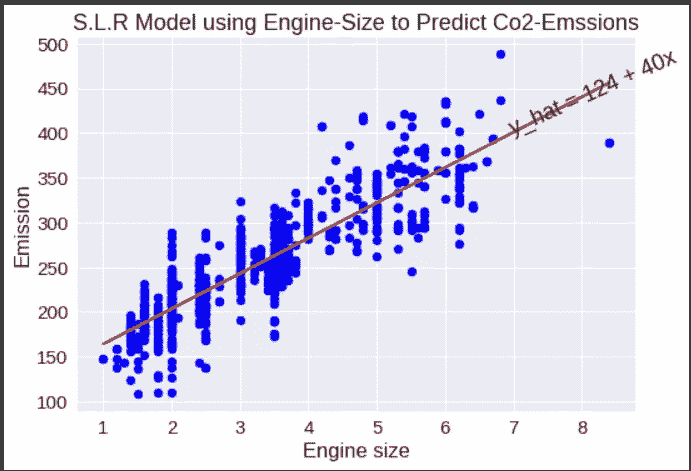

简单的线性回归模型，在给定车辆发动机尺寸的情况下预测二氧化碳排放量

上图描绘了一个简单的线性回归模型。它被称为简单线性回归，因为只有一个特征或独立变量用于预测给定的标签或目标。在这种情况下，只有发动机尺寸用于预测二氧化碳排放量。如果我们有一个以上的预测因子，那么我们称之为*多元线性回归* *(MLR)* 。

上图中的 **T** he **红线**代表车型。这是一条最符合数据的直线。因此，该模型是一个数学方程，在给定发动机尺寸(自变量)的情况下，试图预测 Co2 排放量(因变量)。

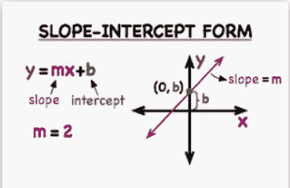

线性方程的斜率截距形式

这篇文章旨在创造一个更好的单反直觉，让我们更舒服的概念和其内部工作。这只是简单的数学。谁都能想出来。一个有效的开始方式是从已知到未知…所以让我们回到高中。

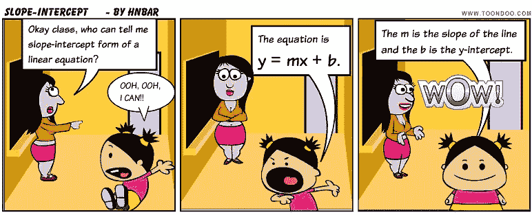

图片提供:-[http://www.toondoo.com](http://www.toondoo.com//public/h/n/b/hnbar/toons/cool-cartoon-1114635.png)

**y = MX+b**

**T** 斜率截距形式 *(y=mx+b)* 是直接应用于简单线性回归的线性方程

***y = y 轴上的数值***

***m =直线的斜率或坡度(y 方向的变化****/****x 方向的变化)***

***x = x 轴上的值***

***b = y 轴截距或 x 为 0 时 y 的值***

**一个**线性方程是这样一个方程，其中如果我们绘制 x 和 y 的所有值，那么该图在坐标平面上将是一条完美的直线。

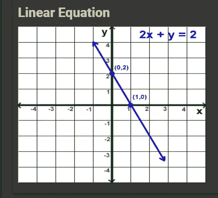

2x + y = 2 的线性方程解，显示一条完美的直线

**T** 因此，斜率截距表表明，对于坐标平面上的任意直线，*的值是直线 ***m*** 的斜率与***×直线*** 的值加上直线 ***b*** 的 y 截距的乘积。参见[链接](https://www.khanacademy.org/math/algebra-basics/alg-basics-graphing-lines-and-slope/alg-basics-slope-intercept-form/a/introduction-to-slope-intercept-form)*

****y = mx + b****

***O** 好，回到简单的线性回归…SLR**模型与我们上面看到的斜率-截距形式方程相同，唯一的区别是我们将我们想要预测的标签或因变量表示为 ***y*** 并且我们将我们的权重或模型参数表示为 ***m*** 和 ***b******

*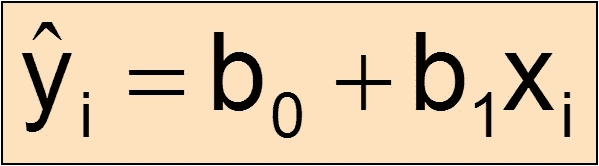*

*y_hat = b0 + b1x1…表示预测值(yhat) =偏差单位+(斜率*特征)*

**在简单线性回归中:**

***y = wx+b***

**同:**

****y = b + wx****

*这与以下内容相同:*

****y = B0+b1x 1****

**哪里:-**

****y =因变量或目标变量。*** *(又名，预测或 y_hat)**

****x =自变量或预测变量。*** *(又名，x1)* ***。****

****B0 = y 轴截距。*** *(又名偏置单位)* ***。****

****b1 =回归线的斜率或梯度****

***A** nd 就像斜率截距形式( ***y = mx + b)*** ，只要自变量*(****【x】****)*)和因变量*(****【y****)*有线性关系，无论这种关系是正还是负，我们都可以*

**

*负关系向下倾斜，正关系向上倾斜，零或弱关系很少或没有倾斜。*

# *最基本的问题是:-*

> ****1。我们如何判断一个自变量与我们想要预测的因变量之间是否存在线性关系？****

***B** 因为在线性回归*(无论是简单的还是多重的)*中，有**必须**在自变量或预测变量和因变量或目标变量之间存在线性关系。*

*更多详情请参见来自 IBM @Coursera 的这个 [***链接***](https://www.coursera.org/learn/machine-learning-with-python/lecture/0y8Cq/multiple-linear-regression)*

*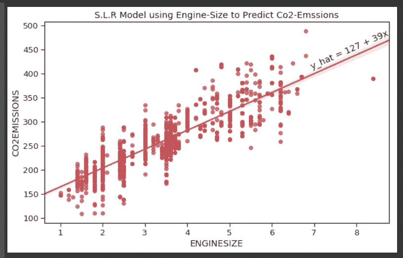*

*SLR 模型，仅使用发动机尺寸作为预测因素或独立变量来预测二氧化碳排放量。*

> ***2*2。如何才能为自己的单反机型选择最好的线路？换句话说，在给定自变量和因变量的情况下，我们如何找到* b0 *和* b1 *的理想值，使它们产生最佳预测线？****

## *如何验证两个变量之间是否存在线性关系？*

*听说过术语 **' *相关性*'吗？？***

**

*换句话说，相关性试图告诉我们一个变量的变化是否会影响另一个变量，或者可能会导致另一个变量的变化，以及影响的程度。*

*例如，如果汽车发动机尺寸的增加可能导致二氧化碳排放量的增加，那么它们是正相关的。但是如果 COMB(mpg)的增加可能导致 CO2 排放的减少，那么 COMB(mpg)和 CO2 排放是负相关的。如果不存在可能的关系，那么统计学家说它们之间的相关性很弱。*

**

*负相关向下倾斜，正相关向上倾斜，弱相关很少或没有倾斜*

***C** orrelation 产生一个介于-1 和 1 之间的数。如果数字接近-1，表示强负相关，如果接近 1，表示强正相关，如果接近 0，表示变量间弱相关。*

*详见 [***链接***](https://www.coursera.org/learn/data-analysis-with-python/lecture/lb1Hl/correlation)*

> ***如果相关性的绝对值大于 0.6，*表明变量之间存在良好的线性关系*。***

*线性关系可以是负的(如果相关性是负的)或正的。*

*相关性或皮尔逊相关性由符号 ***r*** 表示*

*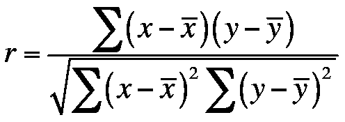*

*计算两个变量 x 和 y 之间相关性的公式*

> ****记住相关性并不意味着因果关系……’****

# *让我们玩一些真实的数据…*

**

*微笑，让我们一起玩*

*W e 将使用*油耗率*数据集在加拿大销售汽车。 [**(原车油耗等级 2000–2014)**](https://open.canada.ca/data/en/dataset/98f1a129-f628-4ce4-b24d-6f16bf24dd64)。但是坦率地说，任何流行的回归分析数据集都足够了。*

***T** he 数据集已经下载到 Google drive，让我们将其导入 Google Colab。*

*让我们看一下数据集的摘要图像，数据集包含 14343 行和 13 列数据。*

```
***Understanding the Data**FuelConsumption.csv:
We have downloaded a fuel consumption dataset, 
FuelConsumption.csv, which contains model-specific fuel consumption ratings and estimated carbon dioxide emissions for new light-duty vehicles for retail sale in Canada.- **MODELYEAR** e.g. 2014
- **MAKE** e.g. Acura
- **MODEL** e.g. ILX
- **VEHICLE CLASS** e.g. SUV
- **ENGINE SIZE** e.g. 4.7
- **CYLINDERS** e.g 6
- **TRANSMISSION** e.g. A6
- **FUEL CONSUMPTION in CITY(L/100 km)** e.g. 9.9
- **FUEL CONSUMPTION in HWY (L/100 km)** e.g. 8.9
- **FUEL CONSUMPTION COMB (L/100 km)** e.g. 9.2
- **CO2 EMISSIONS (g/km)** e.g. 182   --> low --> 0*
```

*首先，让我们导入需要的包*

```
*import matplotlib.pyplot as plt
import pandas as pd
import pylab as pl
import numpy as np
import seaborn as sns
%matplotlib inline
print('imports all done')*
```

***L** et 的导入 Gdrive，轻松将文件从 Gdrive 上传到 Google Colab。*

```
*from google.colab import drive
drive.mount('/content/gdrive')*
```

*让我们从 Gdrive 读取文件到 Pandas 数据帧*

```
*file = ''
with open('/content/gdrive/My Drive/Colab_Notebooks/IBM_cognitive_class_learning/Original_2000-2014_Fuel_Consumption_Ratings.csv') as f:
    file = f.read()

import sys
if sys.version_info[0] < 3: 
    from StringIO import StringIO
else:
    from io import StringIOData = StringIO(file)fuel_consumption_df = pd.read_csv(Data, sep=",")fuel_consumption_df.head()*
```

**

*数据集的前五行的输出*

*为了简洁起见，让我们重新命名一些列标题*

```
*fuel_consumption_df.rename(columns={'FUEL_CONSUMPTION_CITY(L/100km)': 'FUEL_CONS_CITY(L/100km)', 'CO2_EMISSIONS(g/km)':'CO2_EMISSIONS'}, inplace=True)*
```

## *一点 EDA 来感受一下数据集…*

*我们来确认一下形状，*

```
*fuel_consumption_df.shape# which prints out:(14343, 13)*
```

***C**column 数据类型、*

```
*fuel_consumption_df.dtypes# which prints out:*
```

*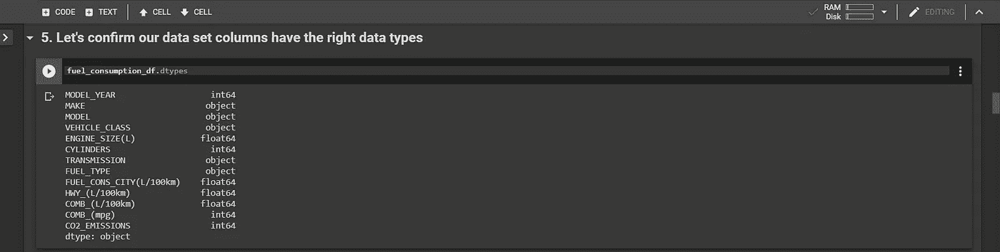*

*显示每列数据类型的代码单元格的输出。*

***C** 检查 NaN 值。*

```
*fuel_consumption_df.isna().sum()*
```

*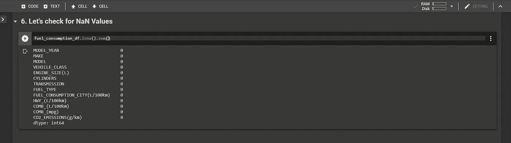*

*代码单元检查 NaN 值的输出…令人惊讶的是一个也没有！*

# *相互关系*

*F 或 **SLR** ，我们希望仅使用数据集中的一个特征或变量来预测 Co2 _ 排放量*(因变量)*。让我们查看数据集中变量的相关性，这样我们就可以选择一个强独立变量。*

```
*corr_data = fuel_consumption_df.corr()plt.figure(figsize=(10,4))
sns.set_style('ticks')
sns.heatmap(corr_data, annot=True)
plt.title('Correlation of variables in fuel_consumption_df Data set')plt.show()*
```

*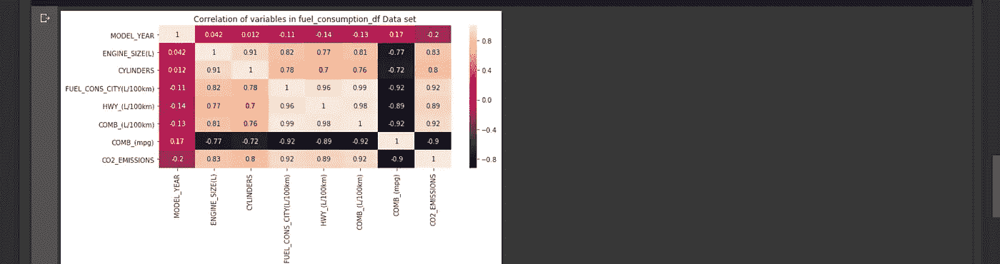*

*使用 Seaborn 库的热图显示数据集中变量的相关性。较浅的颜色表示较高的相关数字*

***C** 显然，与 Co2 _ 排放量相关数字最好的变量是:-*Fuel _ Cons _ City(***0.92***)*、*COMB _(mpg)(***0.92***)*和*Engine _ Size(***0.83***)。让我们想象一下每种关系。**

*绘制 3 个散点图以显示最高相关变量。*

```
*fig = plt.figure(figsize=(20, 5))
plt.suptitle('Scatter plots showing correlation between Top-Correlated-Variables and CO2_EMISSIONS', y=1.05, fontsize=16)ax = fig.add_subplot(131)
ax1 = fig.add_subplot(132)
ax2 = fig.add_subplot(133)# Subplot 1 scatter plot of ENGINE_SIZE and Co2_EMISSIONS
fuel_consumption_df.plot(kind='scatter', x='ENGINE_SIZE(L)', y='CO2_EMISSIONS', color='red', ax=ax)
ax.set_title('ENGINE_SIZE(L) and CO2_EMISSIONS')
ax.set_xlabel('ENGINE_SIZE(L)')
ax.set_ylabel('CO2_EMISSIONS')# Subplot 2 scatter plot of FUEL_CONS_CITY(L/100km) and Co2_EMISSIONS
fuel_consumption_df.plot(kind='scatter', x='FUEL_CONS_CITY(L/100km)', y='CO2_EMISSIONS', color='navy', ax=ax1)
ax1.set_title('FUEL_CONS_CITY(L/100km) and CO2_EMISSIONS')
ax1.set_xlabel('FUEL_CONS_CITY(L/100km)')
ax1.set_ylabel('CO2_EMISSIONS')# Subplot 3 scatter plot of COMB_(L/100km) and Co2_EMISSIONS
fuel_consumption_df.plot(kind='scatter', x='COMB_(L/100km)', y='CO2_EMISSIONS', color='green', ax=ax2)
ax2.set_title('COMB_(L/100km) and CO2_EMISSIONS')
ax2.set_xlabel('COMB_(L/100km)')
ax2.set_ylabel('CO2_EMISSIONS')plt.show()*
```

*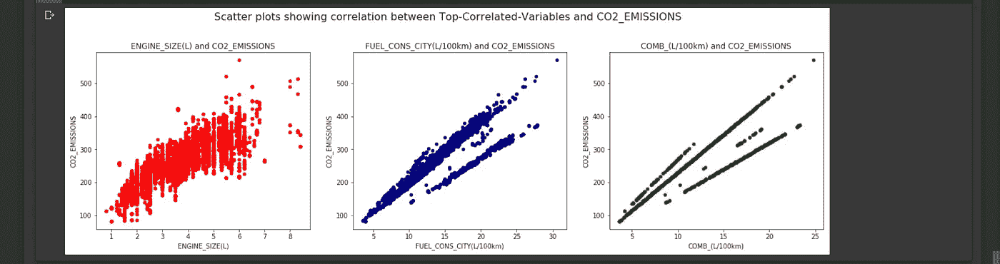*

*输出显示每个顶部相关变量和因变量(CO2 _ 排放量)之间清晰的正线性关系。*

*ll 三个变量与 CO2 排放有很强的正线性关系。我选择 ENGINE_SIZE(L)作为这个练习的自变量。你可以自由选择其中任何一个。*

*现在是时候回答第二个基本问题了。*

*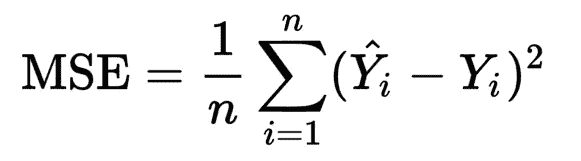*

*计算均方误差的公式*

> *参数 b0 和 b1 的最佳值将是最小化均方误差(MSE)的值。*

## *什么是 MSE？*

*均方误差就是每个预测值和每个实际值之间的平方差之和，除以观察总数。*

*在这里，一个 ***观察值*** 是一行特定的数据 ***。******示例*** 简单来说就是一对给定的发动机尺寸值及其对应的二氧化碳排放量值。记住，数据集包含 14343 个例子/观察值。*

> *那么，我们如何找到 b0 和 b1 的理想值，使我们的单反模型产生最小的 MSE 呢？*

***C** heesy…首先，我们用一个简单的数学公式求出 ***b1*** *(斜率)* 的值。然后我们把 ***b1*** 代入**单反**方程 ***(y = b0 + b1x1)*** ，求 ***b0*** *(拦截器偏置单元)* …就这样 ***。****

****斜率公式*** 为计算 ***b1*** *(斜率)* 在简单线性回归中为:-*

*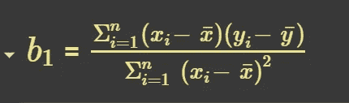*

*一元线性回归斜率的计算公式*

*其中:*

**(是观测值的总数)**

*****x*** (自变量，引擎大小，即一个 ***n * 1*** 列向量)**

*****y*** (因变量，Co2 _ 排放量，这是一个 ***n * 1*** 列向量)**

*****i = 1*** (指数据集中的第一次观察。**注** : ***i*** 从 1 上升到 ***n*** )**

*****xi*** (第 ***i*** 第 ***x*** 的观察)**

*****x _ bar***(***x***的平均值)**

***(第 ***i*** 第 ***y*** 观察)***

*****y _ bar***(y*的平均值)***

## ***概括起来***

> ***为了找到 **b1** ，我们将斜率公式的**分子**除以**分母**。***
> 
> *****分子**简单来说就是****I****等于 1 到 **n** 对于**的每个值，**减去 **x_bar** ，再乘以 **yi、**减去 **y_bar** 的对应值。*****
> 
> *******分母**就是从 ***i*** 等于 1 到 **n** 的 **xi** 和 **x_bar** 的每个值的平方差之和。*****

# ****让我们用斜率公式求解 b1 或斜率。****

****首先让我们定义一下我们的变量:- ***x*** 和 ***x_bar*** ，以及 ***y*** 和 ***y_bar。*******

```
***# The predictor or independent variable x is Engine_Size
x = fuel_consumption_df['ENGINE_SIZE(L)']# The mean or average of x is x_bar
x_bar = x.mean()# The target or dependent variable y is Co2_Emissions
y = fuel_consumption_df['CO2_EMISSIONS']# The mean or average of y is y_bar
y_bar = y.mean()***
```

***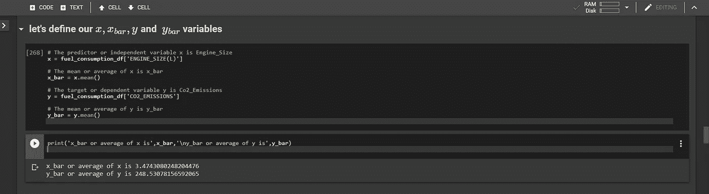***

***定义变量:- x(发动机尺寸)，y(二氧化碳排放量)，x _ bar(x 的平均值)和 y _ bar(y 的平均值)。***

***接下来，让我们定义一个简单的函数，它接受变量并返回***【B1】******

```
*****def** **calc_slope(feature, target, x_bar, y_bar):**
    """ takes two series objects- feature and target and their averages x_bar and y_bar
    performs the slope equation on each combine variables of feature and target,
    then finally returns a floating point number as theta one or b_one,
    Which is also known as the gradient or slope of the linear regression""" numerator = 0
    denominator = 0
    for i, j in zip(feature, target):
        numerator+= (i - x_bar) * (j - y_bar)
        denominator+= (i - x_bar)**2
    return round((numerator / denominator),8)***
```

***让我们通过调用函数并向其传递变量来定义 ***b1******

```
***b1 = **calc_slope(x, y, x_bar, y_bar)**b1***
```

***这会打印出值为 37.28016592 的 ***b1 或******

***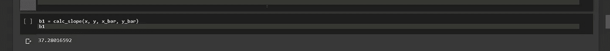***

***使用一个简单的函数，我们可以看到单反模型的 b1 或斜率约为 37.28。***

# ***接下来让我们替换单反方程式中 b1 的值***

*****R** 记住 SLR 方程**(*y = B0+bixi****)*与斜率截距方程 ***(y = b + mx)*** 相同。***

*****T** 因此我们可以使用我们已知的 ***y*** 和 ***x*** 的任意对应值，将斜率***【B1】***代入 SLR 方程，得到 ***y_intercept*** 或 ***b0。******

***我们先用平均值 ***x_bar*** 和 ***y_bar*** 。***

******y = b0 + b1x1******

****因此*:
***y _ bar = B0+B1(x _ bar)******

*****让我们求解为*B0******

****因此***:**
***B0+B1(x _ bar)= y _ bar******

****最后求解为* ***b0*** *，可以写成:*
***B0 = y _ bar—B1(x _ bar)******

***我们先输入 ***y_bar*** ， ***b1*** 和 ***x_bar*** 的值，得到 ***b0*** 的值。***

```
***b0 = y_bar - (b1 * x_bar)# Lets round b0 to 8 D.P as is the norm
b0 = round(b0, 8)b0***
```

***这会打印出 ***b0 或截距或偏置单位，*** 的值为 119.00800194***

***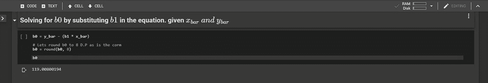***

***使用 SLR 方程对 b0 进行数学求解，得出截距或偏差单位为 119.00***

## ***概括起来***

> ***从数学上，我们可以看到模型参数 **b0** 和 **b1** 的理想值为: ***119* (b0)** 和***37.28*(B1)**。***

***这样我们的数学单反模型就是***y _ hat =*119*+*37.28*(x1)******

***这意味着如果我们想预测一辆引擎大小为 13.5 升的汽车的二氧化碳排放量。我们未知的预测是 ***y_hat*** 。我们的预测器是 ***x1*** ，是 13.5。所以我们所需要做的就是将 13.5 代入方程，找到 ***y_hat*** 。***

******y _ hat =*119*+*37.28***13.5*****

******y_hat =* 622** (四舍五入为整数)***

# ***让我们比较一下我们的数学模型和 Sklearn 模型***

***首先，从 Sklearn 导入线性回归并创建一个模型***

```
***# first we import Linear regression model from sklearnfrom sklearn.linear_model import LinearRegression
from sklearn.metrics import mean_squared_error***
```

***接下来，我们实例化一个线性回归模型***

```
***model = LinearRegression()***
```

*****N** ext，我们定义特征***【X】***和目标***【Y】***变量到 2D 数组中***

```
***# The feature or independent variable 
X = fuel_consumption_df[['ENGINE_SIZE(L)']].values# The target or dependent variable
Y = fuel_consumption_df[['CO2_EMISSIONS']].values***
```

*****T** 当我们使用 fit 函数训练模型并向其传递 ***X*** 和 ***Y*** 时。***

```
***model.fit(X,Y)***
```

***最后，我们打印出 Sklearn 模型的理想值 ***b0*** 和 ***b1******

```
***# Defining the model slope or b1
slope = model.coef_# Defining the model intercept or b0
intercept = model.intercept_print(slope,intercept)***
```

***他打印出的斜率为 37.28046592，截距为 119.00800194，与我们的数学模型完全相同。***

***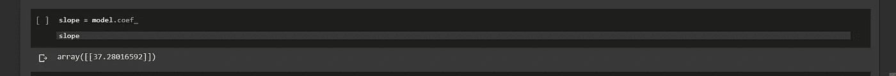***

***显示 Sklearn 模型斜率(b1)的代码单元的输出，该值与数学模型的值相同。***

***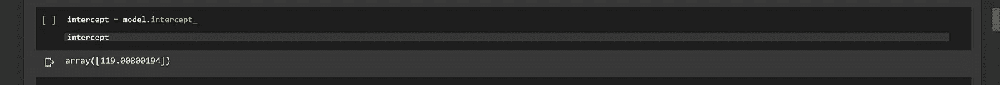***

***显示 Sklearn 模型截距(b0)的代码单元的输出，与数学模型具有相同的值。***

***Maths 和 Sklearn 模型都有完全相同的参数 ***b0*** 和 ***b1*** ，这证明了一个事实，即不需要库就可以直观地解决 SLR，特别是如果它是一个中小型数据集。***

***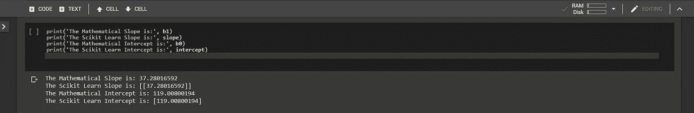***

***Maths 和 Sklearn 模型具有相同的斜率(梯度)和截距(偏差单位)值***

# ***最后，***

## ***评估…***

> ***模特们表现如何？。***

******

***图片提供:[https://cdn . Lynda . com/course/645049/645049-636628390565991366-16x 9 . jpg](https://cdn.lynda.com/course/645049/645049-636628390565991366-16x9.jpg)***

***让我们比较一下数学模型和 Sklearn 模型的 ***RMSE*** 。***

***均方根误差是 ***MSE*** 的平方根，是衡量线性回归模型性能的理想指标。***

> ***`***RMSE can be interpreted right on the same scale as the dependent or target variable and gives a good indicator of how well our model performs. Simply find the range of the target variable and compare the RMSE to it. The lower the RMSE as a percentage of the range, the better the model performance.***`***

***让我们计算两个模型的 MSE 和 RMSE***

```
***# First import mean_squared_error metric from sklearn
from sklearn.metrics import mean_squared_error# for maths model
y_hat = round(x * b1 + b0)
MSE = mean_squared_error(y_hat, y)
RMSE = MSE**0.5# for Sklearn model
prediction = model.predict(X)
model_MSE = mean_squared_error(prediction, Y)
model_RMSE = model_MSE**0.5***
```

***接下来，我们打印出数学和 Sklearn 模型的 MSE 和 RMSE***

```
***print('The Mathematical MSE is:', round(MSE))
print('The Scikit Learn MSE is:', np.round(model_MSE))
print('The Mathematical RMSE is:', round(RMSE))
print('The Scikit Learn RMSE is:', np.round(model_RMSE))***
```

***上面的代码打印出以下内容***

```
***The Mathematical MSE is: 1110.0 
The Scikit Learn MSE is: 1110.0 
The Mathematical RMSE is: 33.0 
The Scikit Learn RMSE is: 33.0***
```

***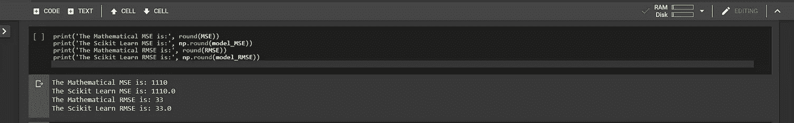***

***两个模型都有完全相同的 MSE 和 RMSE，但是 33 的 RMSE 到底意味着什么呢？***

***两款车型都有相同的**1110**的 MSE 和 33 的 **RMSE。*****

> ***但是，一个 33 的 **RMSE 到底意味着什么……它能告诉我们什么？*****

*****T** o 得到 ***RMSE*** 的含义，让我们把它做成因变量范围的百分比。百分比越低，模型越好。***

***首先，我们找到因变量(二氧化碳排放量)的范围***

```
***y_range = fuel_consumption_df['CO2_EMISSIONS'].max() - fuel_consumption_df['CO2_EMISSIONS'].min()y_range***
```

***这给出了一个范围 **487*****

***最后，我们将 RMSE 设为量程的一个百分比***

```
***error_margin = (RMSE / y_range) * 100error_margin***
```

***这会打印出一个值 **6.84%*****

***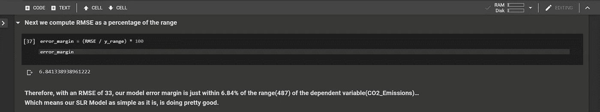***

***显示两个模型的误差范围的输出***

***因此，利用 33 的 ***RMSE，我们的模型误差在因变量(CO2 _ 排放)的 ***范围*【487】**的 **6.84%** 的误差范围内……这意味着我们的 SLR 模型虽然简单，但做得相当好。******

## **让我们来看看数学模型和 Sklearn 模型的曲线图。**

**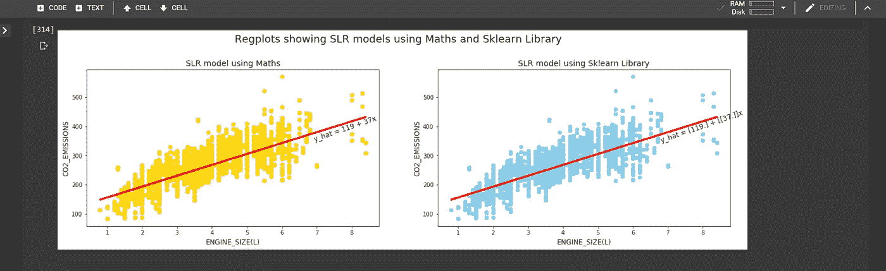**

**数学和 Sklearn 模型的 Regplots。两者惊人的相同。**

# **结论**

**我希望我已经向你展示了简单的线性回归是如何工作的。运用统计学和简单数学。希望你喜欢阅读，欢迎在下面发表任何问题或意见**

**坚持练习。**

**如需进一步学习，请查看这些来自 [cognitiveclass.ai](https://courses.cognitiveclass.ai/login?next=/courses/course-v1%3ACognitiveClass%2BML0101ENv3%2B2018/progress) 的免费课程**

1.  **[用 python 进行数据分析](https://cognitiveclass.ai/courses/data-analysis-python/)**
2.  **[用 python 进行机器学习](https://cognitiveclass.ai/courses/machine-learning-with-python/)**

**您可以在 [Github](https://github.com/Blackman9t/Machine_Learning/blob/master/understanding_the_maths_of_simple_linear_regression.ipynb) 上找到本文的代码库**

****干杯！！****

## **关于我:**

***Lawrence 是技术层的数据专家，对公平可解释的人工智能和数据科学充满热情。我持有 IBM 的* ***数据科学专业*** *和* ***高级数据科学专业*** *证书。我已经使用 ML 和 DL 库进行了几个项目，我喜欢尽可能多地编写函数代码，即使现有的库比比皆是。最后，我从未停止学习和实验，是的，我拥有几个数据科学和人工智能认证，并且我已经写了几篇强烈推荐的文章。***

**请随时在以下网址找到我**

**[**Github**](https://github.com/Lawrence-Krukrubo)**

**[**领英**](https://www.linkedin.com/in/lawrencekrukrubo/)**

**[**推特**](https://twitter.com/LKrukrubo)**