# 理解通用逼近定理

> 原文：<https://pub.towardsai.net/understanding-the-universal-approximation-theorem-327ceeed81ee?source=collection_archive---------2----------------------->

## [深度学习](https://towardsai.net/p/category/machine-learning/deep-learning)

[杰瑞米·托马斯](https://unsplash.com/@jeremythomasphoto?utm_source=medium&utm_medium=referral)在 [Unsplash](https://unsplash.com?utm_source=medium&utm_medium=referral) 上拍照

## 让我们花些时间来理解神经网络的重要性

神经网络是有史以来发明的最美丽的编程范例之一。在传统的编程方法中，我们告诉计算机做什么，将大问题分解成许多小的、精确定义的、计算机可以轻松执行的任务。相比之下，在神经网络中，我们不会告诉计算机如何解决我们的问题。相反，它从观察数据中学习，找出手头问题的解决方案。

直到最近，我们还不知道如何训练神经网络来超越更传统的方法，除了一些专门的问题。改变的是在所谓的深度神经网络中学习技术的发现。这些技术现在被称为深度学习。它们得到了进一步的发展，今天深度神经网络和深度学习在计算机视觉、语音识别和自然语言处理的许多重要问题上取得了出色的性能。

话虽如此，还是让我们深入研究一下**通用逼近定理吧。**

假设有人给了你一个 wiggly 函数，像下面这样说 **f(x)** 。

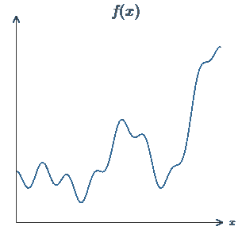

图片来源于[迈克尔·尼尔森](http://michaelnielsen.org/)

使用神经网络的一个显著特点是，它可以计算任何函数，不管它有多复杂。

保证对于任何函数都有一个神经网络，以便对于每个可能的输入， **x** ，值 f(x)(或一些接近的近似值)从网络输出，例如:

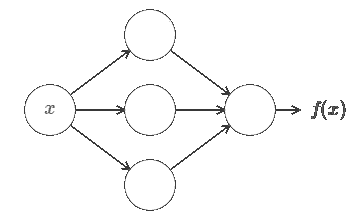

图片来源于[迈克尔·尼尔森](http://michaelnielsen.org/)

即使函数有多个输入 f=f(x1，…，xm)和多个输出，上述结果也成立。例如，这是一个 m=3 个输入和 n=2 个输出的函数的网络计算:

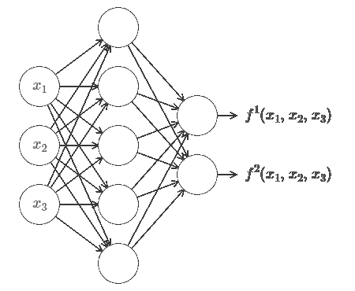

图片来源于[迈克尔·尼尔森](http://michaelnielsen.org/)

这告诉我们，神经网络在其中具有某种普遍性，即无论我们想要计算的函数是什么，都已经有一个可用的神经网络。

***普适定理*** 为使用神经网络的人所熟知。但是为什么它是真的并没有被广泛理解。

> 几乎任何你能想象到的过程都可以被认为是函数计算。考虑一下根据一小段音乐样本给一段音乐命名的问题。可以认为是计算一个函数。或者考虑将中文文本翻译成英文的问题。同样，这可以被认为是计算一个函数。

***当然，仅仅因为我们知道有一个神经网络可以将中文文本翻译成英文，并不意味着我们有很好的技术来构建甚至识别这样的网络。这个限制也适用于传统的普适性定理，如布尔电路模型。***

# 一个输入一个输出的通用性

让我们从了解如何构建一个神经网络开始，该网络用一个输入和一个输出来逼近一个函数:

图片来源于[迈克尔·尼尔森](http://michaelnielsen.org/)

如果敏锐地观察，这就是普遍性问题的核心。一旦我们理解了这个特例，就很容易扩展到具有多个输入和多个输出的函数。

为了深入了解如何构建一个网络来计算 f，让我们从一个仅包含一个隐藏层、两个隐藏神经元和一个包含单个输出神经元的输出层的网络开始:

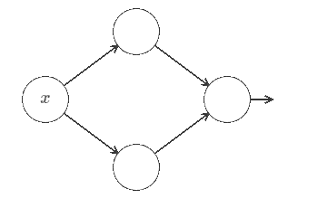

图片来源于[迈克尔·尼尔森](http://michaelnielsen.org/)

为了了解网络中的组件是如何工作的，让我们把注意力集中在最上面的隐藏神经元上。让我们从权重 w = 0 和偏差 b = 0 开始。

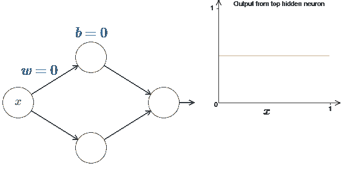

权重= 0，偏差= 0

让我们通过保持偏差不变来增加权重‘w’。下图显示了 2D 空间中不同权重值“w”的函数 f(x)。

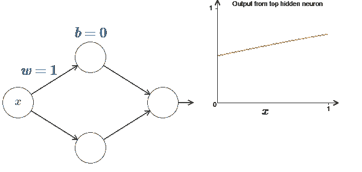

权重= 1，偏差= 0

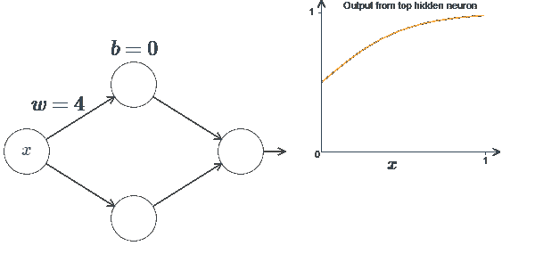

权重= 4，偏差= 0

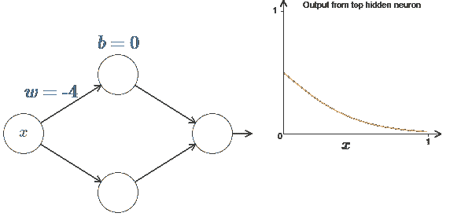

权重= -4，偏差= 0

现在让我们通过保持重量不变来改变偏差。

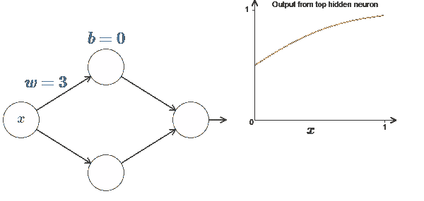

权重= 3，偏差= 0

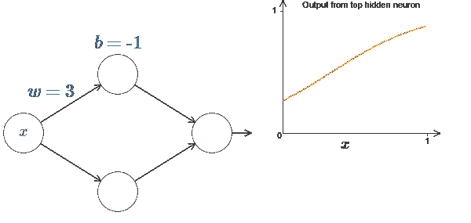

权重= 3，偏差= -1

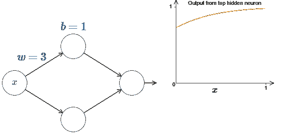

权重= 3，偏差= 1

这种简单神经网络中权重和偏差的可视化表示一定有助于您理解通用逼近定理背后的直觉。

**多输入变量**

让我们将这种方法扩展到有许多输入变量的情况。这听起来可能很复杂，但我们需要的所有想法都可以在只有两个输入的情况下理解。因此，让我们解决两个输入的情况。

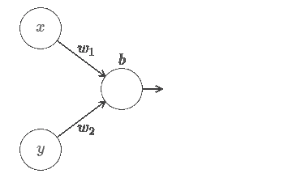

这里，我们有输入 x 和 y，具有相应的权重 w1 和 w2，以及神经元上的偏置 b。让我们将权重 w2 设置为 0，然后试验第一个权重 w1 和偏差 b，看看它们如何影响神经元的输出:

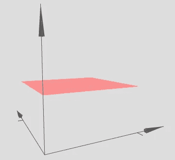

w1=0 w2=0 且 b=0

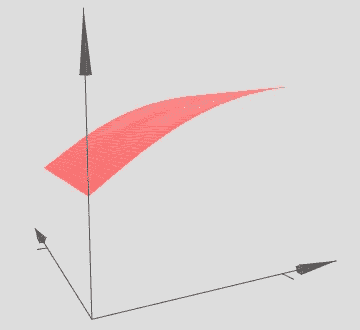

w1=3 w2=0，b=0

w1=-7 w2=0 且 b=0

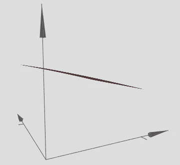

w1=1 w2=0 且 b=1

如你所见，当 w2=0 时，输入 y 对神经元的输出没有影响。好像 x 是唯一的输入。

让我们也改变偏见，玩玩图表，了解发生了什么。

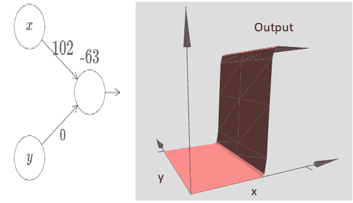

随着输入权重变大，输出接近阶跃函数。不同的是，现在阶梯函数是三维的。和以前一样，我们可以通过修改偏移来移动步进点的位置。阶跃点的实际位置为 Sx≠b/w1

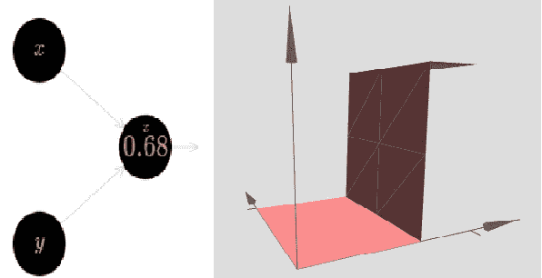

我们可以用刚刚构造的阶梯函数来计算一个三维凹凸函数。为此，我们使用两个神经元，每个计算 x 方向的阶跃函数。然后，我们将这些阶跃函数分别与权重 h 和 h 相结合，其中 h 是所需的凸起高度。下图说明了这一切:

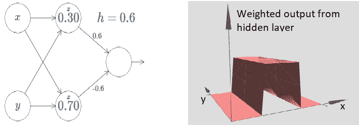

我们已经知道了如何在 x 方向创建一个凹凸函数。当然，通过在 y 方向使用两步函数，我们可以很容易地在 y 方向创建一个凹凸函数。回想一下，我们通过在“y”输入上增加权重，在 x 输入上增加权重 0 来实现这一点。结果如下:

***这看起来和早期的网络几乎一模一样！***

让我们考虑一下，当我们把两个凸起函数相加时会发生什么，一个在 x 方向，另一个在 y 方向，两个高度都是 h:

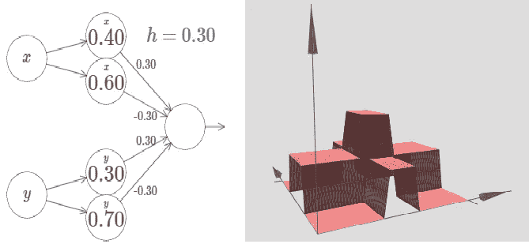

我们可以继续这样去逼近任何一种函数。但是我们会在这里结束这个讨论，我会在底部给你一些链接，让你玩这些神经网络。

**结论**

我们所讨论的对普遍性的解释当然不是如何使用神经网络进行计算的实用处方！

虽然这个结果对构建网络没有直接用处，但它很重要，因为它解决了是否可以用神经网络计算任何特定函数的问题。

这个问题的答案总是“是”。所以正确的问题不是任何特定的函数是否是可计算的，而是计算函数的好方法是什么。

本文所有部分均改编自[迈克尔·尼尔森](http://michaelnielsen.org/)的《神经网络与深度学习》一书。

**参考文献:**

1.  [神经网络可以计算任何函数的视觉证明](http://neuralnetworksanddeeplearning.com/chap4.html)迈克尔·尼尔森著。
2.  本文是与[自由代码营](https://www.freecodecamp.org/)合作提供的 [ZeroToGANs](http://zerotogans.com/) 课程 [Jovian.ml](https://jovian.ml/) 作业的一部分。
3.  [Tensorflow 的游乐场](https://playground.tensorflow.org/)用于直观理解神经网络。
4.  [机器学习游乐场](https://ml-playground.com/)