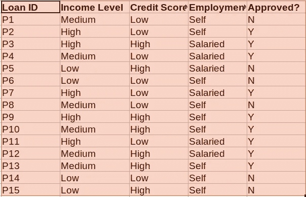
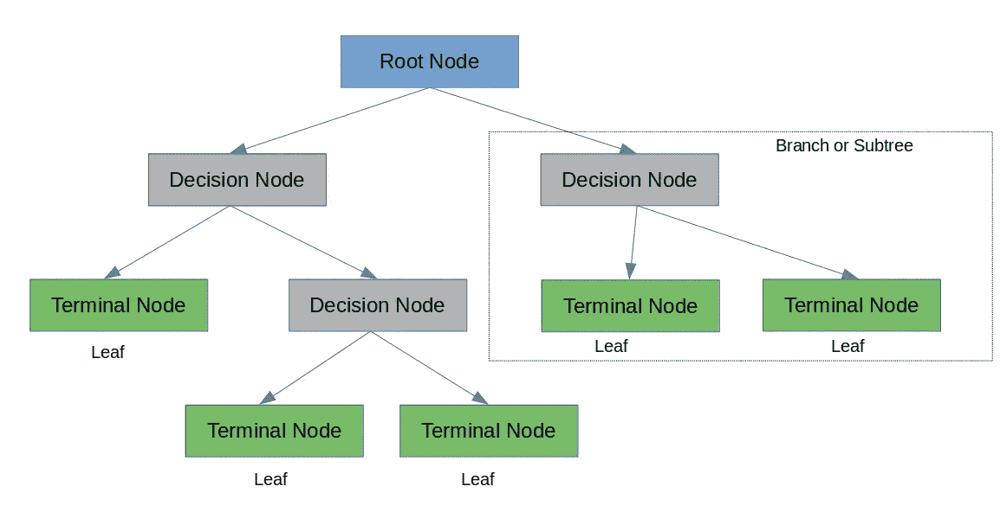
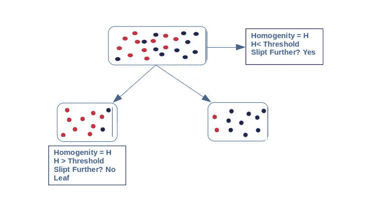
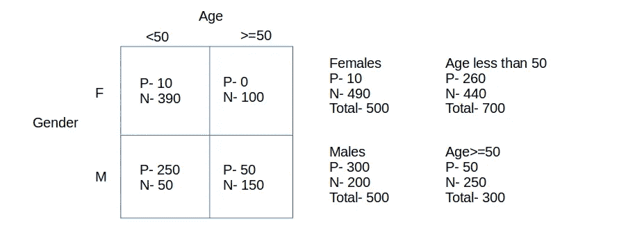
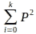
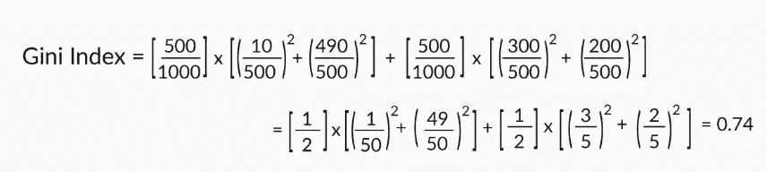
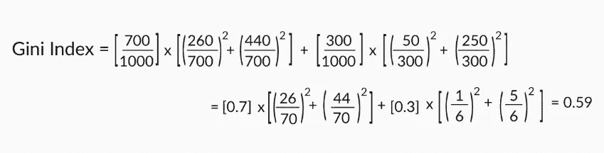
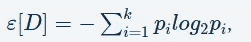
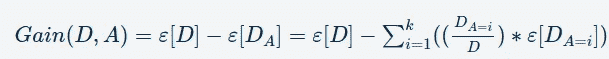

# 理解树模型

> 原文：<https://pub.towardsai.net/understanding-tree-models-d2a38a9dcd5b?source=collection_archive---------3----------------------->

## [机器学习](https://towardsai.net/p/category/machine-learning)

生活中充满了决策，最终，我们会通过一些基于逻辑的分析来衡量选择哪一个。在这一系列博客中，我们将让自己适应两个非常流行的机器学习模型— **决策树**和**随机森林。**

对于这篇博客，我们将把自己限制在**决策树**上，然后继续讨论**随机森林**业界最常用的算法之一。我们还将通过解决一个真实世界的例子来理解业务的编码部分。那我们开始吧。

# **决策树背后的直觉**

凭借高度的可解释性和直观的算法，决策树模仿人类的决策过程，并擅长处理分类数据。与逻辑回归或支持向量机等其他算法不同，决策树不会发现自变量和目标变量之间的线性关系。相反，它们可以用于**高度非线性数据的建模。**

这是一种监督学习算法，你可以很容易地解释导致特定决策/预测的所有因素。因此，他们很容易被商人理解。让我们通过下面的**贷款审批系统**的例子来理解这一点

贷款数据集

如果出现新的记录，我们需要根据这些历史数据做出决策，不管这个人是否有资格获得贷款。让我们将上述数据集的决策树可视化

贷款审批决策树

你可以看到决策树使用一个非常自然的决策过程:在一个嵌套的 if-then-else 结构中问一系列问题。

在每个节点上，您提出一个问题来进一步拆分该节点保存的数据。如果测试通过，你向左走；否则，你走右边。我们在每个节点分裂，直到我们没有得到一个纯粹的子集或达成一个决定。

# 解释决策树

让我们从决策树的角度来理解上面的内容。

决策图表

在每个决策节点，都会进行与数据集中的一个要素相关的测试，如果测试通过，则测试会进行到树的一侧，否则会进行到另一侧。测试的结果将把我们带到树的一个分支，对于一个分类问题，每个叶子将包含一个类。

在二叉决策树中，我们测试将数据集分成两部分，就像上面示例中根据雇佣类型进行决策一样。现在，如果有一个属性有 4 种值，我想根据每个值做出决定，那么它将是一个多路决策树。

决策树很容易解释。几乎总是，你能识别导致决定的各种因素。树通常被低估了将预测变量与预测联系起来的能力。根据经验，如果外行人的可解释性是你在模型中寻找的，那么决策树应该在你的列表的顶部。

# 决策树回归

在回归问题中，决策树将数据分成多个子集。决策树分类和决策树回归的区别在于，在回归中，**每片叶子代表一个线性回归模型**，而不是一个类标签。对于这个博客，我们将把自己限制在分类问题上，但是我也会在需要的地方提到回归的某些要点。

# **决策树构造算法**

让我们理解一下，决策树是如何知道应该首先对哪个属性进行拆分的？

## 同质性概念

一般来说，规则说我们应该尝试分割节点，使得产生的节点尽可能地**，**，即分割后所有的行都属于一个类。如果在上面的例子中节点是收入水平，尝试用一个规则分割它，使得所有通过规则的数据点有一个标签(即尽可能同质)，而那些不通过规则的数据点有另一个标签。

现在从上面，我们来了一个一般规则如下

同种

> 根据规则，我们会不断分割数据，直到数据的同质性低于某个阈值，因此您可以一步一步地选择属性并分割数据，这样每次分割后同质性都会增加。当产生的叶子足够同质时，你就停止分裂。什么是足够同质的？你定义了同质性的数量，当达到这个数量时，树应该停止进一步分裂。让我们看看有哪些具体的方法被用来衡量同质性。

让我们用一个假设的数据集例子来理解所有的同质性度量

我们需要根据特定人群的年龄和性别来预测他们是否能打板球。

例子

在上面的例子中，我们需要决定是否根据年龄或性别来划分，以决定这个人是否能打板球？让我们看看同质性度量来做决定

## 基尼指数

基尼指数使用数据集中各种标签概率的平方和。

基尼

**总基尼指数，**如果按性别划分**，**将是

基尼指数(性别)=(男性节点的总观察分数)*男性节点的基尼指数+(女性节点的总观察分数)*女性节点的基尼指数。

性别差异基尼指数

同样，如果我们按年龄划分，我们可以计算出基尼指数。

年龄划分的基尼指数

假设您有一个带有 2 个类别标签的数据集。如果数据集是完全同质的(所有数据点都属于标签 1)，那么找到对应于标签 2 的数据点的概率将是 0，找到对应于标签 1 的数据点的概率将是 1。所以 p1= 1，p2= 0。基尼系数等于 1，在这种情况下是最高的。同质性越高，基尼指数越高。

所以如果你必须在年龄和性别这两个分裂中做出选择。按性别划分的基尼系数高于按年龄划分的基尼系数；所以你继续按性别划分。

## 熵和信息增益

另一个同质性度量是信息增益。这个想法是利用熵的概念。熵量化了数据中的无序程度，和基尼指数一样，它的值也从 0 到 1 不等。

熵由下式给出

熵

其中，p _i 是找到带有标签 I 的点的概率，与基尼系数相同，k 是不同标签的数量，ε[D]是数据集 D 的熵。

信息增益=ε[D]ε[DA]即原始数据集的熵减去分割后分区熵的加权和。

信息增益

让我们考虑一个例子。您有四个数据点，其中两个属于类别标签“1”，另外两个属于类别标签“2”。您拆分了这些点，使得左侧分区有两个数据点属于标签“1”，右侧分区有另外两个数据点属于标签“2”。现在让我们假设你在一个叫做‘A’的属性上分裂。

1.  原始/父数据集的熵为ε[D]=[(24)log2(24)+(24)log2(24)]= 1.0。
2.  分割后分区的熵为ε[DA]= 0.5∫log2(2/2)-0.5∫log2(2/2)= 0。
3.  分离后的信息增益为 Gain[D，A]=ε[D]ε[DA]= 1.0。

因此，对属性‘A’上的原始数据集进行拆分后的信息增益为 **1.0，**，信息增益的值越大，拆分后数据的同质性越好。

> 对连续输出变量进行分割？您可以使用与线性回归模型类似的方式计算数据集(拆分前后)的平方。因此，拆分数据，使拆分后获得的分区的 R2 大于原始或父数据集的。换句话说，拆分后模型的拟合应该尽可能‘好’。

我希望这个博客能让你以一种非常简单的方式理解决策树。在本系列的下一篇博客中，我们将讨论与决策树的相关的**超参数**，并理解"**随机森林的随机性是什么:)"**

# 参考

1.  [http://ogrisel . github . io/sci kit-learn . org/sk learn-tutorial/modules/tree . html](http://ogrisel.github.io/scikit-learn.org/sklearn-tutorial/modules/tree.html)
2.  [https://www . udemy . com/course/complete-data-science-and-machine-learning-using-python/](https://www.udemy.com/course/complete-data-science-and-machine-learning-using-python/)
3.  Upgrad 的数据科学项目(【https://www.upgrad.com/】T2

# 链接到我的媒体简介

[https://commondatascientist . medium . com/medium-to-bond-de 3c 81 e 193 b 8](https://commondatascientist.medium.com/medium-to-bond-de3c81e193b8)