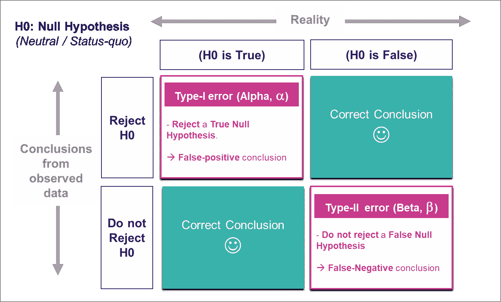
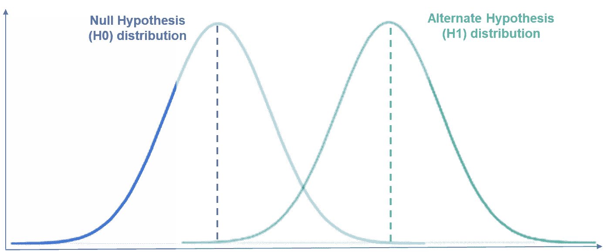
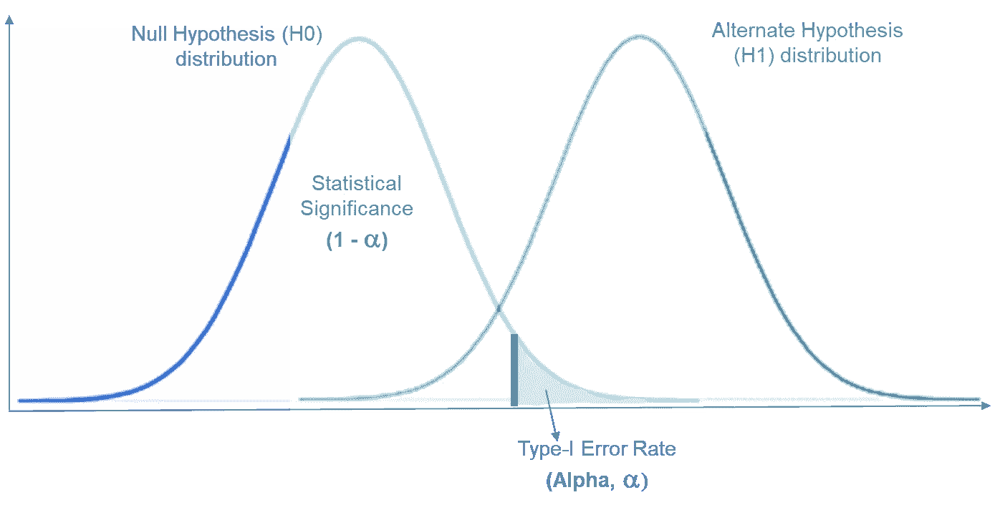
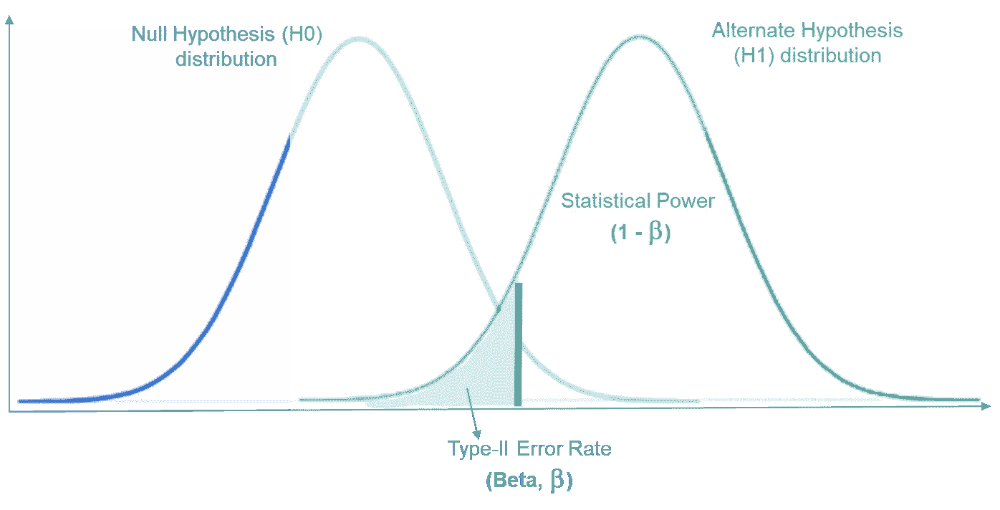
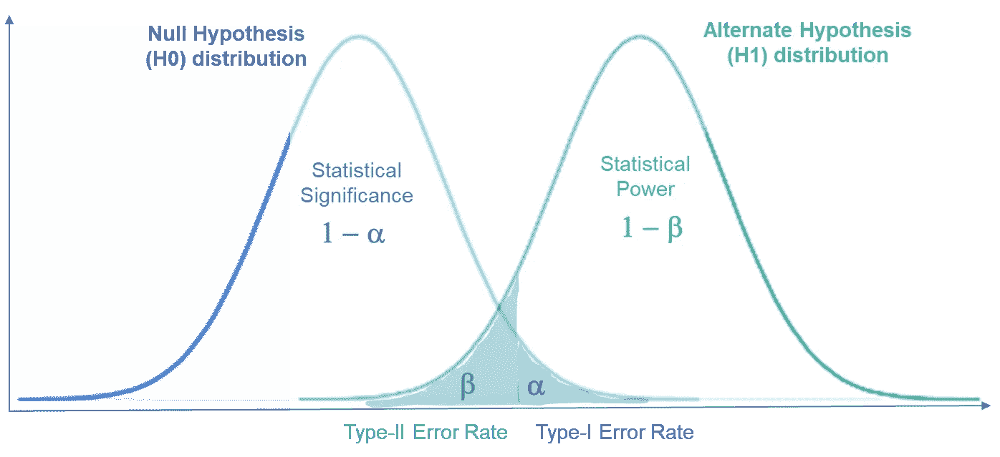

# 理解假设检验中的第一类和第二类错误

> 原文：<https://pub.towardsai.net/understanding-type-i-and-type-ii-errors-in-hypothesis-testing-956999e60e17?source=collection_archive---------1----------------------->

## 深入了解支撑至关重要的统计假设检验的概念。

(图片由作者提供)

不管是有意还是无意，我们每天都在假设一些事情！ **—**我们都会想到*路线 A 是否会比路线 B 花费更少的时间，平均投资回报率 X 是否大于投资回报率 Y，电影 ABC 是否比电影 XYZ 更好。在所有这些情况下，我们都在测试我们头脑中的一些假设。*

对于数据科学家来说，建立假设，使用数据证明/反驳假设，并帮助企业做出决策就像面包和黄油一样。数据科学家通常依靠概率来理解偶然观察到数据的可能性，并使用它来围绕假设做出结论。**概率为*(差不多！)*永远不能 100%** ，反过来暗示**我们永远不能 100%确定自己的结论**。

因此，在围绕我们的假设得出结论时，总会出现出错的情况。

*下面的帖子旨在对统计假设检验中出现的第一类和第二类错误提供直观而详细的解释。*

# 假设检验

假设检验是数据科学家通过观察样本数据来检验他们围绕总体参数的假设(或假说)的领域。*(我们很少有整个人群的数据)。*

*这通常是通过从假设的中性状态(称为零假设)开始，并基于观察到的样本数据来证明或反驳。*

> **零假设(H0)是中性假设，假设总体数据保持现状(无关系或无差异)。**
> H1 是 H0 的候补，被称为候补假说。

*假设检验流程:*
**假设 H0 →观察样本数据→拒绝或不拒绝 H0**

*   我们假设一个中性的 H0 是真实的，并在观察到的数据中寻找“拒绝”或“不拒绝”H0 的证据。
*   基于观测样本数据，计算观测统计量和观测 P 值；*即从我们的观测样本中得到观测统计量的概率，*假设 H0 为真。

*要了解更多关于 P 值的信息，请参考下文..*

 [## p 值——正确解释的介绍

### 在 5 分钟内理解一个广泛使用(和滥用)的统计概念

towardsdatascience.com](https://towardsdatascience.com/p-values-an-introduction-to-correct-interpretation-14417771dd0f) 

*   然后将观察到的 P 值与数据科学家预先确定的显著性水平(或α值)进行比较。这个 Alpha 值充当一个阈值，超过这个值，您将认为您的观察结果在统计上是显著的。
*   基于这种比较*(观察到的 P 值与预先选择的阈值α值)*，你对你假设的 H0 做出结论:
    *—观察到的* ***P 值*** *≤预先选择的****α水平*** *→* ***拒绝 H0
    —*** *观察到的* ***P***

由于观察到的 P 值是一个概率，因此总是有可能得出“拒绝”或“不拒绝”零假设的错误结论。因此，一个有统计学意义的结果，虽然被广泛接受，但仍然不能 100%肯定地证明或否定一个研究假设。

在下图-1 中，左边是假设的零假设(H0)人口分布，右边是替代假设(H1)人口分布。
*(注:两者都是未知的和假设的，因为没有整个人口的数据)。* 观察到的样本将位于这些分布的某处，基于此我们将得出关于我们的零假设(H0)的结论。

图片-1 |总体的零假设(H0)分布和替代假设(H1)分布(图片由作者提供)

*请注意，如果分布没有重叠，我们将永远不会在结论中观察到错误。然而，在实践中，它们几乎总是重叠的。
→* ***第一类和第二类误差出现在这两种分布重叠的地方。***

> 误解:我们会“拒绝”或“接受”无效假设，这是一个常见的误解。
> 
> -请注意，我们**不能“接受”无效假设。我们可以根据数据中观察到的证据“拒绝”,也可以因为观察到的数据没有带来足够的重要证据而“不拒绝”。**

## 假设检验——可能性。

现实中的 H0 只有两种选择——要么是真，要么是假。类似地，基于观察到的数据，我们只能得出两种可能的结论——我们要么拒绝 H0，要么不拒绝 H0。

→综合这些，我们看到关于 H0 只有四种可能的互斥的、集体穷尽的(MECE)可能性:

1.  *现实* — **H0 是真的**和*观测数据得出* — **拒绝 H0**
2.  *现实*——**H0 是真的**和*观测数据得出*——**不排斥 H0**
3.  *真实* — **H0 为假**和*观测数据得出* — **拒绝 H0**
4.  *真实* — **H0 为假**和*观测数据得出* — **不拒绝 H0**

场景中请注意:

*   **(2)和(3)** ，我们正在根据观察到的数据做出**正确的结论**。
*   **(1)和(4)** ，我们正在做出**错误的结论**，因为观察到的数据发现与现实相反。在场景(1)和(4)中，我们分别犯了第一类和第二类错误。

让我们详细了解这些错误..

# 1.第一类错误。

> 第一类错误指的是**拒绝一个实际上为真的无效假设**的情况。
> 这意味着，根据我们观察到的数据得出的结论是**观察到的结果具有统计显著性，而在现实中，它们纯粹是偶然存在的**。

如上所述，“拒绝”或“不拒绝”零假设取决于观察到的 P 值和预先确定的α值。
→由于**观察到的 P 值将小于预先选择的α水平**，可能会出现真零假设被拒绝的情况。这就是第一类错误的含义。

> I 型错误→做出假阳性结论。

*请注意，对于第一类错误场景我们有:
给定现实:* **H0 对总体为真***观察结论:* **拒绝 H0**

对于总体为真的零假设，如果我们重复取样，我们将得到一条零假设分布曲线，显示所有可能观察到的样本结果的概率。
*(下图-3 左侧 H0 分布)*

*   因为我们正在观察一个样本，基于这个样本我们拒绝了 H0
    →这意味着**这个观察到的样本一定位于 H0 分布曲线的最右边，*与 H1 分布曲线重叠。*** *(请看下面代表这个场景的图片-2)*

图片-2 |犯第一类错误的概率(图片由作者提供)

犯第一类错误的区域称为**临界区域**，位于零假设分布曲线的右尾端。
这是由我们预先选择的 Alpha 值决定的。

> *如果我们观察到的结果落在这个区域，我们将拒绝零假设*(对于这些场景，观察到的 p 值<α)。 *→由于 H0 在现实中是真实的，我们会做出假阳性的结论*

因此，**α是我们在研究中可能遇到的第一类错误率**。

# 2.第二类错误。

> 第二类错误指的是**没有拒绝实际上为假的零假设**的情况。
> 它的意思是，根据我们观察到的数据推断出**观察到的结果在统计上不显著，而实际上它们是**。

> 第二类错误→做出假阴性结论。

请注意，这可能是因为缺乏证据，也就是说，我们的研究可能没有足够的统计能力来检测某个效应大小。

> **产生第二类错误的概率用β**表示。
> 一项研究的统计功效定义为，**功效= 1—β**

你可以通过确保你的研究有很高的统计功效来减少犯第二类错误的机会。

*请注意，对于第二类错误我们有:
给定现实:* **H0 对总体是假的**和*观察结论:* **不排斥 H0**

对于总体为假的零假设，如果我们从总体中重复取样，我们将得到一个替代假设分布曲线，显示所有可能观察到的样本结果的概率。
*(下图-4 右侧 H1 分布)*

*   因为我们正在观察一个样本，根据这个样本，我们没有证据否定 H0。
    →这意味着**这个观察到的样本一定位于 H1 分布曲线的最左侧，*与 H0 分布曲线*** *(请参见下面代表这种情况的图片-4)*

图片-3|犯二类错误的概率(图片由作者提供)

**β是第二类错误率，由左边的阴影区域表示。**右边剩余区域代表统计功效。

> 如果我们观察到的结果落在这个区域，我们将不能拒绝零假设，即使我们知道 H0 对总体是假的。
> →我们正在做出**假阴性结论**。

# 举几个例子。

**#1:测试帮助疾病的新药** *H0:新药无效。H1:新药有效*

*   *I 型错误* →得出新药有效的结论，但实际上并不有效。
*   *第二类错误* →得出新药无效的结论，而实际上它能有效治疗疾病。

**#2:刑事审判**
*H0:人是无辜的。H1:人是有罪的*

*   第一类错误 →断定一个人有罪，而实际上他是无辜的。*(即无辜者被送进监狱)*
*   *第二类错误* →断定一个人是无辜的，而实际上他是有罪的。*(即罪犯被释放)*

# **I 型和 II 型误差之间的权衡**。

我们已经知道，在假设检验中，我们通过将观察值与预先确定的临界值(α)进行比较来“拒绝”或“不拒绝”假设。

*考虑以下使 Alpha 变低和变高的情况:*

*情况 1:* **如果 Alpha-level 变得更严格** *(即 Alpha 值更低)*，我们在拒绝 H0 时会更严格，在不拒绝 H0 时会更宽松。
→ **拒绝 H0 的可能性较小，不拒绝 H0 的可能性较大。**
*(请看两者如何齐头并进)*

*   在 H0 在现实中是正确的情况下，不太可能拒绝 H0 将导致我们比以前犯更少的 I 型错误。
*   在 H0 在现实中是错误的情况下，更有可能不拒绝 H0 将导致我们比以前犯更多的第二类错误。

*情况 2:* **如果 Alpha-level 变得不那么严格** *(即 Alpha 的值更高)*，我们在拒绝 H0 时的限制性会更小，在不拒绝 H0 时的限制性会更大。
**→更有可能拒绝 H0，不拒绝 H0 的可能性较小。** *(请看两者如何齐头并进)*

*   在 H0 在现实中是正确的情况下，更有可能拒绝 H0 将导致我们比以前犯更多的 I 型错误。
*   在 H0 在现实中是错误的情况下，不拒绝 H0 的可能性降低将导致我们比以前犯更少的第二类错误。

*由此可见，显然存在一种取舍。****第一类和第二类误差是相关的，一个增加另一个减少，反之亦然。***

> ***第一类和第二类错误相互反向影响**。*

**同样，从下面的图-5 可以直观的看出*，如果α增加则β减少，如果β减少则α增加。*

**

*图片-4 |犯第一类和第二类错误的概率(图片由作者提供)*

*在犯第一类和第二类错误的风险之间取得平衡是很重要的。因为减少一个会增加另一个，反之亦然。*

# *哪个更糟？*

*这个问题没有简单的答案，完全取决于被检验的假设和做出错误结论的代价。 **——***如果制造 I 型的成本较高，应该避免。同样，如果制造ⅱ型的成本比ⅰ型差很多，就应该优先考虑。**

> *然而，一般来说，第一类错误被认为有更多的后果。*

*这是因为，第一类错误意味着违背现状的假设(H0)和**可能导致引入新的变化**，这可能被证明具有不利影响。然而，第二类错误意味着不能拒绝现状的假设(H0)和**可能只会导致错失机会**。*

**..但是，正如前面所说…**

> *这完全取决于制造第一类/第二类错误的成本。*

# *摘要*

*假设检验是数据科学中一个非常重要的概念。统计学的力量允许我们对人口做出假设，观察数据样本，使我们能够拒绝或不拒绝我们的假设并得出结论。假设检验中有两种可能的错误——第一类和第二类。*

*   **假设检验过程:*
    假设一个**中性 H0** →观测数据*(比较* ***观测 P 值与预先决定的α水平*** *)* → **拒绝或不拒绝 H0***
*   **I 型错误:*
    -拒绝真零假设
    -得出假阳性结论*
*   *α值为第一类错误率— *预选阈值。**
*   *第二类*错误:*
    -不拒绝假零假设
    -得出假阴性结论*
*   *β为第二类错误率*。研究的统计功效= 1-β**
*   *第一类和第二类错误相互影响。减少一个总是增加另一个，反之亦然。*
*   *一般来说，**第一类错误被认为比第二类错误**更重要。然而，这完全取决于被检验的假设以及围绕我们的假设做出这些错误结论的代价。*

**..享受第一类和第二类错误。**