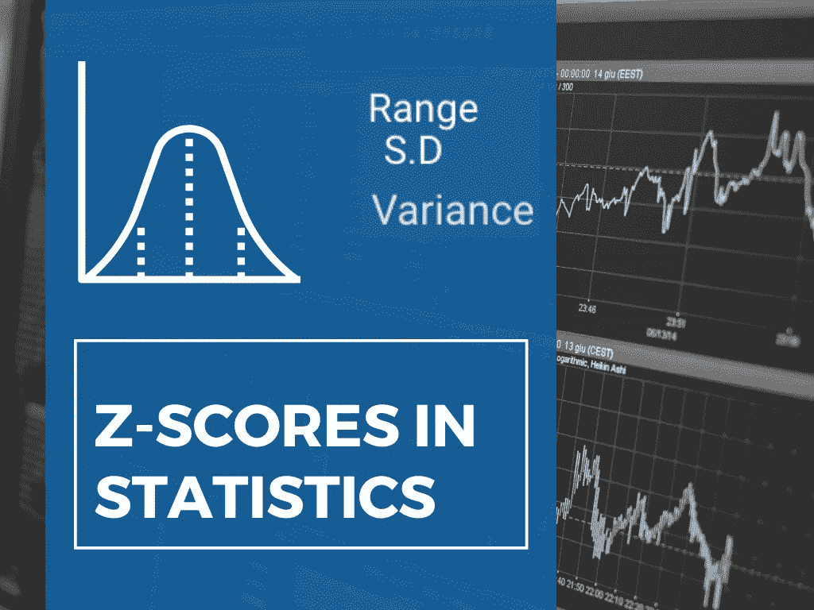
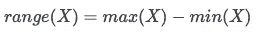
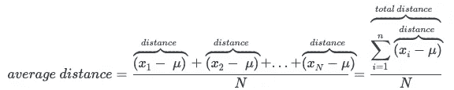
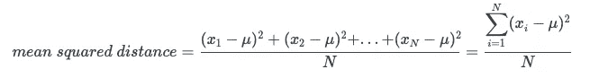
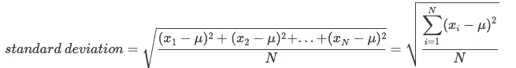
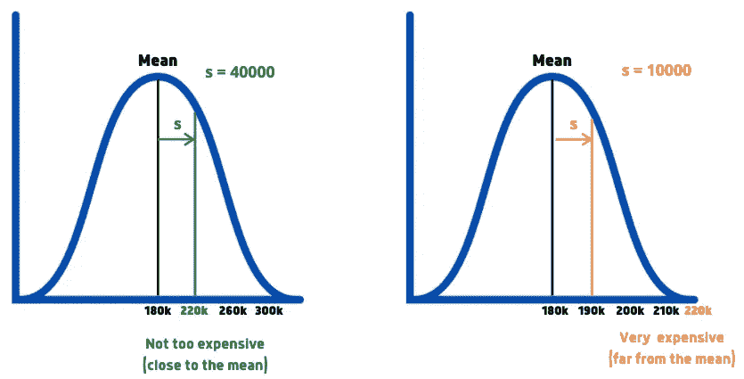
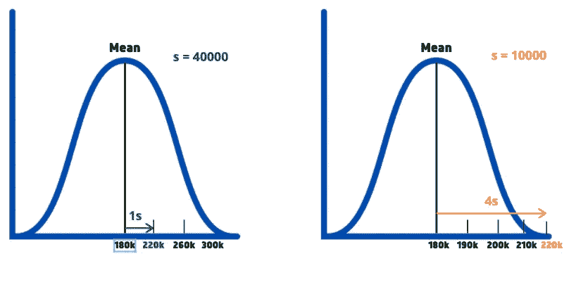
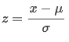

# 了解统计学中的 Z 分数

> 原文：<https://pub.towardsai.net/understanding-z-scores-in-statistics-c94f38fc3cc5?source=collection_archive---------2----------------------->

## [统计数据](https://towardsai.net/p/category/statistics)

## 深入探究 Z-score，这是统计学中广泛使用的指标



使用 Canva 设计。

我们大多数人都听说过/用过统计学中的术语均值、中位数和众数。为了获得更好的想法，你可以在这里阅读我的文章。现在，让我们来讨论可变性和 Z 分数的度量。你们中有多少人知道 Z 分数在日本被用来评估学生的学习成绩？世卫组织在儿童成长调查中也使用 z 分数。为了理解 Z 分数，让我们试着理解可变性测量背后的直觉。

# 差异量数

> 可变性(也称为扩散、分散)指的是数据的扩散程度。

## 范围

例如，考虑以下分布—
A = [6，6，6，6]
B = [1，6，1，6]

列表 A 中的值没有变化，而列表 B 中的值显示出一些可变性。如果我们要给两个列表分配一个可变性分数，我们会给 a 分配**0**。**B 的分数是多少？**

我们需要一个*度量*来描述给定分布的可变性。一种直观的方法是找出分布的最大值和最小值之间的差异(也称为**范围**)。对于列表 A，最大值和最小值是 6，
因此，对于列表 B，最大值是 6，最小值是 1。
因此，max(B) — min(B) = 5。

一般来说，分布 X 的范围由下式给出



范围的问题在于它只考虑了分布中的两个值。例如，考虑下面的分布-
C = [1，1，1，1，1，1，1，1，1，1，1，21]

由于 C 语言没有太多的可变性，我们期望可变性接近于零。如果我们计算上述分布的范围

范围(C) =最大(C)-最小(C)= 21–1 = 20。

与零相比，这是非常高的**,并且似乎不是可变性的*合适的测量*。由于该范围只考虑两个值，因此对异常值非常敏感。**

## 方差和标准差

为了得到一个更平衡的可变性度量，如果我们考虑分布的每个值会更好。解决这个问题的一个方法是。取一个参考值(平均值/中值)。
2。找出每个值与参考值的距离。
3。求所有距离的平均值。(距离总和/总距离数)


使用 Canva 设计。

代数上的这个方法可以用下面的方式来表达。考虑均值为μ，分布为[X₁，X₂，X₃，X₄，…..Xn】。



现在，让我们考虑以前使用的分布-
C = [1，1，1，1，1，1，1，1，1，21]，平均值= 3

如果我们计算平均距离，我们观察到分子是零。为了克服这个问题，我们考虑距离的平方，而不仅仅是分子的差异。

尽管取绝对值是另一种解决方案，但平方函数是首选，因为它具有

a)更好的性质(如平滑和可微分)

b)也放大了异常值的影响。



这个*表示距离的平方*，也称为**方差**。现在让我们计算分布 c 的方差。

36 的值高于预期。这是直接平方距离的结果，并且反映在较高的值中。在某些情况下，也会出现单位不匹配的情况。

为了克服上述问题，我们取距离平方和的平方根，这就是所谓的**标准差。**



一般来说，标准偏差是最常用的传播度量。从现在开始，我们将使用一个[数据集](https://www.kaggle.com/prevek18/ames-housing-dataset)来描述 2016 年到 2010 年在美国埃姆斯市出售的房屋的详细情况。数据集中有 2930 行，每行描述一栋房子。

让我们试着找出房屋数据集中“销售价格”列的标准偏差。

```
print(standard_deviation(houses['SalePrice']))Output - 79873.05865192247
```

“销售价格”列的含义是

```
print(houses['SalePrice'].mean())Output - 180796.0600682594
```

平均值告诉我们，一所房子的平均价格大约是 1，80，796 美元，但这并不意味着所有的房子都会有 1，80，796 美元的价格。会有价格在 120，000 美元左右的房子，也很少有价格在 240，000 美元的。标准差会给我们一个价格相对于平均值如何变化的图像。因此，79873 美元的标准差意味着价格在平均值上下浮动大约 79873 美元。

标准差不是为价格限制设定界限，而是试图解释大多数房屋属于**平均值+标准差**或**平均值-标准差**的类别

# z 分数

让我们从“销售价格”列中选择一个示例价格。

```
print(houses['SalePrice'].sample(1, random_state = 0))Output:
2216    220000
Name: SalePrice, dtype: int64
```

`random_state = 0`确保每次都选择相同的元素，因此可以在将来需要时复制结果。

我们出价 22 万美元。**这个价格是便宜，一般，还是贵？**要回答这个，我们可以求均值，算出来。由于我们已经计算了平均值(1，80，796 美元)，我们可以得出结论，随机选择的价格比平均值更贵。

但是我们如何估计这个价格是否比平均值稍微偏高或者偏高呢？
这个可以用标准差来回答。为了更好地理解这一点，考虑两个销售价格的正态分布样本(创建用于解释)。两种分布都具有相同的平均值 180，000，但标准偏差不同。



使用 Canva 设计。

对于一个标准差较大的样本，可以看到我们的值接近均值，说明 220k 的价格很常见(关于其他价格)。然而，对于具有较小标准偏差的样本，我们可以看到我们的值远离平均值，这表明 22 万的价格是昂贵的(关于其他价格)。

在上面的过程中，我们通过计算均值、标准差来确定 220000 美元的价格贵不贵，并把它们标绘出来得到清晰的画面。我们还依赖于缺乏所需准确性的视觉图。我们需要找到一种更快、更准确的方法来测量给定值与平均值的差距。

现在，让我们再看一下上面的分布。在这两个分布中，我们随机选择的值 **$2，20，000** 和平均值 **$1，80，000** 之间的**距离**是 **$40，000** 。在左侧的分布中，该距离**正好等于标准偏差**(s = 40，000)，而在右侧的分布中，该距离是标准偏差**的 4 倍**(s = 10，000)。

记住以上两点，我们可以说，在左侧分布的情况下，2，20，000 美元距离平均值 *1 个标准偏差*，我们可以得出结论，2，20，000 美元相对接近平均值，与其他房屋相比并不昂贵。

在右侧分布的情况下，2，20，000 美元距离平均值 *4 个标准偏差*，我们可以得出结论，2，20，000 美元相对不常见且昂贵。



使用 Canva 设计。

从代数上来说，我们可以通过计算给定值和平均值之间的距离，并将该距离除以分布的标准偏差来计算。在我们的例子中，代码看起来像—

```
distance = 220000 - houses['SalePrice'].mean()
st_devs_away = distance / houses['SalePrice'].std()
```

代表偏离平均值的标准偏差数量的值通常被称为**标准分数**或 **Z 分数**。



其中 x 表示值，μ表示平均值，σ表示标准差。

一般来说，Z 分数可以是正的(T0)和负的(T3)。让我们考虑一下左边的分布，有一个标准差(s =$40，000)。我们已经知道平均值是 18 万美元。值为 1，00，000 美元的 Z 得分将是 **-2** ，因为它比平均值小 2 个标准差。

# 结论

在这篇文章中，我试图解释可变性的度量和它们的直觉。我还解释了在日常生活中广泛使用的 Z 分数的概念。我很乐意听到你的回答，更多的 Z 分数的应用。我希望你今天学到了新东西！在那之前，注意安全！

如果想联系，**在**[**LinkedIn**](https://www.linkedin.com/in/saiteja-kura-49803b13b/)**上联系我。**

# 参考

1.  数据请求. io