# 使用开源 Monk 工具包进行水下垃圾检测

> 原文：<https://pub.towardsai.net/underwater-trash-detection-using-opensource-monk-toolkit-ad902db26ea6?source=collection_archive---------2----------------------->

## [计算机视觉](https://towardsai.net/p/category/computer-vision)

## 这个应用程序的完整代码可以在 Monk Object Detection 库的[应用程序模型动物园](https://github.com/Tessellate-Imaging/Monk_Object_Detection/blob/master/application_model_zoo/Example%20-%20Underwater%20Trash%20Detection.ipynb)中找到

# 介绍

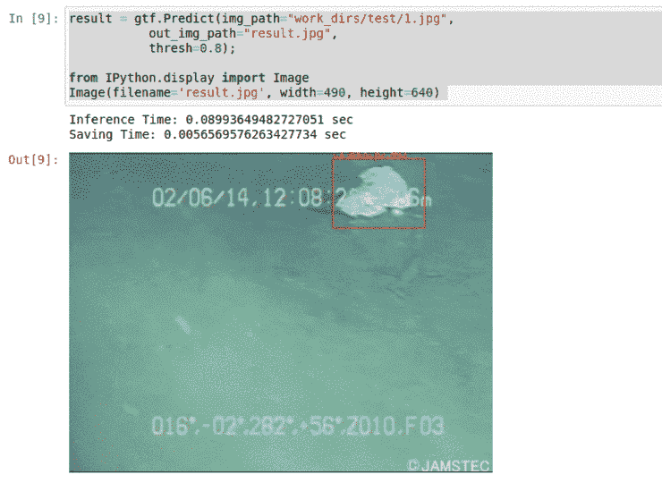

**水下垃圾**是一个巨大的环境问题，严重影响水生栖息地。海洋废弃物包括**塑料**、不可生物降解**工业废弃物**、污水污泥、放射性物质堆等。

根据在 [Condor Ferries](https://www.condorferries.co.uk/marine-ocean-pollution-statistics-facts)
★发表的统计，超过 **10 万只海洋动物因塑料垃圾
而死亡**★据估计，我们的海洋中约有 **5.25 万亿个塑料碎片**
★*70%的垃圾碎片沉入海洋*，约 15%漂浮，其余被冲上岸。

[**大太平洋垃圾带**，](https://www.azocleantech.com/article.aspx?ArticleID=1071)也被称为太平洋垃圾漩涡，横跨夏威夷和加州之间大约 617 公里。而这还是整个海洋污染的一小部分。

为了解决这个问题，许多倡议正在实施，如▹海洋清洁项目、▹清洁海洋项目、▹海滨项目等等！

这些项目的一个关键部分是使用机器人 **★在比人工清理更短的时间内清理更大的区域。
★进入人类潜水员无法到达的区域**

**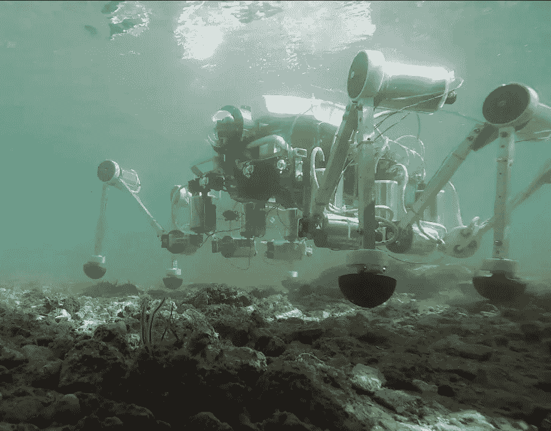**

**从海底移除塑料的机器蟹。[学分](https://www.asme.org/topics-resources/content/a-robot-crab-to-clean-the-ocean)**

> ****这些机器人的一个关键组成部分是识别不同的对象并采取相应的行动，这就是深度学习和机器视觉进入该领域的原因！！！****

# **关于数据集和库**

**让我们作为深度学习工程师投入进来，做出最少的贡献，让这个世界变得更美好**

**为了创建一个检测器，我们使用了 [**Trash-ICRA19**](https://conservancy.umn.edu/handle/11299/214366) **数据集**
*包含 5K+训练图像和 1K+测试图像
*数据来自海洋废弃物 *J-EDI 数据集*
*该数据集标记有垃圾和海洋生物的边界框注释。(为了简单起见，我们只对垃圾数据进行训练)**

**为了训练和推断，我们将使用[**Monk 对象检测库**](https://github.com/Tessellate-Imaging/Monk_Object_Detection)
*它作为*低代码可轻松安装的包装器*用于主要的对象检测算法
*在 15+管道上选择的一个这样的算法是 [*MMdetection*](https://github.com/open-mmlab/mmdetection)**

**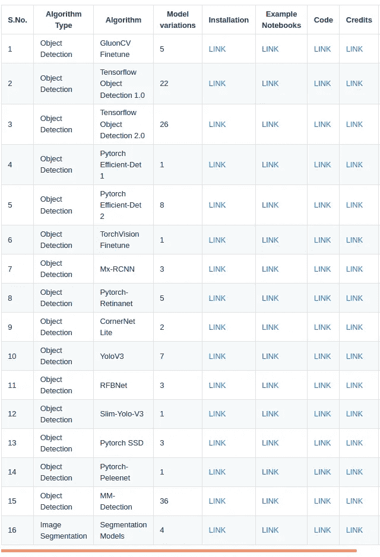**

****支持 80 多种不同型号的物体检测管道列表****

> ****Monk libraries 通过** ★ **一步到位**安装
> ★ **低代码语法** —在不到 10 行代码中训练
> ★ **导出模型**以便轻松推断
> ★轻松语法**在任何对象检测管道中摄取自定义数据**。克服更改代码和配置以插入自定义数据集进行训练的麻烦。**

# **装置**

**安装相当简单 ****克隆库
*运行安装脚本*****

****对
▹python-3.6
▹cuda-9.0、9.2、10.0、10.1、10.2
▹ *的支持也在 colab 上运行！！！*****

# ****数据准备****

****训练数据集按照 Pascal VOC 格式(XML 文件)进行标记****

****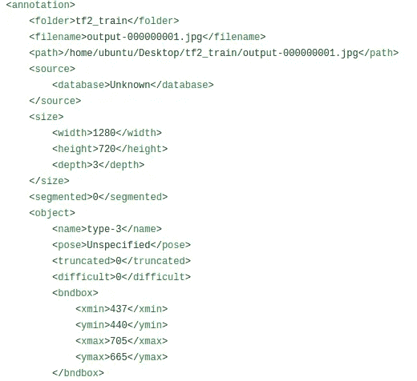****

****PASCAL-VOC 格式。[学分](https://github.com/Tessellate-Imaging/Monk_Object_Detection/blob/master/example_notebooks/sample_dataset/ship/voc/output-000000001.xml)****

****并且训练引擎要求数据为 COCO 格式****

****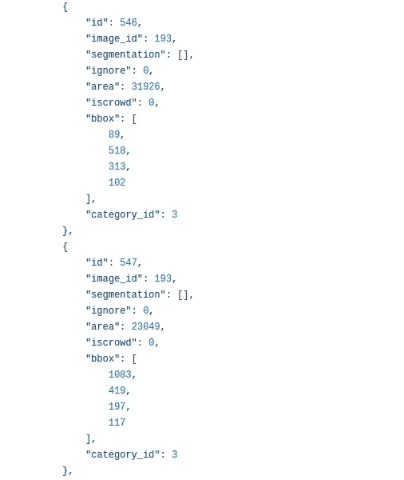****

****COCO Json 格式[学分](https://github.com/Tessellate-Imaging/Monk_Object_Detection/blob/master/example_notebooks/sample_dataset/ship/annotations/instances_Images.json)****

*****相同的代码(从下载到格式化数据集)可在本* [*Jupyter 笔记本*](https://github.com/Tessellate-Imaging/Monk_Object_Detection/blob/master/application_model_zoo/Example%20-%20Underwater%20Trash%20Detection.ipynb) 中获得****

# ****培养****

****使用原始的 MMdetection 库进行训练需要对配置文件和代码的参数进行大量修改。对于 Monk，使用简单的 pythonic 语法更容易做到这一点。****

*****完整代码可在本* [*jupyter 笔记本*](https://github.com/Tessellate-Imaging/Monk_Object_Detection/blob/master/application_model_zoo/Example%20-%20Underwater%20Trash%20Detection.ipynb) *中找到。(下面提到的都是相同的重要片段)*****

****★步骤 1 —导入并启动培训引擎****

****★步骤 2 —将训练和验证数据集路径添加到检测器****

****★步骤 3 —设置数据集参数
*注意:批量大小为 8 需要 10 GB 的 RAM****

****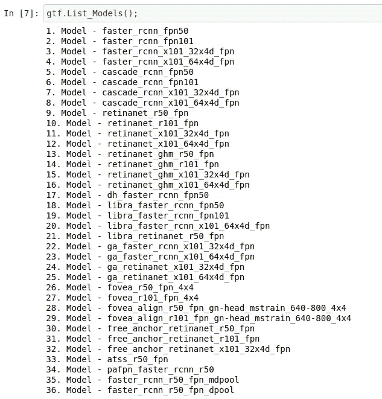****

****★步骤 4 —从 35 种不同的型号中选择型号****

*****在本教程中，我们将使用 retinanet_r50_fpn(关于此型号的更多详细信息，请参见附录)*****

****★步骤 5—设置学习率和 sgd 优化器参数****

****★步骤 6——设置训练和验证的时期数****

****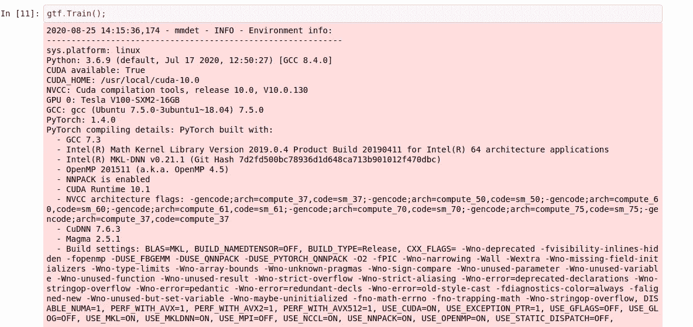****

****★开始训练流程！！！****

****一旦模型被训练，我们就在样本图像或视频上测试模型****

# ****推理****

****使用 Monk 运行推理甚至更简单****

****★步骤 1 —导入并启动推理机****

****★步骤 2 —加载训练好的模型****

****★步骤 3—对图像进行推理****

****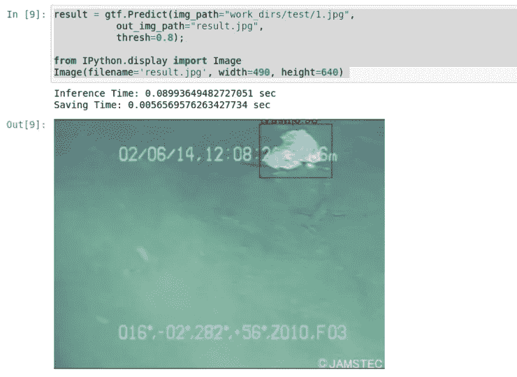****

****最终输出可以以这种方式显示在 jupyter 笔记本中！！****

****在 Nvidia V-100 GPU 上，检测器平均运行速度为 15 fps。为了修剪和优化模型，需要将它输入 TensorRT 引擎，很快将会发布一个*教程。*****

****搞定了。！！同样的引擎**可以部署在任何地方**。*即将发布在 raspi-board 和 Nvidia nano 板上部署的教程。*****

****您可以使用该库来试验不同的模型，如级联 RCNN 或更快的 RCNN；甚至可以从 [Monk 对象检测库](https://github.com/Tessellate-Imaging/Monk_Object_Detection)中试验不同的管道，如 Tensorflow 对象检测 API[v 1.0](https://github.com/Tessellate-Imaging/Monk_Object_Detection/tree/master/12_tf_obj_1)或 [V2.0、](https://github.com/Tessellate-Imaging/Monk_Object_Detection/tree/master/13_tf_obj_2)或 [YoloV3、](https://github.com/Tessellate-Imaging/Monk_Object_Detection/tree/master/7_yolov3)等****

****编码快乐！****

# ****附录— 1****

****关于 RetinaNet 架构和培训细节****

****根据 [Keras 网站](https://keras.io/examples/vision/retinanet/)上提供的信息****

******RetinaNet** 是一个
★ **单级**检测器
★使用**特征金字塔网络**在多个尺度上高效检测物体
★引入了一个新的损失**焦点损失函数**，以缓解前景-背景类别极度不平衡的问题****

****作为基础网络，在本教程中，我们使用 **Resnet50** 模型从图像中提取特征****

****关于 retinanet 的更多支持文献
* [使用 Retinanet 进行对象检测](https://www.wandb.com/articles/object-detection-with-retinanet)
*[retina net 背后的直觉](https://medium.com/@14prakash/the-intuition-behind-retinanet-eb636755607d)****

****关于训练的附加细节使用 **Resnet50** 作为基础模型提取
特征
* **焦点损失**用于 retinanet 的分类分支
* **L1 回归损失**用于 FPN bbox 估计器分支
* **SGD** 具有动量功能的优化器用于训练
* **学习率**预定**每减少一个******

# ****附录— 2****

****更多关于僧库的信息****

****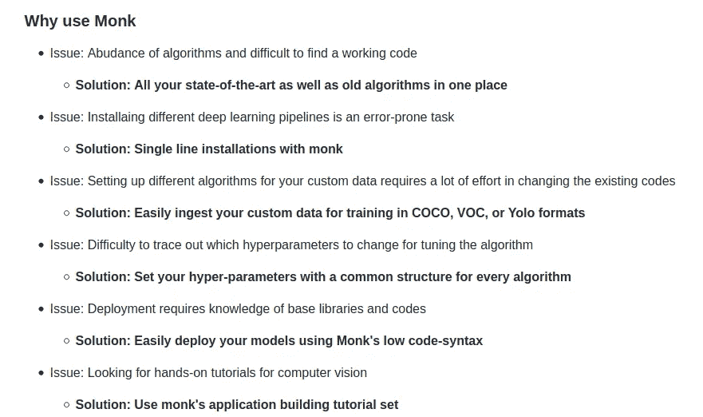****

******整套包括 3 个库:******

****★ [和尚形象分类](https://github.com/Tessellate-Imaging/monk_v1)****

****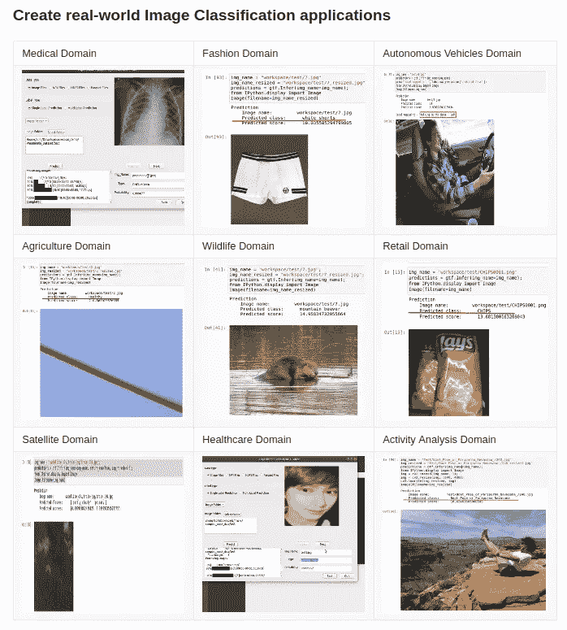****

****★ [和尚物体检测](https://github.com/Tessellate-Imaging/Monk_Object_Detection)****

****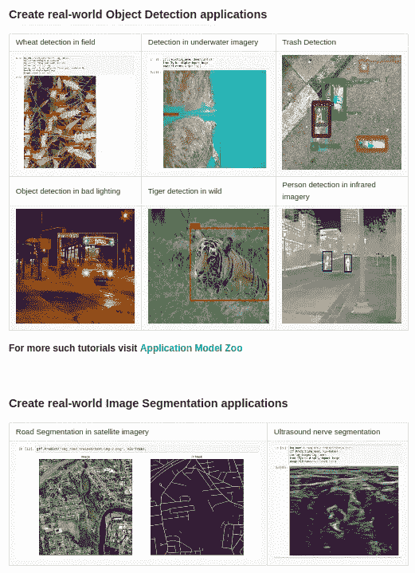****

****★和尚工作室****

****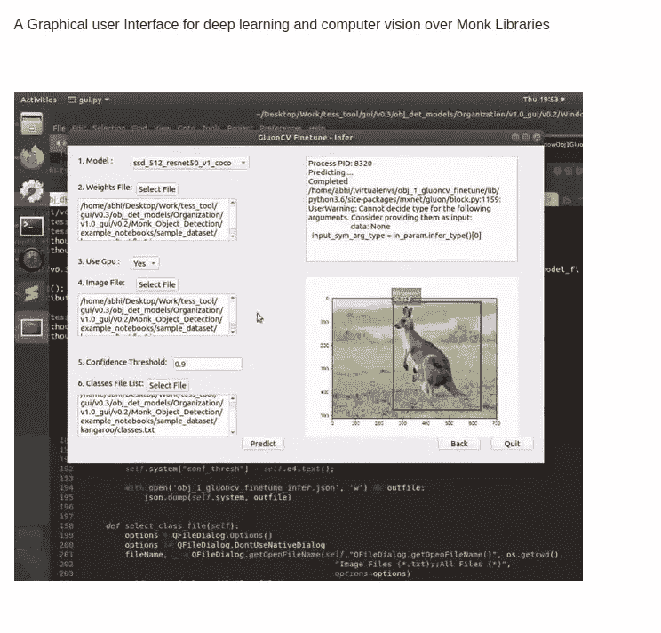****