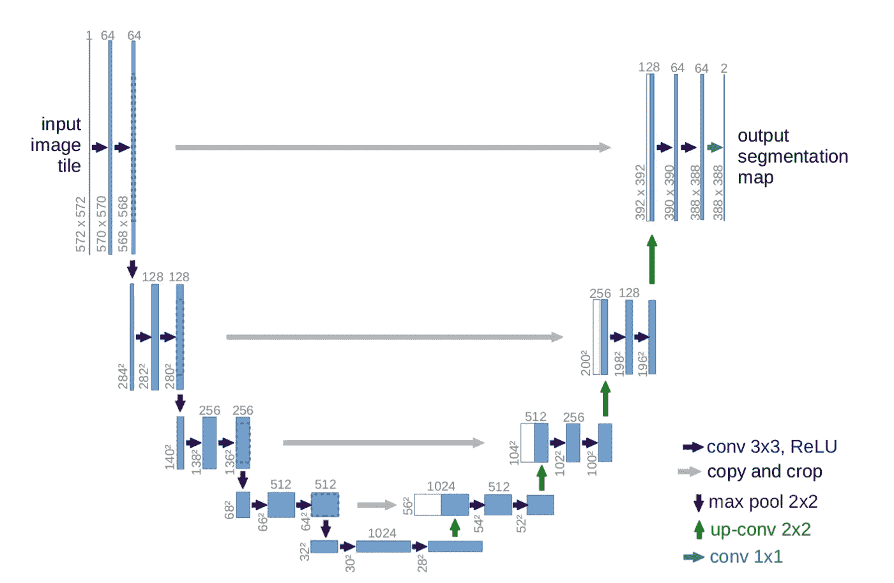
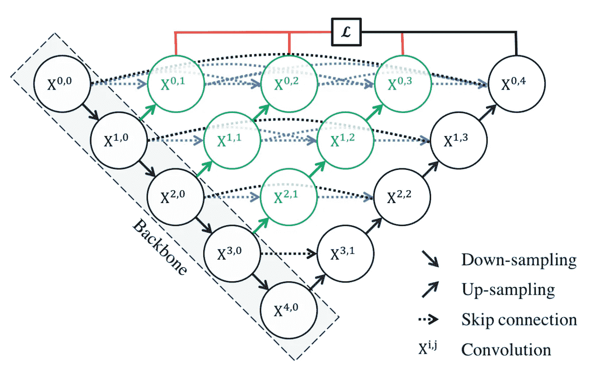
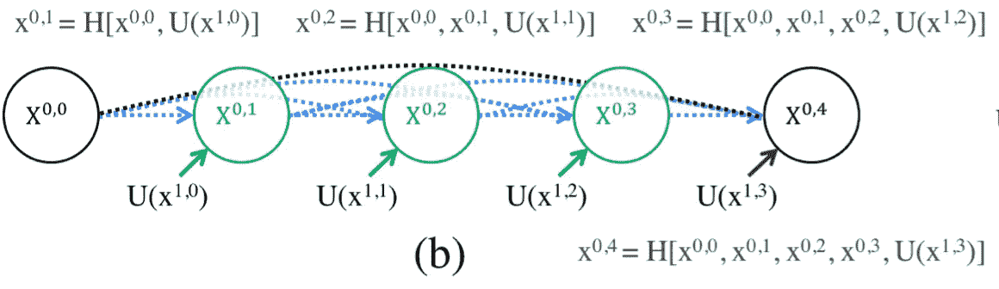
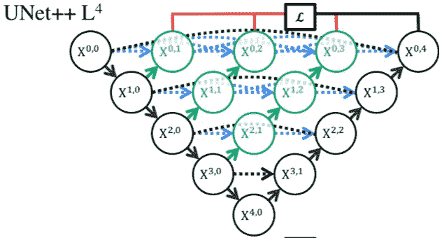
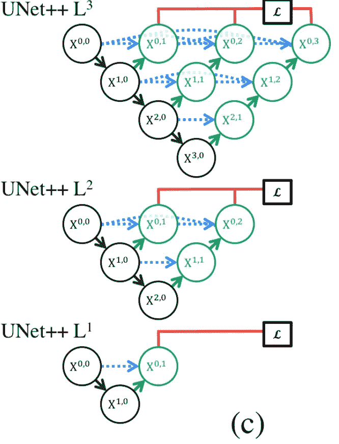
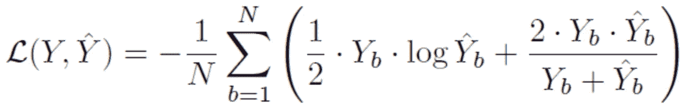
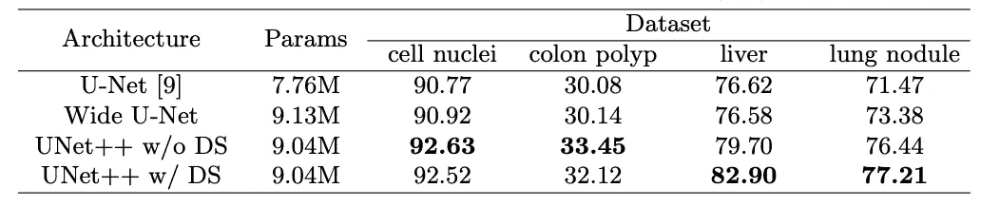

# UNet++清楚地解释了——更好的图像分割架构

> 原文：<https://pub.towardsai.net/unet-clearly-explained-a-better-image-segmentation-architecture-f48661c92df9?source=collection_archive---------2----------------------->

由 [Unsplash](https://unsplash.com?utm_source=medium&utm_medium=referral) 上的 [Pietro Jeng](https://unsplash.com/@pietrozj?utm_source=medium&utm_medium=referral) 拍摄

# 目录

∘ [⭐️ U-Net 重述](#3e17)
∘ [⭐️ UNet++创新](#35d6)
∘ [⭐️损失函数](#b4e5)
∘ [⭐️表现](#a4a6)
[引文](#7f9a)

在本文中，我们将向您介绍 UNet++，本质上是 U-Net 的升级版本。这篇文章旨在帮助你用尽可能少的时间直观而彻底地理解它。建议您至少对 U-Net 有一个非常粗略的概念，但是我们还是要做一个回顾！

## ⭐️ U-Net 概要

U-Net 于 2015 年推出，旨在专门在医学成像领域执行图像分割任务。它的名字来源于它的“U 形”建筑。

该架构由一个**契约路径**(又名。下采样路径，编码器)，其中特征图的宽度和高度被收缩，同时通道以因子 2 扩展，直到它达到 1024 ( *通常是 CNN*的 *最大推荐级别)，作为“转折点”的**瓶颈**，以及**扩展路径**(又名。上采样路径、解码器)，其中特征图的宽度和高度被扩展到掩模的维度。*

图 1: U-Net 架构

## ⭐️ UNet++创新

UNet++从 U-Net“升级”而来，本质上增加了密集的卷积块(图 1 中的蓝色和图 3)和嵌套在网络顶层的深度监管设计(图 2 中的红色)。新提出的模型看起来像这样:

图 2

第一个设计变化是增加了**密集卷积模块**，图 2 直观而简洁地显示了其工作原理。

图 3

在 U-Net 中，从编码器生成的特征映射被自动传递到相同级别的解码器(在图 3 中以黑色示出)。然而，在 UNet++中，情况发生了变化(如图 3 中蓝色和绿色所示)。要理解它，下面是解释:

*   在图 3 顶部所示的公式中， **H** 是 DenseNet 的复合函数，它结合了**批量归一化、**ReLU 激活和一个 **3x3 卷积**。
*   **[]** 中的元素被连接在一起作为 **H** 复合函数的输入。
*   **U** 是 U-Net 的复合函数；默认情况下，当你使用 U-Net 自己的主干网时，你应该期待**两个****3×3 卷积**的 ReLU 激活(如图 1 所示，每一层是如何构成的)。
*   应该注意的是，在中间引入的密集块不仅考虑了来自同一级别中的先前“节点”的信息，还考虑了其下一级别中的“节点”的信息(如图 2 所示)。这是一个真正紧密相连的网络！

因此，新引入的密集连接将有助于减少“编码器和解码器的特征图之间的语义差距”(图 1)，因此该模型可以具有更容易的学习任务，因为那些特征图将更加“语义相似”

UNet++的第二个变化是增加了**深度监督**设计(图 4 红色部分)。

图 4

深度监管并没有看起来那么难。本质上，它有助于模型在两种模式下运行:
1)精确模式(来自级别 0 中所有分支的输出被平均以产生最终结果)
2)快速模式(并非所有分支都被选择用于输出)

图 5 显示了快速模式中的不同选择如何产生不同的模型

图 5

## ⭐️损失函数

在该论文中，作者提出了二元交叉熵和骰子损失的组合损失函数，如公式 1 所示。

一级方程式

作者对 BCE 损失使用 0.5 权重，对骰子损失使用 1.0 权重。注:骰子系数相当于 F1 分。在实施过程中，当使用骰子系数作为损失时，建议使用 **1 减去骰子系数**。因此，本文中显示的这种做法可能有待改进。

此外，由于骰子损失的非凸性质，骰子损失通常难以收敛。因此，一个最近的解决方案是通过将它包装在一个 log 和 cosh 函数中来“平滑曲线”([https://arxiv.org/pdf/2006.14822.pdf](https://arxiv.org/pdf/2006.14822.pdf))

此外，将 BCE 损失与骰子损失相结合通常会产生更好的结果。

## ⭐️表演

作者在四个不同的数据集上训练了该模型，并且都产生了比 U-Net 和 Wide U-Net 模型更好的性能。表 1 显示了结果。DS 的意思是深度监管。结果显示在 IoU 得分(重叠面积/并集面积)中，它说明了模型的精确度。

表 1

结果表明，与它的前身 U-Net 相比，UNet++确实有所改进。

接下来，我们将向您展示 UNet 3+是如何工作的。是 UNet++的升级版！

[*UNet 3+详细说明—下一代 UNet*](https://medium.com/@mlquest0/unet-3-fully-explained-next-generation-unet-2a8e204e4cf9)

谢谢大家！❤️

# 引文

[1] Z. Zhou，M. Siddiquee，N. Tajbakhsh，J. Liang，UNet++: [一种用于医学图像分割的嵌套 U-Net 架构](https://arxiv.org/abs/1807.10165) (2015)，2015 计算机视觉与模式识别
[2]: O. Ronneberger，P. Fischer，T. Brox， [U-Net:卷积网络用于生物医学图像分割(2015)](https://arxiv.org/abs/1505.04597) ，2015 计算机视觉与模式识别