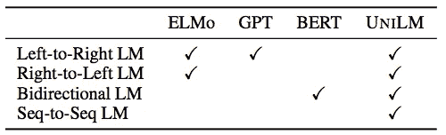
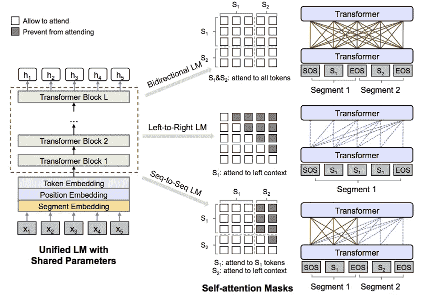
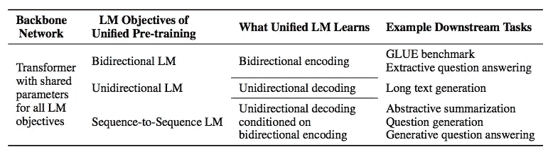
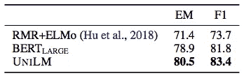
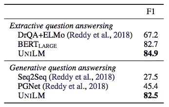
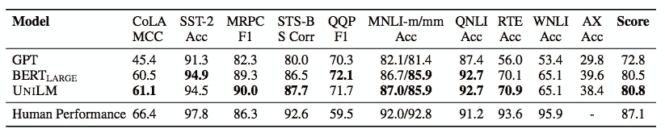

# 面向自然语言理解和生成的统一语言模型预训练

> 原文：<https://pub.towardsai.net/unified-language-model-pre-training-for-natural-language-understanding-and-generation-f87dc226aa2?source=collection_archive---------0----------------------->

## 用 UNILM 拦截 NLU 和 NLG | [向 AI](https://towardsai.net)

## 使用 UNILM 解决自然语言理解(NLU)和自然语言生成(NLG)

由[路易·汉瑟](https://unsplash.com/@louishansel?utm_source=medium&utm_medium=referral)在 [Unsplash](https://unsplash.com?utm_source=medium&utm_medium=referral) 拍摄的照片

最近最先进的 NLP 预训练模型也使用语言模型来学习上下文化的文本表示。从埃尔莫(彼得等人，2018)，GPT(拉德福德等人，2018)到伯特(德夫林等人，2018)，他们都使用语言模型(LM)来达到更好的结果。

董等人提出了一种新的模型，UNILM，用于解决由英文维基百科和图书语料库训练的自然语言理解和自然语言生成问题。与埃尔莫(彼得等，2018)、GPT(拉德福德等，2018)和伯特(德夫林等，2018)不同，UNILM 针对不同的任务实现单向语言模型(LM)、双向语言模型(LM)和序列到序列语言模型(LM)。

下图显示了模型的架构。ELMo 应用单向(从左到右和从右到左)LSTM。GPT 使用从左到右的转换器，而伯特使用双向转换器来学习文本表示。

自然语言处理模型的比较(董等，2019)

# 体系结构

UNILM 使用 Transformer (Vaswani 等人，2017 年)作为主干网络，它为不同的 NLP 下游任务提供了三个语言模型(LM)目标。

## 输入表示

与 BERT 一样，输入序列(文本)将被转换为标记嵌入、位置嵌入和段嵌入。

对于令牌嵌入，`SOS`将被插入作为输入的开始，而`EOS`将被插入作为段的结尾。对于位置嵌入，它是指特定段的标记位置，而段可以是 0(第一段)或 1(第二段)。

## 变压器

该模型通过上述特征使用多层转换器来学习上下文化的文本表示。根据使用情况，您可以为不同的下游任务选择单向 LM、双向 LM、序列到序列 LM。

为了训练该模型，它从文本中随机选取一个单词并进行屏蔽。模型训练的目标是通过其他标记来预测这个被屏蔽的单词。对于双向 LM，训练将使用除屏蔽令牌之外的所有令牌作为功能。对于从左到右 LM，左侧的所有标记都将成为输入要素。对于序列到序列 LM，第一句中的所有标记和第二句中左边的所有标记成为特征。

UNILM 模型架构(董等，2019)

## 三个 LM 目标

根据下游任务，您可以从 UINLM 中选择任何一种体系结构。可用的 LM 目标有双向 LM、单向 LM 和序列到序列 LM。

各种 LM 目标(董等，2019)

## 微调模型

与其他著名的 NLP 模型一样，最好根据您的领域数据对广义预训练模型进行微调，以获得更好的结果。由于它是由非常大的语料库训练的，所以你只需要提供一个相对较小的数据集。

# 实验

UNILM 在 SQuAD、CoQA 和 GLUE 结果方面达到了最先进的水平。

模特队伍成绩(董等，2019)

模型间的 CoQA 结果(董等，2019)

模型间的粘合结果(董等，2019)

# 喜欢学习？

我是湾区的数据科学家。专注于数据科学、人工智能，尤其是 NLP 和平台相关领域的最新发展。欢迎在 [LinkedIn](https://www.linkedin.com/in/edwardma1026) 上与 [me](https://makcedward.github.io/) 联系，或者在 [Medium](http://medium.com/@makcedward/) 或 [Github](https://github.com/makcedward) 上关注我。

# 延伸阅读

*   [伯特](https://towardsdatascience.com/how-bert-leverage-attention-mechanism-and-transformer-to-learn-word-contextual-relations-5bbee1b6dbdb)

# 参考

*   长度董，杨恩伟，王文伟，魏福荣，刘小玲，王玉英，高军，周明军，洪海伟[面向自然语言理解和生成的统一语言模型预训练](https://arxiv.org/pdf/1905.03197.pdf)。2019
*   A.瓦斯瓦尼，n .沙泽尔，n .帕马尔，j .乌兹科雷特，l .琼斯，A. N .戈麦斯，l .凯泽。[注意力是你所需要的全部](https://arxiv.org/pdf/1706.03762.pdf)。2017