# 从头开始的一元线性回归

> 原文：<https://pub.towardsai.net/univariate-linear-regression-from-scratch-68065fe8eb09?source=collection_archive---------0----------------------->

## 使用 Python 代码

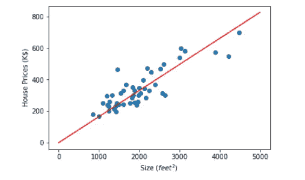

一元线性回归-作者图片

# 介绍

一般一个*机器学习*课程的第一个科目是**线性回归**，不是很复杂，很容易理解。此外，它包括许多*机器学习*概念，可以在以后更复杂的概念中使用。所以从**线性回归**到新的*机器学习*基础系列开始是合理的。

在这篇博文中，我们将了解**单变量线性回归**，这意味着**线性回归**只有*一个变量*。在本文结束时，我们将了解基本的*机器学习*概念，如**假设**、**成本函数**和**梯度下降**。此外，我们将为这些函数编写必要的代码，并使用***Python***【1】为 Kaggle 数据集训练/测试线性模型。

在深入**一元线性回归**之前，我们先简单说一下一些基本概念:

## 基本概念

*机器学习*是人工智能的子领域，它使用数据为计算机编写一些任务。典型的*机器学习*应用使用数据集和学习算法来建立模型，该模型预测应用的新输入的输出。

*机器学习*的应用一般分为三类:

*   监督学习
*   无监督学习
*   强化学习

在监督学习[2]中，数据具有可以映射到某个标签的相同特征。监督学习有两种类型。

如果标签的数量有限，并且可以转换成一些类别，则称为**分类**。识别图像中的动物或手写数字是分类的例子。

如果标签集不局限于一些小数量的元素，而是可以假设为无限多，那么它被称为**回归**。预测一个地区的房价或每公里汽车的耗油量都是回归的例子。

在无监督学习[3]中，数据集没有标记数据。在教学过程之后，模型发现数据中的模式。对电子商务网站的客户进行分类是无监督学习的一个例子。

强化学习[4]使用根据奖惩机制行动的智能代理[5]。它主要用于电脑游戏。

# 线性回归

如上所述，回归将输入映射到无限多的输出。此外，线性回归表明输入和输出之间存在线性关系[6]；如果我们有一个以上的输入变量，这是很难想象的。如果我们有一个输入变量，我们需要在 XY 平面上画一条线；如果我们有两个输入变量，我们需要在三维坐标系中构造一个平面。超过两个输入变量是很难想象的。因此，我们将使用单变量数据演示线性回归。下面是俄勒冈州波特兰市数据集【7】中的[房价，我们将以此为例。](https://www.kaggle.com/datasets/kennethjohn/housingprice)

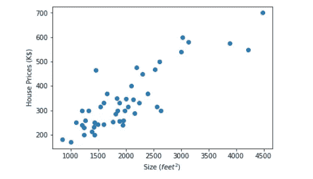

俄勒冈州波特兰市的房价——作者图片

在上图中，y 轴是波特兰一些房子的价格(K$)，x 轴是房子的大小(英尺)。我们想在这个图表上画一条直线(如下图所示)，这样当我们知道一个新房子的尺寸不在这个数据集中时，我们就可以用这条线来预测它的价格。

俄勒冈州波特兰市房价与假设-图片由作者提供

例如，我们可以预测一栋 3000 英尺的房子的价格大约是 50 万美元，如下图所示。

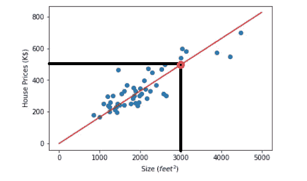

计算俄勒冈州波特兰市房价的新输入值-图片由作者提供

因此，事不宜迟，让我们深入更深刻的概念，以了解如何划清界限。

> 注意，本文使用了来自 Kaggle 的 [**线性回归**](https://www.kaggle.com/datasets/andonians/random-linear-regression) 数据集【1】和 [**一元线性回归**](https://www.kaggle.com/code/erkanhatipoglu/univariate-linear-regression-from-scratch) 笔记本【8】。如数据集的内容部分所述，它有 700 个训练数据集和 300 个元素的测试数据集。数据由(x，y)对组成，其中 x 是 0 到 100 之间的数字，y 是使用 Excel 函数 NORMINV(RAND()，x，3)生成的。也给出了 y 的最佳估计应该是 x。

首先，我们必须编写三个函数来寻找数据集上的一元线性回归解。这些函数按顺序用于假设、成本和梯度下降计算。首先，我们将逐一解释它们。

## 假设

我们的目标是找到一个可以用来预测新输入的模型。一个[假设](https://machinelearningmastery.com/what-is-a-hypothesis-in-machine-learning/#:~:text=A%20statistical%20hypothesis%20is%20an,for%20mapping%20inputs%20to%20outputs.)是一个机器学习系统的潜在模型【9】。

如下图所示，我们可以通过使用学习算法找到数据集的假设[10]。稍后我们将讨论这个假设与我们的数据的吻合程度，但现在，让我们先定义一下假设公式。

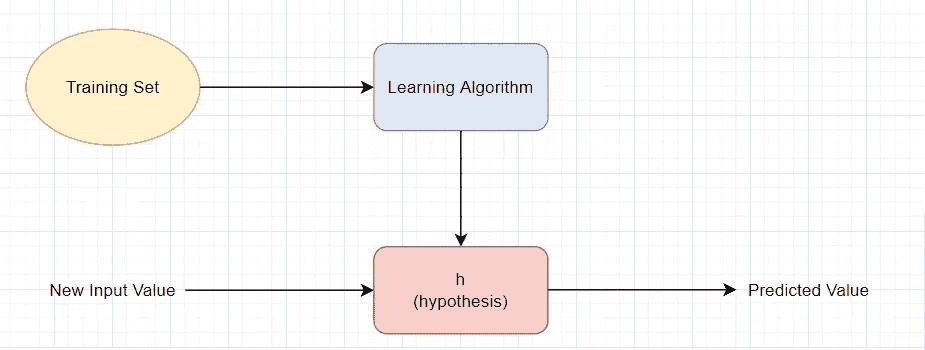

假设—作者的形象

对于**单变量线性回归**任务，假设的形式为:

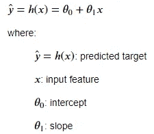

假设公式—作者的形象

y 轴与假设线的交点称为截距。这是我们公式中的θ₀，假设线的斜率是θ₁.

如果我们知道 x、θ₀和θ₁值，我们就可以预测机器学习系统的目标值。例如，在上面的房价例子中， ***红线*** 的θ₀ = 0.00008，θ₁ = 0.16538。所以对于一栋 3000 英尺(x=3000)的房子，期望价格是:

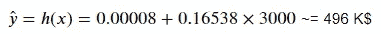

可以看出，我们需要三个参数来写假设函数。这些是 x(输入)，θ₀和θ₁.因此，让我们为假设编写 Python 函数:

假设函数的 Python 代码

这个过程非常简单。我们只需要返回*(*θ₀*+*θ₁** x)*。

## 成本函数

当我们有一个假设时(例如，我们知道θ₀和θ₁的值)，我们必须决定这个假设有多符合我们的数据。回到房价的例子，让我们以θ₀为 500，θ₁为-0.1，在我们的数据上画线。

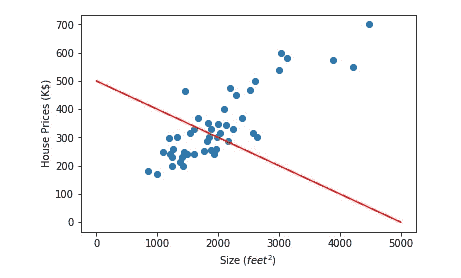

俄勒冈州波特兰的房价不符合假设——图片由作者提供

如上图所示，θ₀ = 500，θ₁ = -0.1 的假设与我们的数据集不太匹配。我们不希望这样的假设成为我们的模型，因为除了几个点之外，它给出了错误的结果。让我们多画一些线，以便更好地理解。

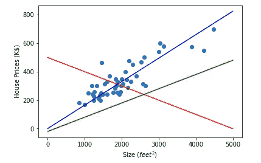

俄勒冈州波特兰市不同假设线的房价-图片由作者提供

上图中我们有三个不同θ值的假设。凭直觉，我们可以很容易地选择蓝线(θ₀ = 0，θ₁ = 0.165)作为我们数据的最佳匹配。问题是，我们如何从数学上选择更好的拟合？换句话说，我们如何选择最佳的θ₀和θ₁值，为我们找到一个可用于预测新输入的模型的目标提供最佳解决方案？

为此，我们可以选择θ₀和θ₁，使 h(x)接近所有训练示例的实际值[10]。我们针对特定假设(已知θ₀和θ₁值)对数据集上的每个点进行误差分析。如果我们以某种方式将数据集上每个数据点产生的所有误差相加，我们可以通过选择最小和来选择最佳拟合线(这意味着我们产生的误差更少)。

因此，我们定义了一个成本函数来衡量我们的总误差。有几种解决方案可供我们选择。一种称为平方误差函数:

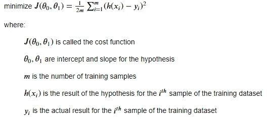

成本函数——作者的图像

θ₁j(θ₀)称为成本函数。它是θ₀和θ₁的函数，它们是假设的截距和斜率。h(xᵢ) — y(xᵢ)是我们为第 I 个训练例子所犯的错误。通过平方它，我们得到两个显著的好处；第一，我们惩罚大错误，第二，我们去掉负号 if h(x)< y. By dividing the total sum of errors by the number of samples, we find the average error we made. As described above, smaller cost function values suggest a better match, so we are trying to minimize the cost function for a better fit.

To write the cost function, we must import [***NumPy***](https://numpy.org/)，一个著名的用于线性代数任务的机器学习库。NumPy 会加速我们的计算。我们还需要四个参数，它们是θ₀、θ₁、x(输入)和 y(实际输出)。

成本函数的 Python 代码

在函数内部，首先要做的是使用 NumPy 的 subtract 函数计算每个数据点的误差。然后，我们可以使用 NumPy 的平方函数计算每个数据点的平方误差。最后，我们可以使用 sum()计算总平方误差，并除以示例的数量，以获得平均误差。请注意，所有训练数据都作为 NumPy 数组传递给函数。此外，由于我们在成本函数中使用假设函数，我们必须事先编写它。还要记住，我们还没有试图最小化成本函数。我们将在后面的梯度下降主题中看到如何做。

## 梯度下降

现在，我们可以计算数据集上给定的一组θ₀和θ₁的成本函数。我们还知道，使成本函数最小的θ₀和θ₁值是我们数据的最佳匹配。下一个问题是如何找到使成本函数最小的θ₀和θ₁值。

梯度下降算法可用于此目的，我们可以使用攀登者类比来更好地解释梯度下降。假设在山顶有一个登山者。他想尽快下到山坡上。所以，他观察了周围的环境，找到了通往地面的最陡的路径，向那个方向迈了一小步。然后，他再次观察他的周围环境，以看到新的、最垂直的移动方向。他不断重复这个过程，直到他到达山坡。

解释超出了这篇博文的范围，但是我们知道平方误差成本函数有一个全局最小值，没有局部最小值。此外，它在某点的负梯度是这个全局最小值的最陡方向。因此，就像山顶上的登山者找到通往山坡的路一样，我们可以使用梯度下降来找到使成本函数最小的θ值。

要做到这一点，首先，我们需要选择一些初始θ₀和θ₁开始。然后，我们可以计算在这一点的梯度下降，并改变θ₀和θ₁值成比例的负梯度计算。然后重复相同的步骤，直到收敛。

为了更好地理解梯度的概念，我们将使用θ₀ = 0 的随机平方误差成本函数，如下所示。我们选择θ₀为零；否则，我们将会在 3D 图形中挣扎，而不是处理 2D 图形。

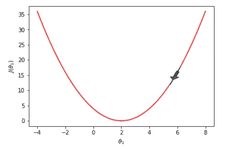

j(θ₁)——作者图片

在上图中，假设我们在点= 6(也就是说，我们已经选择我们的初始θ₁为 6)，并试图达到全局最小值。该点的负梯度向下，如箭头所示。所以如果我们在那个方向上更进一步，我们会得到一个小于 6 的点。然后，如下所示，我们可以重复相同的过程，直到收敛在点= 2。

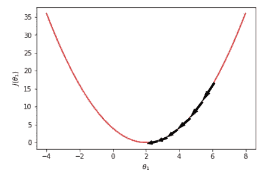

J(θ₁的收敛)在局部最小值—作者图片

让我们试试下面的另一个观点。如果我们选择了另一个θ₁值，如点= -2，则该点的负梯度将向下，如箭头所示。因此，如果我们在这个方向上更进一步，我们将得到一个大于-2 的值。

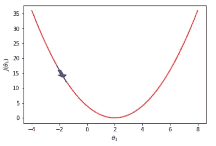

j(θ₁)——作者图片

然后，如下所示，我们可以重复相同的过程，直到收敛在点= 2。

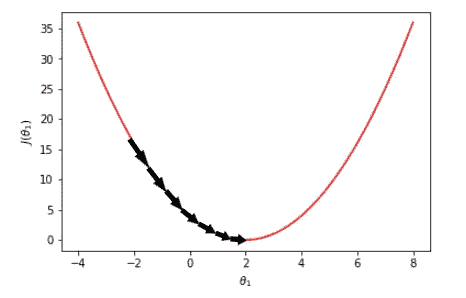

J(θ₁的收敛)在局部最小值—作者图片

一个很好的问题是如何决定我们何时收敛。也就是说，我们在代码处的停止条件是什么？我们有两个选择。我们可以检查成本函数值，如果它小于或等于预定值就停止，或者我们可以检查连续成本函数值之间的差异，如果它小于或等于阈值就停止。我们将选择后者，因为由于初始θ值的选择，我们永远无法达到我们选择的预定义成本值。

取函数的梯度下降是大一级别的微积分概念，我们就不深究了；相反，我们将只给出结果。单变量数据集的平方误差成本函数的梯度如下:

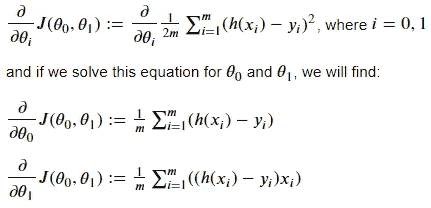

平方误差代价函数的梯度计算—作者图片

在写梯度下降的代码之前，我们必须引入最后一个概念:学习率。正如我们上面讨论的，梯度下降算法需要很小的步长，如下所示，如果步长太大，我们可能会有超过局部最小值的风险。因此，在计算新的θ值时，我们将梯度结果乘以学习速率系数。学习率是一个需要在训练中调整的超参数。虽然较高的学习率值可能导致超调，但较小的学习率值可能导致较高的训练时间[10]。

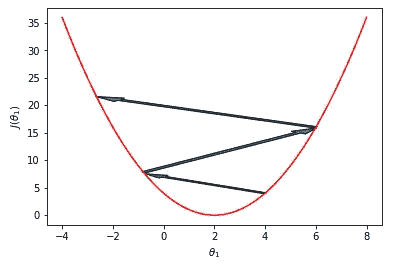

超越——作者图片

因此，对于具有形式为 h(x) = θ₀ *+* θ₁ ** x 的假设和平方误差成本函数 J(* θ₀，θ₁ *)的单变量数据集，每个步骤的* θ *值可以计算如下:*

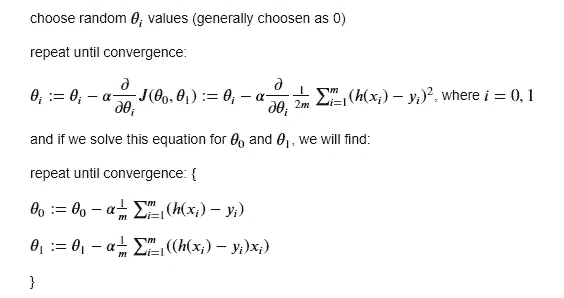

用梯度下降法计算θ值的算法——作者图片

如前所述，α是学习率，m 是训练样本的数量。

我们必须像在成本函数中一样导入 NumPy 来编写梯度下降函数。我们还需要五个参数，它们是θ₀、θ₁、α(学习率)、x(输入)和 y(实际输出)。我们还必须确定 ***没有更新*** θ₀才计算θ₁ [10]。否则，我们将以错误的结果告终。梯度函数的代码如下:

渐变函数的 Python 代码

在函数内部，首先要做的是使用 NumPy 的 subtract 函数计算每个数据点的误差，并将其存储在一个变量中。然后我们可以把前面的结果乘以 x，存放在另一个变量里。请注意，所有训练数据都作为 NumPy 数组传递给函数。因此，这些变量属于数组类型，sum()函数可用于获取总值，然后将总值乘以学习率，再除以示例数量。最后一步，我们可以计算并返回新的θ值。

## 模特培训

既然已经把需要的函数都写好了，就该训练模型了。如前所述，我们需要决定梯度下降何时收敛。为此，我们将减去连续的成本值。如果差值小于某个阈值，我们将得出梯度下降收敛的结论。

我们还为每次迭代画出假设，看看它是如何变化的。但是这降低了代码的速度。初始值的选择可能会显著地改变迭代的次数，因此对于复制它的人来说，改变这部分代码可能是合适的。也可以为此从零开始复制 [***一元线性回归***](https://www.kaggle.com/code/erkanhatipoglu/univariate-linear-regression-from-scratch) 笔记本，其中一节画出只因为迭代次数高而训练好的模型。

模型训练代码块

在代码块中，我们初始化α、θ₀、θ₁和收敛阈值。我们还通过调用成本函数来计算初始成本值。

如前所述，while 循环的停止条件是连续成本函数值的差小于阈值。我们首先为每次 while 循环迭代绘制训练数据和假设，用于演示目的。然后，我们通过调用成本函数来计算成本函数值。接下来，我们通过调用梯度函数来计算新的θ₀和θ₁值。接下来，我们使用新的θ值来重新计算成本值，以找出差异来检查停止条件。在循环结束时，我们为每次迭代打印一些必要的信息。

## 结果呢

下面的结果是针对模型定型代码块中的初始条件的。训练进行了 27 次迭代。据计算，θ₀约为 0.015，θ₁约为 0.999。最终成本值计算为约 3.936。结果非常接近于在[线性回归数据集](https://www.kaggle.com/datasets/andonians/random-linear-regression)中讨论的 y = x 线。我们还可以看到每次迭代中假设的变化。

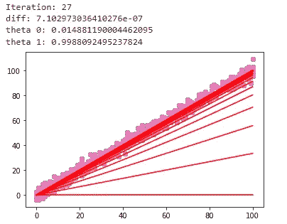

作者使用测试数据集-图像的验证结果

## 确认

我们还可以用测试数据集来验证我们的结果，这个数据集还没有在训练过程中使用过。下面你可以看到我们的模型在测试数据集上的表现。模型的成本值约为 4.702，比预期的 3.936(培训成本值)略差。

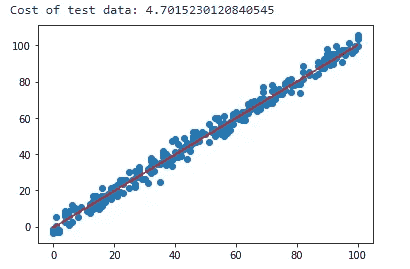

作者使用测试数据集-图像的验证结果

# 结论

在这篇博文中，我们学习了线性回归的基础知识，比如假设、成本函数和使用单变量数据的梯度下降。我们也用 Python 写了那些函数。此外，使用它们，我们已经训练了一个单变量线性模型，并利用[线性回归](https://www.kaggle.com/datasets/andonians/random-linear-regression)数据集对其进行了测试。

感兴趣的读者可以在 Kaggle 笔记本 [***一元线性回归从头开始***](https://www.kaggle.com/code/erkanhatipoglu/univariate-linear-regression-from-scratch) 中找到这篇博文中用到的代码。

感谢您的阅读！

# 参考

[1] V. Andonians，《线性回归》，*Kaggle.com*，2017。【在线】。可用:[https://www . ka ggle . com/datasets/andonians/random-linear-regression。](https://www.kaggle.com/datasets/andonians/random-linear-regression.)【访问日期:2022 年 9 月 12 日】。

[2]《监督学习——维基百科》，*En.wikipedia.org*，2022 年。【在线】。可用:【https://en.wikipedia.org/wiki/Supervised_learning. 【访问时间:2022 年 9 月 13 日】。

[3]《无监督学习——维基百科》，【En.wikipedia.org】T4，2022 年。【在线】。可用:[https://en.wikipedia.org/wiki/Unsupervised_learning.](https://en.wikipedia.org/wiki/Unsupervised_learning.)【访问时间:2022 年 9 月 13 日】。

[4]《强化学习——维基百科》，*En.wikipedia.org*，2022 年。【在线】。可用:[https://en.wikipedia.org/wiki/Reinforcement_learning.](https://en.wikipedia.org/wiki/Reinforcement_learning.)【访问时间:2022 年 9 月 13 日】。

[5] J. Carew，“什么是强化学习？全面概述”，*search enterprisesai*，2021。【在线】。可用:[https://www . techtarget . com/search enterprise ai/definition/reinforcement-learning。](https://www.techtarget.com/searchenterpriseai/definition/reinforcement-learning.)【访问日期:2022 年 9 月 12 日】。

[6] J. Brownlee，“用于机器学习的线性回归”，[*https://machinelearningmastery.com/*，](https://machinelearningmastery.com/,) 2022。【在线】。可用:[https://machine learning mastery . com/linear-regression-for-machine-learning/。](https://machinelearningmastery.com/linear-regression-for-machine-learning/.)【访问日期:2022 年 9 月 11 日】。

[7]约翰克斯，“房价，波特兰，或，”*Kaggle.com*，2017 年。【在线】。可用:[https://www.kaggle.com/datasets/kennethjohn/housingprice.](https://www.kaggle.com/datasets/kennethjohn/housingprice.)【访问时间:2022 年 9 月 11 日】。

[8] E. Hatipoglu，“一元线性回归从零开始”，*Kaggle.com*，2022。【在线】。可用:[https://www . ka ggle . com/code/erkanhatipoglu/单变量-线性-回归-从头开始。【访问日期:2022 年 9 月 12 日】。](https://www.kaggle.com/code/erkanhatipoglu/univariate-linear-regression-from-scratch.)

[9] J. Brownlee，“机器学习中的假设是什么？”，[*machinelearningmastery.com*](https://machinelearningmastery.com/)，2019。【在线】。可用:[https://machine learning mastery . com/what-is-a hypothesis-in-machine-learning/。](https://machinelearningmastery.com/what-is-a-hypothesis-in-machine-learning/.)【访问时间:2022 年 9 月 12 日】。

[10] A. Ng，《斯坦福 CS229:机器学习——线性回归与梯度下降|第二讲(2018 年秋季)》，*Youtube.com*，2018。【在线】。可用:[https://www.youtube.com/watch?v=4b4MUYve_U8&list = ploromvodv 4 rmigqp 3 wxshtmggzpvfbu&index = 2。【访问日期:2022 年 9 月 12 日】。](https://www.youtube.com/watch?v=4b4MUYve_U8&list=PLoROMvodv4rMiGQp3WXShtMGgzqpfVfbU&index=2.)