# 数据分析师的单变量统计—解释置信区间

> 原文：<https://pub.towardsai.net/univariate-statistics-for-data-analysts-confidence-intervals-explained-bd19836ccc74?source=collection_archive---------2----------------------->

## 带示例


在 [Unsplash](https://unsplash.com?utm_source=medium&utm_medium=referral) 上由 [Carlos Muza](https://unsplash.com/@kmuza?utm_source=medium&utm_medium=referral) 拍摄的照片

所有数据分析师和数据科学家，在体验最先进的人工智能技术之前，必须掌握微积分、代数、离散数学、函数编程和统计的基本概念。这篇文章是单变量统计的修订，回顾了与统计推断相关的概念。

> **统计推断**

统计推断旨在使用重要样本估计关于总体特征的假设。因此，总体被定义为包含所有个体的集合，样本是总体的一部分的集合。

要使样本被认为是有意义的，它必须具有与总体相似的特征和相似的比例。为了估计总体的参数，使用统计推断，即在样本中计算该统计值，然后将推断应用于总体。

统计推断的一个简单而著名的例子是选前分析。在这些情况下，不可能对整个人口进行民意测验，因此民意测验公司对人口中有代表性的样本进行提问，然后推断出结果。

因为不可能知道总体中给定参数的真实值，所以也不可能知道统计值(样本中的值)是否绝对正确。

> 我们能相信这些估计吗？

样本中的计算值与总体中相同指标的实际值之间的差异称为抽样误差，定义为:

***|统计—参数|***

其中 ***统计*** 为样本值， ***参数*** 为总体值。由于参数值通常是未知的，因此研究者也不知道抽样误差。

> **为什么不能有统计值的概率？**

概率测量是通过测量连续区间以下的面积来实现的。由于平均值等统计参数是由一个值(即一个点)给出的，所以从数学上来说，计算一个点下的面积是不可能的。因此，不可能计算单值度量(点估计)的置信度量。

> **解决办法？置信区间…**

但是首先，我们需要知道更多关于 t 分布的知识

当总体标准差未知时，t 分布用于描述样本均值和总体均值之间的差异。它假设观察值来自正态分布的总体。

**t 分布和正态分布有什么区别:**

→正态分布假设研究者知道总体的真实标准差。t 分布确实需要这种假设，并且是由自由度定义的(样本大小— 1)。

→ T 分布表可以在网上找到，研究人员可以选择单尾表(如果平均值只能在一个方向上变化)或双尾表(如果平均值可以高于或低于样本中获得的平均值)。

→研究员根据期望的置信区间和自由度找到要使用的值。

***举例:*** 求均值的置信区间

```
**Sample size: **         3333
**Mean:  **               1.563
**Std. Deviation:**       1.315
```

置信区间由下式给出:

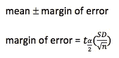

其中:

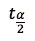

是期望置信水平的双尾表中的 t 分布值，根据样本的自由度。

置信区间:

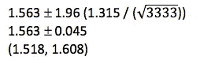

→我们有 95%的把握认为真实人口平均值介于 1.518 和 1.608 之间。

> **如何减少误差？**

让我们看看我们的公式:

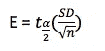

其中:

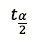

是 t 分布值，取决于所需的置信水平和样本大小。

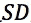

标准差是一个样本特征，不能改变。

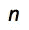

是样本大小。

***鉴于此，我们有两种方法来减少误差:***

1.  通过降低置信水平(不推荐)
2.  通过增加样本量(推荐)

> **比例的置信区间估计量**

与平均值类似，比例是一个值(点)，因此没有置信度的度量。所以，我们需要找到一个间隔。

***举例:***

在对 3333 名顾客的抽样调查中，我们发现有 483 名顾客曾有过不愉快经历。要计算比例:

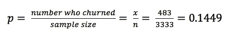

同样，我们也不知道人口的真实比例，所以我们不知道抽样误差。但是，我们可以使用比例误差的公式:

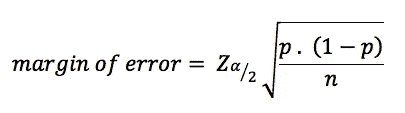

其中 *Z* 值可以在 Z 得分表中找到。然而，我们通常使用:

```
90% confidence: z = 1.645
95% confidence: z = 1.96
99% confidence: z = 2.576
```

***要应用该公式，我们的样本必须满足以下条件:***
→我们从大量人群中随机抽取一个样本
→样本中的观察值是独立的
→我们在每个类别中至少有 15 个观察值

使用之前的数据找出 95%的置信区间，我们得到:

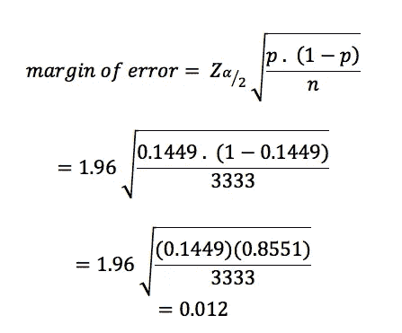

该比例的置信区间为:

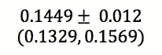

同样，为了减少误差，我们只需要增加样本量。

感谢您的阅读。

如果你喜欢这篇文章，别忘了关注我，这样你就能收到关于新出版物的所有更新。

如果你想了解更多，你可以通过[我的推荐链接](https://cdanielaam.medium.com/membership)订阅媒体会员。它不会花你更多的钱，但会支付我一杯咖啡。

**其他:**谢谢！