# 具有堆叠 LSTM、BiLSTM 和 NeuralProphet 的单变量时间序列

> 原文：<https://pub.towardsai.net/univariate-time-series-with-stacked-lstm-bilstm-and-neuralprophet-c8d6a11a9665?source=collection_archive---------0----------------------->

## [深度学习](https://towardsai.net/p/category/machine-learning/deep-learning)

## 为多步时间序列开发深度学习 LSTM、BiLSTM 模型和 NeuralProphet


为时间序列开发 LSTM、BiLSTM 模型和 NeuralProphet 由 [Nick Chong](https://unsplash.com/@nick604?utm_source=unsplash&utm_medium=referral&utm_content=creditCopyText) 在 [Unsplash](https://unsplash.com/s/photos/stock-market?utm_source=unsplash&utm_medium=referral&utm_content=creditCopyText) 上拍摄

# 目录

*   [简介](https://medium.com/p/c8d6a11a9665/#20b9)
*   [什么是时间序列？](https://medium.com/p/c8d6a11a9665/#a6df)
*   [什么是 LSTM](https://medium.com/p/c8d6a11a9665/#320e) ？
*   [什么是双向 LSTM](https://medium.com/p/c8d6a11a9665/#69d8) ？
*   [什么是 NeuralProphet](https://medium.com/p/c8d6a11a9665/#eadc) ？
*   [让我们从股票数据开始](https://medium.com/p/c8d6a11a9665/#f89c)
*   [模型实施阶段](https://medium.com/p/c8d6a11a9665/#5668)
*   [车型训练&验证失败](https://medium.com/p/c8d6a11a9665/#4146)
*   [结论](https://medium.com/p/c8d6a11a9665/#4f1c)
*   [参考](https://medium.com/p/c8d6a11a9665/#5856)

# 介绍

你愿意尝试回归之外的方法来解决你的时间序列问题吗？然后，这篇文章将通过深度学习技术利用时间序列来实现更好的优化和预测，以使用单变量因变量作为随时间变化的单个时间序列来进行预测。对数据科学家来说，预测股市是一种有吸引力的潜力，其动机是挑战，而不是对财务收益的渴望。我们检查市场的每日涨跌，并想象一定有一种模式，在这种模式中，我们的模型优于股票交易。

因此，这篇文章的主要目的是；实现深度学习算法递归神经网络(RNNs)的两个顺序模型，如堆叠 LSTM、双向 LSTM 和用 [PyTorch](https://pytorch.org/) 构建的 [NeuralProphet](https://github.com/ourownstory/neural_prophet/?utm_source=hootsuite&utm_medium&utm_term&utm_content&utm_campaign&fbclid=IwAR1G35yRHAhO-UwiuR2UPGKwBlUtU98cJyPxu5vA4P-XTDzgBEwLe5Iq0EA) ，使用基于深度学习的时间序列预测来预测股票价格。

让我们假设读者已经基本掌握了时间序列和深度学习模型。但是，我将简要解释文章的一些概念，以刷新对基本面的一些想法。

# 什么是时间序列？

> [时间序列的定义:](https://www.investopedia.com/terms/t/timeseries.asp)时间序列是一段时间内连续出现的数据点序列。这可以与[横截面数据](https://www.investopedia.com/terms/c/cross_sectional_analysis.asp)形成对比，后者捕捉一个时间点。

为了简单起见，时间序列是一组随着时间的推移对对象的观察，在个人财务的每日收盘价或全年的每小时程序中每分钟测量一次。现在让我们把时间序列分成两部分:**分析**和**预测**。

时间序列分析涉及了解序列内在特征的不同方面，以便您可以获得更好的信息来做出有意义的预测。另一方面，将模型与过去的数据进行拟合，并使用它来预测未来的观察值，这就是时间序列预测的全部内容。

# 什么是 **LSTM**

长期短期记忆(LSTM)，一种人工[递归神经网络](https://www.ibm.com/cloud/learn/recurrent-neural-networks) (RNN)的形式，可以用来根据历史数据预测库存值。它的开发是为了消除长期依赖的问题，并有助于避免[梯度消失](https://www.analyticsvidhya.com/blog/2021/06/the-challenge-of-vanishing-exploding-gradients-in-deep-neural-networks/)。LSTMs 适合于对序列数据建模，因为它们维护内部状态来跟踪已经看到的数据。时间序列和自然语言处理是 LSTMs 中的两个常见用途，因为它们具有反馈联系；这意味着不仅可以处理单个数据点，还可以处理完整的数据序列。

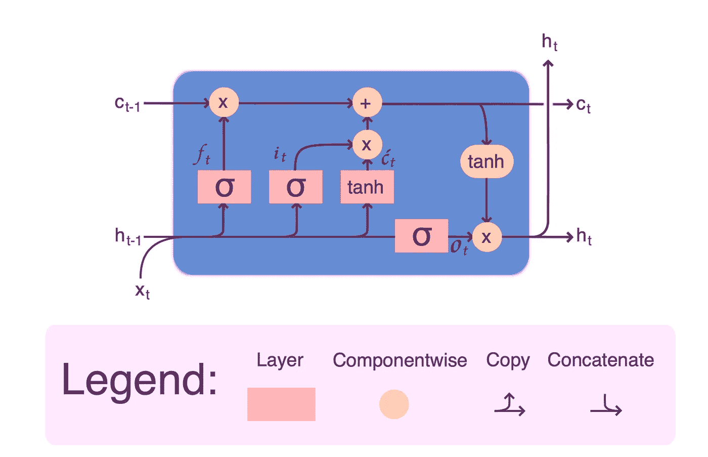

LSTM 街区的结构——来自作者

LSTM 由许多内存块组成，如图所示是一个完整的内存块。两个状态被带到下一个块；单元格状态(存储和加载信息)和隐藏状态(携带之前事件的信息并覆盖)。LSTMs 使用一个称为 gates 的过程来学习。这些门可以学习序列中的哪些信息应该被保留或删除。因此，LSTM 包含三个门:输入、遗忘和输出。更多关于 LSTM 的细节请点击这里。

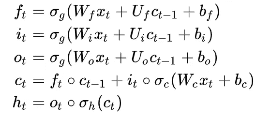

**f** *t* **=忘门**

**I**t=输入门

**o**t*t*=输出门

**C**t=细胞状态

**h**t=隐藏状态

# 什么是双向 LSTM

双向长短期记忆(BiLSTM)是一种允许任何神经网络以两种方式存储序列信息的技术，或者向后或者向前。我们的输入双向运行，区分一个 [BiLSTM](https://en.wikipedia.org/wiki/Bidirectional_recurrent_neural_networks) 和一个标准 LSTM。我们可以有两个方向的输入流；在任何时间点存储过去和未来的信息。然而，正常的 LSTMs 允许一个方向的输入流(向前或向后)。

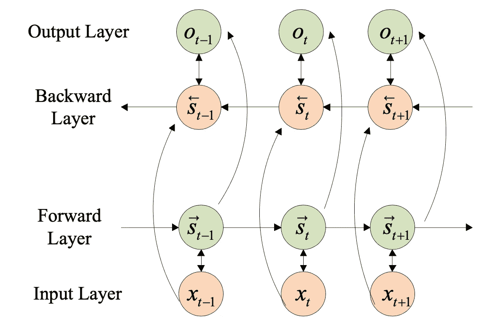

双向 LSTM 的基本结构—图片[来源](https://www.mdpi.com/2076-3417/11/17/8129/htm)

# 什么是神经营养

NeuralProphet 是一个新的开源时间序列预测工具包，使用 [PyTorch](https://pytorch.org/) 创建，基于神经网络。它是 Prophet(自动预测程序)的增强版本，这是一个预测库，允许您在 [AR-Net 库](https://ai.facebook.com/blog/ar-net-a-simple-autoregressive-neural-network-for-time-series/)(自回归神经网络)的影响下，利用更高级和复杂的深度学习模型进行时间序列预测。

**使用以下命令从 GitHub 安装该工具的最新版本，并查看以下链接获取* **NeuralProphet** 文档*。*

```
#Use (!pip)if it did not install
pip install neuralprophet#Live version(more features)if you are going to use the Jupyter
pip install neuralprophet[live]
```

[](https://github.com/ourownstory/neural_prophet) [## GitHub-ourowstory/neural _ prophet:neural prophet:一个简单的预测包

### 请注意，该项目仍处于测试阶段。请报告您遇到的任何问题或您的建议。我们…

github.com](https://github.com/ourownstory/neural_prophet) 

# 让我们从股票数据开始

## 1.数据准备

在本项目中，数据取自从 [**雅虎财经**](https://finance.yahoo.com/quote/AAPL/history?p=AAPL%5C) 直接导出的**苹果公司(AAPL)** 和**2010 年 1 月 4 日至 2021 年 11 月 2 日。股票价格历史将是过去 11 年(*包括* ***新冠肺炎*** *时期*)以来我们使用神经网络，数据越多，模型训练越好。如上所述，上述模型和工具将作为单变量时间序列应用于数据集的“日期”。**

**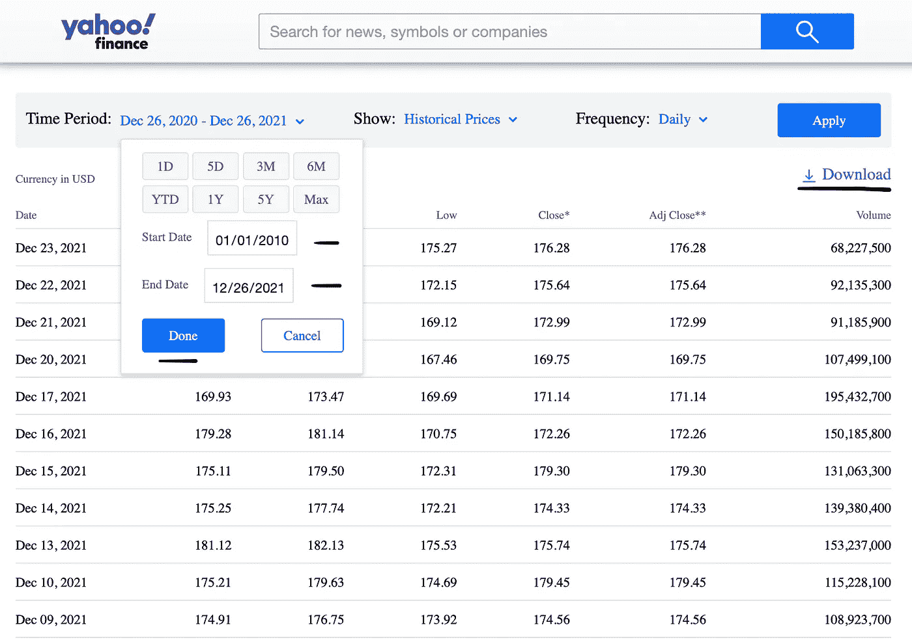**

**如何从雅虎财经导出股票价格历史——来自作者**

## **2.数据预处理**

*   **导入库**

```
# Use **Colab** notebooks(recommended) or **jupyterlab, etc.**
import pandas as pd
import numpy as np
import seaborn as sns
import matplotlib.pyplot as plt
from matplotlib.pylab import rcParams
from datetime import datetime
import warnings
warnings.filterwarnings('ignore')
%matplotlib inline
```

*   **读取和浏览数据**

```
# Reading the exported file as CSV. 
data = pd.read_csv("AAPL.csv")
print(data.head())# Check duplicate, nan and so on. 
data.duplicated().sum().any()
data.isna().sum() # Function to explore and validate
def explore(df):
   print(f"Dataset Shape: {df.shape}")
   summary = pd.DataFrame(df.dtypes,columns=['dtypes'])
   summary = summary.reset_index()
   summary['Name'] = summary['index']
   summary = summary[['Name','dtypes']]
   summary['Missing'] = df.isnull().sum().values
   summary['Uniques'] = df.nunique().values
   return summary# function call
explore(data)
```

**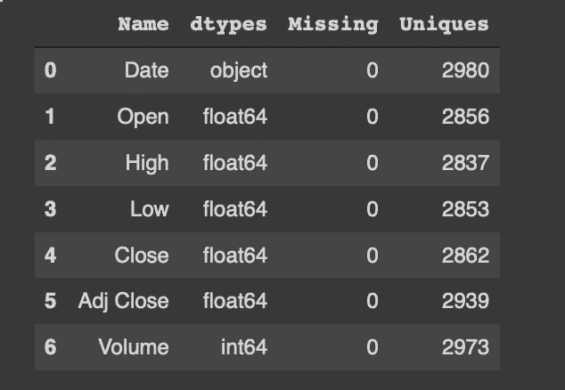**

**探索*功能*的结果—来自作者**

**如您所见，在应用*浏览函数*后，“日期”是一个对象类型，需要更改为日期时间格式，如下所示:**

```
# convert Date from object to datetime
data['Date'] = pd.to_datetime(data['Date'], infer_datetime_format=True)# print info to check conversion 
data=data.set_index(['Date']) # set date as index or rest_index()
data.head()
print(data.info())**# Output:** Data columns (total 7 columns):
 #   Column     Non-Null Count  Dtype         
---  ------     --------------  -----         
 0   **Date **      2980 non-null   datetime64[ns]
 1   Open       2980 non-null   float64       
 2   High       2980 non-null   float64       
 3   Low        2980 non-null   float64       
 4   Close      2980 non-null   float64       
 5   **Adj Close**  2980 non-null   float64       
 6   Volume     2980 non-null   int64
 #   Column     Non-Null Count  Dtype         
---  ------     --------------  ----- 
```

# **模型实施阶段**

## **1.堆叠 LSTM**

**对股票数据进行预处理后,“Adj Close”特性将成为目标值。因此，“Adj Close”考虑了任何可能在收盘后影响股价的因素(拆分、股息和配股)。**

**然后，在模型拟合之前，使用来自 [sklearn](https://scikit-learn.org/stable/modules/preprocessing.html#normalization) 的 MinMaxScaler 函数对数据进行标准化，这将促进和提升神经网络的性能。**

*   **让我们深入研究代码:**

**堆叠的 LSTM 代码—来自作者**

**如果多次耐心等待后验证损失仍未减少(训练后无改善)，现在是时候构建带有[提前停止](https://www.tensorflow.org/api_docs/python/tf/keras/callbacks/EarlyStopping)的堆叠 LSTM(多层)以避免过度拟合。**

**注意:[如果您希望每次运行模型时都得到相同的结果，而每次运行都不会得到不同的结果，请设置 TensorFlow 的随机种子](https://www.tensorflow.org/api_docs/python/tf/random/set_seed)(可重复的结果)，或者保存模型或其权重以供以后最佳训练使用([关于如何存储和加载模型的更多详细信息，请参见](https://www.tensorflow.org/tutorials/keras/save_and_load))。**

**堆叠 LSTM 模型—作者提供**

```
# The figure below of the real “Adj Close” feature of Apple stock from the dataset (y-axis is the stock price and x-axis is the date).data.set_index('Date')['Adj Close'].plot(figsize=FIGURE_SIZE)
```

**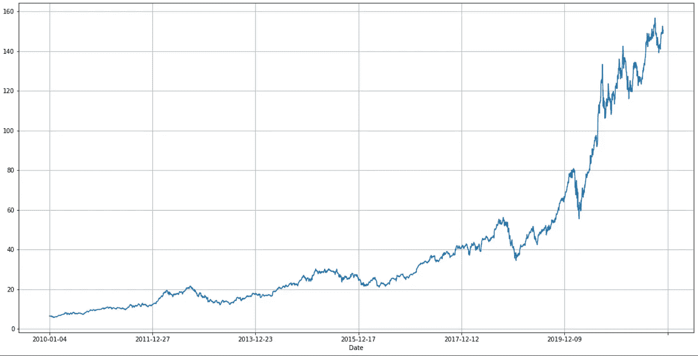**

**从 2010 年 1 月 4 日到 2021 年 11 月 2 日，苹果股票在“调整收盘”时的实际价格——来自作者**

*   **可视化堆叠 LSTM 结果**

**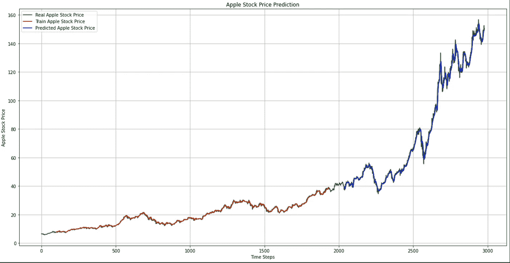**

**预测苹果股票价格在“调整收盘”时的叠加 LSTM 结果——来自作者**

## **2.双向 LSTM**

**从堆叠的 LSTM 数据集构建具有相同选定特征(调整后收盘价)的双向 LSTM 模型。**

**BiLSTM 代码—来自作者**

**如下图所示，利用 ReLU(整流线性单元)[激活功能](https://en.wikipedia.org/wiki/Activation_function)创建了一层 BiLSTM。但是，如果应用 RMSProp(均方根传播)优化器，它将产生与 Adam 优化器(在 BiLSTM 构建中使用)几乎相似的结果，您可以试验所有的优化器。**

**比尔斯特姆大厦——来自作者**

*   **可视化 BiLSTM 结果**

**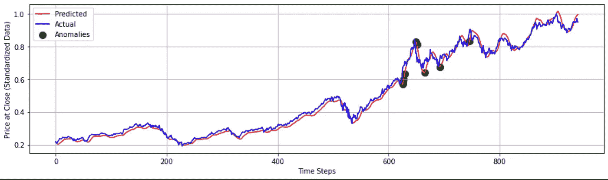**

**比尔斯特姆预测苹果股票价格“接近”的结果——来自作者**

## **3.神经营养细胞**

**最后，让我们从用于基于神经网络的时间序列建模的 NeuralProphet 开始。**

*   **安装并导入库，如下例所示:**

**安装和导入 NeuralProphet —来自作者**

**NeuralProphet 模型拟合对象假定时间序列数据有一个名为 **ds** (日期)的日期列和一个预期为 **y (** 预测列名-调整关闭)的时间序列值。遵循以下代码:**

**阅读神经营养学家的数据——来自作者**

**用默认超参数初始化 NeuralProphet 模型。 [**D** 频率](https://pandas.pydata.org/pandas-docs/stable/user_guide/timeseries.html#offset-aliases)作为基于每日调整收盘价的数据。**

**用 1000 个纪元(你可以选择你的纪元)训练模型，这将需要几分钟的等待时间，NeuralProphet 在训练上很快就能做出预测。**

**创建神经营养模型—来自作者**

**用更多组件绘制预测，但结果显示的是**模型。【剧情(预测)】T17。****

**神经原植物的情节代码——来自作者**

*   **可视化 gNeuralProphet 结果**

**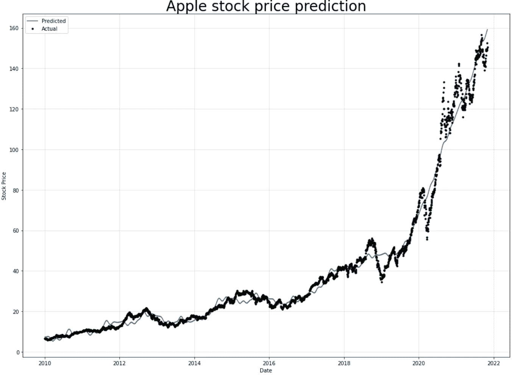**

**预测苹果股票价格“Adj Close”的神经网络预测结果——来自作者**

**在这段代码中，通过 NeuralProphet 手动将数据集分为训练和测试，以使用 30%的训练数据作为验证数据。**

**有分裂的神经原植物——来自作者**

*   **可视化神经营养结果**

**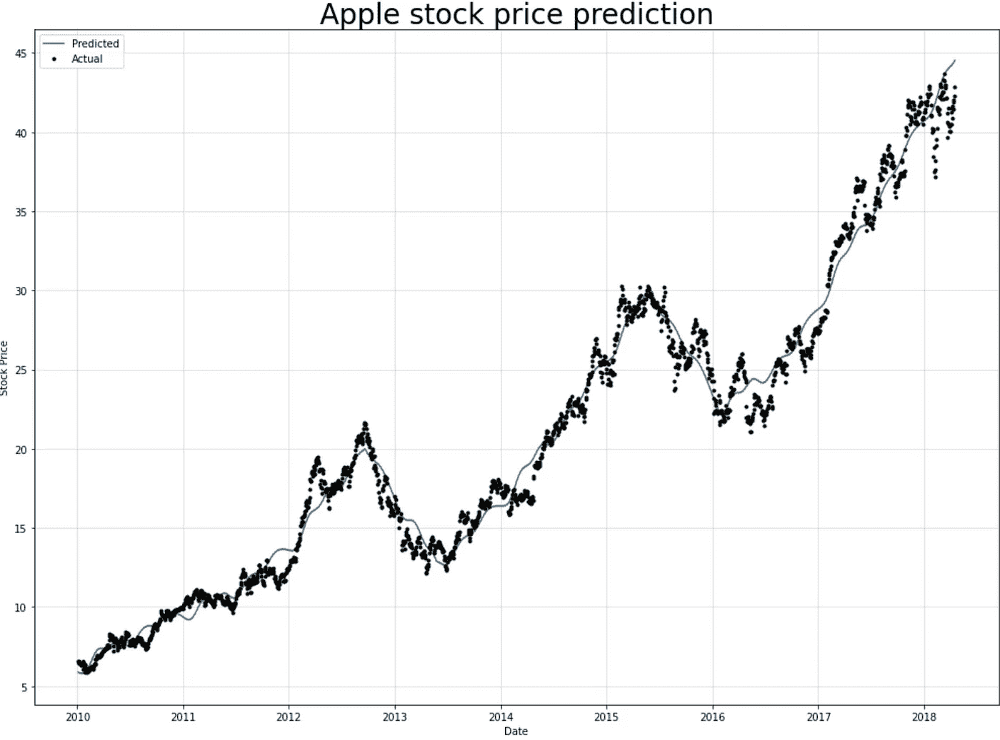**

**在“Adj Close”分裂时预测苹果股票价格的神经营养图结果—来自作者**

# ****型号 T** 下雨&验证失败**

**[学习曲线](https://machinelearningmastery.com/learning-curves-for-diagnosing-machine-learning-model-performance/)只是一个图表，显示了在培训期间学习的特定指标的体验进度。要评估模型在预测中的性能，请查看每个模型中的时段数及其损失。**

****注:** O [过拟合和欠拟合](https://machinelearningmastery.com/overfitting-and-underfitting-with-machine-learning-algorithms/)是常见的，但过量必须用退出等策略来控制，以保证[泛化](https://machinelearningmastery.com/introduction-to-regularization-to-reduce-overfitting-and-improve-generalization-error/)。因此，目标是尽可能地最小化验证损失，直到它与列车损失达到良好的拟合。本文中所有实现的模型都使用了[提前停止来避免过度拟合](https://medium.com/p/c8d6a11a9665/#bc3e)。**

*   ****堆叠 LSTM 列车&验证损失:****

```
**RMSE** (Root Mean Square Error) performance metrics:**Train Data**: 20.75, **Test Data**: 80.098
```

**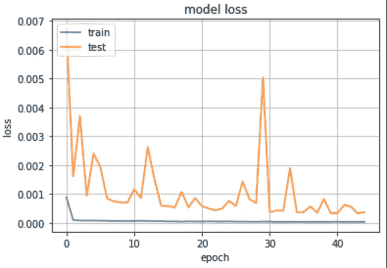**

**堆叠的 LSTM 多层-来自作者**

**在**确认损失**结束时的波动点可以是学习可以停止的点。因为这之后的经验可能会显示过度拟合的复杂性。**

*   ****BiLSTM 列车&验证损失:****

```
**RMSE** performance metrics: **Train Data**: 20.288, **Test Data**: 87.739
```

**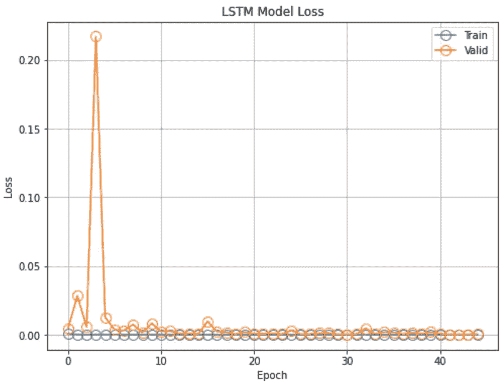**

**双向 LSTM (BiLSTM)一层—来自作者**

**该图显示了**验证损失**如何增长，然后在三个时期内从大到小突然下降到低于 0.05 的水平。ReLU 激活功能用于处理[消失/爆炸梯度问题](https://analyticsindiamag.com/can-relu-cause-exploding-gradients-if-applied-to-solve-vanishing-gradients/)，可能会导致 BiLSTM 训练中的高脉冲。**

*   ****神经营养因子序列&验证损失:****

```
**RMSE** performance metrics: **Train Data:** 1.16, **Test Data:** 31.8
```

**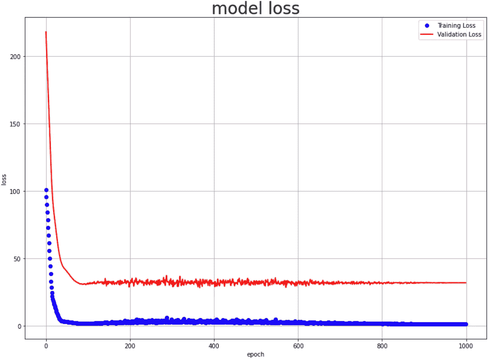**

**神经原植物——来自作者**

**训练和验证损失正在改善，但它们之间存在差距，这意味着它们的行为不同于来自各种分布的数据集。**

# **结论**

**正如我们所见，我们的模型运行良好。它可以准确地跟踪 2010 年至 2021 年大多数意想不到的跳跃/下跌；但是，您可以通过修补超参数并进行更多调整来增强性能。其他几个动作可以帮助微调超参数，例如改变隐藏层的数量、神经元的数量、学习速率、激活函数和优化器设置。但是，这些问题留待下一次讨论。**

**我希望您已经通过在 Tensorflow 中实现堆叠 LSTM 和比尔斯特姆模型，以及探索 NeuralProphet 建模库，使用深度学习理解了时间序列预测。因此，这里介绍的模型可用于各种其他时间序列预测场景，在这些场景中，您可以将多元数据指定为一个 [3D 张量](https://www.tensorflow.org/tutorials/structured_data/time_series#baseline)。**

**如果您有任何意见或问题，请在下面发表。这个项目的整个 Jupyter 笔记本具有 EDA(探索性数据分析)、可视化、培训后转换回原始形式、性能指标、未来预测等等，可在我的 GitHub 存储库中访问。**

*****这篇文章的所有源代码和更多可以在我的 GitHub 找到:*****

**[](https://github.com/A-safarji/Time-series-deep-learning/) [## GitHub-A-safarji/Time-series-Deep-learning:开发深度学习 LSTM、BiLSTM 模型和…

### 使用公司的历史数据预测股票价格使用神经网络进行股票的多步预测…

github.com](https://github.com/A-safarji/Time-series-deep-learning/) 

> ***免责声明:*** *已经尝试使用时间序列分析算法来预测股票价格，但是它们不可用于在真实市场中下注。这只是深度学习模型预测股票的教程和实现。因此，不打算让其他人购买本出版社的股票。*

😃感谢您的宝贵时间。 ***快乐学习！***** 

# **参考**

**[](https://www.investopedia.com/terms/t/timeseries.asp) [## 了解时间序列

### 时间序列是在一段时间内连续出现的数据点序列。这可以是…

www.investopedia.com](https://www.investopedia.com/terms/t/timeseries.asp) [](https://www.ibm.com/cloud/learn/recurrent-neural-networks) [## 什么是递归神经网络？

### 了解递归神经网络如何使用顺序数据来解决语言翻译中常见的时态问题…

www.ibm.com](https://www.ibm.com/cloud/learn/recurrent-neural-networks) 

基于深度学习双向 LSTM 神经网络的短期负荷预测。*应用科学*。[https://doi.org/10.3390/app11178129](https://doi.org/10.3390/app11178129)

[](https://ieeexplore.ieee.org/document/9005997) [## LSTM 和比尔斯特姆在时间序列预测中的表现

### 基于机器和深度学习的算法是解决时间预测问题的新兴方法

ieeexplore.ieee.org](https://ieeexplore.ieee.org/document/9005997)  [## 神经营养文献

### 基于神经网络，受脸书先知和 AR-Net 启发，构建于 Pytorch 之上。可以安装 NeuralProphet

neuralprophet.com](https://neuralprophet.com/html/contents.html) [](https://machinelearningmastery.com/how-to-develop-lstm-models-for-time-series-forecasting/) [## 如何开发用于时间序列预测的 LSTM 模型—机器学习掌握

### 长短期记忆网络，简称 LSTMs，可用于时间序列预测。有很多种…

machinelearningmastery.com](https://machinelearningmastery.com/how-to-develop-lstm-models-for-time-series-forecasting/) [](https://programming-review.com/machine-learning/overfitting) [## 如何防止过拟合|正则化-编程复习

### 机器学习工程师害怕过度拟合。首先，他们发现过度拟合，然后他们试图避免它。这里…

programming-review.com](https://programming-review.com/machine-learning/overfitting)**