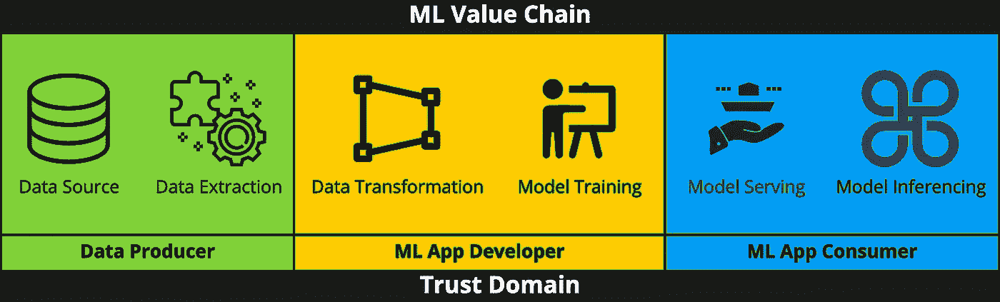
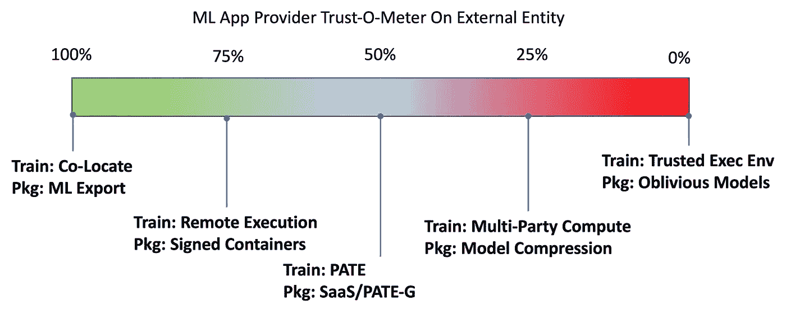
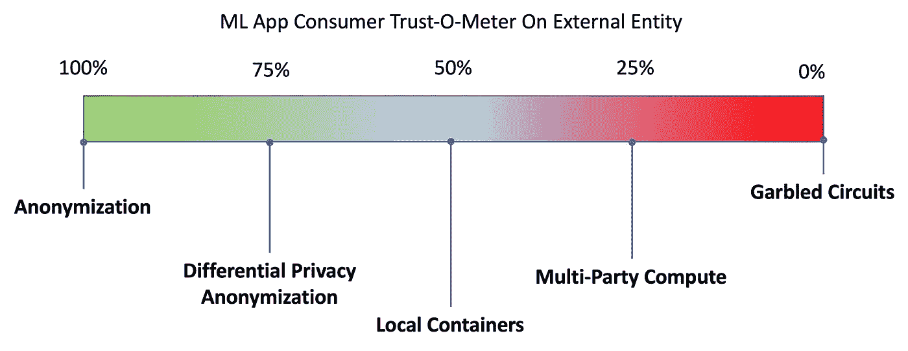

# 开启人工智能/人工智能领域的新价值链

> 原文：<https://pub.towardsai.net/unlock-new-value-chain-in-ai-ml-b1f1f7746904?source=collection_archive---------2----------------------->

## 保护隐私的人工智能如何发现人工智能/人工智能价值链中的新价值？

照片由 [DeepMind](https://unsplash.com/@deepmind?utm_source=medium&utm_medium=referral) 在 [Unsplash](https://unsplash.com?utm_source=medium&utm_medium=referral) 上拍摄

与我们过去历史上的任何其他技术相比，人工智能/人工智能在过去十年中的发展是激烈和戏剧性的。这种快速发展可以归因于两个主要因素，数据集的可用性和可以访问这些数据集的开源社区。不可否认的事实是，像 ImageNet、COCO、NLTK、GPT-2 和 GloVe 这样的数据集在 AI/ML 的发展中发挥了重要作用。

10 年前人工智能进化开始时，几乎没有人意识到数据的价值及其对隐私的影响。快进到今天，各国正在推出我们的数据保护法，我们大多数人至少意识到数据泄露可能给我们带来的潜在危害。随着对数据保护的认识和法规的增加，新数据集的公共可用性很可能会下降，因此可能会减缓人工智能的进一步发展。数据隐私问题在组织中更加突出，因为他们将数据视为知识产权，不愿意与第三方共享。隐私保护 ML (PPML)是一个可行的解决方案来解决这些问题，并在 ML 价值链中释放新的价值。

# 什么是隐私保护 ML？

今天，AI/ML 应用程序的整个生命周期都被限制在信任边界内。每个组织都被迫雇用内部数据科学团队或短期顾问来从他们的数据中提取价值。一些组织成功地做到了这一点，但许多组织没有做到。对数据进行石墙保护的要求正在损害组织，因为其创新速度受到内部能力的限制。今天，没有人在构建像 MongoDB、Redis 等这样的内部数据库应用程序。，但每个人都在建立预测模型、推荐系统、序列预测等。，并试图将它们投入生产。保护隐私的 ML(PPML)可以帮助组织超越信任边界，并从 AI/ML 应用程序中提取比现在更多的价值。PPML 不仅涉及控制和保护训练数据，还涉及保护训练模型、发送给模型进行推理的数据以及模型生成的预测。他们构成了 PPML 的四大支柱。

最近有多项研究和开发工作集中在 PPML。联合学习最近变得流行起来，这要归功于 Google 的出版物“移动键盘预测的联合学习”[2]，这给了联合学习产品化的信心。与此同时，像“联邦学习的进步和公开问题”[3]和“联邦学习系统:数据隐私和保护的愿景、宣传和现实”[4]这样的出版物让我们清楚地知道，联邦学习是解决 PPML 所需的难题的一部分。出版物“保护隐私的机器学习:方法、挑战和方向”[5]概述了定义和访问 PPML 解决方案的良好框架和词汇。

# 隐私保护 ML 中的信任域

下面的图 1 展示了 ML 价值链中涉及的信任域。

图 1—ML 价值链中的信任域

ML 价值链有三个子领域，即数据生成、模型训练和模型消费。PPML 的主要目标是让多方在有限信任或零信任的情况下参与到这个价值链中。当数据生成、模型开发和模型推理的责任被一个人或一个 scrum 团队这样的单一实体所拥有时，就不需要 PPML 了。随着 ML 应用的范围和适用性的扩大，由一个 scrum 团队或业务部门来管理端到端的 ML 生命周期是不可能的。当 ML 价值链被多个 scrum 团队或业务单位或组织共享时，保护 ML 解决方案的责任也被共享，因此需要一个 PPML 框架来确保 ML 价值链端到端的安全。

为了实现信任域之间的零信任，每个域提供的隐私机制应该是独立的。例如，ML 应用程序开发人员采用的信任机制应该是独立的，不应该依赖于数据生产者的隐私机制。

# PPML 信托 O-米

下面的信息图试图将 PPML 技术作为一个框架，应用于不同的信任级别。这些信息图表并不旨在提供目前可用的所有 PPML 技术的完整地图，而是提供一种可以考虑推出针对不同需求的 PPML 解决方案的可能选项。

## 数据生产者信任-O-米

图 2 —数据生产者的 PPML 选项

对于参与 ML 价值链的数据生产者，他们需要保护他们的数据，并确保数据不会离开他们的信任域。他们需要向第三方公开其数据的受控、受限和可审核的界面，而不损害数据隐私和丢失数据资产的风险。数据生产者至少应该考虑实现匿名化，以混淆敏感信息。当外部实体的信任因子相当高时，可以考虑基于差分隐私的匿名化和远程执行技术。当信任因子有限时，可以考虑使用联合学习和同态加密。最近，联合学习在生产中的应用有限，同态加密仍处于研究领域。

## ML 应用提供商信任度-O-Meter

图 3—ML 应用提供商的 PPML 选项

模型或 ML 应用程序提供商需要执行 EDA 并训练模型，而无需访问本地的实际数据。ML 应用程序提供者会对保护他们的模型免受数据提供者和模型消费者的多个外部实体的影响感兴趣。他们需要保护模型权重和架构，以确保训练数据和模型训练不能被逆向工程。当对数据提供者的信任级别相当高时，ML 应用程序提供者可以考虑远程执行环境和“PATE”类型的知识提炼方法用于培训，并且可以考虑签名容器和 SaaS 或 PATE-G 类型的模型抽象用于包装模型以供模型消费者接口。当信任级别较低时，可以考虑使用多方计算(MPC)和可信执行环境(TEE)等方法进行训练和模型压缩，并使用遗忘模型进行模型打包。

## ML 应用程序消费者信任度-O-Meter

图 4 —面向 ML 应用消费者的 PPML 选项

ML 应用程序消费者希望保护 ML 应用程序提供商提供的敏感输入数据，如健康记录、信用评分以及由此得出的诊断、信用评级等推论。至少 ML 应用消费者应该考虑在敏感信息上使用传统的匿名技术。当信任级别相当高时，可以考虑应用基于差分隐私的匿名技术和本地容器等方法来保护输入数据。当信任级别较低时，应该考虑使用多方计算和乱码电路技术来确保输入数据的隐私性。多方计算和乱码电路技术仍处于研究领域。

安全和隐私从来都不是绝对的，在信任、安全和资源可用性之间总会有一个折衷。人们需要根据需要逐案保护的价值做出权衡决定。对于每一个用例，人们应该根据所涉及的各方、信任因素和资源需求来建立一个 PPML 概要文件。希望上面提到的信息图表可以作为创建这样的个人资料的起点。

# 结论

尽管今天许多 PPML 技术仍处于研究领域，但有相当多的技术，尤其是在数据生产者领域，可以在今天投入生产。随着 PPML 技术的发展，人们应该考虑将它们部署到生产中，从而发现超越信任边界的 ML 价值链中的新价值，并以安全的方式共同将 ML 推向新的前沿。

# 参考

1.  完全保护隐私的人工智能。它是什么，我们如何实现它？|作者 Patricia Thaine |走向数据科学
    [https://Towards Data Science . com/perfective-privacy-preserving-ai-c 14698 f 322 F5](https://towardsdatascience.com/perfectly-privacy-preserving-ai-c14698f322f5)
2.  Andrew Hard，Kanishka Rao，Rajiv Mathews，Swaroop Ramaswamy，Franç oise Beaufays，Sean Augenstein，Hubert Eichner，Chloé Kiddon，Daniel Ramage:《移动键盘预测的联邦学习》，2018； [arXiv:1811.03604](http://arxiv.org/abs/1811.03604)
3.  Peter Kairouz，H. Brendan McMahan，Brendan Avent，Aurélien Bellet 等人:《联邦学习的进展和开放问题》，2019 年； [arXiv:1912.04977](http://arxiv.org/abs/1912.04977)
4.  李，温泽义，，胡思旭，王乃波，，，何炳生:“联邦学习系统调查:数据隐私和保护的愿景，炒作和现实”，2019； [arXiv:1907.09693](http://arxiv.org/abs/1907.09693)
5.  徐润华，Nathalie Baracaldo，James Joshi:“保护隐私的机器学习:方法、挑战和方向”，2021；arXiv:2108.04417

## 版权所有 A5G 网络公司。