# 利用自然语言处理释放文本分析的力量

> 原文：<https://pub.towardsai.net/unlock-the-power-of-text-analytics-with-natural-language-processing-2e6d83b35f99?source=collection_archive---------1----------------------->

## [深度学习](https://towardsai.net/p/category/deep-learning)，[自然语言处理](https://towardsai.net/p/category/nlp)

## 主题建模的潜在狄利克雷分配和文本分类的朴素贝叶斯

资料来源:[调查统计](https://www.surveysensum.com/customer-experience/text-analytics/)

自然语言是一种用于人类日常交流的语言。它在本质上对于文本和语音都是高度非结构化的，因此很难被机器解析和理解。**自然语言处理(“NLP”)涉及自然人类语言和计算机之间的交互。它是语言学、计算机科学和人工智能领域的交叉。**

根据国际数据公司在其报告[中的预测，世界的数字化:从边缘到核心](https://www.seagate.com/files/www-content/our-story/trends/files/idc-seagate-dataage-whitepaper.pdf)，数据总量

> 将从 2018 年的 33 泽字节增长到 2025 年的 175 泽字节。

根据 2019 年福布斯的统计， [**每天生成的 90%的数据是非结构化数据**](https://www.forbes.com/sites/bernardmarr/2019/10/16/what-is-unstructured-data-and-why-is-it-so-important-to-businesses-an-easy-explanation-for-anyone/#5c1abd3415f6) ，其中大部分将是文本。这是产生的最大数据源，因此是企业中分析和部署 AI 应用程序的丰富数据源。然而，公司通常只习惯于管理和分析“结构化”数据，这些数据整齐地排列在数据库的行和列中。

为了从非结构化数据中发掘洞察力，我们可以利用文本分析的力量，并使用 NLP 将文档和数据库中的非结构化文本转换为适合分析的标准化结构化数据。

# **NLP 的两个主要组成部分**

*   自然语言理解帮助计算机理解和解释人类语言。NLP 不要求用户通过编程代码与计算机交互，而是允许用户使用日常语言与计算机交互，计算机可以对此做出适当的响应。
*   **自然语言生成**是计算机将数据翻译成人类可读语言的过程。正在翻译的数据包括构成电脑屏幕上显示的照片和文本的位和字节。

# **自然语言理解的主要应用**

1.  **主题建模**通过识别重复出现的模式或主题从文本中提取意义，并解开每个单独文本背后的语义结构。
2.  **文档分类**帮助将离散的文本集合分类。示例包括垃圾邮件过滤、区分正面和负面产品评论以及客户评论。
3.  **文档推荐**通过基于内容的[推荐系统](https://en.wikipedia.org/wiki/Recommender_system#Content-based_filtering)根据给定的信息选择最相关的文档。一个很好的例子是 Google 搜索引擎，它根据用户的查询显示最相关的网页。

# **自然语言生成的主要应用**

1.  **文档摘要**从不断增长的可用文本数据中生成文本摘要。随着远程办公的发展，从对话中获取关键想法和内容的能力越来越受欢迎。一个能够将语音转换成文本并从团队会议中生成摘要的**语音摘要**系统会很有趣。
2.  **机器翻译**在不同语言之间翻译文本。谷歌翻译就是一个例子，它可能是迄今为止使用最多、最著名的机器翻译引擎。
3.  系统用自然语言回答人类提出的问题。想想苹果的 Siri、亚马逊的 Alexa 等语音助手。

在这篇文章中，我们将完成一个 NLP 工作流程，探索使用潜在的 Dirichlet 分配进行主题建模和使用朴素贝叶斯进行文本分类的基础。

# 问题陈述:对一组新闻语料进行主题建模，开发文本分类模型。

# 开始编码吧！

# 数据准备

加载[新闻语料库](https://www.nytimes.com/)并预览数据集的片段。

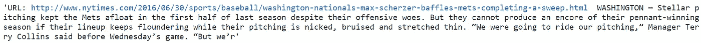

新闻语料库中存在 URL 链接，让我们利用正则表达式来移除 URL 链接。 ***re.compile()*** 方法将一个正则表达式模式组合成模式对象进行模式匹配。这使我们能够再次搜索一个模式，而不用重写它。然后，我们将逐行拆分单独的新闻文章，删除开头和结尾的空格。

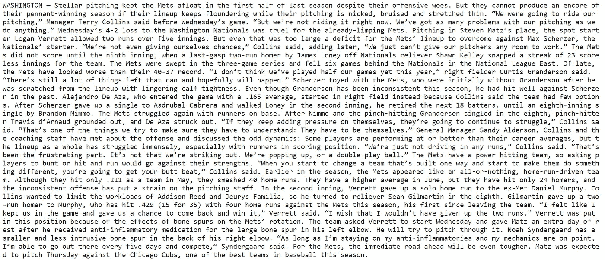

上面展示的示例文章看起来不错。让我们将处理后的新闻[语料库](https://dictionary.cambridge.org/dictionary/english/corpus)加载到 dataframe 中，并创建一个名为“content”的列。

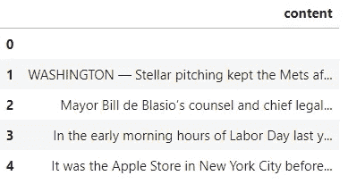

索引 0 下的第一行似乎是空的。在清理之前，让我们找出数据框中的物品总数。

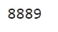

# 数据清理

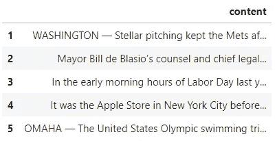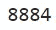

我们已经成功地从数据帧中删除了 5 个空行。下一步，我们将使用正则表达式删除包含数字的单词，并用一个空格替换它们。标准化也是通过将所有的单词转换成小写来完成的。

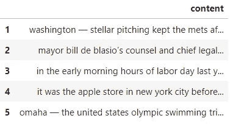

这些数据对我来说看起来仍然有些奇怪，为什么连字符还在那里？去掉所有的标点符号是个好主意。

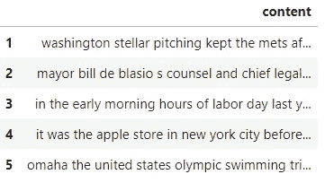

# 探索性数据分析

**单词云**是一种数据可视化技术，用于表示文本数据，其中每个单词的大小表明其频率或重要性。使用单词云可以突出显示重要的文本数据点，从而有助于获得最常见单词的可视化表示。

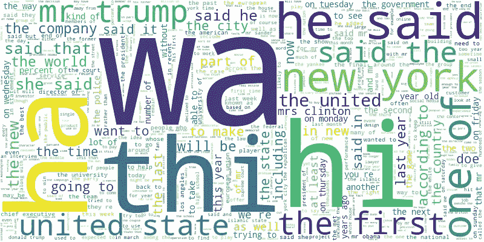

# 特征工程

[自然语言工具包](http://www.nltk.org/)(“NLTK”)是一个为文本工作和建模而编写的 Python 库。它为加载和清理文本提供了很好的工具，以便为使用机器学习和深度学习算法准备好数据。以下是一些用于特征工程的常用工具:

*   **标记化**包括将原始文本分割成小的、不可分割的单元进行处理。NLTK 提供了一个函数- ***word_tokenize()，*** 用于将字符串拆分成记号(名义上是单词)。根据空格和标点符号拆分标记。

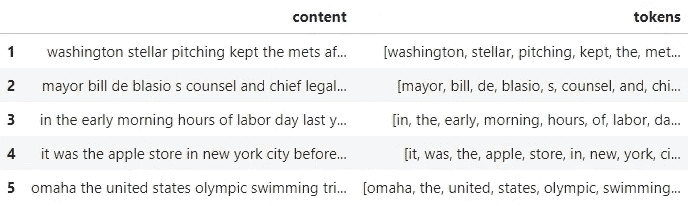

转换成**单词的单个记号的句子**

*   **停用词**是对短语的深层含义没有贡献的词。最常见的例子有"*、*、*、*、*、*、*、*。NLTK 提供了各种语言(如英语)的常用停用词列表。

**删除停用词**，如“the”、“in”、“it”和“was”。

*   **引理化**使用单词的词汇和形态分析，旨在仅移除[屈折词尾](https://sites.google.com/a/norridge80.net/ms-matocha-s-first-grade/phonemic-experts/inflected-endings)，并返回单词的基础或字典形式，这被称为[引理](https://en.wikipedia.org/wiki/Lemma_(morphology)#:~:text=In%20morphology%20and%20lexicography%2C%20a,by%20which%20they%20are%20indexed.)。NLTK 提供了***WordNet lemmatizer()***，它使用 [WordNet 数据库](https://wordnet.princeton.edu/)来查找单词的词条。

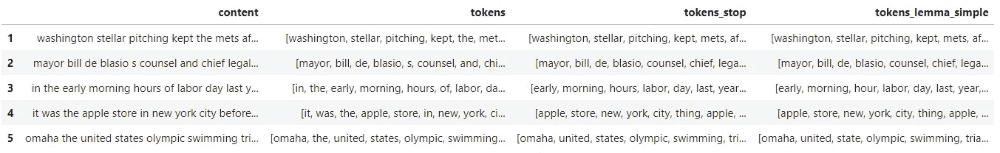

**从“小时”到“小时”、“状态”到“状态”导出**的引理。

*   **词性标注**或**词性标注**是将单词按其词性分类并相应标注的过程。词性标注器用于指定句子中每个单词的语法信息。

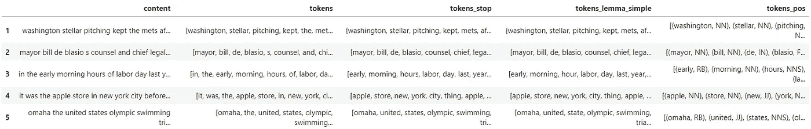

以上缩写的几个例子，连同它的意思:

*NN:名词，单数或复数*

NNS:名词，复数

*IN:介词或从属连词*

JJ:形容词

RB:副词

NLTK 使用来自 [Penn Treebank 项目](https://www.ling.upenn.edu/courses/Fall_2003/ling001/penn_treebank_pos.html)的标签集，该项目为语言结构注释自然出现的文本。

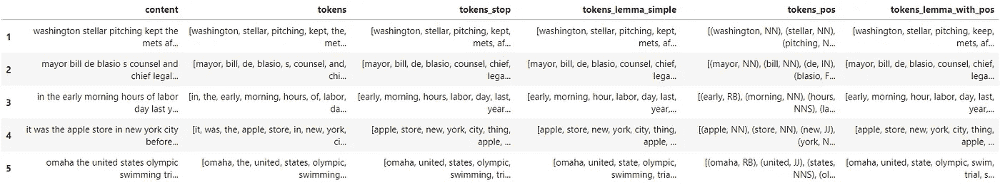

接下来，我们将使用[单词袋](https://machinelearningmastery.com/gentle-introduction-bag-words-model/#:~:text=A%20bag%2Dof%2Dwords%20is,the%20presence%20of%20known%20words.)方法从新的语料库中提取特征，并建立其中出现的所有独特单词的词汇表。新的语料库被转换成简单的矢量表示*。现在，我们能够根据向量列表绘制出十个最常见的单词。*

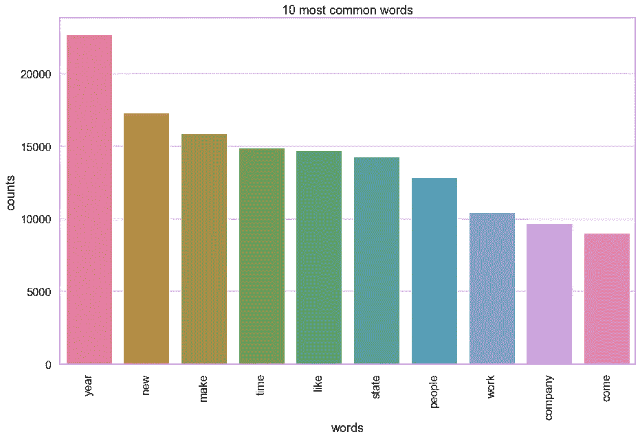

# 使用潜在狄利克雷分配(“LDA”)的主题建模

LDA 背后的关键思想是将语料库中的文档表示为潜在主题的随机混合，其中每个主题由词的分布来表征。LDA 是语料库的生成概率模型。我们将通过使用 scikit-learn 实现 [LDA](https://scikit-learn.org/0.16/modules/generated/sklearn.lda.LDA.html) ，scikit-learn 是一个用于机器学习的开源 Python 库。

首先，如上所述为**主题模型对象**定义一个函数。接下来，我们将准备**文档术语矩阵**。LDA 主题模型算法需要文档单词矩阵作为主要输入。使用计数矢量化工具对文档进行矢量化，因为我们只能使用 LDA 的原始术语计数，LDA 是一种概率图形模型。

接下来，执行**参数选择，选择最佳数量的主题。**我们可以使用困惑度和对数似然性等指标来确定良好的模型性能。具有较高对数似然性和较低复杂度的模型被认为是好的。首先指定值的初始范围。

对所有可能的主题大小应用 LDA， *k* ，并确定其对数似然和困惑分数。**通过执行 for 循环来创建新的 LDA 对象，并将其与文档术语矩阵相匹配，从而遍历主题编号的可能范围**。然后将结果插入到创建的 topic_models 列表中。获得具有最高对数似然和最低困惑分数的LDA 的最优主题大小， *k，*。

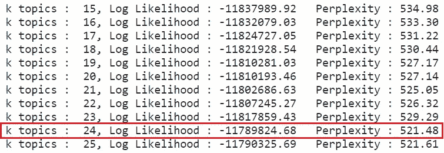

结果显示， ***k 个主题:24 个*** 是给出最高对数似然和最低困惑分数的主题的**最佳数量。使用获得的最佳主题数量评估主题和术语**，并显示前 15 个单词，以了解每篇新闻文章的主题类别。

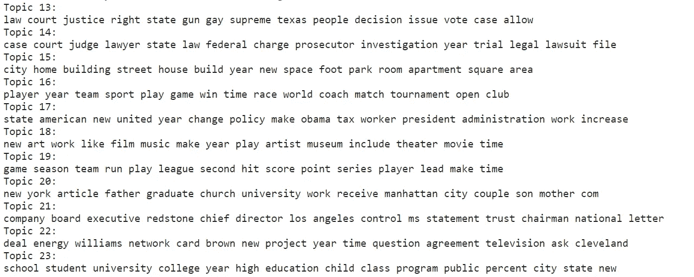

使用 LDA 优化获得 24 个主题。

通过**使用 pyLDAvis 可视化主题模型，解释符合文本数据语料库的主题模型中的主题。pyLDAvis 是一个用于交互式主题模型可视化的 python 库。**

正如卡森·希沃特和肯尼·雪莉的研究论文 [LDAvis:一种可视化和解释主题的方法](https://www.aclweb.org/anthology/W14-3110.pdf)中所介绍的，

> LDAvis，一个基于 web 的交互式可视化主题，使用潜在的 Dirichlet 分配进行估计，它是使用 R 和 D3 的组合构建的。我们的可视化提供了主题的全局视图(以及它们之间的区别)，同时允许深入检查与每个主题最相关的术语。

一个好的主题模型应该没有重叠，每个主题都有一个相当大的区域。我们将向 pyLDAvis 传递三个参数，(1) LDA 对象，(2)文档术语矩阵，以及(3)计数矢量器。相关性度量通过主题内的概率相对于整个语料库的概率来排序。如上述研究论文所述，推荐的最佳相关性度量是 **λ=0.6。**

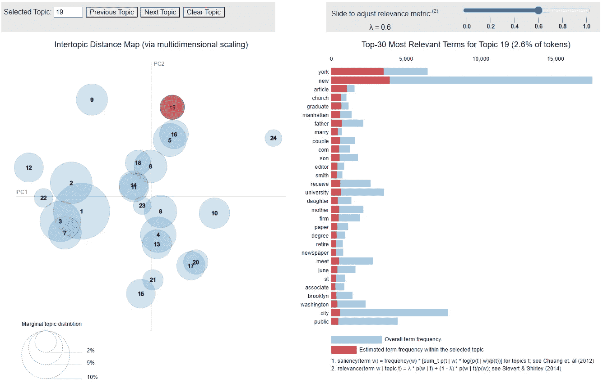

pyLDAvis 可视化工具显示与主题 19 最相关的术语。

主题间距离图允许我们了解主题如何相互关联，包括主题组之间潜在的更高层次的结构。圆圈之间的**距离**表示主题之间的分布相似度接近度。基于上述主题间距离图，主题#1、2、3 和 7 彼此紧密相关。

圆圈的**面积与主题的总体流行度成正比。在这种情况下，圆圈#1 具有出现频率较高的术语。此外，圆圈根据流行程度进行编号和分类。**

要获得文档的主导主题，一种合理的方法是查看哪个主题对该文档的贡献最大，并将该主题作为标签分配给该文档。属性 ***n_components*** 包含主题总数，通过循环寻找 ***n_components*** ，为主题提供索引。

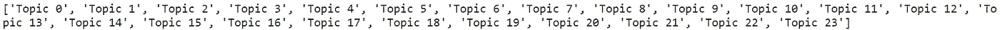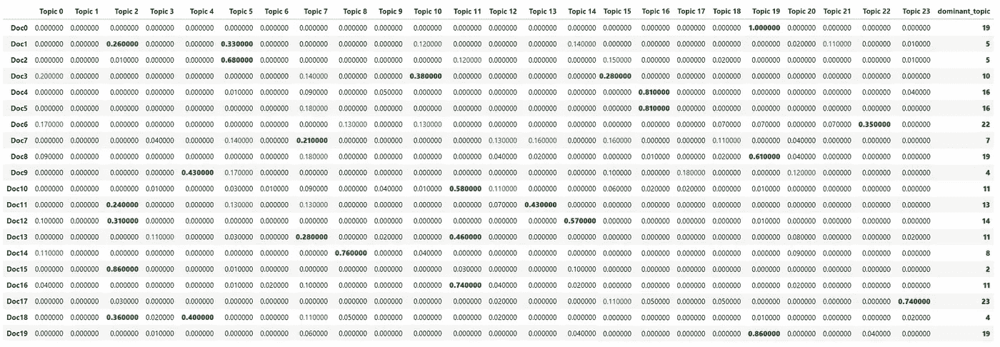

以粗体和绿色字体表示的主导主题的最高贡献。

让我们对确定的主要主题进行直观检查。

**主题 19** 由上面 pyLDAvis 可视化工具中显示的术语组成。因此，通过视觉检查，我们可以确认文档 19 的主导主题确实是主题 19。

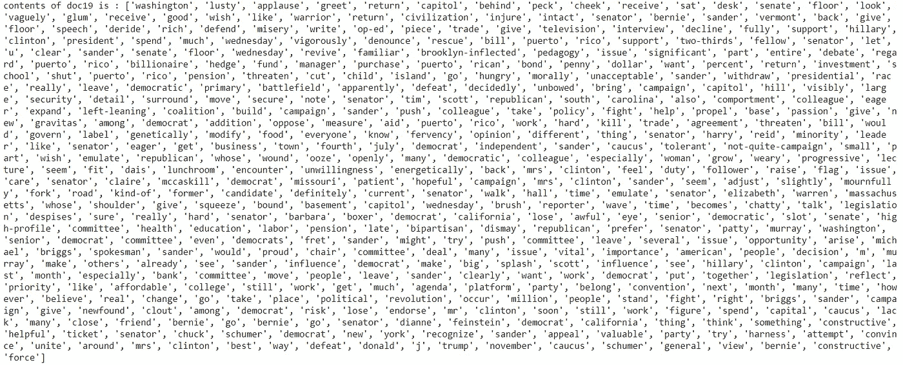

# 使用朴素贝叶斯的文本分类

文本分类是根据文本的内容给文本分配标签、标记或类别的过程。朴素贝叶斯是一个概率算法家族，利用[贝叶斯定理](https://en.wikipedia.org/wiki/Bayes'_theorem)来预测文本的标签。

看看 Kamran Kowsari 等人的研究论文[文本分类算法:调查](https://arxiv.org/abs/1904.08067)，

> 自 20 世纪 50 年代以来，朴素贝叶斯文本分类已被广泛用于文档分类任务。朴素贝叶斯分类方法的理论基础是贝叶斯定理，该定理是由托马斯·贝叶斯在 1701-1761 年间提出的。最近的研究已经广泛地解决了信息检索中的这种技术。这种技术是一种生成模型，是最传统的文本分类方法。

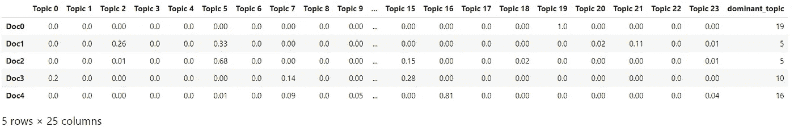

主导主题被表示为整数，因此我们将替换它们并用最主导的主题标签来标记数据帧。

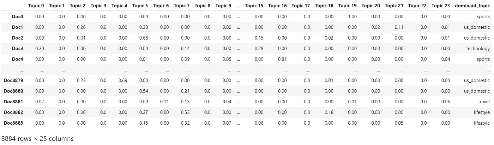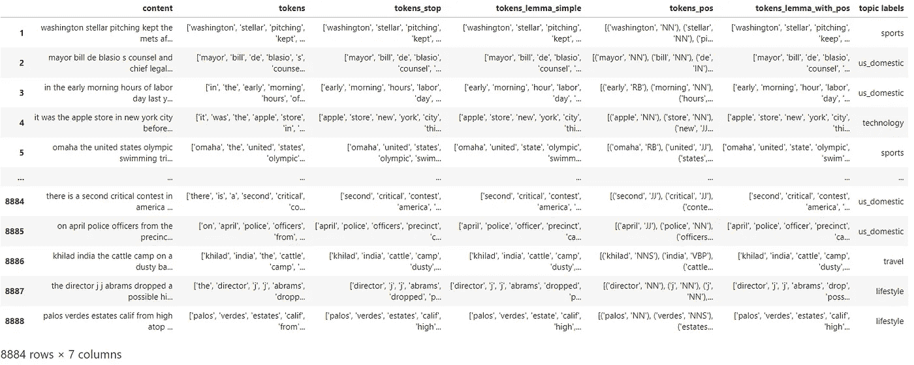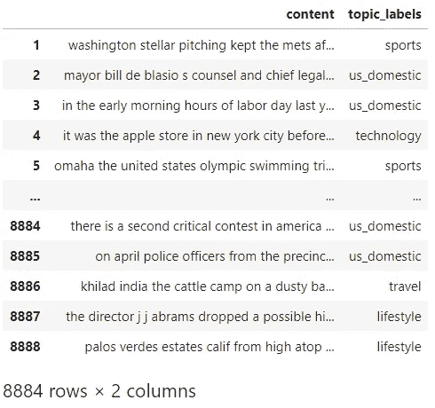

数据帧现在可以进行训练了。将数据帧分为输入文本和输出标签。

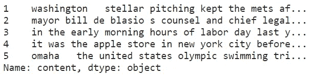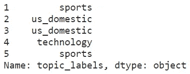

通过使用 scikit-learn 内置的英语停用词表，使用[计数矢量器](https://scikit-learn.org/stable/modules/generated/sklearn.feature_extraction.text.CountVectorizer.html)将文本文档集合转换为令牌计数矩阵。 ***ngram_range*** 表示要提取的不同单词 n 元文法或字符 n 元文法的 n 值范围的下限和上限。将使用所有 n 值，使得 min_n < = n < = max_n。在这种情况下，默认的 **ngram_range** 为(1，1)，即。使用了 unigrams。

选择了[多项式朴素贝叶斯模型](https://scikit-learn.org/stable/modules/naive_bayes.html)来实现用于多项式分布数据的朴素贝叶斯算法。它是文本分类中使用的两个经典朴素贝叶斯变体之一，其中数据通常表示为词向量计数。对训练数据拟合模型，并应用拟合的模型来预测测试集的主题标签。

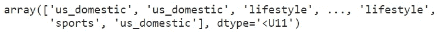

# 结果评估

 [## 决策树和随机森林在机器学习中的应用

### 分类问题的监督学习研究

medium.com](https://medium.com/towards-artificial-intelligence/use-of-decision-trees-and-random-forest-in-machine-learning-1e35e737b638) 

请务必查看我的上述帖子，以深入了解**混淆矩阵**和**分类报告。**

# 1.混淆矩阵

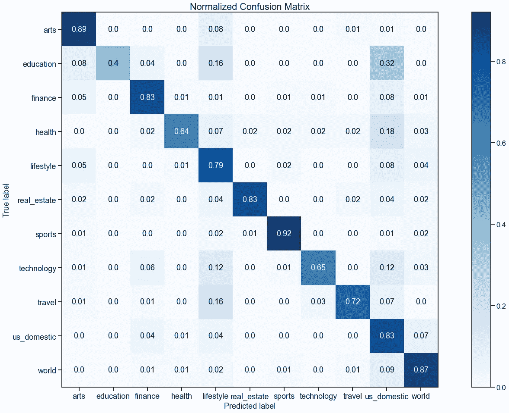

基于上述归一化的混淆矩阵，朴素贝叶斯分类器表现良好，预测了高百分比的真实标签。

# 2.分类报告和错误度量

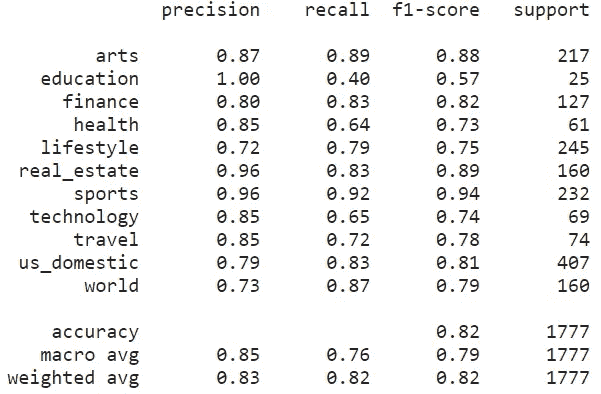

**分类报告**显示了基于每个类别的主要分类度量**的表示**，并给出了对分类器行为的更深层次的直觉，而不是全局准确性。这些指标是根据真阳性和假阳性以及真阴性和假阴性来定义的。

需要注意的一个重要方面是“教育”类别的分数。获得了 1.00 的精确度分数，这相当于被分类为阳性的所有实例的 100%分数。然而，0.4 的不良回忆分数(< 0.5) was obtained with a slightly above average f1-score of 0.57\. This indicates that **对于所有实际上为阳性的实例，低百分比实际上被正确分类**。对于数据集中 25 个实际出现的“教育”文章的低支持，也许在“教育”类别中训练更多的文章将有助于提高分数。

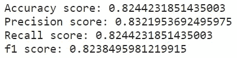

**在全球基础上**，我们还通过将测试标签与预测标签进行比较，计算了各种**误差指标**，如准确度、精确度、召回率和 f1 分数。总体而言，朴素贝叶斯分类器获得的分数远高于基线 0.5。

# 已训练模型的部署

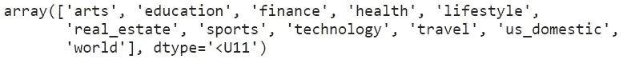

# 主题名称预测

使用训练好的模型，让我们请求用户输入新的文本。

下面的例子接收一个新的文本，并调用上面定义的函数对标签进行预处理和预测。

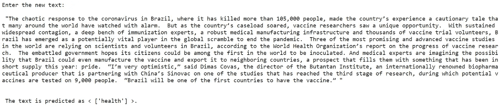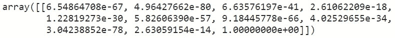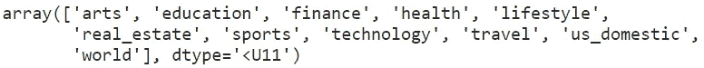

# 更多示例新闻片段的结果

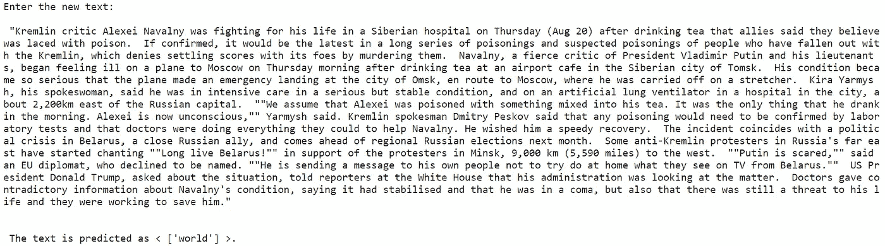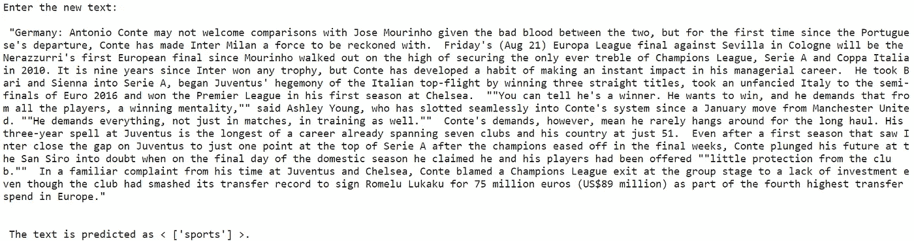

# 结论

LDA 的建模目标已经成功实现。对于主题和术语的评估，从新的语料库中获得最佳的主题数量。这样，**就能够** **确定各种主题类别，并解开隐藏的主题结构**。

此外，朴素贝叶斯分类器的使用再次被证明适用于文本分类。在大量数据用于训练的情况下，基于对结果的评估，主题建模和文本分类的结果是令人满意的。

通过使用从互联网上提取的各种新闻片段测试训练好的模型，**结果被证明是积极的，并且在主题标签应该是什么的预期之内**。

# 参考

1.  [世界的数字化:从边缘到核心](https://www.seagate.com/files/www-content/our-story/trends/files/idc-seagate-dataage-whitepaper.pdf)
2.  [什么是文本挖掘、文本分析和自然语言处理](https://www.linguamatics.com/what-text-mining-text-analytics-and-natural-language-processing)
3.  [通过文本挖掘从非结构化数据中发掘洞察力](https://www.peakindicators.com/blog/unlocking-insights-from-unstructured-data-with-text-mining)
4.  [如何用 Python 清理机器学习的文本](https://machinelearningmastery.com/clean-text-machine-learning-python/)
5.  [LDAvis:一种可视化和解释主题的方法](https://www.aclweb.org/anthology/W14-3110.pdf)
6.  [文本分类算法综述](https://arxiv.org/abs/1904.08067)