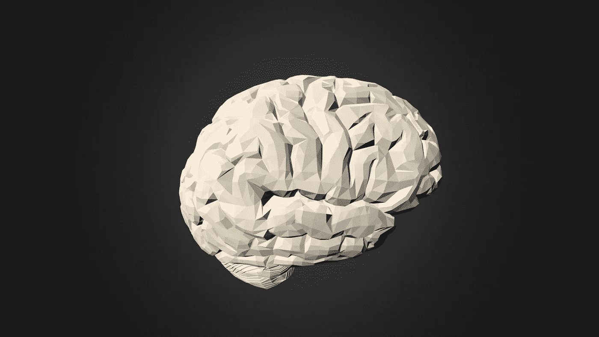
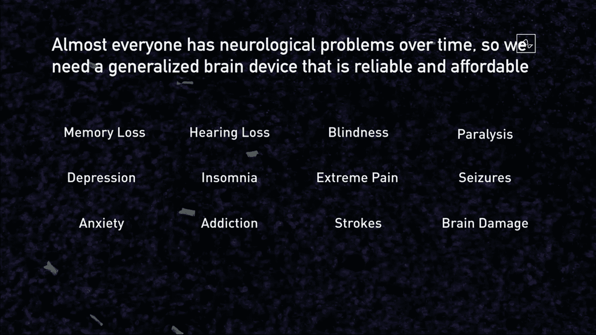
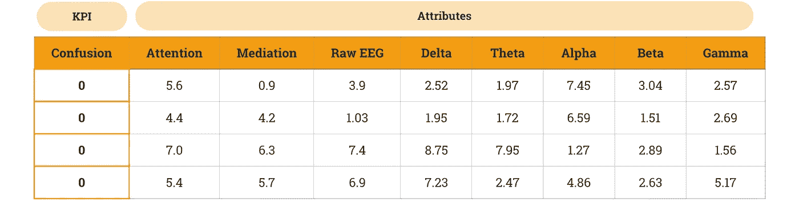
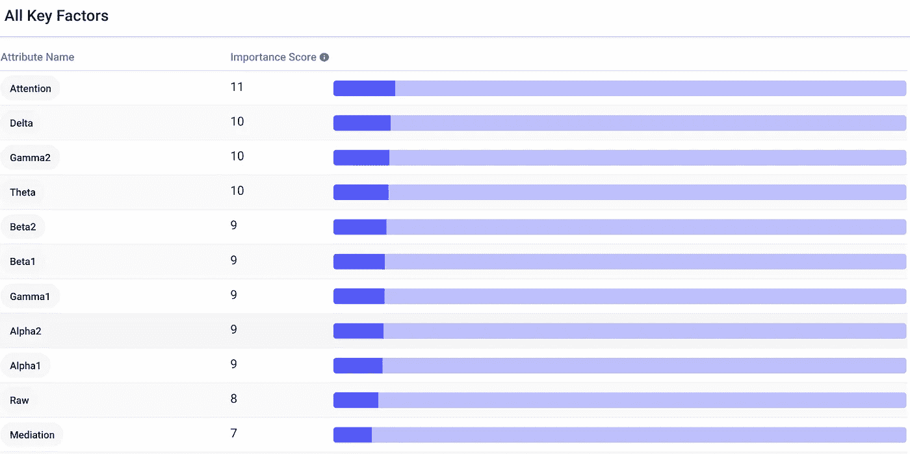
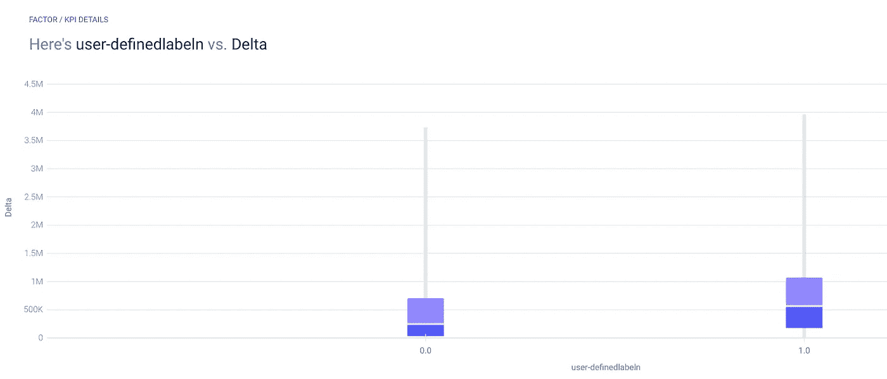
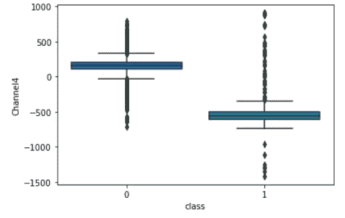
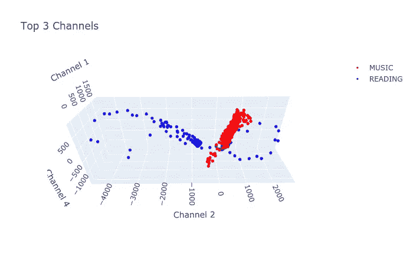
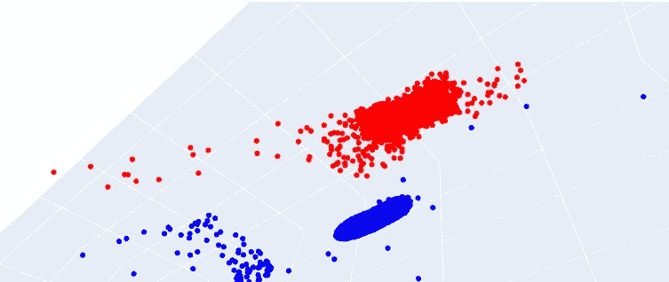

# 用 AutoML 揭开大脑的神秘面纱

> 原文：<https://pub.towardsai.net/unlocking-the-mysteries-of-the-brain-with-automl-8cefb0875aab?source=collection_archive---------3----------------------->

## [机器学习](https://towardsai.net/p/category/machine-learning)

## 从脑电图数据中发现真知灼见。

[【人脑】](https://sketchfab.com/3d-models/49bcdf19c1904c76a456b31838b0d7ac) by [Versal](https://sketchfab.com/versal) ， [CC BY 4.0](http://creativecommons.org/licenses/by/4.0/?ref=ccsearch&atype=rich)

短语“[这不是火箭科学](https://www.npr.org/2012/04/13/150580809/its-called-as-hard-as-rocket-science-for-a-reason)”听起来像是火箭制造的极端复杂性，有数百万个零件和许多犯错误的机会。

也就是说，大脑有近 100 *亿*个神经元，每个神经元都像一台“[微型计算机](https://singularityhub.com/2020/01/14/scientists-discovered-mini-computers-in-human-neurons-and-thats-great-news-for-ai/)”并非所有的神经元都是相互连接的，但仍然有大约 100 万亿个连接。我们怎么能理解如此复杂的计算机呢？嗯，人类已经尝试了几千年，但是“大脑代码”还没有被发现。

大脑计划希望逐个神经元地重建大脑的活动，类似于人类基因组计划确定我们整个基因组的 DNA 序列的方式。

事实上，重建大脑的活动是我们可以从自己开始的，利用 AutoML 的力量。以下是方法。

# 数据

正如任何机器学习问题一样，我们需要数据。在这种情况下，我们将使用表格自动工具 [Apteo](http://apteo.co) ，因此我们需要一个 KPI 和属性。

属性将是各种“大脑数据”测量，KPI 将是定义的精神状态。这种精神状态可能是焦虑、抑郁、癫痫发作、疼痛或任何其他我们希望调节的疾病。大脑就像一个电路，如果我们可以读取断开的电路(一种消极的精神状态)，我们就可以向大脑写入电信号来修复那些断开的电路。

[Neuralink 进度更新](https://www.youtube.com/watch?v=DVvmgjBL74w)

这种精神状态也可能是一种我们希望加强的积极现象，就像专注或放松一样。

为了简单起见，我们的第一个 KPI 将是“困惑”，我们将使用来自 Kaggle 的[困惑学生脑电图脑波数据](https://www.kaggle.com/wanghaohan/confused-eeg)。这些数据来自 10 名大学生，他们在观看 MOOC 视频的同时戴着单通道思维模式，测量额叶的活动。

其中两个属性`Attention`和`Meditation`是 [NeuroSky](http://neurosky.com/biosensors/eeg-sensor/algorithms/) 的专有算法输出，而其余的是频带(α、β、δ、γ和θ)，以及原始 EEG 信号。

在单通道的情况下，数据收集速率为 0.5 秒(学生观看 1 分钟的视频，因此每个学生每个视频有 120 行，总共 10 个学生和 10 个视频产生 12，000+行)，这比最先进的神经接口简单几个数量级。

相比之下，Neuralink 有 1，024 个通道以 19.3 kHz 采样，每秒约 19，300 个样本，每秒产生近 2000 万个数据点。

在我们的示例中，一个学生观看一个视频的两秒钟的数据可能如下所示，每一行都是一个样本，以 0.5 秒为间隔。

# 分析

最初的[研究论文](http://www.cs.cmu.edu/~kkchang/paper/WangEtAl.2013.AIED.EEG-MOOC.pdf)使用该数据在独立于学生的分类器上实现了 57%的平均准确率。换句话说，这是一个艰难的挑战，但我们可以做得比随机猜测更好。

我们可以将 Kaggle CSV 原样上传到 Apteo。我们选择`userdefined-label`(学生是否表示困惑)作为 KPI。我们最终得到一个随机森林分类模型，其 Jaccard 得分为 0.691。

粗略地说，我们模型的预测与学生是否困惑的现实有 69.1%的相似性。还不错。

下面，我们可以看到每个属性在预测混乱中的重要性。专有的`Attention`值是最重要的，其次是`Delta`通道、`Gamma2`通道、`Theta`通道以及其他。

各种属性具有惊人的相似预测能力。

δ是最有预测性的频带。δ脑电波与深度睡眠有关，但它们在清醒时也会以较小的量存在，大量的δ脑电波与自闭症、[双相情感障碍](https://www.sciencedirect.com/science/article/abs/pii/S0022395605000063)、[不适当的觉醒](https://www.nature.com/articles/s41398-018-0105-y)(注意力不集中)，以及[儿童多动症](https://journals.sagepub.com/doi/10.1177/1550059416643824)有关。

事实上，我们可以看到，当学生感到困惑时，δ脑电波的数量要高得多。下一个最重要的频带是伽马-2。研究表明[伽马波与更大的注意力](https://www.ncbi.nlm.nih.gov/pmc/articles/PMC5486945/)、[有关，尤其是在冥想的人](https://journals.plos.org/plosone/article?id=10.1371/journal.pone.0170647)中。

另一个重要的频率是`Theta`，通常[与*慢*思考](https://nhahealth.com/brainwaves-the-language/)联系在一起。关注快节奏的学习视频需要更活跃的脑电波，我们确实可以看到高θ与更大的困惑相关。困惑的学生θ值中位数在 115K 左右，非困惑的学生θ值中位数在 55K 左右。

# 更多数据(特征提取和更多通道)

上图中，我们使用了α、β和γ等脑电波频带来预测精神状态。本质上，我们使用原始 EEG 数据(仅由一个通道读取)的各种频带作为特征。

然而，我们可以通过各种提取技术从 EEG 数据中获得许多其他特征。我们还将研究从 4 个电极读取的原始数据，而不仅仅是 1 个电极，以了解增加通道数如何提高精度。

## 放松还是集中？

[例如，这个 Kaggle 数据集](https://www.kaggle.com/birdy654/eeg-mental-state-v2)从 EEG 数据中导出 988 个特征来描述一个人是否放松、专注或中立。这些特征依赖于统计技术，如快速傅立叶变换、香农熵、时间序列中的最大-最小特征、对数协方差等，所有这些都是在半重叠时间窗口中计算的。

我们可以将这个属性更加丰富的数据集上传到 Apteo，并选择`Label`作为 KPI。自动选择梯度提升分类模型，Jaccard 得分极高，为 0.972。事实证明，提取大量的特征可以让我们做出非常准确的预测。

在这种情况下，单个属性的重要性分数要低得多，但是综合起来，我们可以获得很高的准确性。

## 开心还是难过？

我们可以分析的另一个属性丰富的数据集是 Kaggle " [EEG 脑波数据集:感受情绪](https://www.kaggle.com/birdy654/eeg-brainwave-dataset-feeling-emotions)"

两名受试者每人观看 6 分钟的正视频，6 分钟的负视频，6 分钟的无(中性数据)，因此每个受试者记录了 18 分钟的数据，共计 36 分钟。

采样率为 150Hz(每秒 150 个样本)，使用 2，160 秒(36 分钟* 60)的数据，我们有一个包含 324，000 个数据点的数据集。

与之前的属性丰富的数据集一样，我们能够实现比仅使用几个频段更高的准确性。

## 音乐还是读书？

为了了解更多的通道数如何提高准确性，我们将分析来自 Kaggle 的数据集,该数据集测量某人在听音乐和阅读时的脑电图数据。记录设备有 4 个通道，而不是本文开始时分析的 1 通道数据。

我们的目标是简单地预测他们的大脑是在忙着听还是在读——这比预测某人是否困惑要简单得多，并且在 4 倍的频道数下，我们最终通过逻辑回归分类器获得了 1.0 的 Jaccard 分数。换句话说，我们有 100%的准确率。这引发了一个危险信号，让我们的模型看起来像是过度拟合了。

然而，看看这些数据，我们就能明白为什么这个模型能达到如此高的精确度。

下面，`0`类是指听音乐，`1`类是指阅读。这两个类别之间的通道 4 数据的大部分根本没有重叠(只有一些异常值重叠)，这意味着即使只有通道 4 也很容易做出相当准确的预测。

考虑到其他三个通道，每个都有不同程度的重叠，在数据的阅读和倾听之间有明显的区别。与其说模型过度拟合，不如说这只是一个需要解决的简单问题。

例如，我们还可以看到，在通道 2 数据中，类别之间的重叠最小。`reading`类的通道 2 数据范围极广，大约从-5000 到+3000，而`music`类的范围较窄，大约在-300 到+1000 之间，在这个范围内，没有多少读取示例。

如果我们放大得足够近，我们可以想象一个三维的清晰可分的超平面。

我们无法想象第四个通道维度，但这个维度用于训练，并使预测类别变得更加容易。

# 摘要

在本文中，我们使用 AutoML 准确预测困惑、放松或集中、积极或消极情绪，以及某人是否在阅读或听音乐，只需 1 个电极的数据。

想象一下，不是只分析一个电极，我们有来自 1024 个电极的数据，直接与大脑接触。这是像 Neuralink 这样的神经植入物的承诺。我们可以分析极其复杂的神经关联，即使是目前的测试版 Neuralink，其目标是在未来的版本中实现“数量级”的更多通道。

正如我们所见，更高的通道数和更多的特性支持更精确的预测模型。不难想象，有一天，神经分析将揭示意识本身的奥秘。