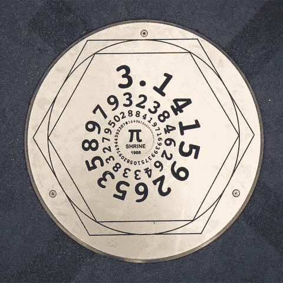
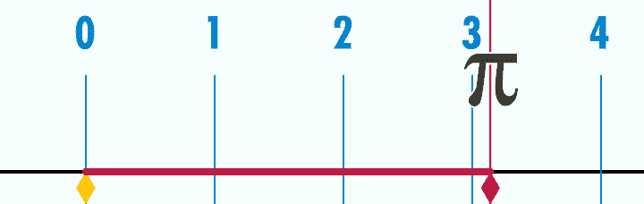
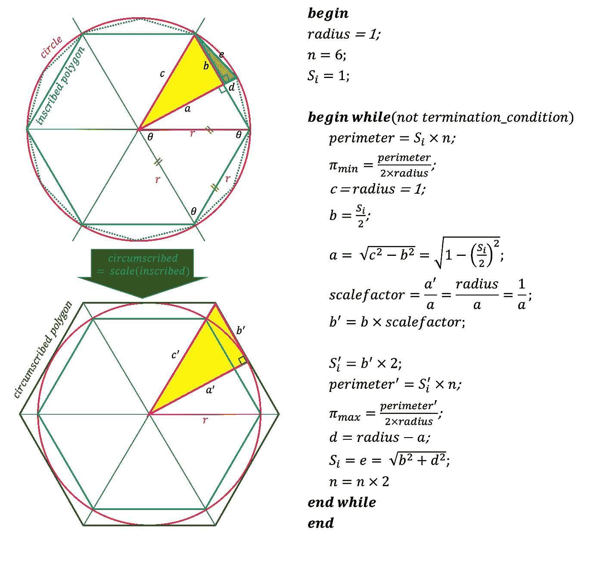
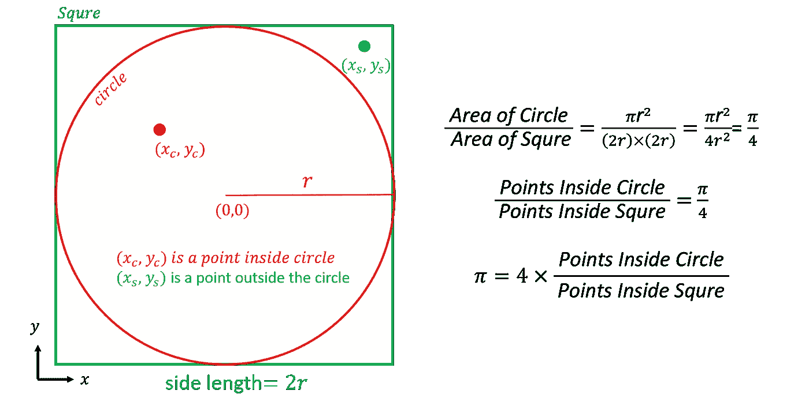
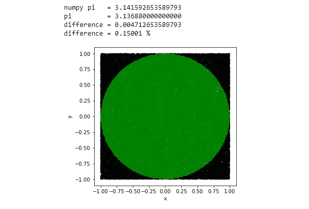
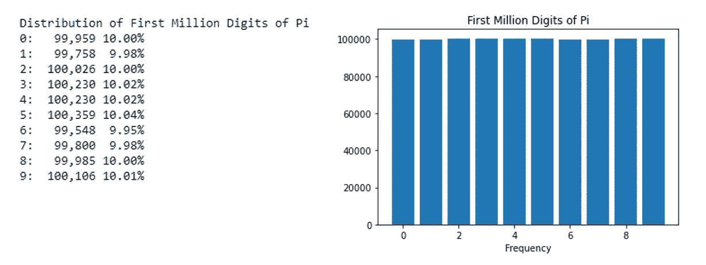
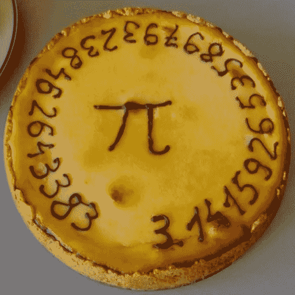

# 展开圆周率(π)的数字

> 原文：<https://pub.towardsai.net/unrolling-the-digits-of-pi-%CF%80-7e8b404be08e?source=collection_archive---------4----------------------->

## [数学](https://towardsai.net/p/category/mathematics)，[编程](https://towardsai.net/p/category/programming)

## 庆祝圆周率日(3 月 14 日)，一年一度的数学常数π的庆祝活动，以及国际数学日，享受计算机编程的乐趣。

# 我们为什么庆祝圆周率日？

每年的 3 月 14 日对科学界来说都是一个特殊的日子。日以月/日格式(3/14)书写，类似于数学常数π≈3.14 的前三个有效数字(3、1 和 4)。

1988 年[探索博物馆](https://en.wikipedia.org/wiki/Larry_Shaw_(Pi))的物理学家拉里·肖组织了第一次已知的圆周率庆祝活动。美国众议院于 2009 年 3 月通过题为“ [H. RES. 224 支持指定圆周率日，并出于其他目的](https://en.wikipedia.org/wiki/United_States_Government_Publishing_Office)”的决议，支持圆周率日，并将 3 月 14 日定为国家圆周率日。2019 年 11 月，联合国教科文组织第 40 届大会决定圆周率日为[国际数学日](https://en.unesco.org/commemorations/mathematics)。



pi Shrine——自 1988 年以来，这个探索博物馆历史的圆形部分一直在π日庆祝活动中占据首要位置。(来源:[Exploratorium.edu](https://www.exploratorium.edu/exhibits/pi-shrine))

这一天还带来了另一个具有历史意义的现代两位传奇物理学家。这一天是阿尔伯特·爱因斯坦诞生的日子，也是斯蒂芬·霍金去世的日子。


左图:斯蒂芬·霍金在美国宇航局星际儿童学习中心(来源:[美国宇航局/维基媒体](https://en.wikipedia.org/wiki/Stephen_Hawking#/media/File:Stephen_Hawking.StarChild.jpg))，右图:阿尔伯特·爱因斯坦 1921 年在维也纳演讲时(来源:[费迪南·施穆策/维基媒体](https://commons.wikimedia.org/wiki/File:Einstein_1921_by_F_Schmutzer_-_restoration.jpg)

> "数学是上帝书写宇宙的语言."
> 
> ― **伽利略·伽利雷**

## 什么是圆周率(π)

用希腊字母π (pi)表示的数学常数出现在许多数学和物理概念的公式中。也可以认为是几千年来已知的人类历史上最著名的符号。根据定义，圆周率的值由圆周率(c)与其直径(d)的比值给出，公式为π=c/d。



约翰·里德展开的圆周率(来源:[维基共享资源](https://commons.wikimedia.org/wiki/File:Pi-unrolled-720.gif)， [CC BY-SA 3.0](http://creativecommons.org/licenses/by-sa/3.0/&g) )

作为一个数字， **π** 承载着一些可以让人类永远着迷的特殊性质。π是一个[无理数](https://en.wikipedia.org/wiki/Irrational_number)意味着它不能表示为两个整数之比。 **π** 是一个[超越数](https://en.wikipedia.org/wiki/Transcendental_number)因为它不是有理系数的非零多项式的根。还没有发现出现在 **π** 中的数字顺序的已知模式，被认为是随机的和永无止境的。 **π** 的前一百位可以表示为:

> **3.14**15926535 8979323846 2643383279 5028841971 6939937510 5920974 5923078164 06286208 99 862803 4825 3425 34 21 165

但是，在实际应用中，不需要很多小数位。根据 2016 年 [NASA 的一篇文章](https://www.jpl.nasa.gov/edu/news/2016/3/16/how-many-decimals-of-pi-do-we-really-need/)，他们使用的最大值是他们高精度计算的 15 位小数。常数 **π** 被用于许多应用，从测量圆的几何属性和分布到 GPS 定位、太空探索、科学实验和关键任务系统。

甚至采用希腊字母π来象征常数也发生在公元 17 世纪；许多古代文明大量使用这个常数，我们可以从他们留下的文物和记录中观察到。在古代，π的值是根据观察计算的，对于实际应用来说，物理测量是相当精确的近似值。大约在公元前 250 年，传说中的希腊数学家阿基米德试图用穷举法，用边数逐渐增加到 96 的多边形的周长来估算圆周率的值。他的估计精确到小数点后两位。然而，他的工作可以扩展到有更多边的多边形以提高精确度。包括无穷级数方法在内的几种[方法](https://en.wikipedia.org/wiki/Approximations_of_%CF%80)在很大程度上被用来估计π的值。π的最大计算位数的当前记录是由[蒂莫西·穆里肯](https://www.guinnessworldrecords.com/world-records/66179-most-accurate-value-of-pi)创造的 50 万亿位数。

关于人们如何试图估算 **π** 的值的历史[事实值得讨论。然而，本文并不打算讨论π的历史，而是利用一些基本的计算方法来探索一些估计其值的方法。让我们通过一些动手编程来逐一探索它们。](https://en.wikipedia.org/wiki/Chronology_of_computation_of_%CF%80)

# π值的估算方法

本文将探索三种估算圆周率值的不同方法，从头开始构造简单的计算机代码。

## 阿基米德的多边形逼近

阿基米德设计了一种算法，按照穷举法，用边数(n)逐渐增加到 96 的多边形的周长来估算圆周率的值。他证明了 **π** 的下界是223/71，上界是 22/7(即 3.1408<*π*<3.1429)。他的估计的上界在应用中被广泛使用。

**多边形近似的计算方法**

让我们从数学和计算两方面来看这个问题。本练习中使用的算法是基于来自 [MathWithoutBorders](https://www.youtube.com/watch?v=_rJdkhlWZVQ) 的 YouTube 视频。

**问题**:通过计算边(n)的外接圆和内切圆的周长来估计π的值。

**解法:**从一个六边形(n=6)开始，其中从中心到顶点(角点)的距离等于边长。继续加倍并计算周长和半径之比，直到达到所需的π精度。

**算法步骤:**

1.  取半径(r) = 1 个单位的圆；
2.  画一个边数(n) = 6 的内接多边形
3.  把多边形分成 6 个等边三角形，它们的边长(S)等于圆的半径(r)。
4.  选择一个三角形(T1)
5.  计算内接多边形的周长(P) =边数(n) ×内接多边形的边长(S)
6.  用周长(P)除以直径(2r)，利用π = P/(2r)得到 **π** 的下限。
7.  要使用具有 2n 条边的多边形进行下一次迭代，请将其分成两半，在多边形的周长上平分其边。
8.  画第二个三角形(T2 ),将多边形周长上 T1 三角形的两个端点连接到延伸分割线和圆周长的有趣点。
9.  设 *a* =半个 T1 沿分割线的边长， *d* =半个 T2 三角形沿分割线的边长。a、d 和 r 之间的关系可以建立为 r = a + d。
10.  用我们已经知道的边长 S 计算 a = sqrt(1 — (S/2))。
11.  要获得外切多边形的尺寸，计算比例因子= r/a =1/a。
12.  通过 S'=S × (1/a)计算外切多边形(S ')边的长度。
13.  计算外切多边形的周长(P’)=边长(n) ×边长(S’)
14.  用周长(P ')除以直径(2r)，利用π = P'/(2r)得到 **π** 的上界。
15.  使用 S = sqrt((S1) + d)将勾股定理应用于半 T2 三角形，计算下一次迭代中要使用的多边形的边长。
16.  使 n = n×2，然后转到步骤 5，除非满足终止条件。(例如，终止条件=达到所需精度或最大边数)。



作者图片

**代码:**

上面的代码给出了输出:

```
For    6 side polygon = 3.000000000000000 < pi < 3.464101615137755
For   12 side polygon = 3.105828541230249 < pi < 3.215390309173472
For   24 side polygon = 3.132628613281238 < pi < 3.159659942097501
For   48 side polygon = 3.139350203046867 < pi < 3.146086215131435
For   96 side polygon = 3.141031950890510 < pi < 3.142714599645368

====================================================================
numpy pi   = 3.141592653589793
--------------------------------------------------------------------
pi_min     = 3.141031950890510
difference = 0.000560702699283
difference = 0.01785 %
--------------------------------------------------------------------
pi_max     = 3.142714599645368
difference = 0.001121946055575
difference = 0.03571 %
====================================================================
```

## 蒙特卡罗法

**问题**:通过测量圆内接正方形的面积来估计π的值。

**求解方法:**模拟探测边长为 2 个单位的正方形周长内的 x，y 平面上的大量随机点。确定在半径= 1 单位的内切圆内有多少个。假设扫描 x，y 平面，测量正方形周长内的所有点，并标记它们是在圆内还是圆外，我们可以估计π的值，如下所示。



作者图片

由于在计算机模拟中覆盖整个 2D 平面是不实际的，我们可以考虑 N 个点的样本来进行实验。我们可以使用随机数生成器随机选取一个点，并确定它们是在圆内还是圆外。

**算法步骤:**

1.  在正方形内生成随机(x，y)坐标(-半径≤x ≤半径和-半径≤y ≤半径)。
2.  使用 R = x + y 计算从原点(R)到点的距离
3.  如果 R ≤圆的半径，则将该点标记为内部。
4.  重复 1-3，进行 N 次试验。
5.  计算标记为圆内的点数(n)。
6.  计算π=4×n/N。

**代号:**

上面的代码给出了输出:



作者图片

## 估计圆周率的系列方法

计算圆周率数字的[现代方法](https://en.wikipedia.org/wiki/Approximations_of_%CF%80)使用级数方法。在这种方法中，使用了 N 项收敛级数中的一些项。N 的数值越大，对π值的估计就越准确。使用的一些级数是快速收敛的级数，允许使用当今的计算技术发现π的万亿位数。

[**莱布尼茨公式**](https://en.wikipedia.org/wiki/Leibniz_formula_for_%CF%80) 是使用交替级数的方法之一，称为 mad hava–莱布尼茨或[格雷戈里级数](https://en.wikipedia.org/wiki/Gregory%27s_series)。


**黎曼ζ函数ζ(s=2)** 的一个特例也可以用来计算 *π* 。


[**拉马努金**](https://en.wikipedia.org/wiki/Ramanujan) **的** [**圆周率公式**](https://en.wikipedia.org/wiki/List_of_formulae_involving_%CF%80#Infinite_series)**:**1914 年，[斯里尼瓦瑟·拉马努金](https://en.wikipedia.org/wiki/Srinivasa_Ramanujan#Mathematical_achievements)推出了计算圆周率值的公式，可以产生快速收敛。


[**Chudnovsky 算法**](https://en.wikipedia.org/wiki/Chudnovsky_algorithm) 是 David Chudnovsky 和 Gregory Chudnovsky (Chudnovsky 兄弟)基于 Ramanujan 的 *π* 公式于 1988 年提出的现代方法之一。据[报道](http://www.numberworld.org/y-cruncher/)将于 2020 年 1 月用于当前的计算 50 万亿位的世界纪录。


你可以在维基百科页面[中找到π](https://en.wikipedia.org/wiki/Approximations_of_%CF%80) 的近似法。让我们基于上述三种方法尝试一些编码，并产生一些结果。您还可以尝试在您的计算系统的能力和精度范围内计算圆周率的值。

**代码:**

上面的代码给出了输出:

```
====================================================================
numpy pi   = 3.141592653589793
====================================================================
Madhava-Gregory-Leibniz Series
Terms             = 1000
pi (M-G-L)        = 3.140592653839794
difference        = 0.000999999749999
difference        = 0.03183 %
====================================================================
Riemann zeta function (zeta =2)
Terms             = 1000
pi (Rz   )        = 3.140638056205995
difference        = 0.000954597383799
difference        = 0.03039 %
====================================================================
Ramanujan's formula #1 (1914) with rapid convergence
Terms             = 2
pi (Ramanujan #1) = 3.141592653589793
difference        = 0.000000000000000
difference        = 0.00000 %
====================================================================
Ramanujan's formula #2 (1914) with rapid convergence
Terms             = 2
pi (Ramanujan #2) = 3.141592653589793
difference        = 0.000000000000000
difference        = 0.00000 %
====================================================================
Chudnovsky Brothers (1987) with rapid convergence based on  Ramanujan’s π formulae
Terms           = 3
pi (Chudnovsky) = 3.141592653589794
difference      = 0.000000000000000
difference      = 0.00000 %
====================================================================
Chudnovsky Brothers (1987) with rapid convergence based on  Ramanujan’s π formulae (performance enhanced)
Terms              = 3
pi (Chudnovsky_hp) = 3.141592653589793
difference         = 0.000000000000000
difference         = 0.00000 %
====================================================================
```

# 分析π的前一百万位

让我们再做一个有趣的练习。圆周率的值可以从[PiDay.com 网页](https://www.piday.org/million/)中获得，小数点后 100 万位。我们来分析一下位数的分布，就知道是不是随机的了。

**算法步骤:**

1.  加载包含π数字的文本输入文件
2.  清除文本，删除空格、换行符和小数点。
3.  将数字序列分成元素。
4.  创建频率表
5.  绘制分布图。

**代码:**

**上面的代码给出了输出:**



均匀分布给了我们一些提示，但是在声称 pi 是随机的之前，还需要更多的分析。

# 下一步是什么？

您可以在自己的蒙特卡罗方法中不断增加的迭代/试验次数中尝试这些算法，以提高 pi 计算值的准确性。你也可以把这些转换成你喜欢的编程语言，比较这些算法的性能。此外，你还可以玩圆周率的数字，发现模式等。

# 2021 年圆周率日快乐！



[皮派，创建于代尔夫特理工大学，应用物理、地震和声学](https://commons.wikimedia.org/wiki/File:Pi_pie2.jpg)(来源:[维基共享资源](https://commons.wikimedia.org/wiki/File:Pi_pie2.jpg))

您可以在不同的组织中找到今年圆周率日庆祝活动的活动和其他细节。

*   探索博物馆(圆周率的起源之地)——[https://www.exploratorium.edu/pi](https://www.exploratorium.edu/pi)
*   美国宇航局:[https://solar system . NASA . gov/news/350/10-3 月 14 日与美国宇航局一起庆祝圆周率日](https://solarsystem.nasa.gov/news/350/10-ways-to-celebrate-pi-day-with-nasa-on-march-14)
*   美国数学学会(AMS):http://www.ams.org/publicoutreach/pi-day

**圆周率歌曲(记住π的 100 位数)|科学歌曲**

# Pi 上一些有趣的教育 Youtube 视频

**Pi——数字迷**

《少年派的简史》——西蒙·克拉克

**圆周率是不合理的:一个华丽证明的动画—
数学学家**

**用阿基米德法求圆周率——数学无界**

# 放弃

*本文所表达的观点和意见均为作者个人观点和意见，不代表雇主或与作者相关的其他机构的观点和意见。作者投入了大量的精力来研究所讨论的主题，简化技术术语以增加对内容的理解，查找相关参考资料以确保所呈现事实的有效性。欢迎讨论、批评、不同的想法和建议。*

# 参考

*   [π日](http://www.piday.org/)。(检索于 2021 年 3 月 14 日)。
*   探索博物馆的圆周率网站。(检索于 2021 年 3 月 14 日)。
*   "支持圆周率日的指定，并为其他目的."[政府印刷局](https://en.wikipedia.org/wiki/United_States_Government_Printing_Office)， [H. Res. 224](http://frwebgate.access.gpo.gov/cgi-bin/getdoc.cgi?dbname=111_cong_bills&docid=f:hr224ih.txt.pdf) ，2009 年 3 月 9 日。
*   [国际数学日官网](https://www.idm314.org/)。(检索于 2021 年 3 月 14 日)。
*   联合国教科文组织关于国际数学日的网页。(检索于 2021 年 3 月 14 日)。
*   卢梭，克里斯蒂安娜。[“国际数学日”](https://www.ams.org/journals/notices/201908/rnoti-p1306.pdf)，*美国数学会通知*。 **66** (8): 1、2019 年 9 月 1 日。
*   “[圆周率](https://www.guinnessworldrecords.com/world-records/66179-most-accurate-value-of-pi)的最精确值”，GuinnessWorldRecords.com。
*   卢梭，克里斯蒂安娜。[【国际数学日】](https://www.ams.org/journals/notices/201908/rnoti-p1306.pdf)*【美国数学会通知】*。 **66** (8): 1、2019 年 9 月 1 日。
*   美国宇航局/JPL·edu，“我们到底需要圆周率的多少位小数？《JPL edu 新闻》，2016 年 3 月 16 日。
*   彼得·贝克曼，《少年派的历史》，1970 年，ISBN 978–0–911762–07–5。 [[](https://en.wikipedia.org/wiki/A_History_of_Pi) 通过维基百科]
*   威廉·琼斯，“ [*提要帕尔马里奥姆·马塞奥斯:或者，《数学新导论》*](https://archive.org/stream/SynopsisPalmariorumMatheseosOrANewIntroductionToTheMathematics/Synopsis_Palmariorum_Matheseos#page/n261/mode/1up) *”，*1706、263 页。[【](https://en.wikipedia.org/wiki/A_History_of_Pi)[via 维基百科](https://en.wikipedia.org/wiki/Pi#cite_note-110)
*   卡乔里，弗洛里安。 [*一部数学符号史:下卷*](https://books.google.com/books?id=bT5suOONXlgC&pg=PA9)*。Cosimo 公司，第 8–13 页，[国际标准书号](https://en.wikipedia.org/wiki/ISBN_(identifier))[978–1–60206–714–1](https://en.wikipedia.org/wiki/Special:BookSources/978-1-60206-714-1)，2007 年。[ [通过维基百科](https://en.wikipedia.org/wiki/Pi#cite_note-:0-103)*
*   *蒂莫西·穆里肯，《计算圆周率:我打破圆周率世界纪录的尝试》，《blog.timothymullican.com》，2019 年 6 月 26 日。*
*   *[*彼得·鲍文*那个惊人的数字π](http://www.cecm.sfu.ca/personal/pborwein/PAPERS/P159.pdf)。[ [通过维基百科](https://en.wikipedia.org/wiki/List_of_formulae_involving_%CF%80)*
*   *Alexander J. Yee，["](http://www.numberworld.org/y-cruncher/)[y-Cruncher——一个多线程 Pi 程序——来自一个有点过火的高中项目…](http://www.numberworld.org/y-cruncher/) 。(检索于 2021 年 3 月 14 日)*