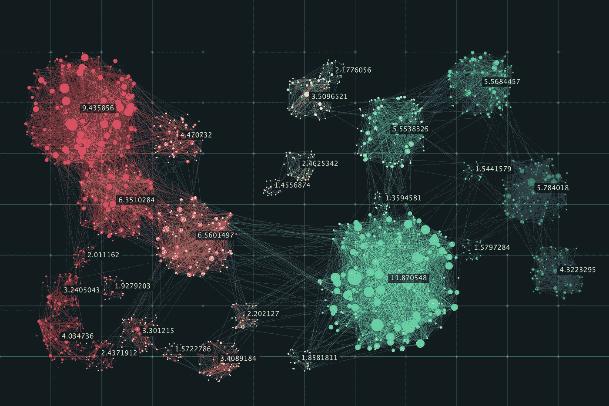
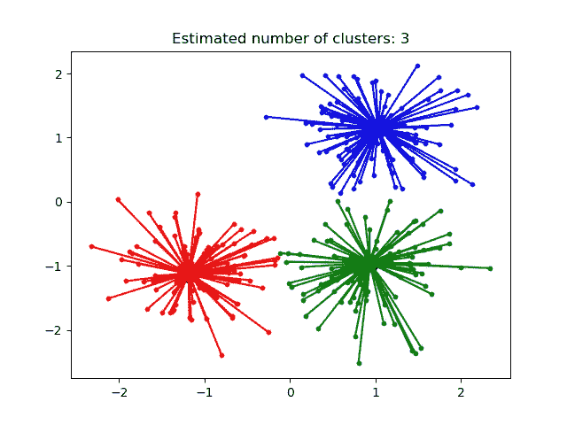
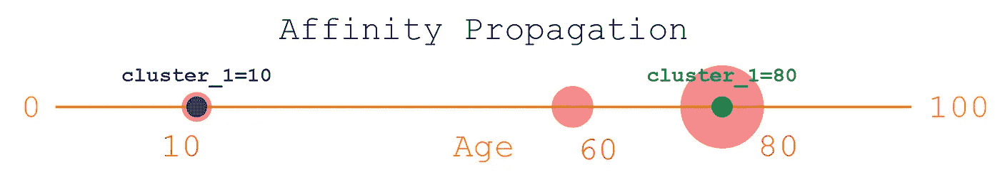
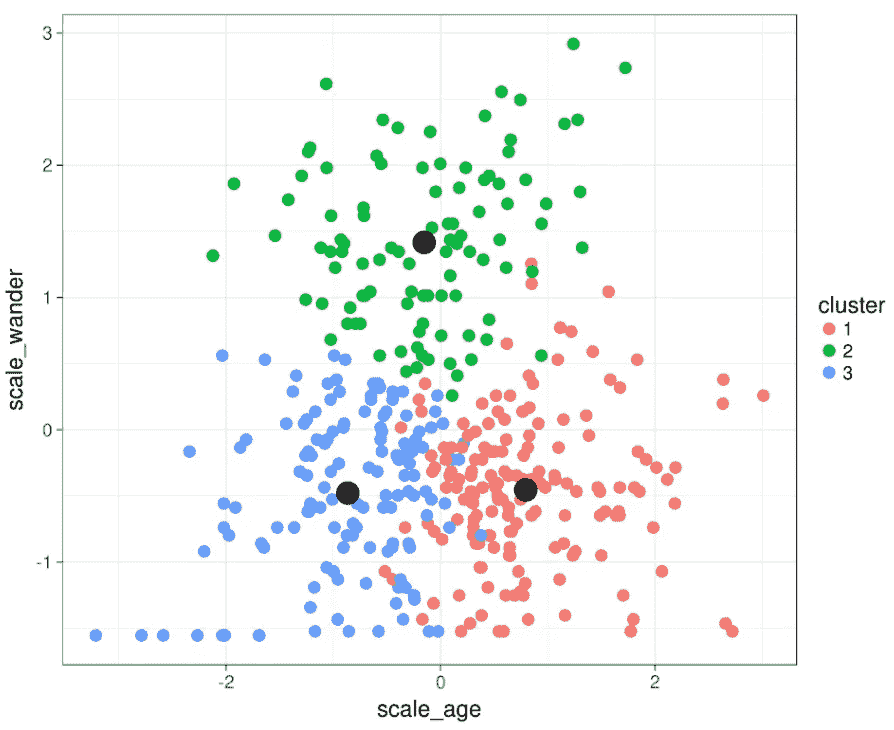
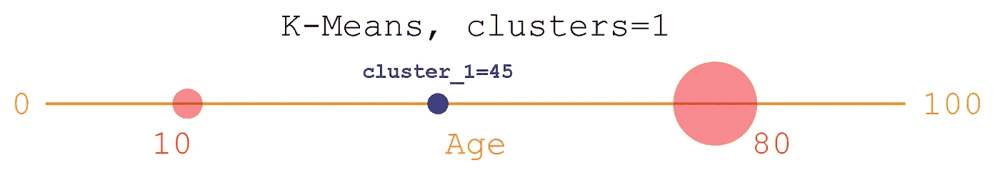
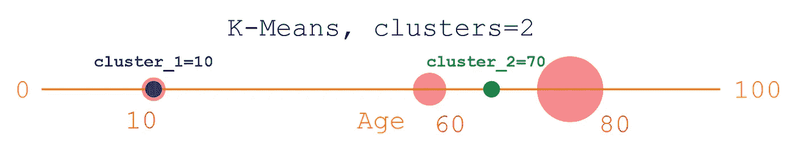
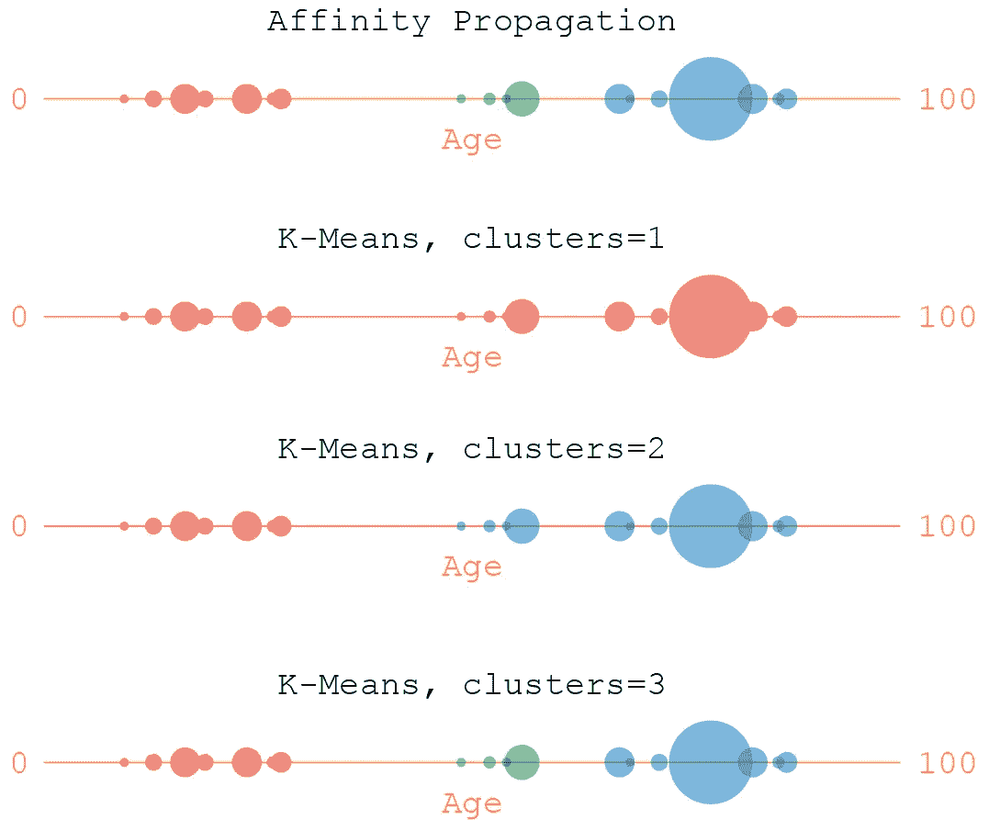

# K-Means 与相似性传播聚类

> 原文：<https://pub.towardsai.net/unsupervised-learning-k-means-vs-affinity-propagation-clustering-624a9154b83d?source=collection_archive---------2----------------------->

## [机器学习](https://towardsai.net/p/category/machine-learning)

## 使用两种方法执行数值聚类。完整的代码可在我的回购[。](https://github.com/arditoibryan/Projects/tree/master/20200713_Numerical_Clustering)

聚类是用任何机器学习工具实现的最简单的算法之一。有两套不同的算法专门用于聚类，这取决于我们是使用数值数据(K-Means 或相似性传播)还是分类数据(K-Mode)。



聚类的例子

因为使用分类聚类时，您的数据不是在任何数学空间中编码的(您可以使用标注来解决这个问题，但是您会强行将一个数值与您的每个类别相关联)，这很难处理。您需要选择特定的算法，并使用不同的指标和评估方法进行分析。因此，在本文中，我将重点讨论数字数据的聚类。

# 什么时候应该使用相似性传播？



相似性传播被认为比使用 K-Means 算法挑战性小。最重要的是，该软件会自动估计集群的数量。如果您不介意使用超参数，这是处理需要聚类算法的问题的一种更简单的方法。

## 查找集群

例如，我有客户信息的数据集。我选择只考虑他们的年龄来分组(为了简单起见，我只使用一个变量)。这就是你如何建立一个相似性传播机器学习算法:

```
from sklearn.cluster import AffinityPropagation
import numpy as np
X = np.array([[10], [60], [80]])
clustering = AffinityPropagation().fit(X)
clustering
AffinityPropagation(affinity='euclidean', convergence_iter=15, copy=True, damping=0.5, max_iter=200, preference=None, verbose=False)#labels
print(clustering.labels_)#cluster centers
print(clustering.cluster_centers_)
```

输出:

```
[0 1 1]
array([[10], [80]])
```

软件分离了位置 10 和 80 的两个簇。很可能，使用算法超参数会在很大程度上改变其输出。



# 什么时候应该使用 K 均值聚类？

有了 K 均值，问题就更大了。这是一个更完整的模型，因此您需要指定分类的数量。



K 均值算法示例

## 查找 1 个群集

我将 K 模式算法应用于同一个数据集:

```
from sklearn.cluster import KMeans
import numpy as np#dots
X = np.array([[10], [80]])
kmeans = KMeans(n_clusters=1, random_state=0).fit(X)#epicenters
print('cluster epicenters', kmeans.cluster_centers_)
```

输出:

```
cluster epicenters [[45.]]
```



该算法发现了一个位于数据中心的分类:45(或 10+(80–10)/2 = 45)。

## 查找 2 个集群

我可以有一个更复杂的数据集，而不是两个点，我可以有三个点(10，60，80)。我已经知道(我会有我的理由)我想把我的数据细分成 2 个集群，而不是 1 个。

```
from sklearn.cluster import KMeans
import numpy as np#4 punti in un piano bidimensionale
X = np.array([[10], [80], [60]])
kmeans = KMeans(n_clusters=2, random_state=0).fit(X)#dove sono gli epicentri dei 2 clusters?
print('cluster epicenters', kmeans.cluster_centers_)
```

输出:

```
cluster epicenters [[10.] [70.]
```



如你所见，我任意选择了聚类数，K-Means 将震中放在了最舒适的位置。

# 比较

对于每一个模型(同样适用于回归)，都有一些简化的模型，它们可以根据每一组数据自行调整。然而，当你想用你自己的方法做事时，你可能想做出明智的选择，使结果更接近你的估计。



这是两种方法在一个更复杂的数据集上的比较。和往常一样，你会根据自己的需求选择最好的型号。如果你不知道你的数据是什么样子，你可以使用相似性传播。但是如果你已经知道你需要多少个聚类，K-Means 是最适合你的算法。