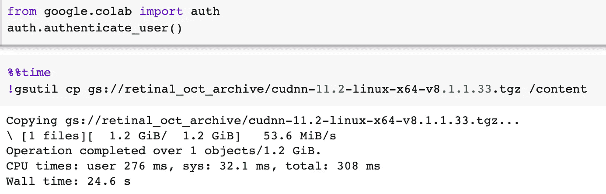
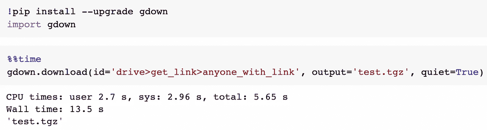

# 像专业人士一样使用 Google Colab

> 原文：<https://pub.towardsai.net/use-google-colab-like-a-pro-39a97184358d?source=collection_archive---------0----------------------->

## 提高工作效率的 15 个技巧


图片由 [Alexander](https://pixabay.com/users/world-fly-856412/) 在 [Pixabay](https://pixabay.com/) 上提供(作者修改)

不管你是免费用户、专业用户还是专业+用户，我们都喜欢 Colab，因为它为我们所有人提供了资源和分享的便利。尽管我们讨厌它的限制，但谷歌在深度学习民主化方面值得称赞，特别是对于来自那些没有机会参与整个行业“新电气化”的国家的学生来说。

你是否花了无数的时间在 Colab 上工作，却没有花几分钟的时间去真正了解这个工具，并在你最有效率的时候*？*

> *“时间是不可退还的；用心用。”*

## *1.检查并报告您的 GPU 分配*

> *“生活就像一盒巧克力。你永远不知道你会得到什么。”
> —阿甘正传*

*非常抱歉，V100s 已经卖完了，让我们为您提供我们值得信赖的 8GB 内存的老 K80。如果你觉得幸运的话，你可以在一小时后再试一次！嗯，是的谷歌，谢谢，但不用了。*

```
*gpu = !nvidia-smi -L
print(gpu[0])
assert any(x in gpu[0] for x in ['P100', 'V100'])*
```

*玩笑归玩笑，我敢肯定，你经历了漫长的 pip 安装、安装 GDrive、下载和准备数据，却在笔记本上发现有四分之三的地方忘记了将运行时设置为“GPU”，这让你焦头烂额。把这句话记在你笔记本的第一格上——你可以以后再感谢我。*

## *2.不再验证“gdrive.mount()”*

*不是所有的 Python 笔记本都一样，Colab 把 Jupyter 笔记本当成二等公民。当你将 Jupyter 笔记本上传到 GDrive 时，你会看到它显示为一个蓝色的/文件夹图标。当你在 GDrive ( **+** 新按钮➤·莫尔·➤·谷歌协作实验室)中从头开始创建一个新的 Colab 笔记本时，它会显示为一个带有 Colab 徽标的*橙色图标。**

*这款“原生”Colab 笔记本拥有特殊的功能——也就是说，只要你打开笔记本，谷歌就可以自动将你的 GDrive 挂载到 Colab 虚拟机上。如果您打开一个 Jupyter 笔记本，单击文件图标(左侧边栏)，然后单击安装驱动器图标(弹出面板顶行)，Colab 会将以下新单元格插入到您的 Jupyter 笔记本中:*

```
*from google.colab import drive
drive.mount('/content/drive')*
```

*当你执行这个单元格时，它会弹出一个新的浏览器标签，你必须通过那个烦人的 I。选择你的帐户，ii。允许和 iii。复制粘贴 iv。切换和关闭标签，废话。*

*如果你有一个经常打开的 Jupyter 笔记本，并且它需要 GDrive 访问，投资 30 秒钟，为你自己省下那不断的麻烦。只需创建一个新的(本机)Colab 笔记本(如上所述)，然后在另一个浏览器选项卡中打开您现有的 Jupyter 笔记本— *和 Colab —* 。点击:编辑➤清除所有输出。然后，确保你处于命令模式，按下`<SHIFT> + <CMD|CTRL> + A`，然后按下`<CMD|CTRL> + C`。去你的新 Colab 笔记本，按下`<CMD|CTRL> + V`。使用挂载驱动器图标的方法挂载你的 GDrive，并删除旧的 Jupyter 笔记本以避免混淆。*

## *3.将数据复制到 Colab 的最快方法*

*一种方法是从谷歌云存储中复制。你必须注册一个谷歌云平台账户，但谷歌提供了一个[免费层](https://cloud.google.com/free)，只要你选择`US-WEST1`、`US-CENTRAL1`或`US-EAST` 1 作为你的地区，就可以获得 5GB。*

**

*除了安全性之外，使用 Google 存储桶的另一个好处是，如果你使用 [TensorFlow 数据集](https://www.tensorflow.org/datasets/api_docs/python/tfds)来存储你自己的数据(如果你不是，你真的*应该* …我会写一篇文章，解释为什么**关注**我会得到通知)，你可以绕过复制，直接使用`tfds.load()`加载你的数据集:*

**

*另一种方法是使用出色的 gdown 实用程序。请注意，在撰写本文时(2022 年 3 月)，即使 gdown 已经预装在 Colab 实例上，您也必须升级这个包才能让它工作。你需要有一个文件 ID，你可以在➤驱动器获取链接➤任何人的链接中右击文件，然后从提供的 URL 中取出 ID(下面以粗体显示):*

*`https://drive.google.com/file/d/**1sk...IzO**/view?usp=sharing`*

**

***注意:**因为*任何有链接的人*都可以用这个文件共享权限访问你的文件，所以只对你的*个人项目*使用这个方法！*

## *4.运行时(内核)重启时绕过“pip 安装…”*

*如果你像我一样，总是重启并重新运行 python 内核——通常是因为你有像`dataset = dataset.map().batch()`这样的非幂等代码——通过在每次重启运行时不调用`pip install`,创建一个伪文件并测试它的存在，节省宝贵的时间并保持笔记本的可读性和简洁:*

```
*![ ! -f "pip_installed" ] && pip -q install tensorflow-datasets==4.4.0 tensorflow-addons && touch pip_installed*
```

*事实上，每当您重新运行笔记本电脑时，使用相同的技术来避免不必要的大数据文件的复制和下载:*

```
*![ ! -d "my_data" ] && unzip /content/drive/MyDrive/my_data.zip -d my_data*
```

## *5.导入您自己的 Python 模块/包*

*如果你发现自己经常使用一个`helper.py`，或者你自己的私人 Python `package`，比如显示一个图像网格或者绘制你的训练损失/指标，把它们都放在你的 GDrive 上一个叫做`/packages`的文件夹里，然后:*

```
*import sys
sys.path.append('/content/drive/MyDrive/packages/')
from helper import **
```

## *6.将文件复制到 Google 存储桶*

*如果你在谷歌的 TPUs 上训练，你的数据必须存储在谷歌云存储桶中。如果您需要在每次 TPU 训练开始前对数据进行一些预处理，您可以使用预安装的`gsutil`实用程序将文件从 Colab VM 的本地驱动器传输到您的存储桶。*

```
*!gsutil -m cp -r /root/tensorflow_datasets/my_ds/ gs://my-bucket/*
```

## *7.确保所有文件都已完全复制到 GDrive*

*我相信你很清楚，谷歌可以也将会因为你的会话不活跃而终止你的会话。在模型训练期间，有充分的理由不要将(巨大的)模型检查点存储到您挂载的 GDrive 中。例如，为了不超过 Colab I/O 限制，或者您的 GDrive 存储配额不足，需要使用 Colab 实例上充足的本地磁盘存储，等等。如果你有妄想症，为了确保你的最终模型和数据完全转移到 GDrive，在你的笔记本的最末端打电话给`drive.flush_and_unmount()`:*

```
*from google.colab import drivemodel.fit(...)  # I'm going to take a nap now, <yawn>
model.save('/content/drive/MyDrive/...')
drive.flush_and_unmount()*
```

*请注意，将文件复制/写入到`/content/drive/MyDrive/`的完成并不意味着所有文件都安全地在 GDrive 上，也不意味着您可以立即终止您的 Colab 实例，因为 VM 和 Google 的基础设施之间的数据传输是异步发生的，所以执行这种刷新将有助于确保断开连接确实是安全的。*

## *8.快速打开本地 Jupyter 笔记本*

*没必要抄袭你的*。ipynb* 到 GDrive 然后双击它。只需转到[https://colab.research.google.com/](https://colab.research.google.com/)，然后点击上传选项卡。您上传的笔记本将驻留在`GDrive://Colab Notebooks/`上。*

## *9.对 Python 变量使用 Shell 命令*

```
*OUT_DIR = './models_ckpt/'
...
model.save(OUT_DIR + 'model1')
...
model.save(OUT_DIR + 'model2')
...
!rm -rf {OUT_DIR}**
```

*利用您可以使用的强大的 Linux 命令…为什么要费心导入 zip 文件和请求库以及所有附带的代码呢？事实上，通过将 Linux 命令的输出通过管道传递给 Python 变量，可以两全其美:*

```
*!wget -O data.zip [https://github.com/ixig/archive/data_042020.zip](https://github.com/gohugoio/hugo/archive/master.zip)
!unzip -q data.zip -d ./tmp
# 'wc': handy linux word and line count utility
result = !wc ./tmp/tweets.txt
lines, words, *_ = result[0].split()*
```

## *10.我是在科拉布还是在朱庇特？*

*如果您在本地机器上运行笔记本和在 Colab 上进行培训之间切换，您需要一种方法来判断笔记本在哪里运行，例如，在本地机器上运行时不要 pip install。您可以通过以下方式实现:*

```
*COLAB = 'google.colab' in str(get_ipython())
if COLAB:
    !pip install ...*
```

## *11.给我发消息，宝贝！*

*没有必要坐在那里等待你的培训完成，让 Colab 在你的手机上给你发送通知！首先，你需要按照说明让 [CallMeBot](https://www.callmebot.com/blog/free-api-signal-send-messages/) 在你的 Signal/FB/WhatsApp/Telegram 应用上给你发信息。只需一分钟—非常简单、快速、安全的注册。然后，您可以:*

```
*import requests
from urllib.parse import quote_plusnumber = '...'
api_key = '...'
message = quote_plus('Done Baby!')
requests.get(f'https://api.callmebot.com/signal/send.php?phone={number}&apikey={api_key}&text={message}')*
```

## *12.使用 IPython 单元魔法*

*好吧，这并不是专门针对 Colab 笔记本的，因为它也适用于 Jupyter 笔记本，但这里有一些最有用的知识。*

*`%%capture`:消除单元格中执行语句时产生的大量烦人的输出。对于那些' *pip install …* '，'*tfds . load(…)【T8]'以及无数 TensorFlow 弃用警告有用。**

*`%%writefile <filename>`:将单元格其余部分包含的文本写入文件。对于动态创建用于测试的 YAML、JSON 或简单文本文件非常有用。*

*`%tensorflow_version 1.x`:如果你还停留在过去(不是评判…嗯，也许只是一点点！)，不要' *pip 安装 tensorflow==1.0* '，会把依赖关系搞得一塌糊涂，用这个线魔代替，在导入 tensorflow 之前。*

## *13.停靠码头*

*如果您是 Pro/Pro+用户，您可以通过终端访问虚拟机。你可以做一些超级强大的事情，比如在上面运行你自己的 jupyter 服务器(如果你喜欢的话，你可以回到你熟悉的 Jupyter 笔记本用户界面)。同样对于争论文件，终端是无价的。如果您是一个自由层用户，并且想要访问一个终端，请查看 [colab-xterm](https://blog.infuseai.io/run-a-full-tty-terminal-in-google-colab-without-colab-pro-2759b9f8a74a) 。*

*当你点击左边工具条上的终端图标时，终端面板会在页面的右边弹出，但是这真的很难使用，因为它太窄了，你必须不断地关闭它才能看到你的代码！解决方案:将终端作为单独的选项卡停靠。打开终端后，点击省略号 **(…)** ➤改变页面布局➤单选项卡式视图。*

## *14.更改这些快捷方式*

*谁能记得谷歌指定的晦涩的快捷键？！转到工具➤键盘快捷键，并确保将以下快捷键分配给你自己的 ***难忘的*** *双按键*组合:*

*   *重启运行时并运行笔记本中的所有单元*
*   *重启运行时*
*   *在当前单元格之前运行单元格*
*   *运行选定单元格和之后的所有单元格*

*好的一面是，Colab 会记住你的更改(一定要点击弹出窗口底部的 Save 按钮),所以你只需要这样做一次。*

## *15.GitHub 集成*

*您可以使用以下 URL 直接在 Colab 中启动 GitHub 上托管的任何笔记本:*

*`https://colab.research.google.com/github/<org>/<repo>/…/<xx.ipynb>`*

*如果你在 Colab Chrome 扩展中安装了 [Open，并且你目前正在 GitHub 中预览一个 Jupyter 笔记本，你可以点击浏览器导航栏右侧的扩展图标(将其固定以确保方便访问)，直接在 Colab 中打开它。](https://chrome.google.com/webstore/detail/open-in-colab/iogfkhleblhcpcekbiedikdehleodpjo)*

*或者，您可以使用以下 URL 将您最喜欢的组织/回购标记为书签，每当您单击书签时，文件浏览器都会提示您:*

*`https://colab.research.google.com/github/<org>/<repo>`*

**一些额外的提示…！**

## *16.互动熊猫桌*

```
*from google.colab import data_table
data_table.enable_dataframe_formatter()*
```

*打开此功能将增强数据帧的渲染，并允许交互式浏览。每页显示的行数可选，支持分页，从而保持笔记本的紧凑性和可读性。可以对列进行排序(在整个数据帧中全局排序)。最强大的功能是带有正则表达式匹配的交互式过滤器对话框。*

## *17.选项卡中的镜像单元格*

*如果您发现您经常滚动回或重新执行一个单元格，例如，您正在使用它来绘制您的训练损失或混淆矩阵——您可以通过“镜像”它来“固定”一个单元格，而不是用重复的代码/单元格来膨胀您的笔记本，因为您在它后面的单元格中试验不同的代码设置会做相同的事情。选择要镜像的单元，单击:工具➤命令选项板➤镜像单元。*

*该单元格现在将在您的笔记本中作为一个单独的选项卡面板弹出。Colab 负责同步您对笔记本中原始单元格或标签中镜像单元格所做的更改。您可以像任何其他单元一样，使用`<SHIFT|CTRL> + <ENTER>`重新执行独立单元。*

## *18.断开 Colab 运行时*

*做一个负责任和体贴的 Colab 用户意味着在你完成培训后不要霸占 GPU 实例…谷歌会注意到并在你下次请求时奖励你一个更好的 GPU！因此，在您将保存的模型文件复制到 GDrive 或 Google Storage 之后，您会给自己发送一条消息，通知您培训已经完成，请在笔记本的最后一个单元格中输入以下内容:*

```
*from google.colab import runtime
runtime.unassign()*
```