# 决策树和随机森林在机器学习中的应用

> 原文：<https://pub.towardsai.net/use-of-decision-trees-and-random-forest-in-machine-learning-1e35e737b638?source=collection_archive---------0----------------------->

来源:[新检查](https://www.neocheck.es/machine-learning/)

## [机器学习](https://towardsai.net/p/category/machine-learning)

## 分类问题的监督学习研究

M 机器学习是人工智能的一种应用，它为系统提供了自动学习和根据经验改进的能力，而无需显式编程。机器学习的 3 个主要类别是监督学习、非监督学习和强化学习。在这篇文章中，我们将关注分类问题的监督学习。

**监督学习**从过去的数据中学习，并将学习应用于当前数据，以预测未来事件。在分类问题的上下文中，输入数据被标注或标记为正确的答案，以实现准确的预测。

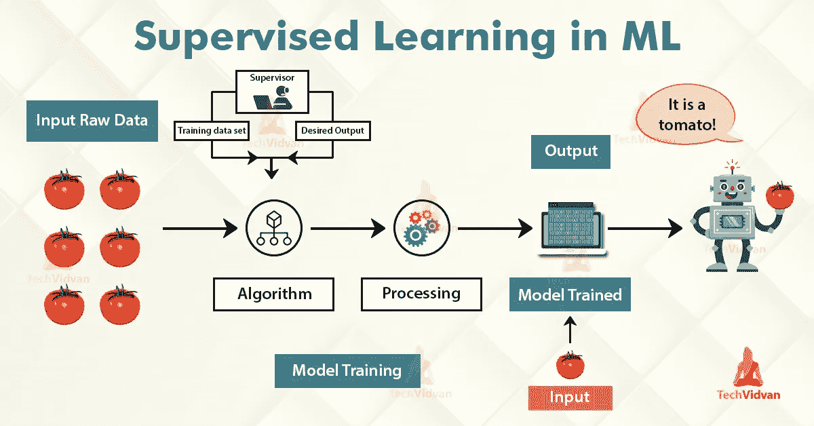

来源: [Techvidvan](https://techvidvan.com/tutorials/supervised-learning/)

基于树的学习算法是最常用的监督学习方法之一。它们赋予预测模型以高准确性、稳定性和易解释性，并适用于解决任何分类或回归问题。

[**决策树**](https://towardsdatascience.com/decision-tree-classification-de64fc4d5aac) 通过学习从特征导出的决策规则来预测响应值。在用于分类的**树结构中，**根节点**代表整个群体，而**决策节点**代表决策树决定在哪个特定特征上进行分割的特定点。将在分割前后评估每个特征的纯度。然后，决策树将决定根据产生最纯粹的**叶节点**(即每个分支的终端节点)。**

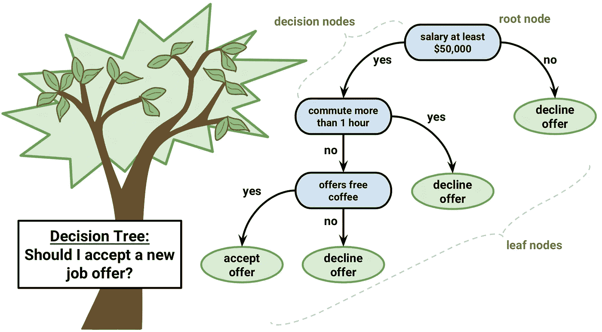

决策树的简单示意图(来源: [Datacamp](https://www.datacamp.com/community/tutorials/decision-trees-R)

决策树的一个显著的优点是它强制考虑一个决策的所有可能的结果，并且追踪每一条路径直到一个结论。它对每个分支的结果进行综合分析，并确定需要进一步分析的决策节点。

然而，**决策树**有其自身的**限制**。决策树模型的可重复性非常敏感，因为数据的微小变化会导致树结构的巨大变化。决策树模型的空间和时间复杂度相对较高，导致模型训练时间较长。单个决策树通常是弱学习器，因此需要一组决策树(称为随机森林)来进行更好的预测。

**随机森林**是一个更强大的模型，它采用单个决策树的思想，从数百或数千棵树中创建一个集合模型，以减少方差。从而给予**获得更精确和稳定的预测**的优势。

每棵树都是在一组随机的观察值上训练的，并且对于节点的每次分裂，只有特征的随机子集被用于进行分裂。当进行预测时，随机森林**不会遭受过度拟合**，因为它对每个数据点的每个单独决策树的预测进行平均，以便达到最终分类。

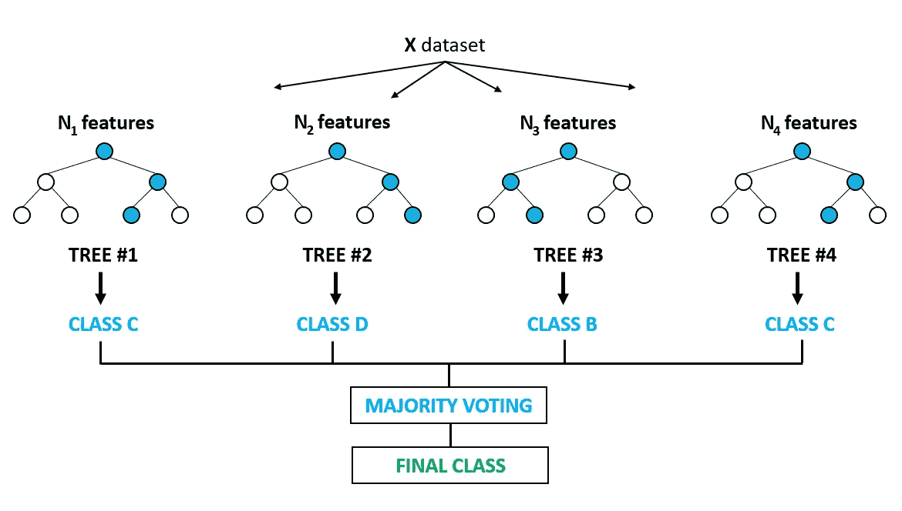

随机森林的描述(来源: [Abilash R](https://medium.com/@ar.ingenious/applying-random-forest-classification-machine-learning-algorithm-from-scratch-with-real-24ff198a1c57)

我们将处理一个分类问题，并探索决策树如何工作的基础知识，各个决策树如何组合形成随机森林，如何微调超参数以优化随机森林，并最终发现使用随机森林的优势。

# 问题陈述:预测一个人的年收入是否超过 50，000 美元。

# 开始编码吧！

# 数据准备

从 URL 加载[人口普查收入数据集](https://archive.ics.uci.edu/ml/datasets/census+income)并显示前 5 行以检查数据。

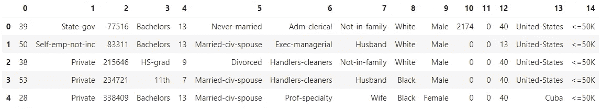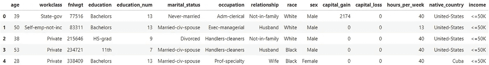

# 数据清理

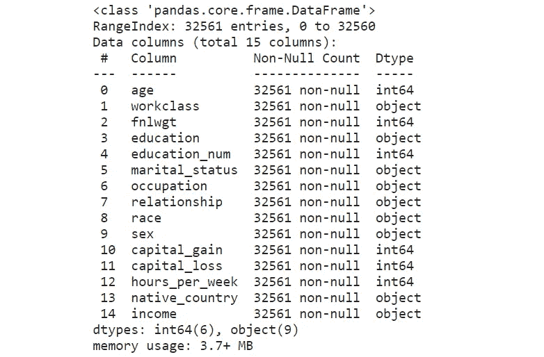

**箱线图**非常有用，因为它们显示了数据集中整数数据类型的异常值。**异常值**是在数值上远离其余数据的观察值。查看箱线图时，异常值被定义为位于箱线图触须外部的数据点。

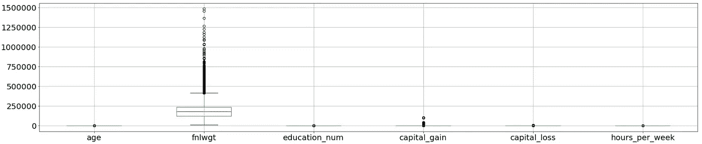

从[人口普查收入数据集](https://archive.ics.uci.edu/ml/datasets/census+income)的属性列表中提取，特征*“fnlwgt”*是指最终重量。它陈述了人口普查认为该条目代表的人数。因此，这个异常值与我们的分析无关，我们将继续删除该列。

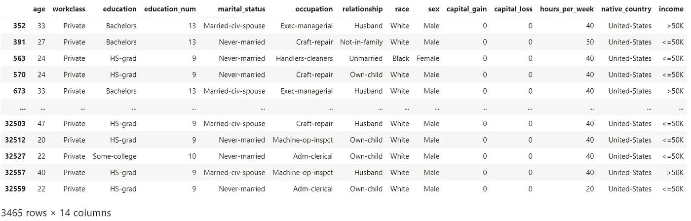

在上面的行中可以看到一个[重复](https://pandas.pydata.org/pandas-docs/stable/reference/api/pandas.Series.duplicated.html)的例子，在“workclass”列下有条目“Private”。这些重复行对应于不同被调查个体的样本，而不是真正的重复行。因此，我们不会删除任何重复的行，以保留数据供进一步分析。

# 标签编码

使用标注编码将分类要素编码为数值，从而将指定要素下的每个类转换为数值。

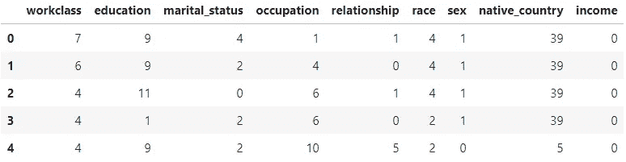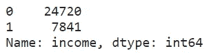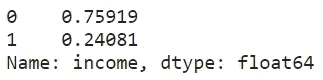

从上述标准化分布中观察到不平衡的数据集。

# 实验设计

观察不同的因素如何影响每个分类器的性能将是有趣的。让我们考虑以下 3 个因素:

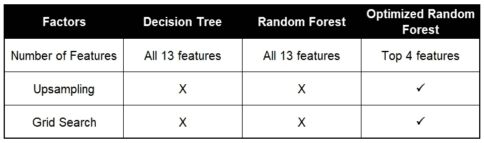

*   **特征数量:**当决定用于特定数据集的特征数量时， [*统计学习的要素*](https://statistics.stanford.edu/~tibs/ElemStatLearn) *(第 15.3 节)*声明:

> 典型地，对于具有 **p** 特征的分类问题，在每次分裂中使用 **√p** 特征。

因此，我们将执行特征选择来选择用于优化随机森林建模的前 4 个特征。有了理想数量的特征，将有助于防止过度拟合并提高模型的可解释性。

*   **上采样:**不平衡的数据集会导致训练后的模型有偏差。对于这个特定的数据集，我们看到 76%的分布代表多数类(即收入<= 50K 美元)而剩下的 24%代表少数阶级(即收入>5 万美元)。

在训练模型时，我们将使决策树和随机森林达到属于多数类的高分类精度。为了克服这一点，我们将对少数类(即收入> 5 万美元)来为优化的随机森林模型创建平衡的数据集。

*   **网格搜索:**为了最大化随机森林的性能，我们可以对最佳超参数执行网格搜索，并优化随机森林模型。

# 数据建模

在优化随机森林之前，执行数据集的初始加载和分割，以训练和测试决策树和随机森林模型。

[**数据集的标准化**](https://scikit-learn.org/stable/modules/preprocessing.html) 是 scikit-learn 中实现的许多机器学习估值器的常见需求。如果单个要素或多或少看起来不像标准的正态分布数据，数据集可能表现不佳，即。均值和单位方差为零的高斯分布。

# 模型 1:决策树

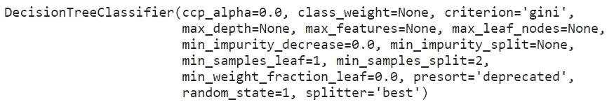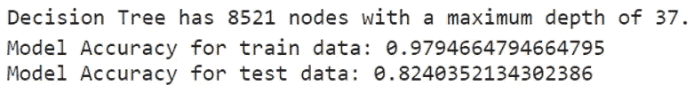

由于深度没有限制，决策树模型能够在很大程度上完美地对每个训练点进行分类。

# 决策树的可视化

通过可视化决策树，它将显示树中的每个节点，我们可以用它来进行新的预测。由于树相对较大，下面绘制了决策树，最大深度为 3。

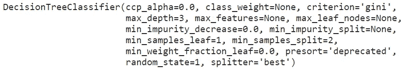

## 对于每个节点(除了叶节点)，这五行代表:

1.  这决定了我们沿着树向下遍历新数据点的方式。
2.  `**gini**`:节点的基尼杂质表示从一个节点中随机选取的样本，根据样本在该节点中的分布，被错误分类的概率。基尼系数杂质的平均值(按样本加权)随着树的每一级而降低。
3.  `**samples**`:节点中训练观察的次数。
4.  `**value**`:各个类别的样本数量。
5.  `**class**`:如果树在此深度结束，则该类预测节点中所有点。

叶节点是树进行预测的地方。不同的颜色对应不同的类别，根据基尼系数的不同，颜色深浅不一。

# 修剪决策树

限制决策树的最大深度可以使树更好地概括测试数据。虽然这将导致训练数据的准确性降低，但它可以提高测试数据的性能，并提供客观的性能评估。

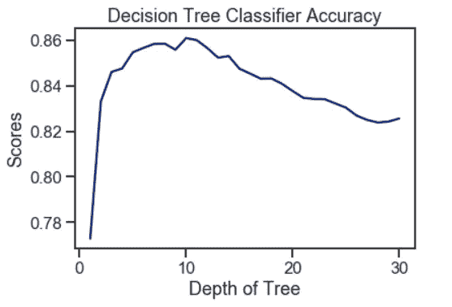

使用决策树，在最佳树深度为 10 的情况下，达到了 86%的最高准确率。随着树的深度增加，准确度分数逐渐降低。因此，较深的树深度并不反映较高的预测准确度。

# 模型 2:随机森林

# 袋外误差评估

使用 bootstrap 聚合来训练随机森林分类器，其中每个新树都是根据训练观察的 [bootstrap 样本](https://www.statisticshowto.com/bootstrap-sample/#:~:text=A%20bootstrap%20sample%20is%20a,from%20a%20single%20original%20sample.)拟合的。**出袋误差**是使用来自树的预测计算的每个训练观察的平均误差，这些树在其各自的引导样本中不包含训练观察。这允许随机森林分类器在被训练的同时被拟合和验证。

随机森林模型拟合了一系列的树数，并对所用的每一个树数的出袋误差进行了评估。

在 **150 棵树**左右，误差似乎已经稳定下来。

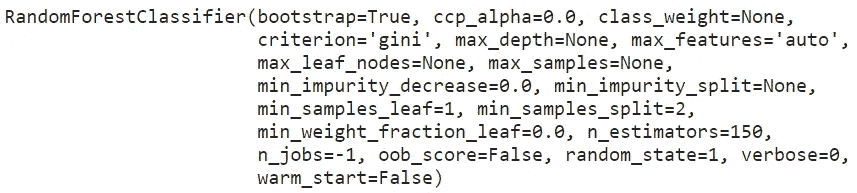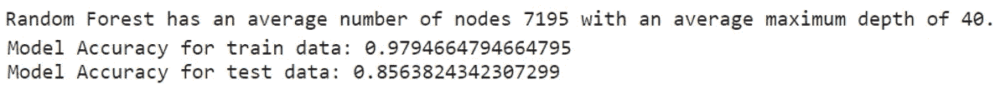

从上面可以看出，随机森林中的每棵决策树都有很多节点，而且非常深。尽管每个单独的决策树可能会过度适应训练数据的特定子集，但随机森林的使用已经为测试数据产生了稍高的准确度分数。

# 特征重要性

数据集的每个要素的要素重要性可以通过使用模型的要素重要性属性来获得。特征重要性给出了数据的每个特征的分数。**得分越高，该特征对目标变量越重要或越相关。**

特征重要性是一个内置的类，带有基于树的分类器。我们使用决策树和随机森林来对数据集的特征重要性进行排序。

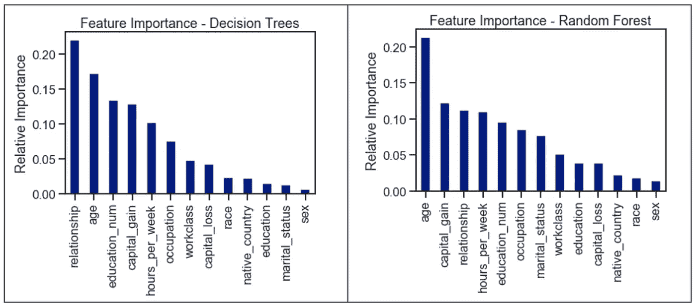

基于各个分类器所考虑的重要性对特征进行排序。通过对使用该特征的树的所有节点上的基尼系数杂质的减少量求和来计算这些值。

# **使用两种方法进行特征选择:**

# **1。单变量选择**

统计测试可用于**选择那些与目标变量**关系最密切的特征。scikit-learn 库提供了 SelectKBest 类，用于一组不同的统计测试，以选择特定数量的特性。我们使用非负特征的卡方(chi)统计测试从数据集中选择 10 个最佳特征。

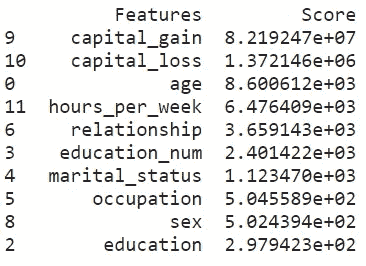

# **2。与热图相关的矩阵**

相关性说明了特征之间或与目标变量之间的关系。相关性可以是正的(增加一个特征值会增加目标变量的值)，也可以是负的(增加一个特征值会减少目标变量的值)。一个**热图**使得**识别哪些特征与目标变量**最相关变得容易。

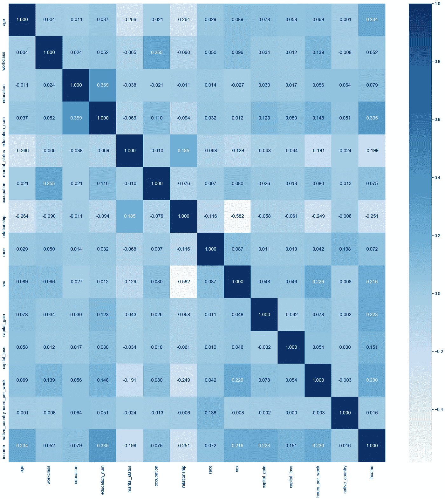

# 上采样

上采样是从少数类中随机复制观察值以加强其信号的过程。有几种试探法可以做到这一点，但最常见的方法是简单地用替换进行重新采样。

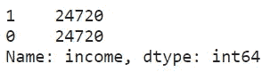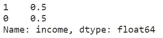

既然数据集已经平衡，我们就可以使用优化的随机森林模型来拆分和缩放该数据集，以便进行训练和测试。

# 通过网格搜索的随机森林优化

**网格搜索**是对估计器的指定参数值的**穷举搜索。它从网格中选择超参数的组合，使用训练数据的交叉验证对它们进行评估，并返回表现最佳的值。**

我们为网格搜索选择了以下[模型参数](https://scikit-learn.org/stable/modules/generated/sklearn.ensemble.RandomForestClassifier.html):

*   **n_estimators:** 森林中树木的数量。
*   **max_depth:** 树的最大深度。
*   **min_samples_split:** 拆分内部节点所需的最小样本数。

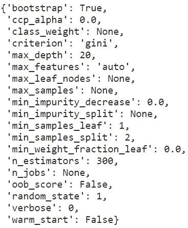

基于网格搜索，最佳超参数值不是默认值。这显示了针对特定数据集优化模型的重要性。每个数据集都有不同的特征，在一个数据集上表现最好的模型不一定在所有数据集上都表现最好。

# 使用最佳模型优化随机森林

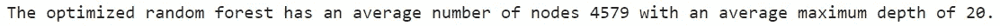

最佳最大深度不是无限的，这表明限制单个决策树的最大深度可以提高随机森林的交叉验证性能。

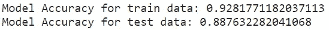

尽管优化模型实现的性能略低于决策树和默认模型，但从训练数据和测试数据获得的模型准确性之间的差距被最小化(~4%)。这代表了学习曲线的良好拟合，其中通过使用测试数据上的训练模型实现了高准确率。

# 模型的性能评估

# 1.分类报告

根据[黄砖](https://www.scikit-yb.org/en/latest/api/classifier/classification_report.html)文件，

> **分类报告**显示了基于每个类别的主要分类度量的表示，并给出了对分类器行为的更深层次的直觉，这可以掩盖多类别问题的一个类别中的功能弱点。这些指标是根据真阳性和假阳性以及真阴性和假阴性来定义的。
> 
> **精度**是分类器不将实际上是负面的实例标记为正面的能力。对于每个类别，它被定义为真阳性与真阳性和假阳性之和的比率。
> 
> 对于所有分类为阳性的实例，正确的百分比是多少？
> 
> **回忆**是分类器找到所有肯定实例的能力。对于每个类别，它被定义为真阳性与真阳性和假阴性之和的比率。
> 
> 对于所有实际为阳性的实例，正确分类的百分比是多少？
> 
> **F1 分数**是精确度和召回率的加权调和平均值，最好的分数是 1.0，最差的是 0.0。一般来说，F1 分数低于准确度，因为它们将准确度和召回率嵌入到计算中。根据经验，F1 分数的加权平均值应该用于比较分类器模型，而不是全局准确性。
> 
> **Support** 是指定数据集中该类实际出现的次数。训练数据中的不平衡支持可能指示分类器的报告分数中的结构弱点，并且可能指示需要分层采样或重新平衡。支持在模型之间不改变，而是诊断评估过程。

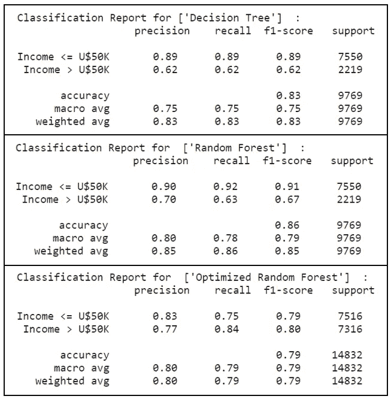

优化的随机森林在上述指标中表现良好。特别是，通过执行上采样来保持平衡数据集，在少数类**(即。标签“1”代表收入>50K 美元)，其中**通过使用优化的随机森林模型，回忆分数提高了 35%，从 0.62 提高到 0.84。****

随着**更高的精确度和召回分数**，优化的随机森林模型能够正确地标记确实为阳性的实例。在这些实际上是正面的实例中，优化的随机森林模型在很大程度上正确地对它们进行了分类。这直接转化为**更高的 F1 分数**，作为精确度和召回率的加权调和平均值。

# 2.混淆矩阵

**混淆矩阵**采用拟合的 scikit-learn 分类器和一组测试 x 和 y 值，并返回一份报告，显示每个测试值预测的类别与其实际类别相比如何。它们提供的信息与分类报告中提供的信息相似，但它们提供的不是顶级分数，而是对单个数据点分类的更深入了解。

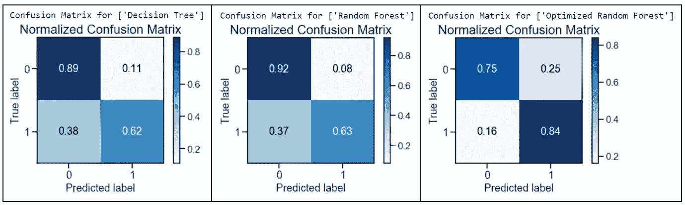

优化的随机森林表现良好，减少了 [**类型 2 错误:假阴性**](https://www.statisticssolutions.com/to-err-is-human-what-are-type-i-and-ii-errors/) (预测收入<= 50K 美元，但实际收入>50K 美元)。当将决策树的结果与优化的随机森林的结果相比较时，从 0.38 到 0.16 的分数获得了 58%的**显著下降。**

然而，通过将优化的随机森林与默认的随机森林模型进行比较， [**类型 1 错误:误报**](https://www.statisticssolutions.com/to-err-is-human-what-are-type-i-and-ii-errors/) (预测> U$50K，但实际上< = U$50K)的**大约增加了三倍，从 0.08 增加到 0.25** 。

总的来说，假阳性多的影响随着假阴性的显著减少而减轻。与实际类别相比，预测类别的测试值具有良好的结果，优化随机森林的混淆矩阵结果优于其他模型。

# 3.精确回忆曲线

**精确召回曲线**是用于评估分类器质量的度量。精度-召回曲线显示了精度(结果相关性的度量)和召回(返回多少相关结果的度量)之间的权衡。曲线下的大部分区域表示高召回率和高精度，这是分类器的最佳情况，显示了为其选择的大多数类返回准确结果的模型。

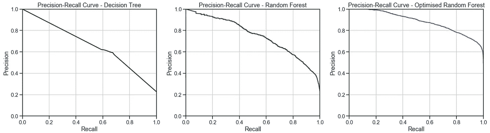

优化后的随机森林分类器在查准率-查全率曲线下获得了较高的面积。这表示高召回率和高精确度分数，其中高精确度与低假阳性率相关，高召回率与低假阴性率相关。两者的高分都表明优化的随机森林分类器返回了准确的结果(高精度)，以及大多数肯定的结果(高召回率)。

# 4.ROC 曲线和 AUC

接收器操作特征(“ROC”)/曲线下面积(“AUC”)图允许用户可视化分类器的灵敏度和特异性之间的权衡。

**ROC** 是对分类器预测质量的一种度量，它比较并可视化了模型的灵敏度和特异性之间的权衡。绘制时，ROC 曲线在 Y 轴上显示真阳性率，在 X 轴上显示假阳性率，以全球平均值和每类为基础。因此，理想点是图的左上角:假阳性为零，真阳性为一。

**AUC** 是假阳性和真阳性之间关系的计算。AUC 越高，模型通常越好。然而，检查曲线的“陡度”也很重要，因为这描述了在最小化假阳性率的同时最大化真阳性率。

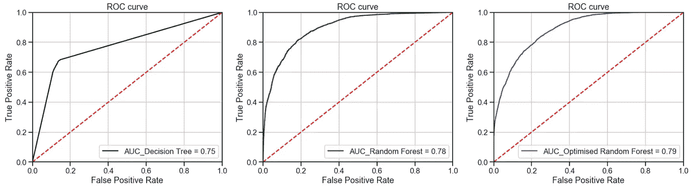

所有模型都优于基线猜测，优化的随机森林实现了最佳 AUC 结果。因此，表明优化的随机森林是更好的分类器。

# 5.校准曲线

当执行分类时，人们经常希望不仅预测类别标签，而且预测相关的概率。这个概率给出了预测的某种可信度。因此，校准图可用于确定预测概率是否可直接解释为置信水平。

与其他两个模型相比，优化随机森林的校准图最接近完美校准。因此，优化的随机森林更加可靠，并且能够更好地归纳出新数据。

# 结论

与其他模型相比，**优化的随机森林在测试集上具有更好的泛化性能**，并且方差减小。决策树往往会过度拟合，修剪有助于将方差减少到一定程度。随机森林**用比单一决策树更健壮的强大建模技术解决了决策树**的缺点。

**使用随机森林优化**对结果有重大影响，考虑了以下 3 个因素:

1.  **特征选择**选择理想的特征数量，以防止过度拟合并提高模型的可解释性
2.  **对少数类进行上采样**以创建平衡数据集
3.  **网格搜索**选择最佳超参数以最大化模型性能

最后，结果也归因于随机森林的独特性质，在生长树木的同时，它给模型增加了额外的随机性。它**不是在分割节点时搜索最重要的特征，而是在随机特征子集**中搜索最佳特征。这导致了广泛的多样性，这通常导致分类问题的更好模型。

# 参考

1.  [一个方框图告诉你什么？](https://www.simplypsychology.org/boxplots.html#:~:text=Box%20plots%20are%20useful%20as%20they%20show%20outliers%20within%20a,whiskers%20of%20the%20box%20plot.)
2.  [分类报告](https://www.scikit-yb.org/en/latest/api/classifier/classification_report.html)
3.  混乱矩阵
4.  [精确召回曲线](https://www.scikit-yb.org/en/latest/api/classifier/prcurve.html)
5.  [罗考克](https://www.scikit-yb.org/en/latest/api/classifier/rocauc.html)