# 使用预测分析建立最佳股票投资组合

> 原文：<https://pub.towardsai.net/use-predictive-analytics-to-build-an-optimal-stock-portfolio-ecb474be9a5f?source=collection_archive---------0----------------------->

## [预测分析](https://towardsai.net/p/category/predictive-analytics)

## 使用 R 的数据可视化财务分析指南


由[马库斯·斯皮斯克](https://unsplash.com/@markusspiske?utm_source=medium&utm_medium=referral)在 [Unsplash](https://unsplash.com?utm_source=medium&utm_medium=referral) 上拍摄的照片

金融是一个利润丰厚的行业，近年来，它大量使用数据科学、机器学习、深度学习和其他几种计算技术来实现结果的最大化。金融领域的一个重要工作类别是类似于股票市场的股票。在这个故事中，我将尝试使用 R 通过可视化来分析股票，根据历史数据来预测未来的股票价格，然后使用夏普比率的概念来创建一个最佳的股票投资组合。

> 我将介绍在 R 中使用数据可视化概念构建交易策略的完整过程。在这个过程中，我还将介绍关于时间序列分析、数据平稳性和执行预测的概念。但是理解这一系列的 R 代码显然没有前提条件。同样作为免责声明，这不是投资建议(我不是财务主管！)

# 准备用于分析的数据

为了这个分析的目的，我将使用直接来自雅虎的数据，并且我将在整个教程中使用一些特定的股票，即苹果、特斯拉和辉瑞。该代码在功能上使用来自 yahoo finance 的数据，并捕获数据在理想情况下可以在。从网站下载 csv。

准备数据采集阶段

# 数据可视化对理解股票的重要性

可视化是讲故事机制的一部分，可以帮助我们深入理解手头的数据。在股票市场分析中，数据可视化起着重要的作用，因为在研究可能包含成千上万只股票的粒度数据时，汇总统计数据至关重要。每个图表都有一个独特的功能，我将根据图表在股市中的用途来解释这些功能。

下面是几个对所有财务分析都极其有帮助的图。

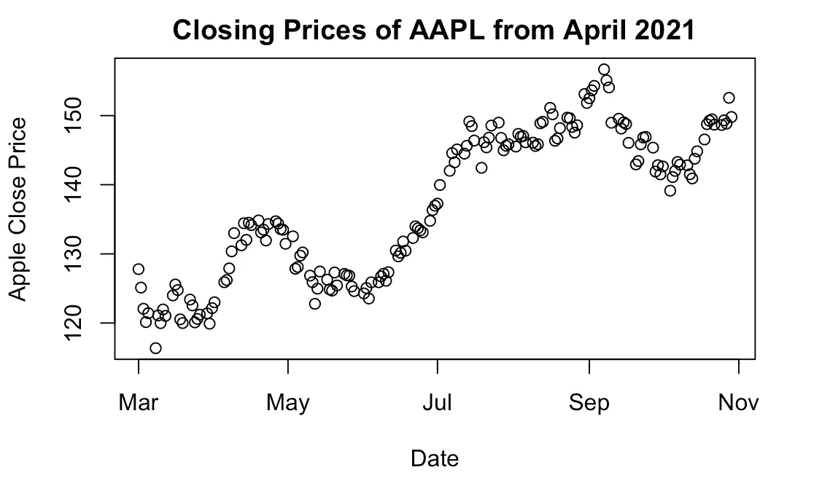

散点图:上图显示了该股票在过去 5 个月的收盘价。我们可以清楚地看到，4 月至 5 月期间是一个驼峰，导致价格在 5 月至 6 月达到最低点。最高收盘可以在 9 月份的帖子中看到，我们再次看到逐渐下降。|作者图片

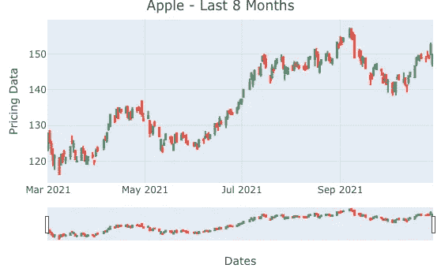

蜡烛图:在一般的金融分析中，蜡烛图被用来理解市场情绪。这些给日内交易者一个详细的股票每日表现的读数，这反过来说明了市场对股票的看法。在苹果的例子中，我们看到一个均匀分布的图表，表明投资者对交易苹果是稳定的。除了 9 月 10 日的一天，当我们看到高和低之间的差距很大。|作者图片

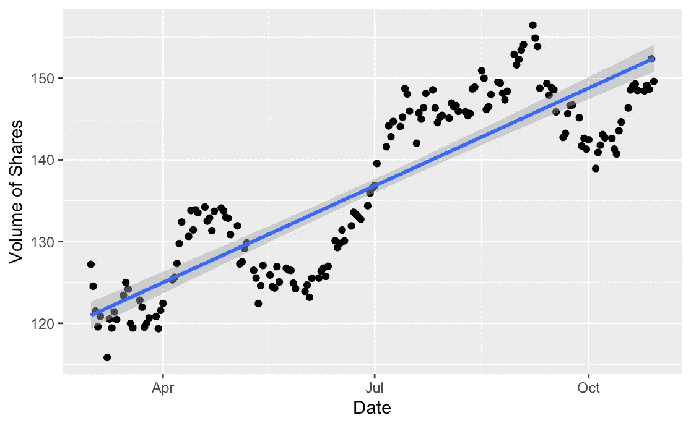

散点图:为了研究每天执行的日交易数量，我们阅读调整后收盘价的散点图。这表明苹果公司的股票价格定期上涨。|作者图片

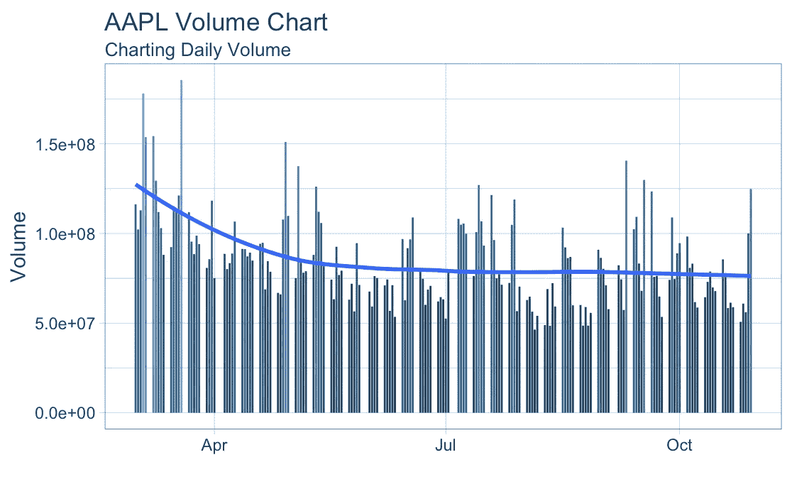

条形图:对日内交易量的研究。AAPL 的数据显示，交易是多样化的，没有向我们显示任何趋势或交易量的模式，不考虑价格。这向我们展示了公司股票的一个重要交易，对于这家公司来说，投资者的信任不受股票价格的影响。|作者图片

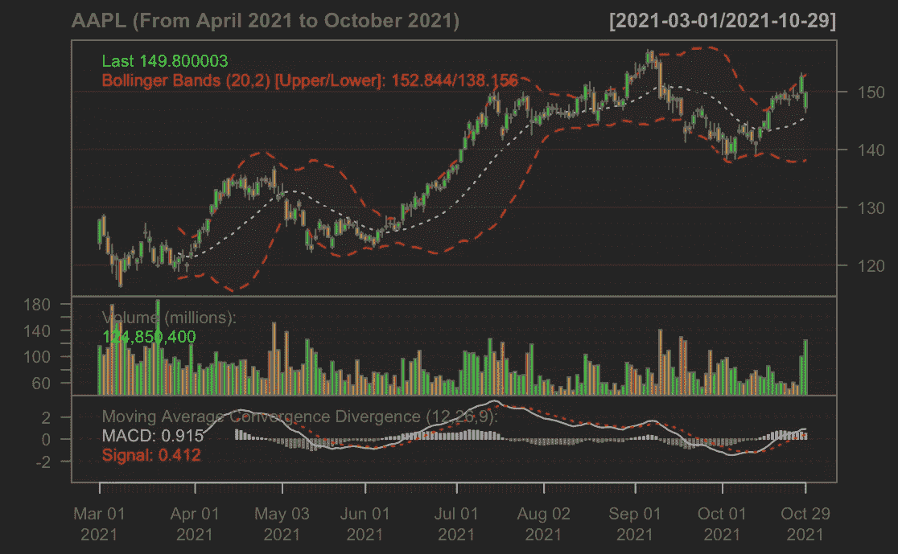

布林线:任何证券的关键分析工具是布林线。它由三条线组成，一条简单的移动平均线(中间带)，一条上面带和一条下面带。
挤压是布林线显示的一个重要指标。当带子靠近时，这叫做挤压。这表明移动平均线正在收缩。这是一个低波动的时期，是未来交易机会的标志。在上面的苹果案例中，我们看到了 6 月和 9 月的挤压，这是苹果股票日内交易的最佳时期。|作者图片

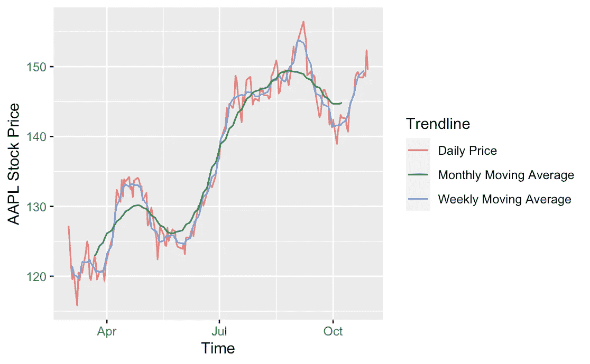

多线图表:上面的图表基于每日价格、周均线和月均线分成两部分。MA 是显示一段时间内股价波动的重要指标。我们在上面观察到，在 9 月份，股票价格明显高于月移动平均线，显示出高波动性的迹象。这些时期可能是日内交易者的潜在交易机会，但伴随着“高风险高回报”的提示。|作者图片

# 预测分析的实施

用我的话来说，吸收一个对象的未来行为的科学是预测分析。它在金融领域的应用非常广泛，因为交易者的策略是基于对市场预测的研究。它通常不是一个具体的输出，没有交易策略可以仅仅基于一个算法，但预测有助于建立认知策略。

> 预测时间序列处理的是预测下一个周期或在未来参考时间框架内发生的事件观察。

## 时间序列中的 ADF、平稳性和季节性

扩展的 Dickey-Fuller 检验(ADF)，也称为 Ad-Fuller 检验，是时间序列分析的一种重要检验机制。它测试一个基本的零假设，即给定的输入单位根存在于整个时间序列样本中。另一个假设通常是序列的平稳性或趋势平稳性。

> 在这个测试中主要使用的增强的 Dickey-Fuller(ADF)统计量是一个负数。越是否定，就越是强烈的拒绝在某个置信水平上存在单位根的假设。

Ad-Fuller 测试背后的启示是，如果时间序列以单位根过程为特征，那么在这种情况下，序列(y-1)的滞后水平将不会产生任何预测(y)未来变化的相关信息，除了在(y-1)的 delta 中观察到的那些变化。在这种情况下，零假设不会被拒绝。另一方面，如果现有的过程没有单位根，这表明它是稳定的，因此显示了均值的回归。这里，滞后水平将提供预测未来变化的相关信息。

时间序列数据的季节性是指在小于一年的特定时间间隔内出现的变化。这些时间间隔可以是每小时、每月、每周或每季度。天气或气候变化等各种因素会导致季节性。 ***造成季节性的模式总是循环的，以周期性的模式出现。***

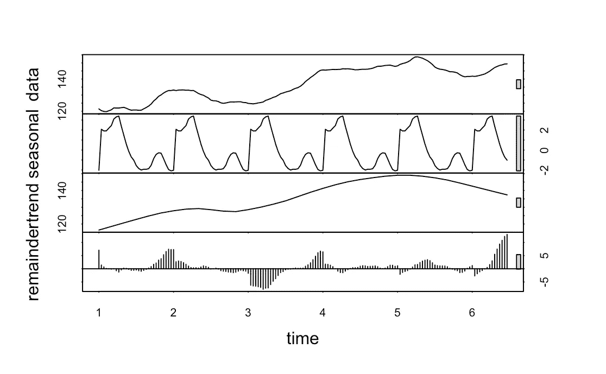

正如我们所看到的，在我们的 8 个月时间内，苹果股票价格交易似乎没有任何明显的周期性。|作者图片

## 自相关和偏相关

**自相关**:序列与其滞后时间的相关性称为自相关。就像相关性测量两个变量之间线性关系的大小一样，自相关在时间序列的滞后值之间也是如此。如果时间序列有很大的自相关性，这意味着滞后对时间序列预测的影响很大。更一般地说，相关因子 1(滞后= 1)表示彼此相隔一个周期的值之间的相关性。同样，滞后“k”自相关显示了彼此独立的“k”个时间段的值之间的关联。

**偏相关**:偏相关的目的也类似于自相关，因为它传达了变量与其滞后之间关系的信息。但是部分自相关仅提供滞后之间的纯关联的细节，而忽略了中间滞后产生的相关性。

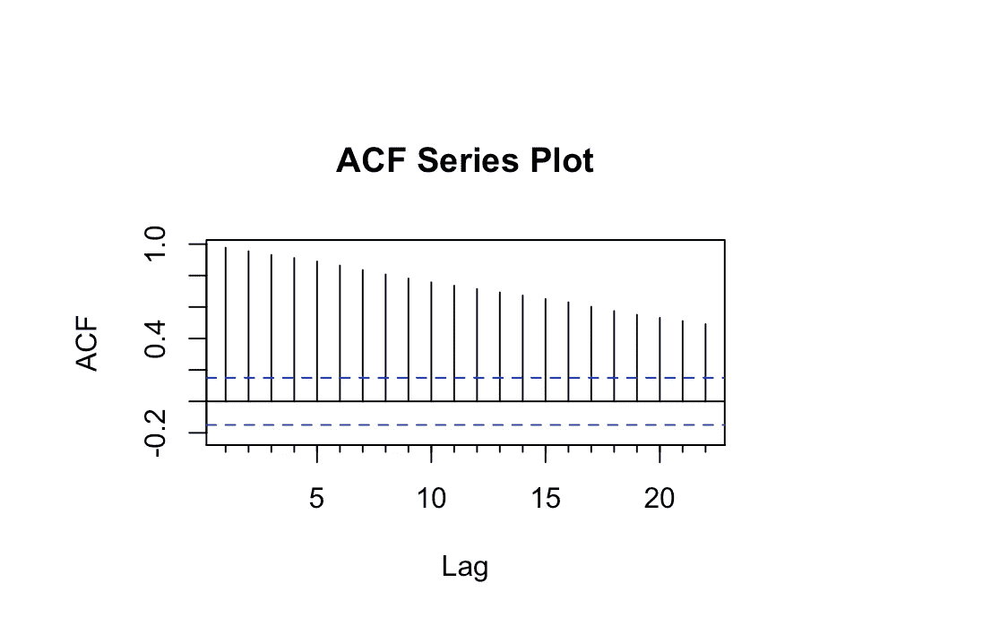

ACF 图表|作者图片

当从苹果的 ACF 图中读取数据时，我们看到滞后逐渐衰减。这种衰减表明在每个时间间隔都有显著的收盘值，这证实了我们在扩展的 Dickey-Fuller 检验中的假设是正确的。

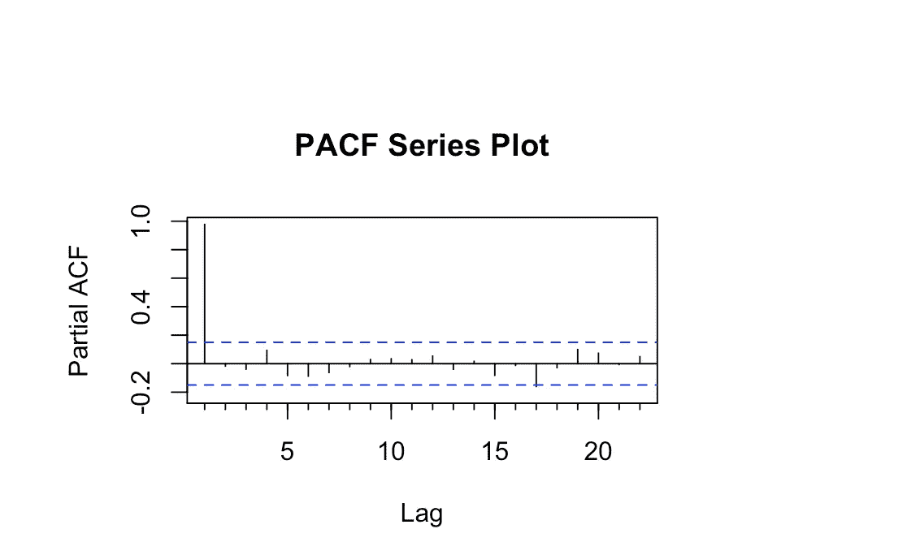

PACF 情节|作者图片

在阅读苹果的 PACF 图时，我们注意到滞后阶数在开始时很高，但随后在整个时间线中以几何级数移动。PACF 图滞后的周期性变化运动证实了这是数据的季节性成分，任何变化的价格都可以用来建立 ARIMA 模型。如果这是一条跨越所有时间框架的直线，这个数据就不会在 ARIMA 预测中产生任何结果。

# ARIMA —自回归积分移动平均

统计和经济领域的通用术语，自回归综合移动平均(ARIMA)用于描述移动平均结构。他们对建立时间序列预测模型产生了浓厚的兴趣。ARIMA 模型适用于输入数据在均值意义上显示非平稳性的证据，但没有观察到显著差异的情况。

我们可以将 ARIMA 的定义分解如下，ARIMA 的 AR 部分代表一个进化变量，它根据自身滞后(旧值)进行回归。MA 部分显示回归误差，它是过去不同时间出现的误差项的线性组合。剩下的“I”(积分)表示数据被当前值和先前值之间的差异所取代。这些单独的过程可能需要执行多次。每个功能的目的都是使模型尽可能符合数据。

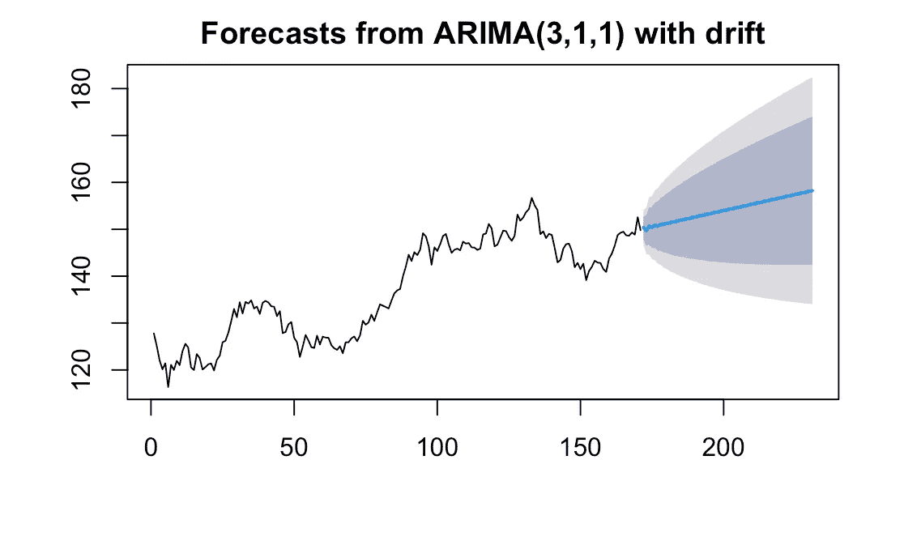

预测 AAPL 股票价格 60 天|图片由作者提供

在上面的代码中，我们基于在教程的初始准备部分开始的数据建立了一个 ARIMA 模型。然后我们用这个模型来预测未来 60 天的股票价格。上述预测可以解读如下:

1.  蓝线代表我们预测的平均值。
2.  蓝线周围较暗的阴影区域代表 80%的置信区间。
3.  浅色阴影的外部代表 95%的置信区间。

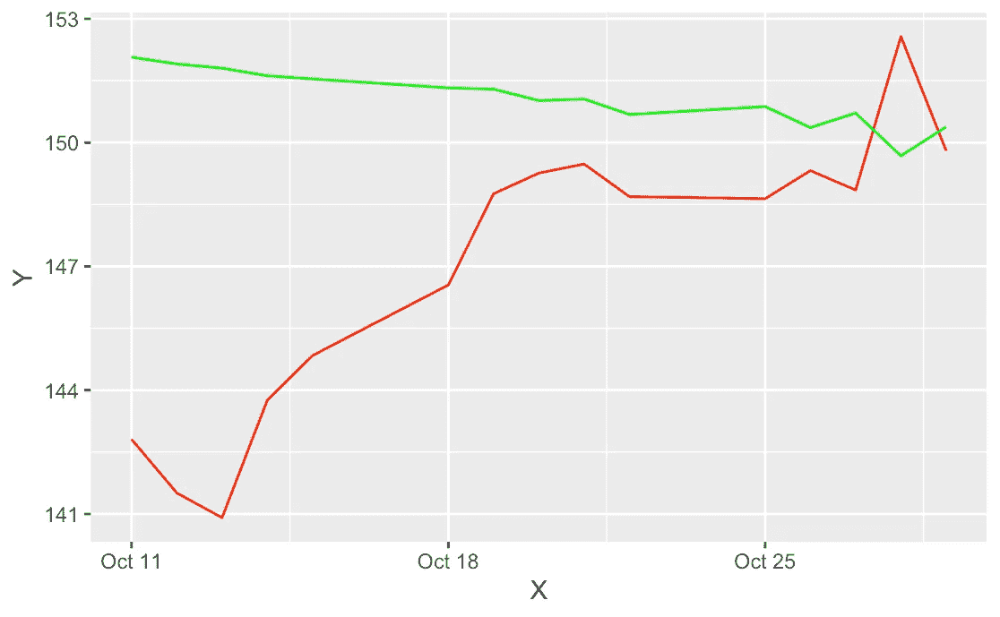

根据真实数据验证预测|作者图片

在匹配时，我们看到随着时间的推移，我们预测的平均值非常接近实际值。这肯定会让我们对构建这种分析和预测的方式产生一些信心。 ***需要注意的一件重要事情是，我们的预测是基于过去 8 个月的数据，针对未来 60 天的。因此，前面的条目不会匹配。但是当我们接近图表的末端时，如果数字开始进入相同的运动模式，这是一个积极的信号。***

有关时间序列预测和使用 ARIMA 模型的所有测试技术的详细信息，请参考下面的教程:

[](https://towardsdatascience.com/create-weather-proof-validations-for-your-time-series-forecasting-model-d456a1037c4f) [## 为您的时间序列预测模型创建“不受天气影响”的验证

### 使用 Python 构建最终时间预测的指南

towardsdatascience.com](https://towardsdatascience.com/create-weather-proof-validations-for-your-time-series-forecasting-model-d456a1037c4f) 

# 使用夏普比率建立股票投资组合

在理财方面，分散投资会产生更好的结果，这是一个常识。这个想法是不要把所有的鸡蛋放在一个篮子里。那么，你如何决定选择哪个篮子，如何分配资金呢？

## 夏普比率

决定交易多只股票的最佳结果的一个重要方法是计算夏普比率。它告诉你哪一对股票和哪一个股票的资金配置比例会产生最好的结果。

在下面的函数中，我们将完成一些先决步骤来计算夏普比率:

1.  带来 3 只股票的数据，过去 6 年的历史数据。
2.  计算他们各自的月回报率，以总结哪只股票给出了什么回报。
3.  将他们的回报合并到一个数据框架中，以进一步划分投资组合的各个部分。

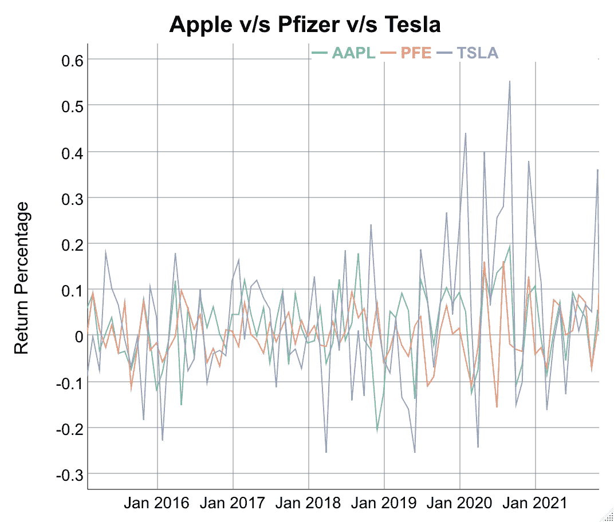

股票回报比较|作者图片

上面的交互式折线图向我们展示了这三只股票各自的回报率。很明显，特斯拉是三只股票中最不稳定的。它是最大的，但有时也会大量亏损。目前，投资 TSLA 似乎能带来高回报，但同时也伴随着很高的风险率。

为了开始计算夏普比率，我将我的投资组合分割如下:

1.  苹果公司——25%
2.  辉瑞公司——25%
3.  特斯拉——50%

这种划分是本能的，而不是来自任何形式的计算。你可以根据你想给你的投资组合增加多少风险来自由试验这些方法。这些值的修改将导致夏普比率的变化。

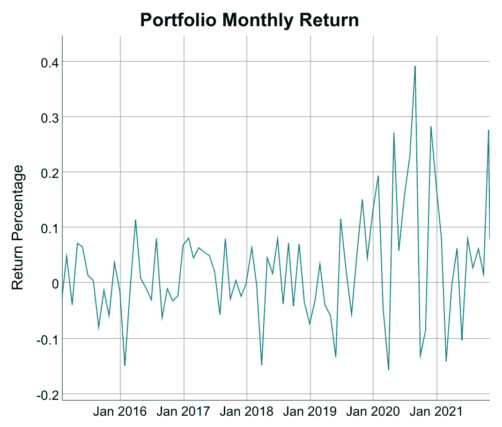

由 25%苹果股票、25%辉瑞股票和 50%特斯拉股票组成的投资组合的月回报率|图片由作者提供

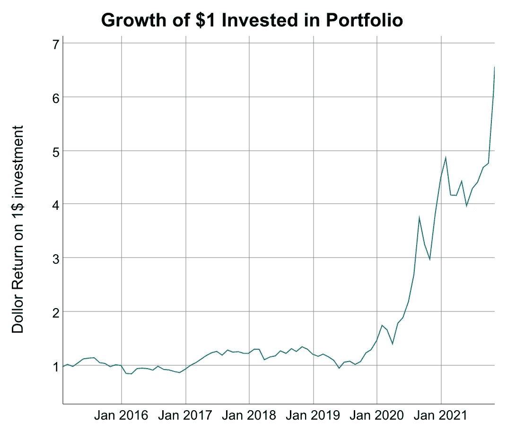

投资于该投资组合的 1 美元的增长

```
Sharpe Ratio: portfolio.returns
StdDev Sharpe (Rf=0%, p=95%):            0.2709
VaR Sharpe (Rf=0%, p=95%):               0.2582
ES Sharpe (Rf=0%, p=95%):                0.2036
```

## 提高夏普比率。这个分数还能更好吗？

我们看到夏普比率的方差得分为 0.27，这被认为是非常好的。但是，理想的投资组合分配应该使这个分数最大化。有多种方法可以最大化这个分数。或者，我们可以将所有这些数据导出到 Excel 中，并运行假设分析，以找出什么样的百分比分配会使夏普比率最大化。或者在这段代码中，我们可以手动更改上面创建的“percAlloc”变量中的百分比分配。分数越高，投资组合越好。

## 代码库

该项目的完整代码，包括。rmd 文件、渲染 HTML 文件都在下面链接的存储库中。务必安装“makeR”外部包(详细信息在代码注释中)。祝你好运！

[](https://github.com/rjrahul24/r-finance-analysis) [## rjrahul24/r-finance-analysis:一个使用 R 对股票数据进行预测并构建…

### 使用 R 对股票数据进行预测并使用夏普比率构建最优投资组合的项目— GitHub …

github.com](https://github.com/rjrahul24/r-finance-analysis) 

## 结论、总结和学习

数据可视化可以在简单和复杂之间共存。但是，对于任何数据分析项目生命周期来说，它都是一个非常重要的工具。这个项目旨在通过简单地研究股票价格数据并在 ARIMA 建立预测来创建 R 上的股票价格预测器。这个项目的另一个重要收获是数据可视化在讲故事艺术中的重要性。处理数字和做出预测并不能传递这些可视化所传递的信息。

希望这种方式有帮助。
附:请不要考虑这个投资建议！

# 关于我

我是纽约哥伦比亚大学的一名软件工程师兼数据科学研究员，目前正在研究如何减少气候变化对世界贫困人口的影响。这些人受我们砍伐树木和在地球表面推混凝土的行为影响最大。如果你的研究或工作抱负也与我一致，请务必与我联系 [Twitter](https://twitter.com/rjrahul24) 或 [LinkedIn](https://www.linkedin.com/in/rjrahul24/) ，我们可以一起努力建设 ***负责任的人工智能。此外，我还从事量化金融和构建交易算法。***

## 参考

1.  [https://www . analyticsvidhya . com/blog/2020/11/stock-market-price-trend-prediction-using-time-series-forecasting/](https://www.analyticsvidhya.com/blog/2020/11/stock-market-price-trend-prediction-using-time-series-forecasting/)
2.  [https://www . kdnugges . com/2020/01/stock-market-forecasting-time-series-analysis . html](https://www.kdnuggets.com/2020/01/stock-market-forecasting-time-series-analysis.html)
3.  [https://towards data science . com/time-series-forecasting-predicting-stock-prices-using-an-ARIMA-model-2e3b 3080 BD 70](https://towardsdatascience.com/time-series-forecasting-predicting-stock-prices-using-an-arima-model-2e3b3080bd70)
4.  [https://rpubs.com/kapage/523169](https://rpubs.com/kapage/523169)