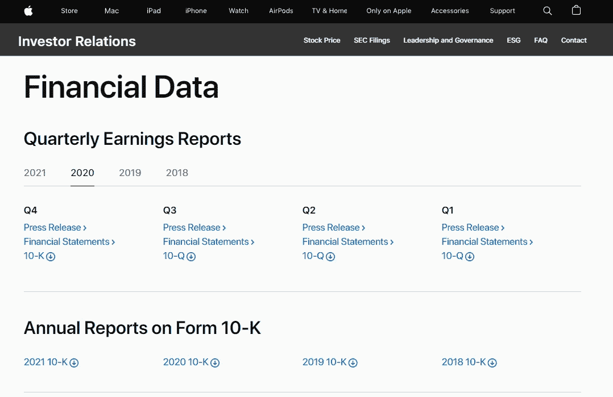
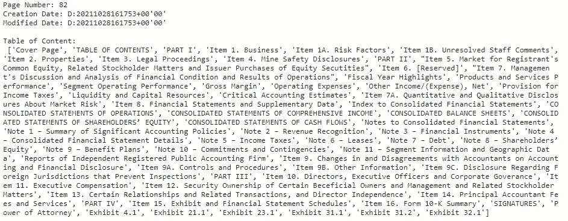
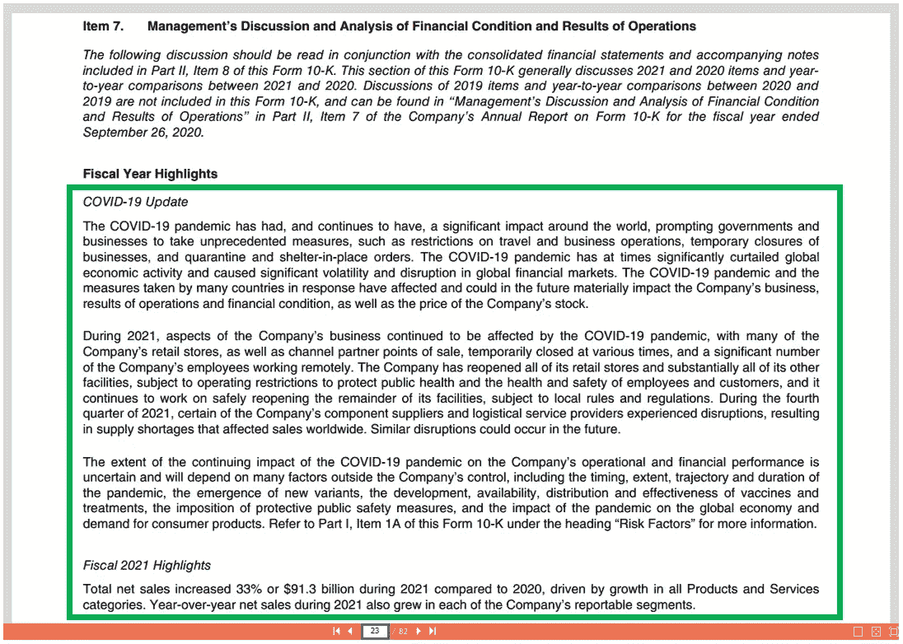
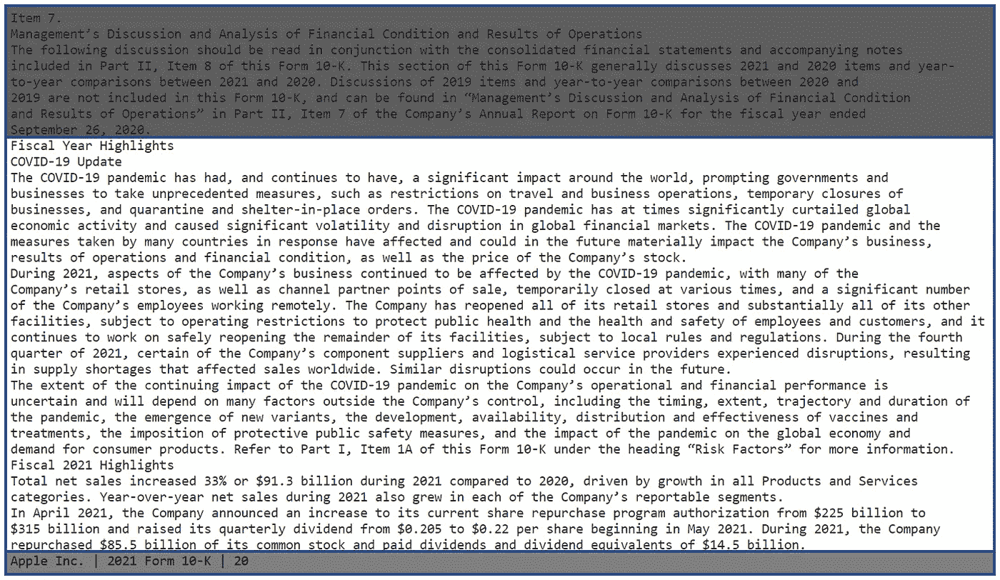
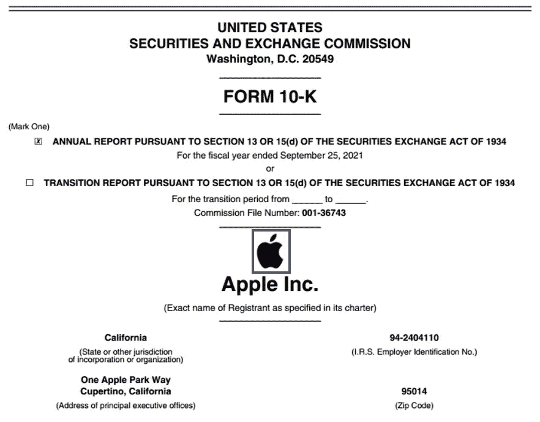
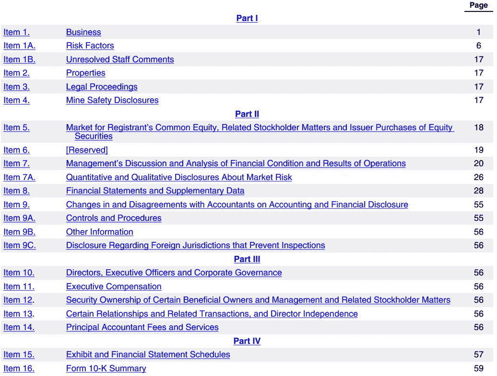
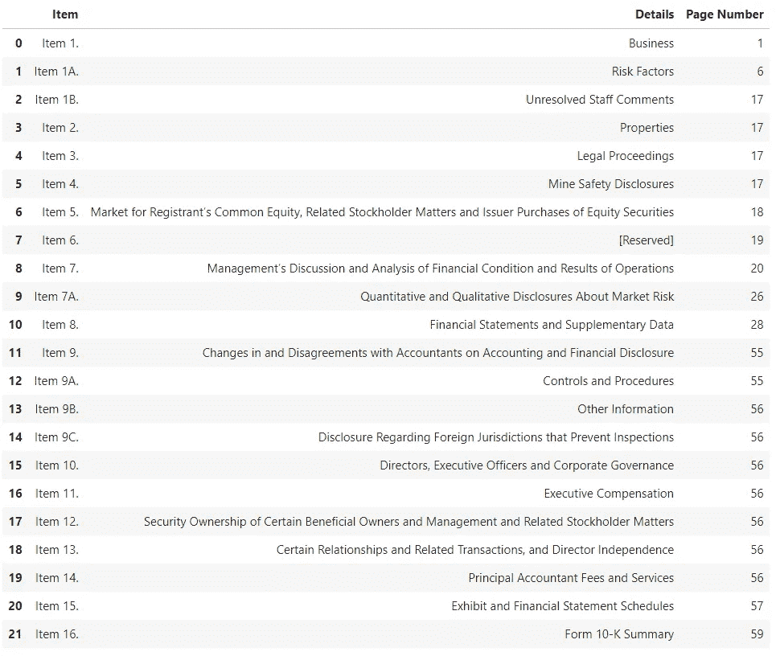
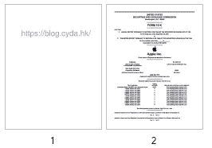
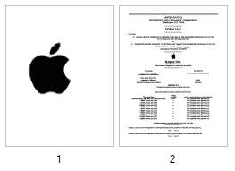

# 使用 Python 处理 PDF 作品

> 原文：<https://pub.towardsai.net/use-python-to-process-pdf-work-e458dbaf5fc7?source=collection_archive---------0----------------------->

## [自然语言处理](https://towardsai.net/p/category/nlp)

## 没有 Adobe PDF 软件，您也可以编辑 PDF，例如添加文本、拆分页面和提取信息。


由 [cyda](https://blog.cyda.hk/) 拍摄

# 目标

人们可能面临的办公室挑战之一是缺乏处理 PDF 编辑操作的软件。在今天的教程中，我将向您展示如何使用 Python 自由地从 PDF 中提取信息或修改 PDF 中的内容。读完本文后，您将了解到

1.  **的方法从 PDF 中提取**关键信息。
2.  分割 PDF 页面的方法。
3.  **添加**不同元素到 PDF 的程序。
4.  **导出**PDF 为图像的方式。

此外，如果你有兴趣查看其他办公室工作技巧，请随时查看我在 Medium 上的其他文章。

[](https://towardsdatascience.com/use-python-to-stylize-the-excel-formatting-916e00e33302) [## 使用 Python 来格式化 Excel

### 使用 Python 格式化 Excel 电子表格的分步教程

towardsdatascience.com](https://towardsdatascience.com/use-python-to-stylize-the-excel-formatting-916e00e33302) [](https://medium.com/mlearning-ai/use-excel-to-scrape-data-no-codes-required-f13748587b0d) [## 使用 Excel 抓取数据(不需要代码)

### 用 Excel 内置函数抓取数据的三个简单步骤

medium.com](https://medium.com/mlearning-ai/use-excel-to-scrape-data-no-codes-required-f13748587b0d) [](https://towardsdatascience.com/use-python-to-automate-the-powerpoint-update-4a385acf1243) [## 使用 Python 自动更新 PowerPoint

### 使用 Python 编辑 PowerPoint 幻灯片的分步教程

towardsdatascience.com](https://towardsdatascience.com/use-python-to-automate-the-powerpoint-update-4a385acf1243) [](https://medium.com/mlearning-ai/use-python-to-send-outlook-emails-d673ce9e33e4) [## 使用 Python 发送 Outlook 电子邮件

### 使用 Python 发送通知电子邮件的分步教程

medium.com](https://medium.com/mlearning-ai/use-python-to-send-outlook-emails-d673ce9e33e4) 

> *A* ***ll 代码和资料上传到我的 GitHub。你可以查一下民间的*** [***这种回购***](https://github.com/cydalytics/Python_PDF_Processing) ***来进一步研究。=)***

# 数据源

为了展示技巧，首先我们需要 PDF 文件。在这里，我使用苹果财务报告作为例子，我们可以很容易地从它的官方网站获得这些 PDF 文件，如下链接所示。

```
[https://investor.apple.com/investor-relations/default.aspx](https://investor.apple.com/investor-relations/default.aspx)
```



截图自[苹果官网](https://investor.apple.com/investor-relations/default.aspx)

# 包裹

在整个教程中，我们主要使用包`PyMuPDF`。如果这是您第一次听说，您可以简单地通过

```
pip install PyMuPDF
```

为了向您介绍这个包，我将介绍 PyMuPDF，它是用 Python 处理 PDF 的最有用和最强大的包之一。它涵盖了从提取、修改到导出等多种功能。

要导入包，可以使用下面的代码。

```
import fitz as pymupdf
```

# 第 1 部分—提取信息

我在下面的列表中总结了人们希望从 PDF 中提取的最常见的元素。

*   基本信息
*   文本
*   形象
*   桌子
*   其他人

让我们一个一个地看。

> **1.1 基本信息**

基本信息是指与文件结构或文件属性相关的信息，如页数、创建日期、作者等。

```
pdf_path = 'Apple Annual Report 2021.pdf'f = pymupdf.open(pdf_path)
print('Page Number:', f.page_count)
print('Creation Date:', f.metadata['creationDate'])
print('Modified Date:', f.metadata['modDate'])
print('\nTable of Content:\n', [toc[1] for toc in f.get_toc()])
f.close()
```



以上代码的输出(Photo by [cyda](https://blog.cyda.hk/) )

我认为代码是很容易解释的。这里我只介绍三种常用的方法供你参考，帮助你提取基本信息(`page_count`、`metadata`、`get_toc()`)。

***备注:当我们使用自动化程序处理大量 pdf 文件时，其中一个技巧是检查修改日期，并将其作为程序启动的触发器。***

> **1.2 文本**

我们一直关注的另一个信息是文本。让我们以*财年集锦*为例。



第 23 页的财政年度亮点(照片由 [cyda](https://blog.cyda.hk/) 拍摄)

要提取文本，我们只需要考虑三件事——(1)页码，(2)文本的起点，(3)文本的终点。

要提取特定页面的文本，*(下面我们以第 23 页为例)*

```
f = pymupdf.open(pdf_path)
txt = f.load_page(22).get_text()
f.close()
```



以上代码的输出(图片由 [cyda](https://blog.cyda.hk/) 提供)

通过获取整个页面的文本，您可以包含那些您可能不感兴趣的不必要的内容，如前一章的段落或页脚。要删除那些不相关的文本，有两种方法，要么设置指针索引，要么用空白替换它们。

要设置指针，可以用下面的代码来做。

```
start_idx = txt.find('Fiscal Year Highlights')
txt = txt[start_idx:]
```

要替换页脚文本，您必须理解页脚的结构，并使用正则表达式包来替换它。

```
import re
txt = re.sub("\nApple Inc. \| 2021 Form 10-K \| **\d+**\n", "", txt)
```

> **1.3 图像**

除了文本之外，还会提取一些图形或情节用于进一步分析。这里，我们使用品牌标志图像作为演示。



第 1 页显示的带有图像的内容(照片由 [cyda](https://blog.cyda.hk/) 拍摄)

为了提取图像，我们需要图像对象的交叉引用号(`xref`)。您可以将其视为 PDF 中对象的唯一标识。为了得到这个数字，我们需要利用函数`get_images`。通过使用函数`get_images`，我们按照下面的项目结构得到一个特定页面的图像列表。
*(****xref****，smask，width，height，bpc，colorspace，alt.colorspace，name，filter)*

```
f = pymupdf.open(pdf_path)
img_list = f.load_page(0).get_images()
print(img_list)
f.close()
```

*[(****489****，0，46，56，8，' DeviceRGB '，''，' Im1 '，' DCTDecode')]*

所以我们现在知道苹果品牌 logo 图像交叉引用号是 489。接下来的工作是通过`extract_image`将图像导出。

```
f = pymupdf.open(pdf_path)
img_xref = img_list[0][0]
img_data = f.extract_image(img_xref)
img_f = open("img." + img_data["ext"], "wb")
img_f.write(img_data["image"])
img_f.close()
f.close()
```

> **1.4 表**

一个坏消息是，PyMuPDF 目前不支持直接提取表格，但是作为数据科学家，只要我们获得文本，我们就可以找到方法将其转换成我们希望的格式，对吗？

下面我用目录作为例子。



第 3 页目录(照片由 [cyda](https://blog.cyda.hk/) 拍摄)

```
import numpy as np
import pandas as pd
pd.set_option('display.max_colwidth', None)f = pymupdf.open(pdf_path)
txt = f.load_page(2).get_text()
f.close()temp_table_list = txt[txt.find('Part I'):].split('\n')
temp_table_list = [cell for cell in temp_table_list if cell not in ['Part I', 'Part II', 'Part III', 'Part IV', '']]
table_list = []
cell = ''
while len(temp_table_list) > 0:
    temp_cell = temp_table_list.pop(0)
    if cell != '':
        temp_cell = cell + temp_cell
        cell = ''
    if temp_cell[-1] == ' ':
        cell = temp_cell
    else:
        table_list.append(temp_cell)
table = pd.DataFrame(np.array(table_list).reshape(-1, 3), columns=['Item', 'Details', 'Page Number'])
table
```

基本上，程序如下。

1.  加载页面并获取文本。
2.  设置指针索引，获取我们感兴趣的文本范围。
3.  将文本拆分到列表中。
4.  处理第 5 项中的换行文本问题。
5.  将列表整形为 3 维，并将其转换为 dataframe。
6.  搞定了。



表格摘录自 PDF(照片由 [cyda](https://blog.cyda.hk/) 拍摄)

> **1.5 其他**

除了上面列出的那些最常见的元素，我还为你的一些兴趣找到了一些额外罕见的组件及其相应的功能。

*   超链接:`page.get_links()`
*   注释:`page.annots()`
*   表单字段:`page.widgets()`

# 第 2 部分—修改内容

除了提取信息，PDF 的另一个操作是编辑文件，比如添加文本和图像。一般来说，这些类型的工作只能适用于 Adobe Acrobat DC 或其他 PDF 编辑器。然而，这些软件中的大多数都不是免费的，而在线 PDF 编辑器平台可能会在某种程度上导致安全问题。因此，我想分享我们如何利用 Python 来完成这些操作。

*   **插入**新的一页
*   **删除**页
*   **添加**文本
*   **添加**图片
*   其他人

> **2.1 插入一页**

要插入页面，我们可以使用方法`new_page`。该参数将是您想要插入的页码。例如

在第一页插入:`f.new_page(0)`

在最后一页插入:`f.new_page(-1)`

在第 6 页插入:`f.new_page(5)`

```
f = pymupdf.open(pdf_path)
f.**new_page**(0, 612.0, 792.0)
f.save("Modified.pdf")
f.close()
```

备注:您可能会注意到有三个参数，实际上它们指的是`(page number, width, height)`。

> **2.2 删除页面**

要删除页面，您可以使用`delete_page`或`delete_pages`，但我建议使用后者，因为前者只能通过指定页码来删除单个页面，而后者可以指示页码范围，效率会更高。例如，如果我想只保留奇数页并删除所有偶数页，

```
f = pymupdf.open(pdf_path)
print('Original Page Number:', f.page_count)
f.**delete_pages**(range(0, f.page_count, 2))
print('Modified Page Number:', f.page_count)
f.save("Modified Apple Annual Report 2021.pdf")
f.close()
```

*原页码:82
修改页码:41*

> **2.3 添加文本**

要添加文本，我们需要一个文本编写器。

```
f = pymupdf.open(pdf_path)
page = f.new_page(0, 612.0, 792.0)
text_writer = pymupdf.TextWriter(page.rect)
```

`page`是指我们要编辑的 PDF 页面。`page.rect`返回用代表页面坐标的四个浮点`(x0, y0, x1, y1)`定义的矩形。为了创建文本编写器对象，我们可以使用`pymupdf.TextWriter(page.rect)`。

编写文本需要两件事情，包括(1)放置文本的 x-y 坐标和(2)文本值。

```
# Compulsory
pos = (100, 200)
text = "[https://blog.cyda.hk/](https://blog.cyda.hk/)"# Optional
font_style = pymupdf.Font("helv")
font_size = 50
font_opacity = 0.5
font_color = (0, 0, 1)text_writer.append(pos, text, font=font_style, fontsize=font_size)
text_writer.write_text(page, opacity=font_opacity, color=font_color)
f.save("Modified Apple Annual Report 2021.pdf")
f.close()
```

请注意，在上面的代码中，我列出了人们希望为字体格式更改的最常见的参数，供您参考。



添加到 PDF 的文本(照片由 [cyda](https://blog.cyda.hk/) 拍摄)

> **2.4 添加图像**

要添加图像，我们只需指定用来放置图像的坐标`(x1, y1, x2, y2)`。

```
f = pymupdf.open(pdf_path)
page = f.new_page(0, 612.0, 792.0)x = 100
y = 200
w = 300
h = 300
img_rect = pymupdf.Rect(x, y, x+w, y+h)
page.insertImage(img_rect, filename="img.jpeg")f.save("Modified Apple Annual Report 2021.pdf")
f.close()
```



添加到 PDF 中的图像(照片由 [cyda](https://blog.cyda.hk/) 拍摄)

> **2.5 其他**

可用于编辑 PDF 的操作远不止上述操作。我列举了其中的一些，供你参考。

*   移动页面:`f.move_page()`
*   复制页面:`f.copy_page()`
*   添加形状:`page.new_shape()`
*   画线:`shape.draw_line()`
*   绘制矩形:`shape.draw_rect()`

# 第 3 部分—导出不同的格式

在本教程结束之前，我想花一些话对 PDF 的输出格式。

*   **分割**PDF。
*   **合并**pdf。
*   **导出**成图像。

> **3.1 PDF 分割**

有时，我们希望拆分整个文件，只提取页面的子集以供进一步处理。诀窍很简单。我们只需创建一个名为`new_f`的新 PDF 对象，并使用`insert_pdf`方法插入页面并保存它。

```
f = pymupdf.open(pdf_path)
new_f = pymupdf.open()
new_f.insert_pdf(f, from_page=0, to_page=1)
new_f.save("Modified Apple Annual Report 2021.pdf")
new_f.close()
f.close()
```

> **3.2 PDF 合并**

当您需要合并两个不同的 pdf 时，可以很容易地应用类似的技巧。基本上，我们打开两个 pdf，然后将第二个插入第一个，并保存它。

```
pdf1_path = 'Apple Annual Report 2021.pdf'
pdf2_path = 'Apple Annual Report 2021.pdf'
f1 = pymupdf.open(pdf1_path)
f2 = pymupdf.open(pdf2_path)
f1.insert_pdf(f2)
f1.save("Modified Apple Annual Report 2021.pdf")
f1.close()
f2.close()
```

> **3.3 导出图像**

最后，你们中的一些人可能有兴趣将 PDF 页面保存为图像。然后，您可以利用`get_pixmap()`功能将页面转换为像素地图对象，然后保存为 PNG。

```
f = pymupdf.open(pdf_path)
page = f.load_page(0)
pix = page.get_pixmap()
pix.save("page.png")
```

# 结论

关于使用 Python 处理 PDF 文件的 office 技巧到此结束。如果你有兴趣了解更多这类工作技巧，请给个赞并关注。请继续关注我的下一篇教程。=)

如果你觉得我的文章有用，请在我的 LinkedIn 页面上为我的技能背书，鼓励我写更多的文章。