# GroupBy 方法简介

> 原文：<https://pub.towardsai.net/useful-groupby-methods-in-python-a3eeba7f3548?source=collection_archive---------3----------------------->

## 使用熊猫执行分组操作


马库斯·斯皮斯克在[的照片](https://www.pexels.com/photo/one-black-chess-piece-separated-from-red-pawn-chess-pieces-1679618/)

在数据分析中，group by 操作根据单个列或多个列中的值将数据行分成不同的组。这是生成聚合统计信息最常用的操作。组内统计很重要，因为它可以洞察不同组之间的差异。例如，假设我们有一家电话公司的客户保持数据。我们可以使用 group by 运算来比较数据中女性和男性的总数。我们甚至可以做更复杂的操作，比如计算有光纤服务的男性和被搅动(取消他们的服务)的男性的百分比。这些类型的类别和组级别的见解可以推动跨行业数据科学团队的决策。

最常见的数据分析任务之一是生成类别级别的聚合统计数据。这包括类别级的计算，比如求和、均值、中值，甚至是使用 lambda 表达式的自定义静态函数。在本文中，我们的目标是讨论使用 Pandas 库的一些数据分析任务。具体来说，我们将使用 Pandas groupBy 方法来执行各种数据分析任务。在执行数据任务时，资源需求可能会因所执行的任务而有很大差异。

为了确保最佳性能，我今天的工作将使用[土星云](https://saturncloud.io/?utm_source=Sadrach+Medium&utm_medium=Intro+to+Groupby+Methods&utm_campaign=Intro+to+Groupby+Methods)。在那里，我可以管理资源需求，并在可再生的开发环境中工作，这大大加快了像这样的数据分析任务。这里我们将讨论如何在 Saturn 云上创建一个 python 服务器，并在[电信客户流失数据集](https://www.kaggle.com/datasets/blastchar/telco-customer-churn)上执行分组操作。我们将了解生成汇总统计数据的操作，如总和、计数、平均值、中值、最大值和最小值。我们将通过例子演示如何使用这些内置的 Pandas 函数对单列和多列分组执行分组操作。[电信客户流失数据集](https://www.kaggle.com/datasets/blastchar/telco-customer-churn)在[Apache 2.0 Li 许可](https://www.apache.org/licenses/LICENSE-2.0)下公开可用，并可免费使用、修改和共享。

**设置环境**

让我们从创建一个新的 python 服务器开始:


作者截图

我们把它命名为 groupby_test。您还会看到一个选择 CPU 或 GPU 的选项。选择 CPU，滚动到底部并单击创建:

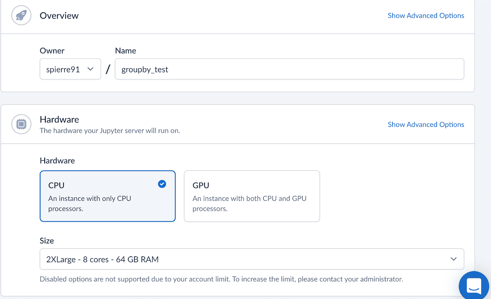

作者截图

单击 create，您应该会看到 Jupyter 服务器的详细信息。单击“启动”启动服务器:

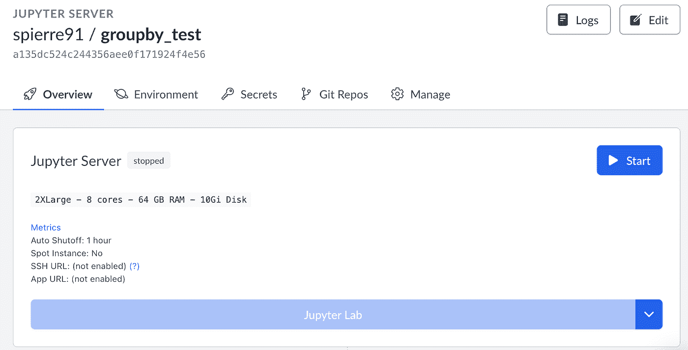

作者截图

您应该看到以下内容:

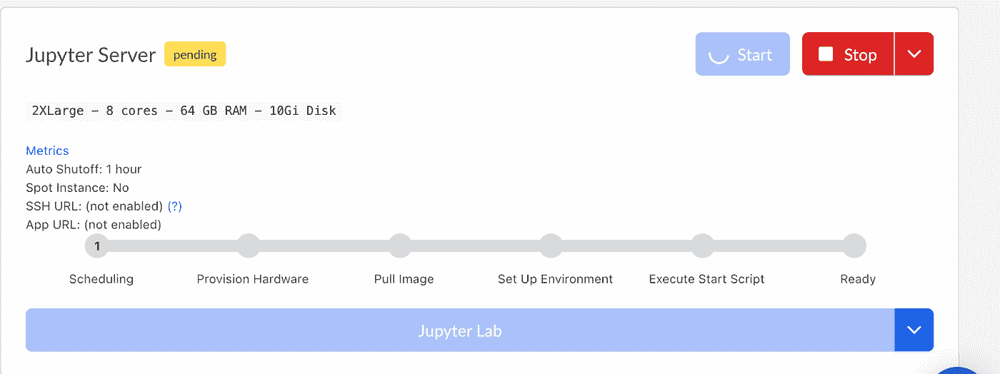

作者截图

服务器启动后，您可以单击 Jupyter Lab 选项卡:

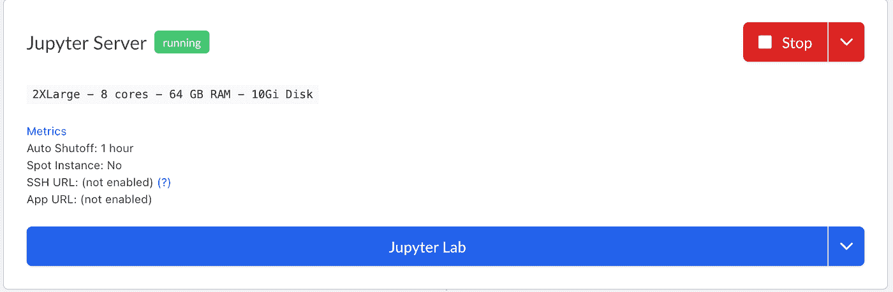

作者截图

从这里，启动土星 Python3 笔记本:

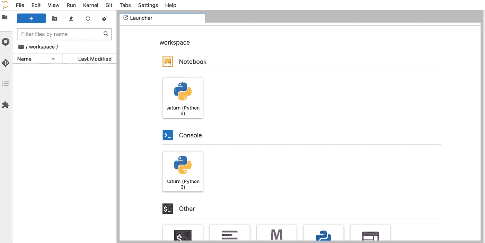

作者截图

你应该看看 Jupyter 实验室的笔记本环境。接下来，单击“文件”选项卡，将笔记本保存为“groupby_tutorial”:

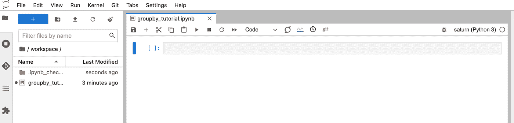

作者截图

Jupiter 实验室环境允许用户轻松地拖放文件。从 [Kaggle](https://www.kaggle.com/datasets/blastchar/telco-customer-churn) 下载 telco_churn.csv 文件后，将文件拖放到左侧:

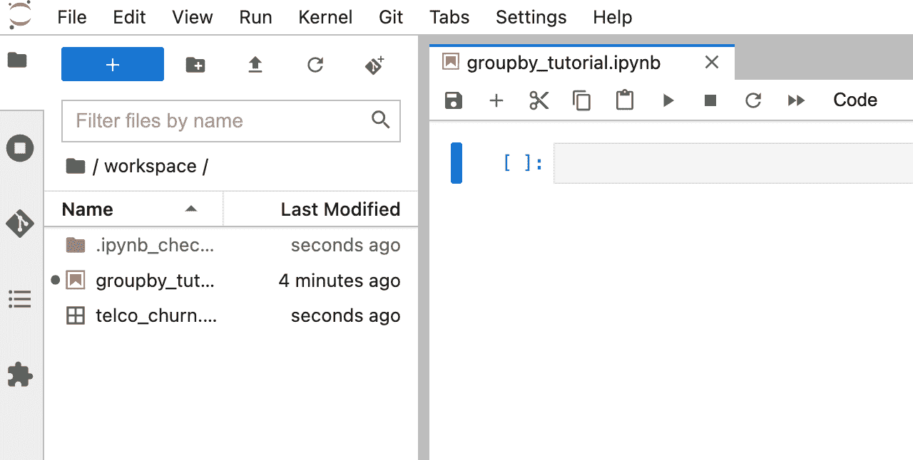

作者截图

我们现在可以开始查看我们的数据了。让我们导入 pandas 库并将数据读入 pandas 数据框架:

进口熊猫作为 pd

```
df = pd.read_csv("telco_churn.csv")
```

让我们显示前五行数据:

```
df.head()
```

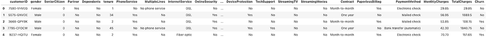

作者图片

**单柱组采用内置熊猫方式**

我们看到数据包含客户信息，如任期，互联网服务的类型，总费用，每月费用，性别，以及客户是否搅拌。groupBy 方法的一个简单应用是计算数据集中的男女人数。为此，我们将使用 pandas value_counts 方法:

```
df['gender'].value_counts()
```

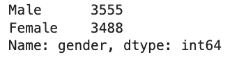

作者图片

现在，如果我们想要查看更复杂的分组，例如分析女性和男性的平均月费用，我们可以使用 pandas groupBy 方法:

```
df['MonthlyCharges'] = df['MonthlyCharges'].astype(float)df.groupby('gender')['MonthlyCharges'].mean()
```

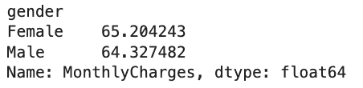

作者图片

我们看到女性平均每月支付 65.2 美元，男性支付 64.3 美元。

使用类似的方法也可以很容易地计算出其他统计数据。例如，女性和男性的月平均费用为:

```
df.groupby('gender')['MonthlyCharges'].median()
```

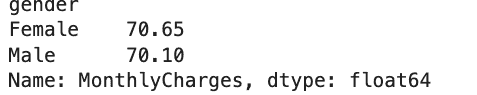

作者图片

同样，最低要求:

```
df.groupby('gender')['MonthlyCharges'].min()
```

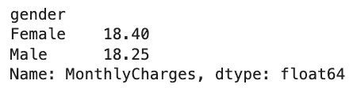

作者图片

最大值:

```
df.groupby('gender')['MonthlyCharges'].max()
```

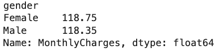

作者图片

我们也可以对其他类别这样做。例如，我们可以看看老年公民和非老年公民的总数。值“0”对应于非老年人，“1”对应老年人:

```
df['SeniorCitizen'].value_counts()
```

我们还可以看看老年人和非老年人的平均月费:

```
df['MonthlyCharges'] = df['MonthlyCharges'].astype(float)df.groupby('SeniorCitizen')['MonthlyCharges'].mean()
```

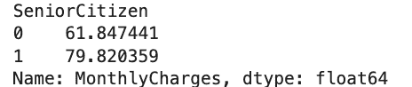

作者图片

我们看到，老年人平均每月支付 79 美元，而非老年人平均每月支付 61 美元。

**使用内置熊猫方法进行多列分组**

我们还可以看看流失的男女人数:

```
df.groupby(['Churn', 'gender'])['Churn'].count()
```

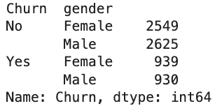

作者图片

我们看到 2549 名女性没有搅动，而 939 名女性搅动了。此外，2625 名男性没有搅动，而 930 名男性搅动。

这种类型的信息可以帮助决策者根据消费者人口统计制定广告和促销计划。例如，如果一家公司知道某个特定群体最有可能取消他们的服务，他们就可以制定战略促销计划，通过交易来锁定这个群体，以防止这些客户流失。

我们还可以看看老年人流失的数量:

```
df.groupby(['Churn', 'SeniorCitizen'])['Churn'].count()
```

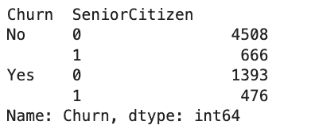

作者图片

除了老年公民身份和流失率，我们还可以按性别分组:

```
df.groupby(['Churn', 'SeniorCitizen', 'gender'])['Churn'].count()
```

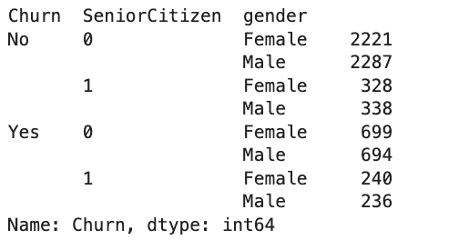

作者图片

这个 groupBy 的输出非常有洞察力，因为我们看到了客户流失是如何在老年人地位和性别之间分解的。我们看到，总的来说，非老年公民比老年公民流动得更频繁。

**使用聚合方法分组:**

通过使用 groupBy 和 lambda 表达式应用方法，数据科学家可以在任何组级别对数据执行复杂的操作。例如，我们可能想计算女性和男性每月费用总和的百分比。首先让我们计算费用的总和:

​​

```
sum_total = sum(df['tenure'] * df['MonthlyCharges'])
```

接下来，让我们按性别分组，并将 lambda 表达式传递给 apply 方法。lambda 表达式将使用列“任期”和“每月费用”来计算男性和女性总费用的百分比:

```
df.groupby(['gender']).apply(lambda df,col1,col2: sum(df[col1] * df[col2])/ sum_total, 'tenure', 'MonthlyCharges')
```

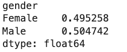

作者图片

我们看到，来自女性的月费用占总费用的 49.5%，50.4%来自男性顾客。我们还可以根据老年公民身份和互联网服务类型进一步细分:

```
sum_total = sum(df['tenure'] * df['MonthlyCharges'])df.groupby(['gender', 'SeniorCitizen', 'InternetService']).apply(lambda df,col1,col2: sum(df[col1] * df[col2])/ sum_total, 'tenure', 'MonthlyCharges')
```

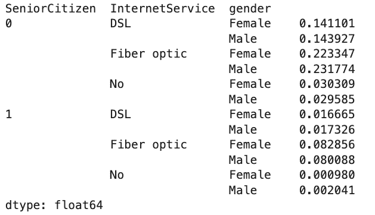

作者图片

从这些结果中我们看到，每月总费用的 45%来自拥有光纤的非老年男女用户。这是一个有用的见解，因为它表明几乎一半的收入来自使用光纤的非老年人。公司可以利用这些信息有策略地锁定这些客户群体，以增加收入。

我们可以对客户流失做类似的事情。让我们来看看按性别划分的流失率:

```
churn_total = df['Churn'].value_counts()df.groupby(['gender']).apply(lambda df,col1 : df[col1].value_counts()/churn_total, 'Churn’)
```

我们还可以按性别来看流失率:

```
churn_total = df['Churn'].value_counts()df.groupby(['gender']).apply(lambda df,col1 : df[col1].value_counts()/churn_total, 'Churn')
```

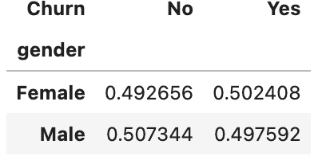

作者图片

我们看到女性占所有搅拌者的 50.2%，而男性占 49.8%。

我们还可以根据互联网服务类型、性别和老年公民身份来查看流失率:

```
df.groupby(['gender', 'SeniorCitizen', 'InternetService']).apply(lambda df,col1 : df[col1].value_counts()/churn_total, 'Churn')
```

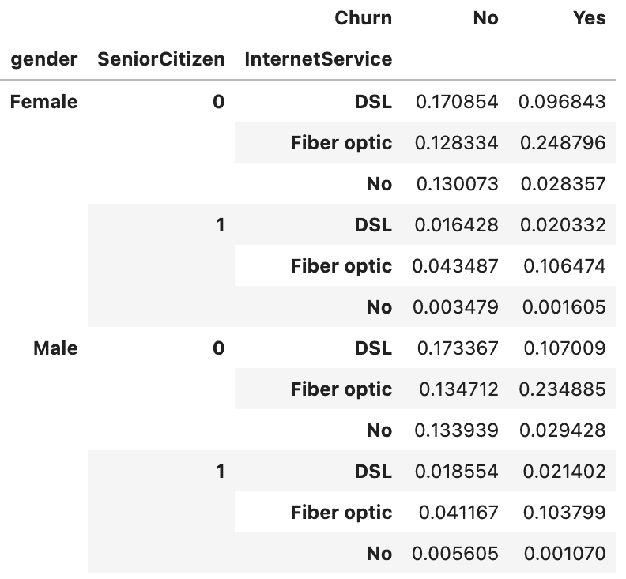

作者图片

这里我们看到使用光纤的女性占所有搅拌器的 24.8%，而使用光纤的男性占所有搅拌器的 23.5%。

**土星云中的资源食谱**

通常，我们希望能够存储关于所使用的资源及其配置细节的信息。Saturn cloud 使用户能够保存资源配方，以便资源配置是可复制的。要下载与我们一直在使用的笔记本对应的资源配置文件，我们首先导航到资源页面并向下滚动到我们的 groupby_test Jupyter 服务器:

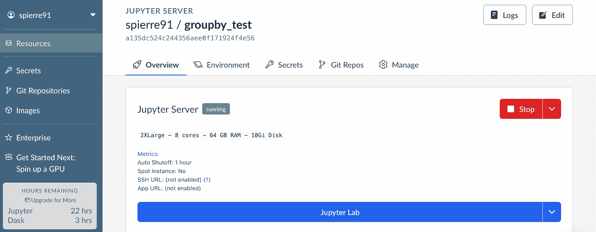

作者截图

然后，我们单击“管理”选项卡:

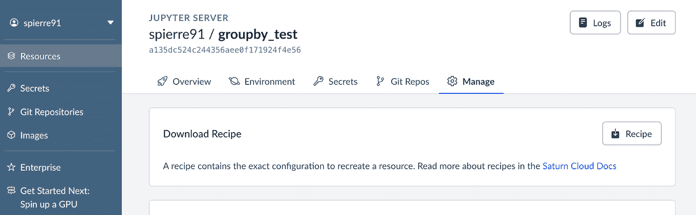

作者截图

我们点击下载食谱。然后，我们应该会收到一个名为 groupby_tesst-Jupyter-recipe 的文件:

```
{"name": "groupby_test","image_uri": "public.ecr.aws/saturncloud/saturn:2022.04.01","description": "","environment_variables": {},"working_directory": "/home/jovyan/workspace","start_script": "","git_repositories": [],"secrets": [],"jupyter_server": {"instance_type": "2xlarge","disk_space": "10Gi","auto_shutoff": "1 hour","start_ssh": false,"use_spot_instance": false},"owner": "spierre91","visibility": "owner","schema_version": "2022.05.01"}
```

要使用我们的配方配置文件重现环境，请导航回参考资料并创建一个新的服务器:


作者截图

单击 recipe 并上传 JSON 配置文件。从那里，您可以使用我们一直在使用的相同配置来命名和创建您的服务器。如果您想要再现使用大量内存的资源密集型脚本的输出，这是一个特别有用的特性。通过能够共享资源配方，数据科学团队可以防止在使用 Saturn 云平台时由于资源不足而导致的再现性问题。

这篇文章中使用的代码可以在 [GitHub](https://github.com/spierre91/saturn_cloud_notebooks/blob/main/groupby_tutorial.ipynb) 上找到。

**结论**

使用 Pandas 的 GroupBy 操作使数据科学家和分析师能够计算类别级别的统计数据。使用 Pandas groupBy 方法生成类别级别、单列和聚合统计信息，可以提供对数据和数据中的组的有用见解。此外，多列分类聚合统计允许对组差异进行更复杂的洞察。Lambda 表达式允许您执行更复杂的组级计算。拥有一种可靠的方法来生成和分析这些统计数据，对于任何数据科学团队来说都是一种无价的技能。

在这里，你可以随意查看土星云[。您可以跨编程语言、ide 和硬件灵活地使用 Jupyter Lab 笔记本和 PyCharm connections 或 RStudio，使用您熟悉的工具和环境。Saturn Cloud 还使用户能够为他们的数据任务选择合适的硬件，如 CPU 和 GPU。此外，Saturn Cloud recipes 功能允许数据科学家、机器学习工程师和数据分析师轻松共享任何数据任务的资源配置细节。](https://saturncloud.io/?utm_source=Sadrach+Medium&utm_medium=Intro+to+Groupby+Methods&utm_campaign=Intro+to+Groupby+Methods)