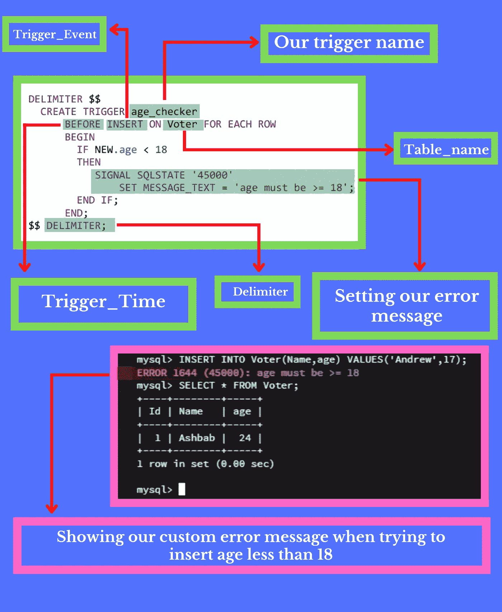
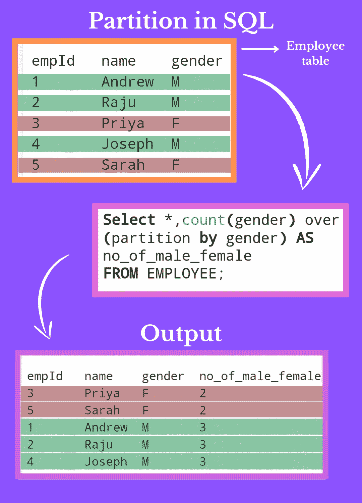
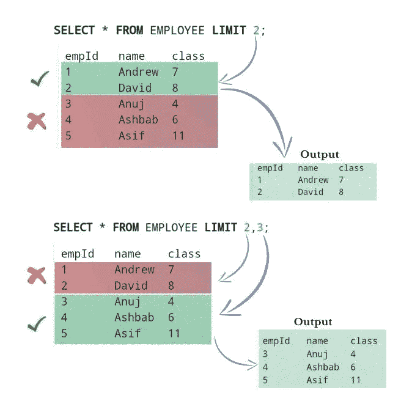
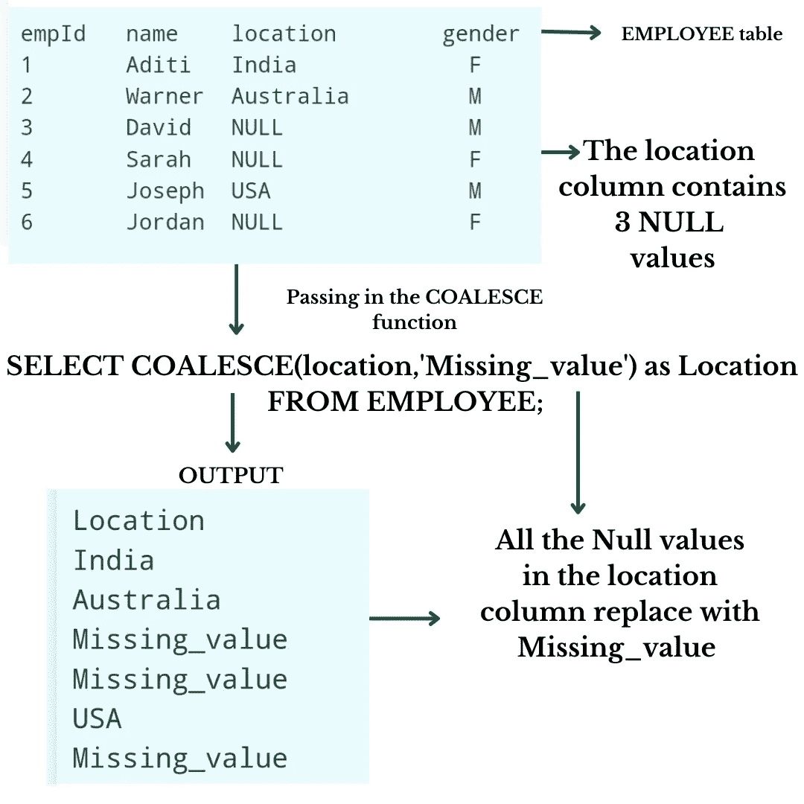

# 数据科学的惊人 SQL 查询

> 原文：<https://pub.towardsai.net/useful-intermediate-sql-queries-for-data-science-408c724b67d0?source=collection_archive---------0----------------------->

## SQL 是开发人员、工程师和数据专业人员的基本语言。SQL 中级知识让您在数据科学职业生涯中占据优势。


由 [Unsplash](https://unsplash.com/s/photos/data-science?utm_source=unsplash&utm_medium=referral&utm_content=creditCopyText) 上的 [Shubham Dhage](https://unsplash.com/@theshubhamdhage?utm_source=unsplash&utm_medium=referral&utm_content=creditCopyText) 拍摄的照片

因此，在这篇文章中，我们将讨论一些数据专业人员的基本中间 SQL 查询。我们将讨论 4 个 SQL 查询，问题是，为什么要学习这 4 个 SQL 查询？

我们都熟悉用 **SQL、**创建数据库，但更重要的是知道如何根据我们的需要有效地清理和过滤数据。这些查询就是这样帮助我们的，所以让我们看看这些查询是什么

1.  **SQL 中的触发器，**以及如何在我们的查询中使用？
2.  **SQL 中的**分区
3.  SQL 中的 **Limit，**以及我们如何使用 **LIMIT** 语法来限制我们在 SQL 表中的查询？
4.  **SQL 中的 COALESCE 函数**，它如何帮助我们摆脱**空值**？

# **1。SQL 中的触发器**



SQL 中的触发器|来源:作者图片

在本帖中，我们将讨论 SQL 中**触发器的威力。**

**什么是 SQL 中的触发器？**

触发器是一个 SQL 代码，在事件执行时自动运行。例如:在下面的查询中，当用户试图在表中插入值时，我们的触发器运行。

触发器主要分为三个部分

**1。触发 _ 时间
2。触发 _ 事件
3。表名**

**1。Trigger_Time:** 触发时间是指您希望该触发器运行的时间，例如，在事件之前或之后。
在我们下面的查询中，我们使用了 before why？因为我们希望代码在插入到表中之前运行。

**2。Trigger_Event:** 触发事件是当我们想要运行这个触发器时，比如**插入**、**更新**、**删除**

在上面的例子中，我们使用 INSERT，因为我们希望在执行 INSERT 事件时运行我们的触发器。

**3。表名:**表名是我们的表的名称

**所以让我们用一个合适的实用解释来详细讨论触发器语法**

在从**开始**到**结束**的这段代码中，每当我们在投票者表中插入一个值时，触发器都会检查年龄，是小于 18 岁还是大于 18 岁。如果它大于或等于 18，什么都不会发生，但如果它小于 18，触发器将显示一个错误，我们设置消息。

例如，见上图，**我们设置 message_text = ' age 必须是> =18 '，**所以每当我们试图**插入小于 18 的值时，这个错误消息显示**。在输出部分，当我们试图插入 17 岁的 Andrew 时，查询显示一个错误，其中包含我们的**定制消息**。这就是 SQL 中的触发器以及如何在查询中使用它们。

**查看以下代码，获得更实际的理解**

```
DELIMITER $$
/* creating a trigger whose name is age_checker */
  CREATE TRIGGER age_checker
     /* defining when our trigger run before inserting or after inserting
        in our case we choose before inserting that's why we use BEFORE */
      BEFORE INSERT ON Voter FOR EACH ROW
      BEGIN 
     /* Now we are checking the inserted value in our age column if it is 
        less then 18 then show our error message */ 
        IF NEW.age < 18
        THEN 
           SIGNAL SQLSTATE '45000'
              /* setting our error message in the MESSAGE_TEXT */
              SET MESSAGE_TEXT = 'AGE MUST BE >= 18';
        END IF;
     END;
DELIMETER;
```

# **2。SQL 中的分区依据**



SQL 中的分区依据|来源:作者图片

这篇文章将讨论**分区**以及如何在 SQL 中使用它。

所以第一个问题是，SQL 中的**分区是什么？**

**分区的工作是对具有相似值的行进行分组，但不对行进行限制。** 为了更清楚起见，我们举个例子。

**请看上面第二张图片。** 表格中有五行，其中有一个名为 gender 的列有三个男性候选人和两个女性候选人，那么如果我们想要一个显示男性和女性数量的新列呢？

partition 语法根据相似的值对行进行分组，这意味着在我们的查询中，我们使用按性别划分。这意味着我们要根据性别对我们的行进行分组，所以在性别列中只有两个唯一的值第一个是 M，第二个是 F，所以它将行分成两组。
1 性别栏中包含 M 的行
2 性别栏中包含 F 的行

，所以这就是 SQL
中 partition 的工作，我们使用 count 函数对组中的几行进行计数。

在输出中，您可以看到构建了新列，其名称为 no_of_male_female，并且该列包含组中的行数。比如 F 组有两行，所以显示 2，M 组有三行，所以显示 3。

有些人可能想知道 SQL 中的 group by 和 partition by 有什么区别，因为两者的工作是相似的。所以答案是，如果你使用一个组，你的五行只转换成两行。为什么？

因为 group by 显示了组的数量，在我们上面的查询中，我们的表分为 M 和 F 两个组，所以 group by 只显示每个组的第一行，这意味着如果组包含 10 行，但它在输出中只显示 1 行，因为它显示每个组的 1 行。

但是如果您在那时使用 partition，您的行数保持不变，因为您看到输出中的行数和表中的行数保持不变。
**SQL 中的分区显示所有行。** 两者都有优点和缺点你可以根据你的要求使用它们。

**如果你需要，检查下面的代码**

```
/* count function used to count number of gender after partition and then 
   show output in no_of_male_female column */

SELECT * , COUNT(gender) OVER (PARTITION BY gender) 
AS no_of_male_female FROM EMPLOYEE;
```

# **3。限额查询**



SQL | Source 中的限制:图片由作者提供

**SQL 中的 LIMIT 及其工作方式，尽管某些 SQL 数据库不支持 LIMIT，如 SQL servers 和 MS access。**

LIMIT 子句在 SQL 数据库中广泛使用，主要用于限制行。
举个例子:如果我们想从数据库中找出前 10 或最差的 10 张专辑，那么限制是有益的。我们在最后一个查询中使用了 LIMIT 10，我们的工作就完成了。

但这里有一个问题，极限是如何工作的，我们如何有效地使用它？

**我们可以在两种类型中使用极限**

**1。LIMIT(任意常数值)** 例如，下面的代码从表中选择前八行
**SELECT * FROM table _ name LIMIT 8；**

**2。LIMIT(x，y)** 这是一种更精确的限制我们的表格的方法。
x 参数用于从顶部删除几行。
y 参数显示消去后所需的行数。
例如:
**Select * FROM table _ name LIMIT 3，2；** 该查询从顶部删除三行，然后显示删除三行后的两行。

检查下面的代码。

```
/* This command is used to select first two rows */

SELECT * FROM EMPLOYEE LIMIT 2;

/* This command is used to select 3 rows after eliminating first two rows */

SELECT * FROM EMPLOYEE LIMIT 2,3; 
```

# **4。合并功能**



SQL | Source 中的联合函数:作者图片

您知道 SQL 中有一些很棒的函数可以节省您的时间吗？
这里我说的是 **COALESCE 函数，**这个函数让你很惊讶，所以请阅读全文。

**COALESCE 函数接受 n 个值。**

```
COALESCE(value_1,value_2,......, value_n)
```

所以让我们明白这一点；请看上面的第四张图。您会看到有一个 EMPLOYEE 表，其中包含一个名为的列，在该列中有 3 个空值。那么，如果我们想用一个有意义的词来代替空值呢？如上图所示，我们希望用 Missing_value 替换所有的空值。

我们可以通过查看上图中的代码来使用 COALESCE 函数。COALESCE 函数用单词 Missing_value 替换所有空值。

让我们一步一步地理解 COALESCE 函数。
**第一步:**我们在 COALESCE 函数中传递的第一个参数是我们要在其中查找空值的列名。这就是我们使用位置的原因。

**第二步**:如果找到一些值，那么什么都不会发生；正如您将在图像中的代码输出中看到的，值保持不变，但如果它发现了空值，那么它只是用我们给定的单词替换该空值，作为联合函数的第二个参数，我们给定 Missing_value 作为第二个参数，这就是为什么它用 Missing_value 替换 location 列中存在的所有空值。

这就是如何在 SQL 中合并函数工作。我们举了一个使用单个列的例子。如果我们想要替换多个列中的空值，我们也做同样的事情；我们也可以按照上面的语法来做。

**查看下面的代码。**

```
/* So we are targeting the location column from our EMPLOYEE table and 
   then replacing the NULL values with Missing_value text */
SELECT COALESCE(location,"Missing_value") as Location
FROM EMPLOYEE;
```

我希望这篇文章能简要解释如何在 SQL 中使用这些基本查询，以及使用它有什么好处。如果你有任何问题，欢迎在评论区提问。

订阅我的时事通讯

在 [Linkedin](https://www.linkedin.com/in/ashbabkhan) 上与我联系

在那之前，祝你编码愉快。