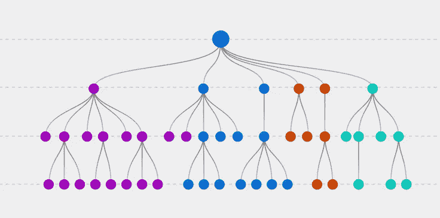

# 使用 Python 的 If-Else 控制语句的实用技巧

> 原文：<https://pub.towardsai.net/useful-tips-of-if-else-control-statement-using-python-a9d652a74e4?source=collection_archive---------1----------------------->

## [编程](https://towardsai.net/p/category/programming)

## 通过示例对控制回路有基本的了解



图片[来源](https://www.explorium.ai/blog/the-complete-guide-to-decision-trees/)

IF 语句根据真或假的条件做出简单的决定。该语句维护语句的控制流。这种说法的概念很简单；如果条件满足，它就执行正确的语句，否则程序就停止。下图代表了这个概念。

**语法:**

```
if condition:
    statements
```

**程序:**(简单)

```
Age = 25if Age >= 18:
    print(“Eligible to vote”)**Output:** Eligible to vote
```

**解释:**在上面的程序中，我们已经将‘年龄’的值定义为 25。条件是如果“年龄”值大于或等于 18，它将打印该语句。如果条件不满足，程序将不显示任何输出。

> ***IF-ELSE 语句***

IF-ELSE 语句也可以根据真或假的条件做出简单的决定。这种说法的概念很简单；如果条件得到满足，它执行 true 语句，如果没有满足，程序打印' else '语句。下图代表了这个概念。

**语法:**

```
if condition:
    body of ifelse:
    body of else
```

**程序:**(简单)

```
Age = 15if Age >= 18:
    print(“Eligible to vote”)else:
    print(“Not eligible to vote”)
```

**说明:**在上面的程序中，我们已经将‘年龄’的值定义为 34。条件是如果“年龄”值大于或等于 18，它将打印第一条语句。因为“年龄”是 15，所以不满足条件。因此，打印第二条语句。

[](/python-zero-to-hero-with-examples-c7a5dedb968b) [## Python:从零到英雄(带示例)

### python 初学者手册指南

pub.towardsai.net](/python-zero-to-hero-with-examples-c7a5dedb968b) [](/latest-programming-languages-for-ai-5252d39e1c51) [## 最新的人工智能编程语言

### 人工智能未来娱乐它的语言

pub.towardsai.net](/latest-programming-languages-for-ai-5252d39e1c51) 

> ***IF-ELIF-ELSE 语句***

IF-ELIF-ELSE 语句也可以根据真或假的条件做出简单的决定。这种说法的概念很简单；如果条件得到满足，它执行语句，如果没有，程序检查第二个条件。如果第二个条件也不成立，则打印“else”语句。

**语法:**

```
if condition:
    body of ifelif:
    body if elifelse:
    body of else
```

**程序:**(简单)

```
num = 15if num > 0:
    print(“The number is positive”)elif num == 0:
    print(“The number is zero”)else:
    print(“The number is negative”)**Output:** The number is positive
```

**说明:**在上面的程序中，我们已经将‘num’的值定义为 15。条件是如果“num”值大于 0，它将打印与条件对应的语句。否则，它将移动到第二个条件；检查“num”是否等于 0，并打印相应的语句。如果两个条件都不满足，则打印最后一条语句。这里，num 是 15(大于 0)。因此，第一条语句显示为输出。

> ***嵌套若***

嵌套 If 有助于根据输入做出复杂的决策。这是 IF-ELSE 语句的高级概念。执行的逻辑很简单；如果条件为假，则执行语句 3。如果第一个条件为真，它继续执行第二个测试。如果第二个条件为真，则显示“语句 1”。否则，语句 2 将显示为输出。

**语法:**

```
if condition:
    if condition:
        statement1
    else:
        statements2
else:
    statements3
```

**程序:**(简单)

```
a = 3
b = 4
c = 5if a>b:
    if a>c:
        print(a, “is the greatest of all”)
    else:
        print(c, is the greatest of all”)
else:
    if b>c:
        print(b, “is the greatest of all”)
    else:
        print(c, “is the greatest of all”)**Output:** 5 is the greatest of all
```

**说明:**上面的程序是为了检查下面哪个数最大。第一个条件检查“a”的值是否大于“b”。既然是假的，就去‘else’条件，检查条件；由于条件再次为假，它打印 else 语句的主体。

**让我们看看如何使用数据结构执行 if-else 语句的不同方法:**

**1。** **if-else 语句使用列表**

**程序:**

```
thing = [“cap”,”bag”,”top”]for a in thing:
    if a==”top”:
        print(“It is present”)
    else:
        print(“It is not present”)**Output:** It is not present
It is not present
It is present
```

**解释:**这里，程序声明检查单词“top”是否出现在列表中。如果满足条件，则打印 true 语句。否则，错误语句将显示为输出。

**2。** **if-else 语句使用字典**

**程序:**

```
item = 0
p = {1: “cp”, 2: “rt”, 3: “re”}for item in p:
    if item % 2 == 0:
        print(p[item])
    else:
        print(“false”)**Output:** false
rt
false
```

**说明:**此处，程序声明仅在键为偶数时打印项目。因此，字典中只有一个键值对满足条件。

> ***结论***

嘿读者们！！，我们已经介绍了“if-else”控制语句的大部分基础知识。我们还讨论了如何使用所有控制流语句来使用数据结构。我鼓励你通过自己执行程序来探索这个主题，并希望你在阅读本文时感到愉快。

我希望你喜欢这篇文章。通过我的 [LinkedIn](https://www.linkedin.com/in/data-scientist-95040a1ab/) 和 [twitter](https://twitter.com/amitprius) 联系我。

# 推荐文章

[1。NLP —零到英雄与 Python](https://medium.com/towards-artificial-intelligence/nlp-zero-to-hero-with-python-2df6fcebff6e?sk=2231d868766e96b13d1e9d7db6064df1)
2。 [Python 数据结构数据类型和对象](https://medium.com/towards-artificial-intelligence/python-data-structures-data-types-and-objects-244d0a86c3cf?sk=42f4b462499f3fc3a160b21e2c94dba6)3 .[Python 中的异常处理概念](/exception-handling-concepts-in-python-4d5116decac3?source=friends_link&sk=a0ed49d9fdeaa67925eac34ecb55ea30)
4。[为什么 LSTM 在深度学习方面比 RNN 更有用？](/deep-learning-88e218b74a14?source=friends_link&sk=540bf9088d31859d50dbddab7524ba35)
5。[神经网络:递归神经网络的兴起](/neural-networks-the-rise-of-recurrent-neural-networks-df740252da88?source=friends_link&sk=6844935e3de14e478ce00f0b22e419eb)
6。[用 Python](https://medium.com/towards-artificial-intelligence/fully-explained-linear-regression-with-python-fe2b313f32f3?source=friends_link&sk=53c91a2a51347ec2d93f8222c0e06402)
7 全面讲解了线性回归。[用 Python](https://medium.com/towards-artificial-intelligence/fully-explained-logistic-regression-with-python-f4a16413ddcd?source=friends_link&sk=528181f15a44e48ea38fdd9579241a78)
充分解释了 Logistic 回归 8。[concat()、merge()和 join()与 Python](/differences-between-concat-merge-and-join-with-python-1a6541abc08d?source=friends_link&sk=3b37b694fb90db16275059ea752fc16a)
的区别 9。[与 Python 的数据角力—第一部分](/data-wrangling-with-python-part-1-969e3cc81d69?source=friends_link&sk=9c3649cf20f31a5c9ead51c50c89ba0b)
10。[机器学习中的混淆矩阵](https://medium.com/analytics-vidhya/confusion-matrix-in-machine-learning-91b6e2b3f9af?source=friends_link&sk=11c6531da0bab7b504d518d02746d4cc)