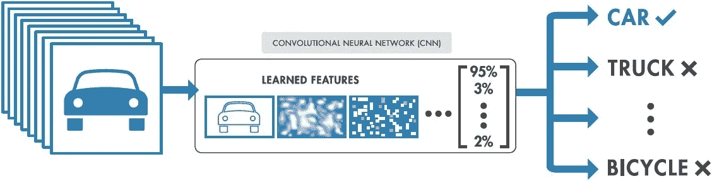
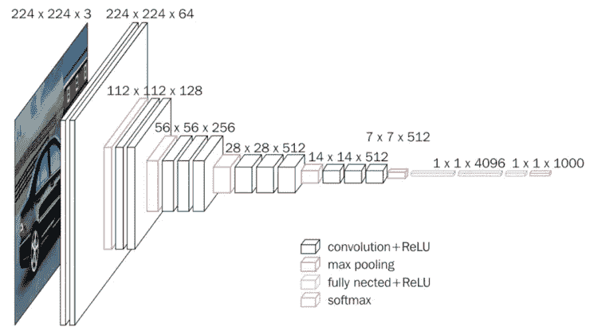

# 使用 CNN 对年龄组进行分类

> 原文：<https://pub.towardsai.net/using-a-cnn-to-classify-age-groups-3f2a3c4f4583?source=collection_archive---------0----------------------->

## 潜入我的第一个卷积神经网络| [走向 AI](https://towardsai.net)

最近了解了卷积神经网络，我想建立自己的网络。最初，我希望能够仅从一张人脸照片中获取一个人的年龄。然而，这也带来了自身的挑战，如班级失衡和必要的培训时间令人望而生畏。所以我决定通过将人们分成不同的年龄组来简化这个问题。

任何机器学习项目的最大挑战是获得标记数据。幸运的是，苏黎世联邦理工学院的计算机视觉实验室最近做了一个类似的项目。他们通过从 IMDB 和维基百科抓取图片创建了一个数据集。这些图像也被裁剪成只显示人脸！该数据集包括演员的照片和照片的拍摄时间，从而可以推断出照片拍摄时的年龄。原始数据集总共包含 524，230 幅图像。经过一些探索性的数据分析和清理，我决定使用 85，565 张图像来减少项目的计算量，并在类平衡方面满足我的需要。我的目标是将图片分成 13 个可能的年龄组，从 10 岁到 80 岁，以 5 为增量。

## 构建网络|迁移学习

对于 CNN，通过使用 VGG-16 的卷积基来使用迁移学习。迁移学习是指在一个新的网络中利用以前训练过的网络的权重。VGG-16 是一个著名的 CNN，它是在 ImageNet 上训练的，ImageNet 是属于 1000 个类别的超过 1400 万个图像的数据集。模型本身在这些图像上达到了 92.5%的准确率。它最初将图像分为 1000 个不同的类别，但在这种情况下，顶层被改变，以便它可以将人脸图像分为 13 个类别或年龄组。这就是为什么迁移学习是如此有益，因为你不必重新培训你的网络，这可能是耗时和困难的，取决于你可用的资源。除了重新培训，你可以通过在一个强大的网络上进行培训来建立你的人际网络。完整的 VGG-16 架构可以在下图中看到。

VGG-16 网络架构

我的模型使用与 VGG-16 相同的卷积基，但有不同的全连接层和 softmax 层，将图像分为 13 个年龄组。只有这些层被训练，而前面的层没有被训练。相反，这些层使用 VGG-16 在 Image-Net 上训练时的权重。

## 结果

该模型在 59，110 幅图像上进行训练，剩余的图像用于测试和验证。由于时间限制，该模型的训练准确率高达 64%。然而，测试和验证的准确率从未超过 17%。我还创建了一个函数来返回一个人最有可能属于的三个年龄组。这个功能，CNN，数据清洗，探索性的数据分析都可以在我的 GitHub 上看到。

 [## ar 3441/age classificationfrom face

### 这个项目的目标是能够分类的年龄范围，通过使用一个卷积神经网络训练…

github.com](https://github.com/AR3441/AgeClassificationFromFace) 

## 资源

对于那些有兴趣看 CNN 将人脸按年龄而不仅仅是年龄组分类的人，我建议看下面苏黎世联邦理工学院计算机视觉实验室的[论文](https://data.vision.ee.ethz.ch/cvl/rrothe/imdb-wiki/)。