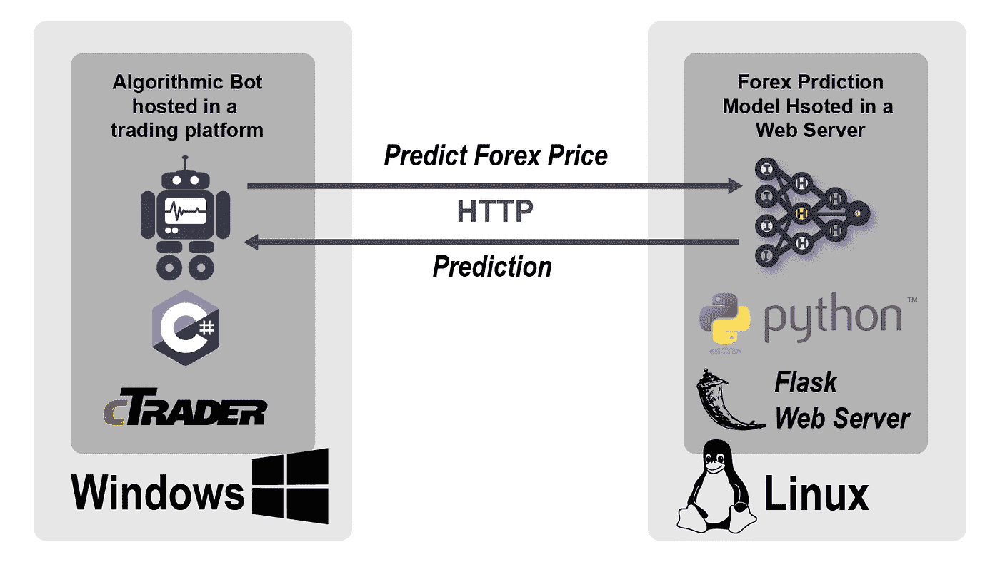
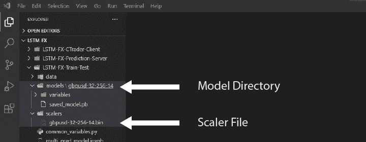
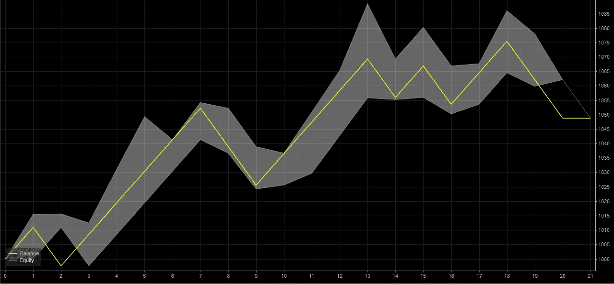

# 使用 TensorFlow 深度学习模型进行外汇交易

> 原文：<https://pub.towardsai.net/using-a-tensorflow-deep-learning-model-for-forex-trading-ec4eff2ebe60?source=collection_archive---------0----------------------->

## [深度学习](https://towardsai.net/p/category/machine-learning/deep-learning)

## 在商业平台上建立一个算法机器人，根据模型的预测进行交易



我之前创建了一个预测外汇市场的模型:

[](https://medium.com/towards-artificial-intelligence/pragmatic-deep-learning-model-for-forex-forecasting-569aae6d4a1a) [## 外汇预测的实用深度学习模型

### 使用 LSTM 和张量流对 GBPUSD 时间序列进行多步预测

medium.com](https://medium.com/towards-artificial-intelligence/pragmatic-deep-learning-model-for-forex-forecasting-569aae6d4a1a) 

现在我们想在商业交易平台下使用这种模式进行交易，看看它是否会产生利润。

这个故事中使用的技术集中在我上一个故事中的模型上，但是它们可以被调整以适合另一个模型。这里的目的是使模型可以被其他系统使用，例如交易平台。

你可以在“LSTM-外汇-CTrader-Client”和“LSTM-外汇-预测-服务器”目录下找到这个故事的源代码:

[](https://github.com/AdamTibi/LSTM-FX) [## 阿达姆蒂比/LSTM-外汇

### 这是外汇预测实用深度学习模型的配套代码。所以，如果你想了解…

github.com](https://github.com/AdamTibi/LSTM-FX) 

# 概述

在[之前的故事](https://medium.com/towards-artificial-intelligence/pragmatic-deep-learning-model-for-forex-forecasting-569aae6d4a1a)中，我们已经训练并测试了一个模型，并将结果模型保存为一个目录，并将用于数据的缩放器保存为一个文件。



在 Visual Studio 代码中显示模型和 scaler 文件的目录

除了理解输入和输出参数之外，模型和缩放器是我们唯一需要的项目。

# 贸易

这个故事中的交易指的是算法交易，也叫量化交易。算法交易是指用代码表示的交易策略，评估交易是否有利可图，并在最少人工干预的情况下自动执行交易。

自动交易策略被称为交易机器人。今天，有大量的商业算法交易平台，你可以托管自己的机器人，这里有两个例子:

[**cTrader**](https://ctrader.com/) :手动和 algo 交易平台。它接受用 C#编写的机器人。

[**Meta Trader 4**](https://www.metatrader4.com/en) :外汇手工和 algo 交易的热门平台。机器人可以使用类似于 C 的专有语言编写，称为 MetaQuotes Language 4 (MQL4)。

在这个故事中，我将使用 cTrader 来托管我们的机器人。

# 体系结构

当我们想要展示一个软件系统 A 以供另一个软件系统 B 使用时，我们使用术语“我们正在展示来自 A 的应用程序编程接口(API)”。我们称消费者(在我们的例子中是交易平台)为**客户端**，称生产者(在我们的例子中是打包模型)为**服务器**。

技术对话:我们想创建一个预测服务器，并公开一个 API，允许第三方交易客户使用它。

让绝大多数交易平台都能使用我们的模型的最好方法是使用 REST 协议，并将我们的模型包装在 RESTful API 中。用不太专业的术语来说，这就是让我们的模型可以通过一个 URL 来访问，您可以传递一个包含输入的 URL，并获得包含输出的“文本”。

RESTful APIs 使用 HTTP 通过网络在系统之间进行通信，这意味着如果我们的模型是 Python 语言，托管在 Linux 上，并且需要从一个用 C#编写并托管在 Windows 上的系统中使用，那么只要这两种语言可以使用 HTTP 协议，并且任何不太好的编程语言都支持 HTTP，这是可能的。


图片由作者提供，所有产品名称、徽标和品牌均为其各自所有者的财产

## 计算机网络服务器

为了通过 RESTful API 公开我们的模型，我们需要用一个 web 服务器来托管(包装)它。因为我们使用 Python 作为模型，所以 Python 的一个流行的非生产 web 服务器是 [Flask](https://palletsprojects.com/p/flask/) 。

您可以使用 Windows 或 Linux，Flask 在两者上都可以工作，但是我建议使用用于培训的相同操作系统，但不一定是相同的实例。从控制台设置烧瓶:

```
conda install flask
or
pip install flask
```

设置系统的完整源代码在我的 [GitHub 页面上，用于设置服务器](https://github.com/AdamTibi/LSTM-FX/tree/main/LSTM-FX-Prediction-Server)。

源代码中有趣的部分如下:

```
@app.route('/predict/<string:ticker>/<int:batch_size>/<int:window_size>/<int:ma_periods>/<float:abs_pips>/<int:pred_size>/<string:instance>/<string:series>', methods=['GET'])def predict(ticker, batch_size, window_size, ma_periods, abs_pips, pred_size, instance, series):
```

这允许 Flask 接受如下 URL:

```
http://localhost:5000/predict/gbpusd/32/256/14/0.0008/4/20200824000100/1.30936,1.309315,1.30932,...,1.30912
```

服务器可能托管多个模型，所以为了区分它们，我通过 ticker、batch size、window_size 和移动平均周期来标识它们，因此一个模型可能被称为:GBP USD-32-256–14。

**代号**:乐器的正式名称，我们这里是 GBPUSD。
**batch_size 和 window_size** :模型需要的参数。
**ma_periods** :简单移动平均平滑周期。
**abs_pips** :你的预测停止，预测结果返回的极限。因此，如果它是 0.0008，而你当前的 GBPUSD 价格是 1.3000，那么如果它达到 1.3008 或 1.2992，模型将停止预测。
**prediction_size** :在达到 abs_pips 之前，您希望预测的最大前进单位数。以前面的例子为例，如果你的 prediction_size 是 30 个单位(在我们的例子中是分钟)，你在 5 个单位后达到 1.2992，预测将不会继续，并将返回“卖出”，但如果达到 30 个单位而没有达到限制，系统将返回“无操作”。
**实例**:保留的整数，以备后用。现在，提供任意整数。

URL 的最后一部分 series 由逗号分隔的价格组成:

```
length = window_size + moving_average_periods = 256 + 14 = 270
```

您的 web 服务器可以从控制台运行:

```
python ./LSTM-FX-Prediction-Server/main.py
```

要测试您的服务器设置是否正常工作，请尝试源代码中的示例 URL。

## 客户

我们有一个预测服务器。要使用这个预测服务器，客户端需要提供一个以前格式的 URL，然后获得一个预测。

我用的是商业手册和 algo 交易平台 cTrader 作为客户端。完整的源代码和设置系统在我的 [GitHub 页面上，用于设置客户端](https://github.com/AdamTibi/LSTM-FX/tree/main/LSTM-FX-CTrader-Client)。机器人使用的语言是 C#。

这是我们的代码向服务器请求预测的地方:

上面的代码准备了一个由我们的服务器需要的输入组成的 URL。然后，它将它传递给服务器，并返回一个“1”、“1”和“0”，分别表示购买、出售和我不知道。

上面的代码在每一次单元传递中都被执行，因此得名 *OnBar* 。在我们的例子中，它使用 1 分钟作为一个单位。

# 结果

我在 2020 年 8 月 24 日和 2020 年 8 月 30 日之间用 1000 英镑的资金运行了这个机器人，上面安装了客户端服务器，它赚了 49 英镑的小利润。



2020 年 8 月 24 日至 2020 年 8 月 30 日之间的回溯测试。捕捉自 [cTrader](https://ctrader.com/)

然而，我尝试了其他时期的回溯测试，它每周增加或减少几磅。我称之为有希望的结果，我相信他们可以通过增强模型来改进，但我不会在实际生产中使用这种 ml 模型。

# 放弃

这些故事旨在研究深度学习的能力，而不是提供任何金融或交易建议。请勿将此研究和/或代码用于真实货币。

# 扩展和限制

## REST vs gRPC

REST 是交易平台和一般现代系统的最大公分母。然而，它不是最快的。gRPC 是一种更快、更受欢迎的 API 类型，明确地说，这种意义上的更快意味着几分之一秒。

Meta Trader 4 不支持 gRPC，无黑客攻击。cTrader 正在使用。NET 4.0 classical，它比 gRPC 早得多，所以很难在这个版本的. NET 上使用这个协议。

然而，如果几分之一秒很重要，考虑 gRPC(或者更快的协议)。

## JSON

JSON 是一种经常和 REST 一起使用的数据结构。我没有故意使用 JSON 来符合绝大多数客户的要求。

我能够以简单的方式表示我的输入和输出，但是一旦您的模型输入和输出变得更加复杂，您可能会想要考虑 JSON。

## 多线程操作

将模型托管在网络服务器中使得同时请求多个预测变得容易，例如在 0.2 秒的间隔内。这可能是同一客户端请求多个预测，也可能是多个客户端同时请求多个预测。

如果您的模型不支持多线程(我们说它不是线程安全的)，这可能会导致运行时错误。最安全的方法是一次访问您的模型一次，这意味着当它不忙于预测时，但如果您需要它在随机时间进行预测，您可能需要编写额外的代码来使您的模型线程安全。我没有测试这个线程的安全性。

## 加密预测

如果您远程托管您的服务器，您可能会考虑将您的 web 服务器设置为 HTTPS，也就是安装一个 SSL 证书，如果您想在客户端和服务器之间建立一个安全的连接。这将意味着，如果有人能够截获客户端和服务器之间的通信，他们将无法破译被预测的内容。

## 授权和认证

如果您远程托管您的服务器，公众可以访问它。虽然，很难知道它有用的预期参数是什么。你不想让它碰运气，通过 RESTful API 安全协议来保护它。

有多种安全协议，最流行的是 OAuth2。讨论这些协议超出了本文的范围。

## 托管您的模型

有一些专业的方法来托管你的模型:云。你可以租用一个云服务器虚拟机，或者使用一个 ML 托管平台，比如 [Azure ML](https://azure.microsoft.com/en-gb/services/machine-learning/) ，选择一个无服务器的选项。

服务器选项较便宜，但您必须自己管理操作系统，并花时间处理具体细节，而无服务器选项较贵，但需要的维护开销较少。

# 结论

我希望这阐明了端到端过程的概念，并使用一个用 Python 构建的 ML 系统，该系统来自另一个用另一种编程语言构建的系统，并且不一定位于同一个网络上。

虽然模型表现平平，但它还没有优化，而且有很大的空间可以考虑选择来增强它的预测，我在以前的文章中分享了一些。

我的意图是分享一个有用的、可扩展的 ML 预测框架。我希望这个框架对读者有用。

# 关于我

我有 20 年的软件工程和金融专业背景。我在伦敦金融城担任软件架构师，我最喜欢的语言是 C#和 Python。我和实用数学有恋爱关系，和机器学习有暧昧关系。