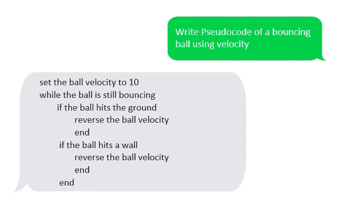
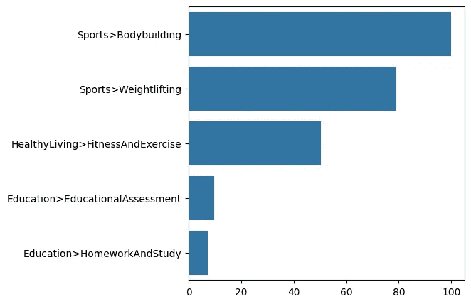
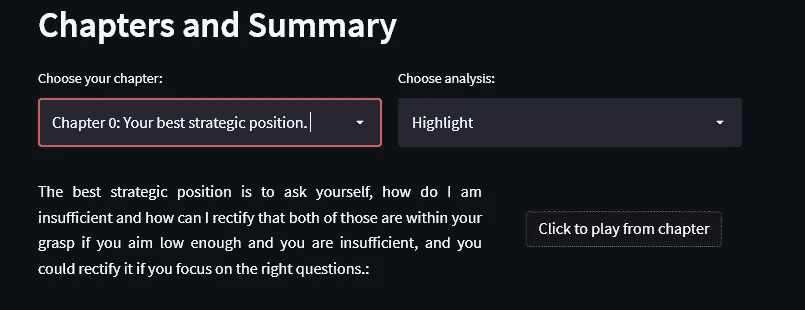
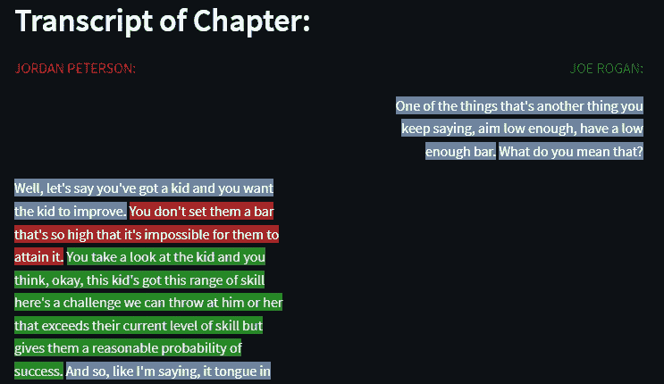
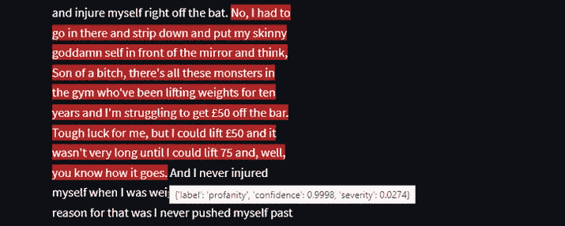

# 利用人工智能分析语音

> 原文：<https://pub.towardsai.net/using-ai-to-analyze-speech-3a3bbf6248ac?source=collection_archive---------3----------------------->

## 应用自然语言处理技术分析播客并制作网络应用

改编自[莎拉·普鲁格](https://burst.shopify.com/@sarahpflugphoto) [爆裂](https://burst.shopify.com/)和[卢卡斯·布拉塞克](https://unsplash.com/@goumbik?utm_source=medium&utm_medium=referral)上 [Unsplash](https://unsplash.com?utm_source=medium&utm_medium=referral)

在过去的几年里，自然语言处理模型变得越来越强大。在本文中，我使用 NLP 分析了一个复杂的语音，并制作了这个小小的 web 应用程序！

# NLP 模型有多好？

自然语言处理(NLP)模型变得非常强大。为了展示它们有多好，我先来谈谈 GPT 3 号。

如果你对 NLP 感兴趣，你可能听说过 GPT-3。这是 OpenAI 最新的预训练生成变压器。它是迄今为止最复杂的语言模型之一。该模型是预先训练的，这意味着它不需要重新训练来执行特定领域的任务。事实上，它是如此之好，以至于很多时候很难相信在所有的回复中没有人打字。

这个模型有 1750 亿个参数，非常庞大。客观地说，人脑大约有 850 亿个神经元。该模型是用从互联网和书籍中搜集的大量数据训练的。由于该模型的规模、复杂性和用于训练的数据量，该模型已经变得非常擅长概括，并且可以在许多不同的任务中表现得非常好。

你可以用[这个链接](https://gpt3demo.com/apps/openai-gpt-3-playground)到他们的露天游乐场来试验 GPT 3 号。这是我在使用操场时与它的一点互动:

与 GPT 三号游乐场互动(图片由作者提供)

正如你所看到的，这个模型对这个随机任务的反应非常好。如果你在你的谷歌主页、Siri 或 Alexa 上尝试这种方法，到今天为止，反应还远远不够好。

这里还有一个:

来自 GPT 三号游乐场的伪代码(图片由作者提供)

伪代码怎么看？对于一个还能想出押韵口号的模特来说，还不错吧？

我展示的这两种相互作用是完全不同的。这两个例子中的明显差异显示了这项技术的适应性及其惊人的概括能力。

# 示例用例:Web-App

为了展示新模型在自然语言处理领域的潜力，我制作了一个小小的网络应用程序，让你可以从 Youtube 上的播客中探索对 T2 这个短片的分析。我选择这个片段是因为它相当复杂，演讲的意义相当深刻。我试图通过举一个非常复杂的语音例子来将模型推向极限。

web 应用程序的功能:

*   预测视频的主题
*   将演讲分成几个章节，并为它们创建摘要
*   分析视频的文字记录，找出情绪、亮点和警告

## 但是我们如何利用 NLP 模型来制作这个工具呢？

人们可以使用 GPT-3 来分析视频，但你首先必须转录它(将数据格式从音频改为文本)。抄写完之后，你必须把课文传给 GPT-3。以正确的格式获取您想要的准确信息是一个巨大的挑战。由于 GPT-3 的性质，每次查询时提供的答案不会是相同的格式，因此很难使用 GPT-3 来制作像我为本文制作的这样的工具。

为了对音频文件进行转录和分析，我使用了 [AssemblyAI](https://www.assemblyai.com/) ，它每次都会返回一个结构化的输出，使其与我想要制作的工具兼容。

我首先下载了 mp3 格式的视频，然后使用他们的 Python API 传递 mp3。分析文件的选项相当完整，有一系列的方法可以分析音频文件。对于我的分析，我使用了:

*   自动章节(将转录拆分成章节并对其进行总结)
*   自动突出显示(突出显示重要的单词)
*   内容安全(获取带有安全警告的句子)
*   情感分析(获得每个句子的情感)
*   实体检测(获取每个单词上的说话者标签)

一旦使用 API 请求分析，分析的结果就会以. json 格式返回。我可以用 Python 把这些结果传到熊猫数据框里。在那里，我使用 [Streamlit](https://streamlit.io/) 制作了应用程序，并将其部署在 [Google Cloud](https://cloud.google.com/) 中。

# 该工具的性能

Joe Rogan——Jordan Peterson 的自我提升哲学

这是我通过工具转录分析的视频。这是视频的摘要:

> “与其设定一个不可能的目标而失败，不如把目标定得低一些，然后逐步提高。这是通过锻炼达到的。当你开始健身的时候，你不会设定一个太高的目标，以至于伤害你自己。你从小处着手，逐渐增加你能做的事情。这也适用于改善你的生活。你从实际上可以实现的小步骤开始。这些小步骤随着时间的推移而复合，最终导致显著的改善。”

摘要是由 NLP 模型编写的，但是如果我告诉你是我写的，你可能会相信我。要清楚的是，这个视频非常复杂，我在这里将 AssemblyAI 的模型发挥到了极限，但正如你很快会看到的那样，它仍然表现得令人惊讶。

## 视频的转录

转录效果非常好。API 可以正确地识别音频文件中的每个单词，即使说话的人互相交谈。转录还会返回说话者在每个单词中所说的内容，这是一个非常有用的功能。

## 视频类别

使用 AssemblyAI 的视频类别(图片由作者提供)

视频讲的是自我提升，工具却把工具归类为健美或者举重。演讲围绕举重展开，把它比作自我提高。从字面上来看，他确实在谈论举重，但实际上，他是在谈论采取小步骤来提高。

## 自动章节

自动章节功能(图片由作者提供)

自动章节功能令人印象深刻。第一章名为“你的最佳战略位置”，第二章名为“目标要足够低”，第三章名为“当你去健身房的时候”。我同意将视频分成三章，我也同意这三章的名字。也许最后一章更好的名字应该是“马修原理”。

章节总结也很好，但还是没有抓住举重和小步前进之间的类比，而是展示了他所说的字面意思。

自动章节功能还返回每章的时间戳。我在应用程序上的章节摘要旁边添加了一个按钮，当点击该按钮时，web 应用程序会从该章的开头播放视频。

## 转录分析

第二章的情感分析，罗根文本在右边，彼得森在左边。(图片由作者提供)

工具的最后部分显示了每个演讲者每章的文字记录。它显示了亮点、情绪和安全警告。看一下上面的情绪分析。文字的颜色表示情绪。蓝色表示中性，红色表示消极，绿色表示积极情绪。

你可以看到采访者相当中立，而客人说话更情绪化。在上图中，游客以消极情绪开始，然后与积极情绪进行对比，构建自己的回应。

工具发出的安全警告(图片由作者提供)

API 擅长检测转录的安全问题。在 web 应用程序中，如果你将鼠标悬停在文本上，你可以看到为什么会发出警告，以及发出警告的理由是什么。在上面的图像中，高亮显示的文本标有亵渎的警告，置信度为 99.9%。

所以如你所见，虽然不完美，但分析很有见地。这个小小的网络应用程序获取一段非常复杂的演讲，将其转录，并完成对所讨论主题的分析。它总结了主题，组织了信息，并最终分析了发言者在情绪和安全问题方面所说的话。

# 结论

在这篇文章中，我解释了如何应用人工智能来分析语音。我做了这个网络应用程序，你可以自己试试。它分解播客中的一个片段，将其分解为章节，总结章节，甚至提供演讲的情感分析。NLP 模型变得越来越强大，可以在非常复杂的任务中表现良好，并且可以像本文中所示的那样轻松地利用它们。

## 支持我👏

希望这对你有所帮助，如果你喜欢，你可以跟我来 [**！**](https://medium.com/@diegounzuetaruedas)

您也可以成为 [**中级会员**](https://diegounzuetaruedas.medium.com/membership) 使用我的推荐链接，访问我的所有文章和更多:[https://diegounzuetaruedas.medium.com/membership](https://diegounzuetaruedas.medium.com/membership)

## 你可能喜欢的其他文章

[信息论应用于 Wordle](https://towardsdatascience.com/information-theory-applied-to-wordle-b63b34a6538e)

[利用人工智能检测欺诈](https://medium.com/p/d1d5bad79e72)