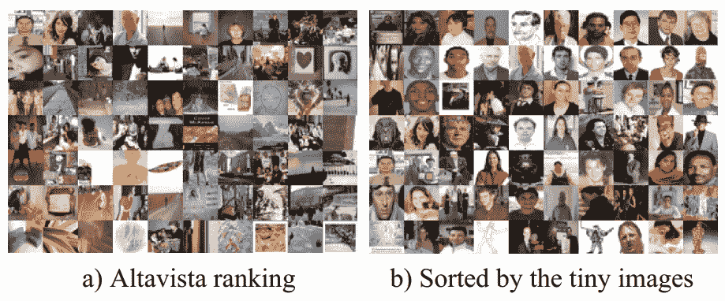
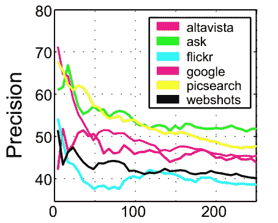
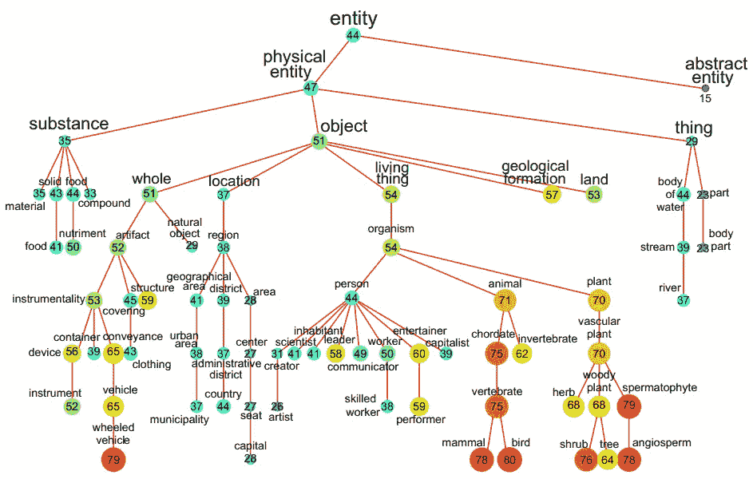
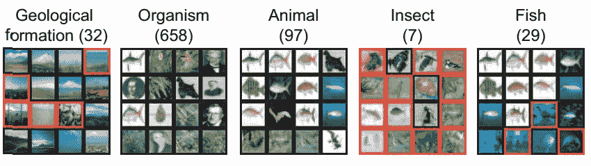
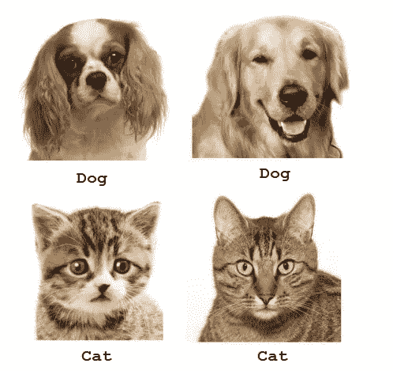
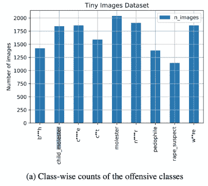
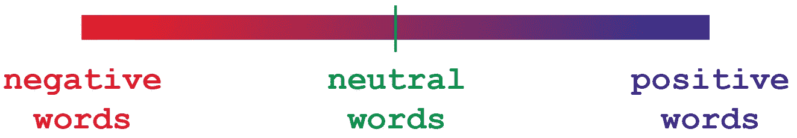

# 使用人工智能控制人工智能:如何防止创建有偏见的数据集

> 原文：<https://pub.towardsai.net/using-ai-to-control-ai-how-to-prevent-creating-biased-datasets-b040dff17067?source=collection_archive---------2----------------------->

## [自然语言处理](https://towardsai.net/p/category/nlp)

## 如何防止像麻省理工学院 8000 万幅微小图像这样有偏见的数据集

在过去的几天里，[麻省理工学院撤下了一张被引用的 8000 万张尺寸为](https://www.gizmodo.co.uk/2020/07/mit-takes-down-popular-ai-dataset-due-to-racist-misogynistic-content/) 32x32 的小图片，因为它包含了不恰当的标签(如果你不知道这是什么意思，我会进一步澄清)。在本文中，我将尝试使用机器学习方法来解决这个具体问题。

# 数据集是如何创建的？

如果我从[发表的关于该数据集的论文](https://people.csail.mit.edu/torralba/publications/80millionImages.pdf)中理解正确的话，这是从互联网收集数据并将其存储到数据集的过程:

1.  从谷歌检索大规模图像

负责该项目的团队在互联网上搜寻这些图片，每张图片都与一些关键词相关联。

2.确定图像噪声的阈值

然而，并不是所有的查询(自动谷歌搜索)都是成功的。在 100 个结果之后，图像的相关性在减少。根据来源的不同，团队不得不为收集的图像数量设定一个阈值。

3.使用最近邻算法将它们聚类在一起

在存储它们并分析与每幅图像相关的关键词后，基于公共因子对它们进行聚类，然后使用统计方法选择标签。

最终输出:

我找不到关于最终标签是如何确定的细节，但有一句话明确指出这是通过“使用 Wordnet 树的子集”来完成的。

总之，没有一个数据是人工分类的，即使有一定程度的人工检查。不管你的工作人员有多少，你实际上无法用手对 8000 万张图片进行分类。

## 什么是标签？

你不能给一个人工智能一个图像列表让它学习。你还需要为数据提供额外的信息，以便人工智能能够将一个单词与其相应的图像关联起来。

标签示例

如果你想更详细地了解人工智能是如何工作的，请阅读我的简化文章！

## 为什么会有一些偏颇的标签？

这是最不合适标签的截图(在图中我们只能看到 76062 个中的 9 个)。考虑到数据集包含了 8000 万张图片。

# 一种可能的方法

澄清一下，在构建人工智能时会出现许多问题。如果一个人工智能显示出偏见的迹象，背后可能有多种原因。

在这个特定的数据集中，问题必须归因于信息的检索。在其他一些数据集中，甚至人为错误或故意误用数据也可能是主要原因。

## 标签上自然语言处理的使用

这种想法是，即使标签太多，人眼也无法一一检查。大约 80，000 个标签构成了大约 150 页的单倍行距。那么，我们如何解决这个具体问题呢？

我会使用无监督的学习方法。通过将标签存储在数据集中，NLP 算法可以用于以不同的顺序排列单词:

*   基本情感分析(一维输出)
*   表情符号分析(64 维输出)
*   情绪检测器(尺寸取决于模型和训练数据集)

如果我们能够识别在分布的负端倾斜太多的单词，我们就可以更深入地搜索我们庞大的数据集是否包含我们想要编辑或删除的数据。

如果我们必须检查按情绪程度排序的 76k 标签，我们可以简单地看一下分布的下端(例如，将人工干预降低到 2000 个单词)，看看是否有任何标签和相关联的图像要去除。

# 结论

在这种情况下，所发生的事情可以作为宝贵的教训。一旦设定了特定的协议，我们就可以自动执行它们以防止进一步的事情发生。